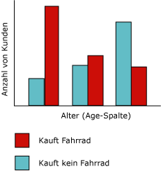
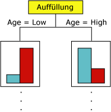

# Microsoft Decision Trees-Algorithmus
  Der [!INCLUDE[msCoName](../../includes/msconame-md.md)] Decision Trees-Algorithmus ist ein Klassifizierungs- und Regressionsalgorithmus für die Vorhersagemodellierung sowohl diskreter als auch kontinuierlicher Attribute.  
  
 Bei diskreten Attributen gründet der Algorithmus seine Vorhersagen auf die Beziehungen zwischen den Eingabespalten in einem Dataset Er verwendet die Werte oder Zustände aus diesen Spalten zur Vorhersage der Zustände einer von Ihnen als vorhersagbar bestimmten Spalte. Dabei identifiziert der Algorithmus die Eingabespalten, die von der vorhersagbaren Spalte abhängig sind. Wenn z. B. in einem Szenario zur Vorhersage der wahrscheinlichen Käufer eines Fahrrads neun von zehn jüngeren Kunden ein Fahrrad kaufen, dies jedoch nur bei zwei von zehn älteren Kunden zutrifft, folgert der Algorithmus daraus, dass das Alter ein gutes Vorhersagekriterium für den Fahrradkauf ist. Die von der Entscheidungsstruktur getroffenen Vorhersagen gründen auf dieser Tendenz hinsichtlich eines bestimmten Ergebnisses.  
  
 Bei kontinuierlichen Attributen bestimmt der Algorithmus anhand einer linearen Regression, wo sich die Entscheidungsstruktur teilt.  
  
 Wenn mehr als eine Spalte als vorhersagbar festgelegt ist, oder wenn die Eingabedaten eine als vorhersagbar festgelegte geschachtelte Tabelle enthalten, bildet der Algorithmus für jede vorhersagbare Spalte eine eigene Entscheidungsstruktur.  
  
## Beispiel  
 Die Marketingabteilung der Firma [!INCLUDE[ssSampleDBCoFull](../../includes/sssampledbcofull-md.md)] möchte die Merkmale früherer Kunden identifizieren, anhand derer sich die Wahrscheinlichkeit ermitteln lässt, mit der diese Kunden künftig als Käufer eines Produkts in Frage kommen. In der [!INCLUDE[ssSampleDBnormal](../../includes/sssampledbnormal-md.md)] -Datenbank sind die demografischen Daten zur Beschreibung früherer Kunden gespeichert. Mithilfe des [!INCLUDE[msCoName](../../includes/msconame-md.md)] Decision Trees-Algorithmus zur Analyse dieser Informationen kann die Marketingabteilung ein Vorhersagemodell entwickeln. Dieses Modell besagt, ob ein bestimmter Kunde als künftiger Käufer von Produkten in Frage kommt, wobei sich das Modell auf die Zustände bekannter Spalten zu diesem Kunden, wie z. B. demografische Muster oder frühere Kaufverhaltensmuster, stützt.  
  
## Funktionsweise des Algorithmus  
 Der [!INCLUDE[msCoName](../../includes/msconame-md.md)] Decision Trees-Algorithmus erstellt eine Reihe von Teilungen in der Entscheidungsstruktur, die zusammen ein Data Mining-Modell bilden. Diese Teilungen werden als *Knoten*dargestellt. Der Algorithmus fügt dem Modell jedes Mal einen Knoten hinzu, wenn eine Eingabespalte in erheblichem Ausmaß von der vorhersagbaren Spalte abhängig ist. Wie der Algorithmus eine Teilung bestimmt, unterscheidet sich danach, ob er eine Vorhersage zu einer kontinuierlichen Spalte oder zu einer diskreten Spalte trifft.  
  
 Der [!INCLUDE[msCoName](../../includes/msconame-md.md)] Decision Trees-Algorithmus verwendet die *Funktionsauswahl* als Rahmen für die Auswahl der nützlichsten Attribute. Die Funktionsauswahl wird von allen [!INCLUDE[ssNoVersion](../../includes/ssnoversion-md.md)] Data Mining algorithms to improve performance and the quality of analysis. Mit der Funktionsauswahl wird vermieden, dass unwichtige Attribute Prozessorzeit belegen. Wenn Sie beim Entwurf eines Data Mining-Modells zu viele Eingabe- und vorhersagbare Attribute verwenden, dauert die Verarbeitung des Modells u. U. sehr lange oder übersteigt sogar den vorhandenen Speicherplatz. Unter den Methoden zur Ermittlung, ob die Struktur geteilt werden sollte, gehören Metriken nach Industriestandard für *Entropie*- und Bayes-Netzwerke*.* Weitere Informationen zu den Methoden zur Auswahl nützlicher Attribute und zur Festlegung der Interessantheit und Rangfolge dieser finden Sie unter [Funktionsauswahl &#40;Data Mining&#41;](../../analysis-services/data-mining/feature-selection-data-mining.md).  
  
 Ein häufiges Problem bei Data Mining-Modellen besteht darin, dass kleinen Unterschieden in den Trainingsdaten eine zu hohe Bedeutung zugewiesen wird. In diesem Fall wird das Modell als *überangepasst* oder *überladen* bezeichnet. Ein überangepasstes Modell kann nicht zu anderen Datasets verallgemeinert werden. Um die Überanpassung an ein bestimmtes Dataset zu vermeiden, verwendet der [!INCLUDE[msCoName](../../includes/msconame-md.md)] Decision Trees-Algorithmus Techniken zur Steuerung des Strukturwachstums. Eine nähere Erläuterung zur Funktionsweise des [!INCLUDE[msCoName](../../includes/msconame-md.md)] Decision Trees-Algorithmus finden Sie unter [Technische Referenz für den Microsoft Decision Trees-Algorithmus](../../analysis-services/data-mining/microsoft-decision-trees-algorithm-technical-reference.md).  
  
### Vorhersagen diskreter Spalten  
 Auf welche Weise [!INCLUDE[msCoName](../../includes/msconame-md.md)] Decision Trees-Algorithmus eine Struktur für eine diskrete vorhersagbare Spalte erstellt, lässt sich anhand eines Histogramms verdeutlichen. Im folgenden Diagramm ist ein Histogramm abgebildet, in dem die vorhersagbare Spalte Bike Buyers (Fahrradkäufer) mit der Eingabespalte Age (Alter) abgeglichen wird. Aus dem Histogramm geht hervor, dass das Alter einer Person Rückschlüsse darauf zulässt, ob diese Person ein Fahrrad kaufen wird.  
  
   
  
 Die im Diagramm veranschaulichte Korrelation würde dazu führen, dass der [!INCLUDE[msCoName](../../includes/msconame-md.md)] Decision Trees-Algorithmus einen neuen Knoten im Modell erstellt.  
  
   
  
 Durch das Hinzufügen neuer Knoten zu einem Modell bildet der Algorithmus eine Baumstruktur. Der oberste Knoten der Struktur beschreibt, wie sich die vorhersagbare Spalte für die Gesamtpopulation der Kunden unterteilt. Beim Anwachsen des Modells werden nach und nach alle Spalten vom Algorithmus einbezogen.  
  
### Vorhersagen kontinuierlicher Spalten  
 Bei Entscheidungsstrukturen, die der [!INCLUDE[msCoName](../../includes/msconame-md.md)] Decision Trees-Algorithmus anhand einer kontinuierlichen vorhersagbaren Spalte erstellt, enthält jeder Knoten eine Regressionsformel. Teilungen finden an Stellen der Nichtlinearität in der Regressionsformel statt. Betrachten Sie beispielsweise das folgende Diagramm.  
  
   
  
 In einem standardmäßigen Regressionsmodell versuchen Sie, eine einzelne Formel abzuleiten, die den Trend und die Beziehungen für die Daten als Ganzes darstellt.  Eine einzelne Formel würde die Diskontinuität in komplexen Daten jedoch nur unzureichend wiedergeben. Der [!INCLUDE[msCoName](../../includes/msconame-md.md)] Decision Trees-Algorithmus sucht stattdessen nach Struktursegmenten, die größtenteils linear sind und erstellt separate Formeln für diese Segmente. Indem die Daten in verschiedene Segmente aufgeteilt werden, kann das Modell die Daten viel besser darstellen.  
  
 Das folgende Diagramm stellt das Strukturdiagramm für das Modell im obigen Punktdiagramm dar.  Das Modell stellt zwei unterschiedliche Formeln bereit, um das Ergebnis vorherzusagen: eine für den linken Bereich mit der Formel y = .5x x 5 und eine für den rechten Bereich mit der Formel y = .25x + 8.75. Die Stelle, an der die beiden Linien im Punktdiagramm zusammentreffen, ist die Stelle der Nichtlinearität und damit die Stelle, an der sich ein Knoten im Entscheidungsstrukturmodell teilen würde.  
  
   
  
 Dies ist ein einfaches Modell mit nur zwei Geradengleichungen. Daher wird die Teilung in der Struktur unmittelbar nach dem **Alle** -Knoten vorgenommen. Allerdings kann eine Teilung auf jeder Ebene der Struktur auftreten. Das bedeutet, dass in einer Struktur mit mehreren Ebenen und Knoten, wo jeder Knoten durch eine andere Sammlung von Attributen gekennzeichnet ist, eine Formel möglicherweise über mehrere Knoten freigegeben werden kann oder nur für einen einzelnen Knoten gilt. Sie erhalten z.B. eine Formel für einen Knoten, der als „Kunden über einem gewissen Alter und Einkommen“ definiert ist, und einen anderen, der „Kunden, die lange Strecken pendeln“ repräsentiert. Klicken Sie einfach auf den Knoten, um die Formel für einen einzelnen Knoten oder ein einzelnes Segment anzuzeigen.  
  
## Erforderliche Daten für Entscheidungsstrukturmodelle  
 Wenn Sie Daten für die Verwendung in einem Entscheidungsstrukturmodell aufbereiten, müssen Sie sich mit den Anforderungen des jeweiligen Algorithmus, dessen Anforderungen an die Daten und der Verwendung der Daten vertraut machen.  
  
 Für Entscheidungsstrukturmodelle gelten folgende Anforderungen:  
  
-   **Nur eine Schlüsselspalte:** Jedes Modell muss eine numerische Spalte oder Textspalte enthalten, die jeden Datensatz eindeutig identifiziert. Verbundschlüssel sind nicht zulässig.  
  
-   **Eine vorhersagbare Spalte** Mindestens eine vorhersagbare Spalte ist erforderlich. Sie können mehrere vorhersagbare Attribute in ein Modell aufnehmen, die numerisch oder diskret sein müssen. Beachten Sie jedoch, dass sich mit steigender Anzahl an vorhersagbaren Attributen die Verarbeitungszeit erhöhen kann.  
  
-   **Eingabespalten** Eingabespalten sind erforderlich und können diskret oder kontinuierlich sein. Auch hier gilt, dass sich bei steigender Anzahl an Attributen die Verarbeitungszeit erhöht.  
  
 Detaillierte Informationen zu den in Entscheidungsstrukturmodellen unterstützten Inhaltstypen und Datentypen finden Sie im Abschnitt „Anforderungen“ unter [Technische Referenz für den Microsoft Decision Trees-Algorithmus](../../analysis-services/data-mining/microsoft-decision-trees-algorithm-technical-reference.md).  
  
## Anzeigen eines Entscheidungsstrukturmodells  
 Mit dem **Microsoft Struktur-Viewer**können Sie das Modell anzeigen. Wenn das Modell mehrere Strukturen generiert, wählen Sie eine Struktur aus. Daraufhin wird im Viewer eine Aufschlüsselung der Fallkategorien für jedes vorhersagbare Attribut angezeigt. Mit dem Abhängigkeitsnetzwerk-Viewer können Sie die Abhängigkeiten zwischen den Strukturen anzeigen. Weitere Informationen finden Sie unter [Durchsuchen eines Modells mit dem Microsoft Struktur-Viewer](../../analysis-services/data-mining/browse-a-model-using-the-microsoft-tree-viewer.md).  
  
 Wenn Sie Näheres über die Verzweigungen bzw. Knoten in der Struktur in Erfahrung bringen möchten, können Sie das Modell im [Microsoft Generic Content Tree Viewer](../../analysis-services/data-mining/browse-a-model-using-the-microsoft-generic-content-tree-viewer.md)durchsuchen. Der für das Modell gespeicherte Inhalt umfasst die Verteilung der Werte an jedem Knoten, die Wahrscheinlichkeiten auf jeder Strukturebene und die Regressionsformeln für kontinuierliche Attribute. Weitere Informationen finden Sie unter [Miningmodellinhalt von Entscheidungsstrukturmodellen &#40;Analysis Services – Data Mining&#41;](../../analysis-services/data-mining/mining-model-content-for-decision-tree-models-analysis-services-data-mining.md)dargestellt.  
  
## Erstellen von Vorhersagen  
 Nachdem das Modell verarbeitet wurde, werden die Ergebnisse als Satz von Mustern und Statistiken gespeichert, die Sie zum Untersuchen von Beziehungen bzw. zum Erstellen von Vorhersagen verwenden können.  
  
 Beispiele zur Verwendung von Abfragen in Verbindung mit einem Entscheidungsstrukturmodell finden Sie unter [Beispiele für Entscheidungsstruktur-Modellabfragen](../../analysis-services/data-mining/decision-trees-model-query-examples.md).  
  
 Allgemeine Informationen zum Erstellen von Abfragen für Miningmodelle finden Sie unter [Data Mining-Abfragen](../../analysis-services/data-mining/data-mining-queries.md).  
  
## Hinweise  
  
-   Unterstützt die Verwendung von PMML (Predictive Model Markup Language) zum Erstellen von Miningmodellen.  
  
-   Unterstützt Drillthrough.  
  
-   Unterstützt die Verwendung von OLAP-Miningmodellen und die Erstellung von Data Mining-Dimensionen.  
  
## Siehe auch  
 [Data Mining-Algorithmen &#40;Analysis Services – Data Mining&#41;](../../analysis-services/data-mining/data-mining-algorithms-analysis-services-data-mining.md)   
 [Microsoft Decision Trees-Algorithmus technische Referenz](../../analysis-services/data-mining/microsoft-decision-trees-algorithm-technical-reference.md)   
 [Decision Trees-Abfragebeispiele](../../analysis-services/data-mining/decision-trees-model-query-examples.md)   
 [Miningmodellinhalt von Entscheidungsstrukturmodellen &#40;Analysis Services – Data Mining&#41;](../../analysis-services/data-mining/mining-model-content-for-decision-tree-models-analysis-services-data-mining.md)  
  
  

