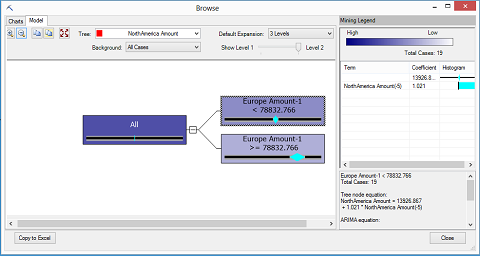

# Anzeigen der Formel für ein Zeitreihenmodell (Data Mining)
  Wenn Sie mithilfe von [!INCLUDE[ssNoVersion](../../includes/ssnoversion-md.md)] Data Mining ein Zeitreihenmodell erstellt haben, besteht die einfachste Möglichkeit zur Anzeige der Regressionsgleichung für dieses Modell darin, die **Mininglegende** des [Microsoft Time Series-Viewers](../../analysis-services/data-mining/browse-a-model-using-the-microsoft-time-series-viewer.md)zu verwenden, der alle Konstanten in einem lesbaren Format darstellt.  
  
### So zeigen Sie die ARTXP-Regressionsformel für ein Zeitreihenmodell an  
  
1.  Wählen Sie in [!INCLUDE[ssManStudioFull](../../includes/ssmanstudiofull-md.md)]das Zeitreihenmodell aus, das Sie anzeigen möchten, und klicken Sie auf **Durchsuchen**.  
  
     - oder -  
  
     Wählen Sie in [!INCLUDE[ssBIDevStudioFull](../../includes/ssbidevstudiofull-md.md)]das Zeitreihenmodell aus, und klicken Sie dann auf die Registerkarte **Miningmodell-Viewer** .  
  
2.  Klicken Sie auf die Registerkarte **Modell** .  
  
3.  Wenn das Modell mehrere Strukturen enthält, wählen Sie aus der Dropdownliste **Struktur** eine einzelne Struktur aus.  
  
    > [!NOTE]  
    >  Ein Modell hat stets mehrere Strukturen, wenn mehr als eine Datenreihe vorliegt. Sie sehen jedoch im **Time Series-Viewer** nicht so viele Strukturen wie im [Microsoft Generic Content Tree Viewer](http://msdn.microsoft.com/library/751b4393-f6fd-48c1-bcef-bdca589ce34c). Der Grund hierfür liegt darin, dass der Time Series-Viewer die ARIMA- und ARTXP-Informationen für jede Datenreihe zu einer einzelnen Darstellung kombiniert.  
  
4.  Klicken Sie auf einen Blattknoten in der Struktur.  
  
     Knoten, die als **Datenreihe** bezeichnet werden, sind immer Blattknoten und können eine Gleichung enthalten. Wenn ein **(Alle)** -Knoten keine untergeordneten Knoten besitzt, kann er ebenfalls eine Gleichung enthalten.  
  
5.  Wenn die **Mininglegende** nicht verfügbar ist, klicken Sie mit der rechten Maustaste auf den Knoten, und wählen Sie **Legende anzeigen**aus.  
  
     Die ARTXP-Formel wird in der ersten Hälfte der **Mininglegende**als **Strukturknotenformel**angezeigt.  
  
       
  
### So zeigen Sie die ARTxp-Formel für ein Zeitreihenmodell an  
  
1.  Wählen Sie in [!INCLUDE[ssManStudioFull](../../includes/ssmanstudiofull-md.md)]das Zeitreihenmodell aus, das Sie anzeigen möchten, und klicken Sie auf **Durchsuchen**.  
  
     - oder -  
  
     Wählen Sie in [!INCLUDE[ssBIDevStudioFull](../../includes/ssbidevstudiofull-md.md)]das Zeitreihenmodell aus, und klicken Sie dann auf die Registerkarte **Miningmodell-Viewer** .  
  
2.  Klicken Sie auf die Registerkarte **Modell** .  
  
3.  Wenn das Modell mehrere Strukturen enthält, wählen Sie aus der Dropdownliste **Struktur** eine einzelne Struktur aus.  
  
    > [!NOTE]  
    >  Das Modell hat stets mehrere Strukturen, wenn Sie mehr als eine Datenreihe einschließen.  
  
4.  Klicken Sie auf einen Knoten in der Struktur.  
  
     Die ARIMA-Formel wird in der zweiten Hälfte der **Mininglegende**als **ARIMA-Formel**angezeigt.  
  
5.  Wenn die **Mininglegende** nicht verfügbar ist, klicken Sie mit der rechten Maustaste auf den Knoten, und wählen Sie **Legende anzeigen**aus.  
  
### Abrufen der Koeffizienten und Terme für die Gleichung  
  
1.  Sie können die Terme und Koeffizienten der Regressionsformel für ein Zeitreihenmodell auch abrufen, indem Sie eine **Inhaltsabfrage** für den Modellinhalt erstellen.  
  
     Weitere Informationen finden Sie unter [Abfragebeispiel Zeitreihenmodell](../../analysis-services/data-mining/time-series-model-query-examples.md).  
  
2.  Sie können die Zeitreihenmodelle auch mit dem [Microsoft Generic Content Tree Viewer](http://msdn.microsoft.com/library/751b4393-f6fd-48c1-bcef-bdca589ce34c) durchsuchen, um die Terme und Koeffizienten zu finden.  
  
     Weitere Informationen finden Sie unter [Mingingmodellinhalt von Zeitreihenmodellen &#40;Analysis Services – Data Mining&#41;](../../analysis-services/data-mining/mining-model-content-for-time-series-models-analysis-services-data-mining.md).  
  
    > [!NOTE]  
    >  Wenn Sie den Inhalt eines gemischten Modells durchsuchen, das sowohl das ARIMA- als auch das ARTXP-Modell verwendet, befinden sich die beiden Modelle in separaten Strukturen, die in dem Stammknoten verknüpft sind, der das Modell repräsentiert. Auch wenn die Modelle ARIMA und ARTXP der Einfachheit halber in ein und demselben Viewer angezeigt werden, unterscheiden sich sowohl ihre Strukturen als auch ihre Gleichungen erheblich und können nicht kombiniert oder verglichen werden. Zum Beispiel gleicht die ARTXP-Struktur eher einer Entscheidungsstruktur, wohingegen die ARIMA-Struktur eine Reihe von gleitenden Durchschnitten darstellt.  
  
## Siehe auch  
 [Tasks und Anweisungen für Miningmodell-Viewer](../../analysis-services/data-mining/mining-model-viewer-tasks-and-how-tos.md)   
 [Durchsuchen eines Modells mit Microsoft Time Series-Viewer](../../analysis-services/data-mining/browse-a-model-using-the-microsoft-time-series-viewer.md)  
  
  

