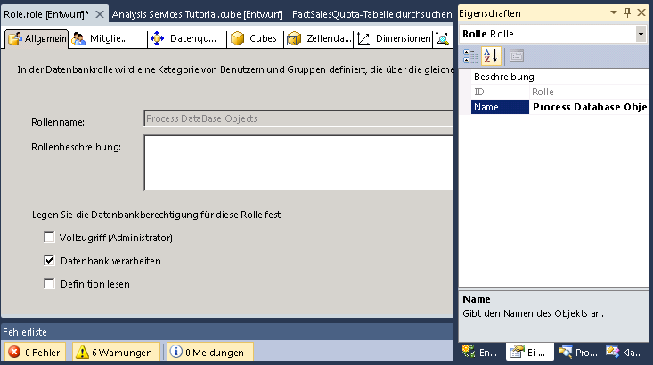

# Lektion 10 – Prozess-Datenbankberechtigungen erteilen
Nach dem Installieren einer Instanz von [!INCLUDE[ssASnoversion](../includes/ssasnoversion-md.md)]verfügen alle Mitglieder der [!INCLUDE[ssASnoversion](../includes/ssasnoversion-md.md)] -Serveradministratorrolle in dieser Instanz über serverweite Berechtigungen, beliebige Tasks innerhalb der Instanz von [!INCLUDE[ssASnoversion](../includes/ssasnoversion-md.md)]auszuführen. Standardmäßig besitzen keine anderen Benutzer die Berechtigung, Objekte in der Instanz von [!INCLUDE[ssASnoversion](../includes/ssasnoversion-md.md)]zu verwalten oder anzuzeigen.  
  
Ein Mitglied der Serveradministratorrolle kann Benutzern serverweiten Administratorzugriff gewähren, indem er sie als Mitglieder der Rolle hinzufügt. Ein Mitglied der Serveradministratorrolle kann Benutzern auch den Zugriff auf eingeschränktem Niveau erteilen, indem ihnen eingeschränkte oder vollständige Administrator- oder Zugriffsberechtigungen auf Datenbankebene erteilt werden. Eingeschränkte Administratorberechtigungen schließen Berechtigungen zum Verarbeiten oder Lesen von Definitionen auf Datenbank-, Cube- oder Dimensionsebene ein.  
  
Im Rahmen der Tasks in diesem Thema definieren Sie die Process Database Objects-Sicherheitsrolle, die Mitgliedern der Rolle die Berechtigung erteilt, alle Datenbankobjekte zu verarbeiten, sie jedoch nicht berechtigt, Daten innerhalb der Datenbank anzuzeigen.  
  
## Definieren der Process Database Objects-Sicherheitsrolle  
  
1.  Klicken Sie im Projektmappen-Explorer mit der rechten Maustaste auf **Rollen** und anschließend auf **Neue Rolle** , um den Rollen-Designer zu öffnen.  
  
2.  Aktivieren Sie das Kontrollkästchen **Datenbank verarbeiten** .  
  
3.  Ändern Sie im Eigenschaftenfenster die **Name** -Eigenschaft für diese neue Rolle in **Process Database Objects Role**.  
  
      
  
4.  Wechseln Sie zur Registerkarte **Mitgliedschaft** des Rollen-Designers, und klicken Sie auf **Hinzufügen**.  
  
5.  Geben Sie die Konten der Windows-Domänenbenutzer oder -Gruppen ein, die Mitglieder dieser Rolle sind. Klicken Sie auf **Namen überprüfen** , um die Kontoinformationen zu überprüfen, und anschließend auf **OK**.  
  
6.  Wechseln Sie zur Registerkarte **Cubes** des Rollen-Designers.  
  
    Mitglieder dieser Rolle sind berechtigt, diese Datenbank zu verarbeiten, können jedoch nicht auf die Daten im [!INCLUDE[ssASnoversion](../includes/ssasnoversion-md.md)] Tutorial-Cube zugreifen und besitzen keinen lokalen Cube/Drillthrough-Zugriff, wie in der folgenden Abbildung dargestellt.  
  
     des Rollen-Designers")  
  
7.  Wechseln Sie zur Registerkarte **Dimensionen** des Rollen-Designers.  
  
    Mitglieder dieser Rolle sind berechtigt, alle Dimensionsobjekte in dieser Datenbank zu verarbeiten und verfügen standardmäßig über Leseberechtigungen für jedes Dimensionsobjekt in der [!INCLUDE[ssASnoversion](../includes/ssasnoversion-md.md)] Tutorial-Datenbank.  
  
8.  Klicken Sie im Menü **Erstellen** auf **Analysis Services Tutorial bereitstellen**.  
  
    Sie haben nun die Process Database Objects-Sicherheitsrolle erfolgreich definiert und bereitgestellt. Nach dem Bereitstellen eines Cubes in der Produktionsumgebung können die Administratoren des bereitgestellten Cubes nach Bedarf der Rolle Benutzer hinzufügen, um Verarbeitungsaufgaben an bestimmte Benutzer zu delegieren.  
  
> [!NOTE]  
> Durch Herunterladen und Installieren der Beispiele ist für Lektion 10 ein abgeschlossenes Projekt verfügbar. Weitere Informationen finden Sie unter [Install Sample Data and Projects for the Analysis Services Multidimensional Modeling Tutorial](../analysis-services/install-sample-data-and-projects.md).  
  
## Siehe auch  
[Rollen und Berechtigungen &#40;Analysis Services&#41;](../analysis-services/multidimensional-models/roles-and-permissions-analysis-services.md)  
  
  
  

