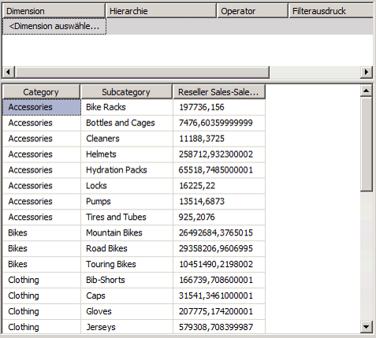
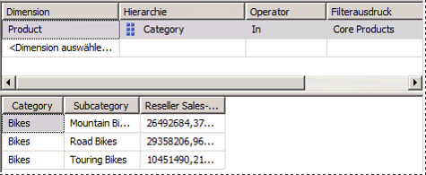
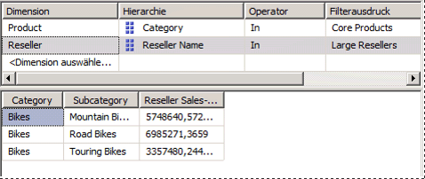

# <a name="lesson-6-2---defining-named-sets"></a>Lektion 6-2: Definieren von benannten Mengen
Eine benannte Menge ist ein MDX-Ausdruck (Multidimensional Expressions), der eine Menge von Dimensionselementen zurückgibt. Sie können benannte Mengen definieren und im Rahmen der Cubedefinition speichern. Sie können auch benannte Mengen in Clientanwendungen erstellen. Benannte Mengen können durch Kombinieren von Cubedaten, arithmetischen Operatoren, Zahlen und Funktionen erstellt werden. Benannte Mengen können von Benutzern in MDX-Abfragen in Clientanwendungen sowie zum Definieren von Mengen in Teilcubes verwendet werden. Ein Teilcube bezeichnet eine Auflistung von Mengen mit Kreuzprodukten, die den Cuberaum auf den definierten Teilbereich für nachfolgende Anweisungen beschränkt. Die Definition eines eingeschränkten Cuberaums stellt ein grundlegendes Konzept der MDX-Skripterstellung dar.  
  
Benannte Mengen vereinfachen MDX-Abfragen und stellen nützliche Aliase für komplexe, häufig verwendete Mengenausdrücke bereit. So können Sie beispielsweise eine benannte Menge namens Large Resellers definieren, die die Menge der Elemente in der Reseller-Dimension mit den meisten Mitarbeitern enthält. Endbenutzer können dann die benannte Menge Large Resellers in Abfragen verwenden, oder Sie können die benannte Menge verwenden, um eine Menge in einem Teilcube zu definieren. Definitionen benannter Mengen werden zwar in Cubes gespeichert, aber ihre Werte sind nur im Arbeitsspeicher vorhanden. Mithilfe des Befehls **Neue benannte Menge** auf der Registerkarte **Berechnungen** des Cube-Designers können Sie eine benannte Menge erstellen. Weitere Informationen finden Sie unter [Berechnungen](../analysis-services/multidimensional-models-olap-logical-cube-objects/calculations.md)und [Erstellen von benannten Mengen](../analysis-services/multidimensional-models/create-named-sets.md).  
  
Im Rahmen der Tasks in diesem Thema definieren Sie zwei benannte Mengen: die benannte Menge Core Products und die benannte Menge Large Resellers.  
  
## <a name="defining-a-core-products-named-set"></a>Definieren der benannten Menge Core Products  
  
1.  Wechseln Sie zur Registerkarte **Berechnungen** des Cube-Designers für den Cube des [!INCLUDE[ssASnoversion](../includes/ssasnoversion-md.md)] -Tutorials, und klicken Sie auf der Symbolleiste auf **Formularansicht** .  
  
2.  Klicken Sie im Bereich **Skriptplaner** auf **[Total Sales Ratio to All Products]** , und klicken Sie anschließend auf der Symbolleiste der Registerkarte **Berechnungen** auf **Neue benannte Menge** .  
  
    Wenn Sie eine neue Berechnung auf der Registerkarte **Berechnungen** definieren, sollten Sie daran denken, dass Berechnungen in der Reihenfolge aufgelöst werden, in der sie im Bereich **Skriptplaner** angezeigt werden. Ihr Fokus innerhalb dieses Bereichs bestimmt beim Erstellen einer neuen Berechnung die Reihenfolge, in der die Berechnung ausgeführt wird. Eine neue Berechnung wird unmittelbar nach der Berechnung definiert, die gerade den Fokus besitzt.  
  
3.  Ändern Sie im Feld **Name** den Namen der neuen benannten Menge zu **[Core Products]**(Kernprodukte).  
  
    Achten Sie im Bereich **Skriptplaner** auf das spezielle Symbol, das eine benannte Menge von einem Skriptbefehl oder einem berechneten Element unterscheidet.  
  
4.  Erweitern Sie auf der Registerkarte **Metadaten** im Bereich **Berechnungstools** die Optionen **Product**(Produkt), **Category**(Kategorie), **Members**(Elemente) und anschließend **All Products**(Alle Produkte).  
  
    > [!NOTE]  
    > Wenn Sie keine Metadaten im Bereich **Berechnungstools** anzeigen können, klicken Sie auf der Symbolleiste auf **Verbindung wiederherstellen** . Funktioniert dies nicht, müssen Sie möglicherweise den Cube verarbeiten oder die Instanz von [!INCLUDE[ssASnoversion](../includes/ssasnoversion-md.md)]starten.  
  
5.  Ziehen Sie den Bereich **Bikes** in das Feld **Ausdruck** .  
  
    Sie haben somit einen Mengenausdruck erstellt, der die Menge von Elementen zurückgibt, die sich in der Bike-Kategorie der Product-Dimension befinden.  
  
## <a name="defining-a-large-resellers-named-set"></a>Definieren der benannten Menge Large Resellers  
  
1.  Klicken Sie mit der rechten Maustaste im Bereich **Skriptplaner** auf **[Core Products]** , und klicken Sie anschließend auf **Neue benannte Menge**.  
  
2.  Ändern Sie im Feld **Name** den Namen dieser benannten Menge zu **[Large Resellers]**.  
  
3.  Geben Sie in das Feld **Ausdruck** **Exists()**ein.  
  
    Mithilfe der Exists-Funktion geben Sie die Menge von Elementen aus der Attributhierarchie „Name des Wiederverkäufers“ zurück, die sich mit der Menge von Elementen in der Attributhierarchie „Anzahl von Mitarbeitern“ mit den meisten Mitarbeitern überschneidet.  
  
4.  Erweitern Sie auf der Registerkarte **Metadaten** im Bereich **Berechnungstools** die **Reseller** -Dimension, und erweitern Sie anschließend die **Reseller Name** -Attributhierarchie.  
  
5.  Ziehen Sie die **Reseller Name** -Ebene in die Klammern für den Exists-Mengenausdruck.  
  
    Mithilfe der Memberfunktion können Sie alle Elemente in dieser Menge zurückgeben. Weitere Informationen finden Sie unter [Members &#40;Menge&#41; &#40;MDX&#41;](../mdx/members-set-mdx.md).  
  
6.  Geben Sie nach dem Teilmengenausdruck einen Punkt ein, und fügen Sie anschließend die Memberfunktion hinzu. Der Ausdruck sollte wie folgt aussehen:  
  
    ```  
    Exists([Reseller].[Reseller Name].[Reseller Name].Members)  
    ```  
  
    Nachdem Sie nun die erste Menge für den Exists-Mengenausdruck definiert haben, können Sie die zweite Menge hinzufügen – die Menge von Elementen der Reseller-Dimension mit den meisten Mitarbeitern.  
  
7.  Erweitern Sie auf der Registerkarte **Metadaten** im Bereich **Berechnungstools** die Option **Number of Employees** in der Reseller-Dimension, dann **Members**und schließlich **All Resellers**.  
  
    Die Elemente dieser Attributhierarchie werden nicht gruppiert.  
  
8.  Öffnen Sie den Dimensions-Designer für die **Reseller** -Dimension, und klicken Sie anschließend im Bereich **Attribute** auf **Number of Employees** .  
  
9. Ändern Sie im Eigenschaftenfenster die **DiscretizationMethod**-Eigenschaft in **Automatisch**, und ändern Sie die **DiscretizationBucketCount**-Eigenschaft in **5**. Weitere Informationen finden Sie unter [Gruppieren von Attributelementen &#40;Diskretisierung&#41;](../analysis-services/multidimensional-models/attribute-properties-group-attribute-members.md).  
  
10. Klicken Sie im Menü **Erstellen** von [!INCLUDE[ssBIDevStudioFull](../includes/ssbidevstudiofull-md.md)] auf **Analysis Services Tutorial bereitstellen**.  
  
11. Wechseln Sie nach der erfolgreichen Bereitstellung zum Cube-Designer für den Cube des [!INCLUDE[ssASnoversion](../includes/ssasnoversion-md.md)] -Tutorials, und klicken Sie auf der Symbolleiste der Registerkarte **Berechnungen** auf **Verbindung wiederherstellen** .  
  
12. Erweitern Sie auf der Registerkarte **Metadaten** im Bereich **Berechnungstools** die Option **Number of Employees** in der **Reseller** -Dimension, dann **Members**und schließlich **All Resellers**.  
  
    Beachten Sie, dass die Elemente dieser Attributhierarchie jetzt in fünf Gruppen enthalten sind, nummeriert von 0 bis 4. Die Zahl einer Gruppe wird angezeigt, wenn Sie den Zeiger auf diese Gruppe richten, um einen InfoTip anzuzeigen. Für den Bereich `2 -17`sollte der InfoTipp `[Reseller].[Number of Employees].&[0]`enthalten.  
  
    Die Elemente dieser Attributhierarchie werden gruppiert, da die DiscretizationBucketCount-Eigenschaft auf **5** und die DiscretizationMethod-Eigenschaft auf **Automatisch**festgelegt ist.  
  
13. Fügen Sie im Feld **Ausdruck** im Exists-Mengenausdruck ein Komma hinter der Memberfunktion und vor der schließenden Klammer hinzu, und ziehen Sie anschließend **83 - 100** aus dem Bereich **Metadaten** an die Position hinter dem Komma.  
  
    Damit haben Sie den Exists-Mengenausdruck erstellt, der die Menge von Elementen zurückgibt, die sich mit den beiden angegebenen Mengen überschneidet (der Menge aller Wiederverkäufer und der aller Wiederverkäufer mit 83 bis 100 Mitarbeitern), wenn die benannte Menge „Large Resellers“ auf einer Achse dargestellt wird.  
  
    Die folgende Abbildung stellt den Bereich **Berechnungsausdrücke** für die benannte Menge **[Large Resellers]** dar.  
  
    ![Bereich für Berechnungsausdrücke für [Large Resellers]](../analysis-services/media/l6-named-set-02.gif "Bereich für Berechnungsausdrücke für [Large Resellers]")  
  
14. Klicken Sie auf der Symbolleiste der Registerkarte **Berechnungen** auf **Skriptansicht**, und überprüfen Sie die beiden benannten Mengen, die gerade dem Berechnungsskript hinzugefügt wurden.  
  
15. Fügen Sie dem Berechnungsskript direkt vor dem ersten CREATE SET-Befehl eine neue Zeile hinzu, und geben Sie dann den folgenden Text in der gesonderten Zeile in das Skript ein:  
  
    ```  
    /* named sets */  
    ```  
  
    Sie haben somit zwei benannte Mengen definiert, die im Bereich **Skriptplaner** angezeigt werden. Sie können jetzt diese benannten Mengen bereitstellen und dann im [!INCLUDE[ssASnoversion](../includes/ssasnoversion-md.md)] Tutorial-Cube nach diesen Measures suchen.  
  
## <a name="browsing-the-cube-by-using-the-new-named-sets"></a>Durchsuchen des Cubes mithilfe der neuen benannten Mengen  
  
1.  Klicken Sie im Menü **Erstellen** von [!INCLUDE[ssBIDevStudio](../includes/ssbidevstudio-md.md)]auf **Analysis Services Tutorial bereitstellen**.  
  
2.  Klicken Sie nach erfolgreicher Bereitstellung auf die Registerkarte **Browser** , und klicken Sie anschließend auf **Verbindung wiederherstellen**.  
  
3.  Löschen Sie das Raster im Datenbereich.  
  
4.  Fügen Sie dem Datenbereich das Measure **Reseller Sales-Sales Amount** hinzu.  
  
5.  Erweitern Sie die Product-Dimension, und fügen Sie dem Zeilenbereich dann Kategorie und Unterkategorie hinzu, wie in der folgenden Abbildung dargestellt.  
  
      
  
6.  Ziehen Sie **Core Products** im Bereich **Metadaten** in der **Product** -Dimension in den Filterbereich.  
  
    Nur das **Bike** -Element des **Category** -Attributs und Elemente der **Bike** -Unterkategorien verbleiben im Cube. Das liegt daran, dass die benannte Menge **Core Products** (Kernprodukte) zur Definition eines Teilcubes verwendet wird. Durch diesen Teilcube werden die Elemente des **Category** -Attributs in der **Product** -Dimension innerhalb des Teilcubes auf die Elemente der benannten Menge **Core Products** beschränkt, wie in der folgenden Abbildung dargestellt.  
  
      
  
7.  Erweitern Sie im Bereich **Metadaten** den Eintrag **Reseller**, und fügen Sie dem Filterbereich **Large Resellers** hinzu.  
  
    Das Reseller Sales Amount-Measure im Bereich Daten zeigt nur Verkaufssummen für große Wiederverkäufer von Fahrrädern an. Darüber hinaus zeigt der Bereich Filter jetzt die beiden benannten Mengen an, die für die Definition dieses bestimmten Teilcubes verwendet werden, wie in der folgenden Abbildung dargestellt.  
  
      
  
## <a name="next-lesson"></a>Nächste Lektion  
[Lektion 7: Definieren von KPIs &#40;Key Performance Indicator&#41;](../analysis-services/lesson-7-defining-key-performance-indicators-kpis.md)  
  
## <a name="see-also"></a>Siehe auch  
[Berechnungen](../analysis-services/multidimensional-models-olap-logical-cube-objects/calculations.md)  
[Erstellen von benannten Mengen](../analysis-services/multidimensional-models/create-named-sets.md)  
  
  
  

