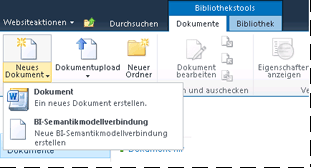

# Erstellen einer BI-Semantikmodellverbindung zu einer PowerPivot-Arbeitsmappe
  Verwenden Sie die Informationen in diesem Thema, um eine BI-Semantikmodellverbindung einzurichten, die zu einer [!INCLUDE[ssGemini](../../includes/ssgemini-md.md)] -Arbeitsmappe in der gleichen Farm umleitet.  
  
 Nachdem Sie eine BI-Semantikmodellverbindung erstellt und SharePoint-Berechtigungen konfiguriert haben, können Sie sie als Datenquelle für Excel- oder [!INCLUDE[ssCrescent](../../includes/sscrescent-md.md)] -Berichte verwenden.  
  
 Das Thema enthält folgende Abschnitte: Führen Sie jede Aufgabe in der angegebenen Reihenfolge aus.  
  
 [Überprüfen der Voraussetzungen](#bkmk_prereq)  
  
 [Erstellen einer Verbindung](#bkmk_create)  
  
 [Konfigurieren von SharePoint-Berechtigungen für die BI-Semantikmodellverbindung](#bkmk_permissions)  
  
 [Konfigurieren von SharePoint-Berechtigungen für die Arbeitsmappe](#bkmk_userdb)  
  
 [Nächste Schritte](#bkmk_next)  
  
##   Überprüfen der Voraussetzungen  
 Sie benötigen Teilnahmeberechtigungen oder weiterreichende Berechtigungen, um eine BI Semantikmodell-Verbindungsdatei zu erstellen.  
  
 Sie benötigen eine Bibliothek, die den Inhaltstyp der BI Semantikmodellverbindung unterstützt. Weitere Informationen finden Sie unter [Hinzufügen eines BI-Semantikmodell-Verbindungs-Inhaltstyps zu einer Bibliothek &#40;PowerPivot für SharePoint&#41;](../../analysis-services/power-pivot-sharepoint/add-bi-semantic-model-connection-content-type-to-library.md).  
  
 Sie müssen wissen, dass die URL des der [!INCLUDE[ssGemini](../../includes/ssgemini-md.md)] Arbeitsmappe für die Sie eine BI-semantikmodellverbindung einrichten (z. B. `http://adventure-works/shared documents/myworkbook.xlsx`). Die Arbeitsmappe muss in der gleichen Farm sein.  
  
 Alle Computer und Benutzer, die Teil der Verbindungssequenz sind, müssen in der gleichen Domäne bzw. vertrauenswürdigen Domäne (bidirektionale Vertrauensstellung) enthalten sein.  
  
##   Erstellen einer Verbindung  
  
1.  Klicken Sie in der Bibliothek, die die BI-Semantikmodellverbindung enthalten soll, auf dem SharePoint-Menüband auf **Dokumente** . Klicken Sie in „Neues Dokument“ auf den Pfeil nach unten, und wählen Sie **BISM-Verbindungsdatei** aus, um die Seite „Neue BI-Semantikmodellverbindung“ zu öffnen.  
  
       
  
2.  Legen Sie die **Server** -Eigenschaft auf die SharePoint-URL der [!INCLUDE[ssGemini](../../includes/ssgemini-md.md)] -Arbeitsmappe fest, z.B. `http://mysharepoint/shared documents/myWorkbook.xlsx`. In einer Bereitstellung von [!INCLUDE[ssGemini](../../includes/ssgemini-md.md)] für SharePoint können Daten auf jeden Server in der Farm geladen werden. Aus diesem Grund geben Datenquellenverbindungen mit [!INCLUDE[ssGemini](../../includes/ssgemini-md.md)] -Daten nur den Pfad zur Arbeitsmappe an. Der [!INCLUDE[ssGemini](../../includes/ssgemini-md.md)] -Systemdienst bestimmt, welcher Server die Daten lädt.  
  
     Verwenden Sie nicht die **Database** -Eigenschaft, diese wird beim Angeben des Speicherorts einer [!INCLUDE[ssGemini](../../includes/ssgemini-md.md)] -Arbeitsmappe nicht verwendet.  
  
     Die Seite sollte ähnlich der folgenden Abbildung aussehen.  
  
       
  
     Wenn Sie über SharePoint-Berechtigungen an der Arbeitsmappe verfügen, wird optional ein zusätzlicher Überprüfungsschritt ausgeführt, der sicherstellt, dass der Speicherort gültig ist. Wenn Sie nicht über die Berechtigung verfügen, auf die Daten zuzugreifen, wird Ihnen die Option gegeben, die BI-Semantikmodellverbindung ohne die Überprüfungsantwort zu speichern.  
  
##   Konfigurieren von SharePoint-Berechtigungen für die BI-Semantikmodellverbindung  
 Damit eine BI-Semantikmodellverbindung als Datenquelle für eine Excel-Arbeitsmappe oder einen Reporting Services-Bericht verwendet werden kann, muss das BI-Semantikmodell-Verbindungselement über **Leseberechtigungen** in einer SharePoint-Bibliothek verfügen. Die Berechtigungsebene „Lesen“ schließt die Berechtigung **Elemente öffnen** ein, die das Herunterladen von BI-Semantikmodell-Verbindungsinformationen in eine Excel-Desktopanwendung ermöglicht.  
  
 Es gibt mehrere Möglichkeiten, Berechtigungen in SharePoint zu erteilen. Die folgenden Anweisungen erläutern, wie Sie eine neue Gruppe mit dem Namen **BISM-Benutzer** erstellen, die die Berechtigungsstufe **Lesen** haben.  
  
 Sie müssen Websitebesitzer sein, um Berechtigungen zu ändern.  
  
1.  Klicken Sie in „Websiteaktionen“ auf **Websiteberechtigungen**.  
  
2.  Klicken Sie auf **Gruppe erstellen** , und nennen Sie die neue Gruppe **BISM-Benutzer**.  
  
3.  Wählen Sie die Berechtigungsstufe **Lesen** aus, und klicken Sie auf **Erstellen**.  
  
4.  Wählen Sie **BISM-Benutzer** in „Personen und Gruppen“ aus.  
  
5.  Zeigen Sie auf „Neu“, klicken Sie auf **Benutzer hinzufügen**, und fügen Sie dann Benutzer- oder Gruppenkonten hinzu.  
  
     Diese Benutzer und die Gruppen haben jetzt Leseberechtigungen überall in der Website, einschließlich aller Bibliotheken und Listen, die Berechtigungen von der Websiteebene erben. Wenn diese Berechtigungen zu hoch sind, können Sie diese Gruppe aus bestimmten Bibliotheken, Listen oder Elementen selektiv entfernen.  
  
 Um Berechtigungen auf Elementebene selektiv zu entfernen, gehen Sie wie folgt vor:  
  
1.  Wählen Sie in einer Bibliothek ein Dokument aus. Klicken Sie auf den rechten Pfeil nach unten, und klicken Sie auf **Berechtigungen verwalten**.  
  
2.  Standardmäßig erbt ein Element Berechtigungen. Um die Berechtigungen von einzelnen Dokumenten in dieser Bibliothek zu ändern, klicken Sie auf **Berechtigungsvererbung beenden**.  
  
3.  Aktivieren Sie das Kontrollkästchen neben **BISM-Benutzer**.  
  
4.  Klicken Sie auf **Benutzerberechtigungen entfernen**.  
  
##   Konfigurieren von SharePoint-Berechtigungen für die Arbeitsmappe  
 Wenn Sie in einer Excel-Arbeitsmappe eine [!INCLUDE[ssGemini](../../includes/ssgemini-md.md)] -Datenbank verwenden, bestimmen die SharePoint-Berechtigungen für die Excel-Arbeitsmappe den Datenzugriff auf die BI-Semantikmodellverbindung. Alle Benutzer, die auf die Arbeitsmappe zugreifen, müssen Leseberechtigungen für die Arbeitsmappe haben, um sie als externe Datenquelle zu verwenden.  
  
 Wenn Sie eine Gruppe **BISM-Benutzer** mithilfe der Anweisungen im vorherigen Abschnitt erstellt haben, haben Benutzer- und Gruppenkonten, die Mitglieder von **BISM-Benutzer** sind, ausreichende Berechtigungen für die Arbeitsmappe und für die BI-Semantikmodell-Verbindungsdatei, wenn die Arbeitsmappe geerbte Berechtigungen verwendet.  
  
##   Nächste Schritte  
 Nachdem Sie eine BI-Semantikmodellverbindung erstellt und gesichert haben, können Sie sie als Datenquelle angeben. Weitere Informationen finden Sie unter [Verwenden einer BI-Semantikmodellverbindung in Excel oder Reporting Services](../../analysis-services/power-pivot-sharepoint/use-a-bi-semantic-model-connection-in-excel-or-reporting-services.md).  
  
## Siehe auch  
 [PowerPivot BI-Semantikmodellverbindung &#40;.bism&#41;](../../analysis-services/power-pivot-sharepoint/power-pivot-bi-semantic-model-connection-bism.md)   
 [Verwenden Sie eine BI-Semantikmodellverbindung in Excel oder Reporting Services](../../analysis-services/power-pivot-sharepoint/use-a-bi-semantic-model-connection-in-excel-or-reporting-services.md)   
 [Erstellen einer BI-Semantikmodellverbindung mit einer tabellarischen Modelldatenbank](../../analysis-services/power-pivot-sharepoint/create-a-bi-semantic-model-connection-to-a-tabular-model-database.md)  
  
  

