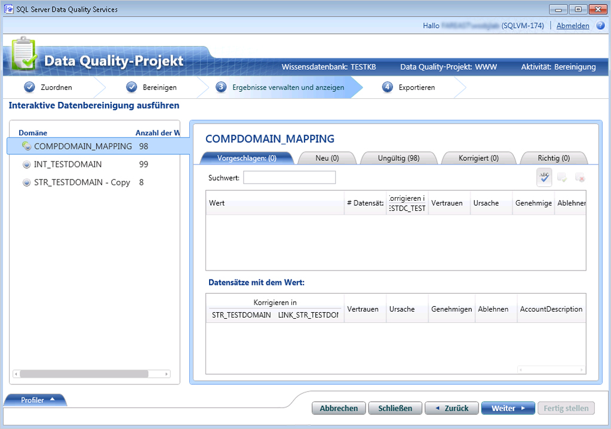

# Bereinigen von Daten mit (externem) Verweisdaten-Wissen
  In diesem Thema wird beschrieben, wie Daten mithilfe des Wissens von Verweisdatenanbietern bereinigt werden. Während alle Schritte der Ausführung eine bereinigungsaktivität unverändert zum Bereinigen der Daten mithilfe der Informationen aus den verweisdatenanbietern wie in erläutert die [Bereinigen von Daten mithilfe von DQS & #40; intern & #41; Knowledge](../data-quality-services/cleanse-data-using-dqs-internal-knowledge.md), dieses Thema enthält Informationen, die speziell für die DatenBereinigung mithilfe des in [!INCLUDE[ssDQSnoversion](../includes/ssdqsnoversion-md.md)] (DQS).  
  
 Wenn Sie die Verweisdatendienstfunktion in DQS verwenden, um die Daten zu bereinigen, sendet der DQS-Bereinigungsprozess die zugeordneten Domänenwerte an den Verweisdaten-Dienstanbieter als Batchanforderung. Der Verweisdatendienst antwortet mit den folgenden Informationen:  
  
-   Vorgeschlagene Korrektur  
  
-   Vertrauen  
  
-   Zusätzliche Informationen über die zugeordnete Domäne. Verweisdaten können auch standardisieren, analysieren oder die Quelle mit weiteren Daten bereichern. Diese Informationen werden in weiteren Feldern in der Antwort bereitgestellt.  
  
 Folgendes geschieht in DQS nach Eingang der Antwort vom Verweisdatendienst während der Bereinigungsaktivität:  
  
-   Auf Grundlage der Werte **Schwellenwert für Autokorrektur** und **Minimaler Vertrauensgrad** , die während der Zuordnung der Domänen zur Verweisdaten-Dienstdomäne angegeben wurden, werden die Domänenwerte automatisch korrigiert oder auf Grundlage des Vertrauensgrads vorgeschlagen.  
  
    > [!NOTE]  
    >  Die Schwellenwerte, die Sie während der Zuordnung einer Domäne zu einem Verweisdatendienst festlegen, werden während des Bereinigens von Daten mithilfe des Wissens im Verweisdatendienst und nicht mithilfe der Werte, die auf der Registerkarte **Allgemeine Einstellungen** im Abschnitt **Konfiguration** festgelegt wurden, angewendet. Informationen zum Festlegen von Schwellenwerten für Verweisdaten-Bereinigung, finden Sie in Schritt 9 in [Domäne anfügen oder Verbunddomäne an Verweisdaten](../data-quality-services/attach-domain-or-composite-domain-to-reference-data.md).  
  
-   Domänenwerte werden in den folgenden kategorisiert: **vorgeschlagen**, **New**, **ungültige**, **korrigiert**, und **richtig**.  
  
-   Weitere Daten werden an die Quelle angefügt, und die Informationen stehen zusammen mit den bereinigten Daten zum Exportieren zur Verfügung.  
  
## Vorbereitungen  
  
###   Erforderliche Komponenten  
 Sie müssen dem entsprechenden Verweisdatendienst erforderliche Domänen in einer DQS-Wissensdatenbank zugeordnet haben. Darüber hinaus muss die Wissensdatenbank Wissen zum Typ von Daten enthalten, die Sie bereinigen möchten. Wenn Sie z. B. die Quelldaten bereinigen, die US-Adressen enthalten, müssen Sie die Domänen einem Verweisdaten-Dienstanbieter zuordnen, der hochwertige Daten für US-Adressen bereitstellt. Weitere Informationen finden Sie unter [Domäne anfügen oder Verbunddomäne an Verweisdaten](../data-quality-services/attach-domain-or-composite-domain-to-reference-data.md).  
  
###   Sicherheit  
  
####   Berechtigungen  
 Sie müssen über die Rolle "dqs_kb_editor" oder "dqs_kb_operator" für die Datenbank DQS_MAIN verfügen, um eine Datenbereinigung auszuführen.  
  
##   Bereinigen der Daten mit Verweisdaten-Wissen  
 Wir werden auch weiterhin mit demselben Beispiel zur Verwendung der Domänen, die wir im vorherigen Thema zugeordnet [Domäne anfügen oder Verbunddomäne an Verweisdaten](../data-quality-services/attach-domain-or-composite-domain-to-reference-data.md), mit dem Melissa Data-Dienst in Windows Azure Marketplace. Jetzt verwenden wir die gleichen Domänen, um einige Beispiel-US-Adressen zu bereinigen. Die Schritte zum Bereinigen von Daten entsprechen den in beschriebenen [Bereinigen von Daten mithilfe von DQS & #40; intern & #41; Knowledge](../data-quality-services/cleanse-data-using-dqs-internal-knowledge.md). Wir lenken Ihre Aufmerksamkeit jedoch während des Prozesses an die nötigen Stellen.  
  
1.  Erstellen Sie ein Datenqualitätsprojekt, und wählen Sie die Aktivität **Bereinigung** aus. Siehe [Create a Data Quality Project](../data-quality-services/create-a-data-quality-project.md).  
  
2.  Ordnen Sie die folgenden 4 Domänen mit entsprechenden Spalten auf der Seite **Karte** in den Quelldaten zu: **Adresszeile**, **Ort**, **Bundesland**und **PLZ**. Klicken Sie auf **Weiter**.  
  
    > [!NOTE]  
    >  Wie Sie alle 4 Domänen zugeordnet haben die **Adressüberprüfung** verbunddomäne, die DatenBereinigung jetzt erfolgt auf Domänenebene zusammengesetzte und nicht auf einzelner Domänenebene.  
  
3.  Auf der **Bereinigen** des computergestützten Bereinigungsprozesses ausführen, indem Sie auf Seite **Start**. Nachdem der Bereinigungsprozess vorbei ist, klicken Sie auf **Weiter**.  
  
    > [!NOTE]  
    >  Auf der **Bereinigen** Seite DQS zeigt Informationen zu den Domänen, die in den folgenden zwei Arten verweisdatendienst verbunden sind:  
    >   
    >  -   Eine Meldung wird angezeigt, unter der **Starten** Schaltfläche: "Domänen \< Domäne1>, \< Domäne2>,... \< Domänen> sind mit Verweisdaten-Dienstanbieters gereinigt. " In diesem Beispiel wird die folgende Meldung angezeigt: „Domänen-Adressüberprüfung wird mithilfe von Verweisdaten-Dienstanbietern gereinigt.“  
    > -   Ein Symbol, , wird angezeigt, dem **Profiler** Bereich anhand der Domänen an Verweisdaten-Dienstanbieter angefügt. In diesem Beispiel wird das Symbol für die Verbunddomäne **Adressüberprüfung** angezeigt.  
  
4.  Prüfen Sie auf der Seite **Ergebnisse verwalten und anzeigen** Ihre Domänenwerte. Der Verweisdatendienst kann ggf. mehr als einen Vorschlag für einen Wert anzeigen, je nach der maximalen Anzahl von Vorschlägen, die im Feld **Vorgeschlagene Kandidaten** während der Zuordnung der Domäne zum Verweisdatendienst angegeben sind. Zwei Vorschläge werden z. B. für die folgende US-Adresse angezeigt:  
  
     **Ursprünglicher Wert:**  
  
    |Adresszeile|Ort|Bundesland|PLZ|  
    |------------------|----------|-----------|---------|  
    |1 msft way|Redmond||98052|  
  
     **Vorgeschlagene Werte:**  
  
    |Adresszeile|Ort|Bundesland|PLZ|  
    |------------------|----------|-----------|---------|  
    |1 Microsoft Way|Redmond|WA|98052|  
    |Postfach 1|Redmond|WA|98073|  
  
       
  
    > [!NOTE]  
    >  Für Verbunddomänen hebt DQS auch die einzelnen Domänen in einer anderen Farbe hervor, die während des computergestützten Bereinigungsprozesses korrigiert wurden. In diesem Fall wurden die Domänen **Adresszeile** und **Status** z. B. korrigiert und deshalb in Cyanblau hervorgehoben.  
  
5.  Nachdem Sie mit dem Überprüfen aller Domänenwerte fertig sind, klicken Sie auf **Weiter** , um die Daten zu exportieren.  
  
6.  Auf der **exportieren** Seite sehen Sie, abgesehen von den regulären Informationen über die bereinigungsaktivität für jede Domäne (Quelle, Grund, vertrauen und Status), gibt es zusätzliche Informationen zur Verfügung gestellt durch den Verweis Melissa Data Datendienst über Ihre Adressdaten, z. B. Breitengrad und Längengrad der Adresse, landkreisname, geben (Hochhaus, Straße usw.), und so weiter.  
  
7.  Exportieren von Daten in das erforderliche Ziel (SQL Server, CSV oder Excel), und klicken Sie auf **Fertig stellen** auf das Projekt zu schließen.  
  
    > [!IMPORTANT]  
    >  Wenn Sie die 64-Bit-Version von Excel verwenden, können Sie die bereinigten Daten nicht in eine Excel-Datei exportieren; Sie können sie nur in eine SQL Server-Datenbank oder eine CSV-Datei exportieren.  
  
  