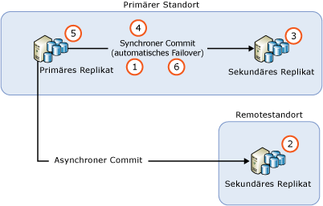
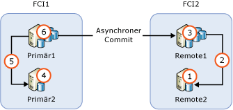

# Upgraden von Always On-Verf&#252;gbarkeitsgruppen-Replikatsinstanzen
[!INCLUDE[tsql-appliesto-ss2016-xxxx-xxxx-xxx_md](../../../includes/tsql-appliesto-ss2016-xxxx-xxxx-xxx-md.md)]

  Wenn eine [!INCLUDE[ssNoVersion](../../../includes/ssnoversion-md.md)]-Always On-Verfügbarkeitsgruppe auf eine neue [!INCLUDE[ssCurrent](../../../includes/sscurrent-md.md)]-Version oder ein neues [!INCLUDE[ssNoVersion](../../../includes/ssnoversion-md.md)]-Service Pack aktualisiert wird, können Sie die Downtime für das primäre Replikat auf ein einzelnes manuelles Failover reduzieren. Führen Sie dazu ein paralleles Upgrade aus (oder zwei manuelle Failover, falls Sie einen Failback auf das ursprüngliche primäre Replikat ausführen). Diese Vorgehensweise funktioniert auch, wenn eine kumulative Aktualisierung durchgeführt wird, beim Installieren auf einem neuen Windows Service Pack oder bei der kumulativen Aktualisierung. Während des Upgradevorgangs steht ein sekundäres Replikat weder für ein Failover noch für schreibgeschützte Vorgänge zur Verfügung. Nach dem Upgrade kann es etwas dauern, bis das sekundäre Replikat auf dem gleichen Stand ist, wie der primäre Replikatknoten. Dies ist vom Ausmaß der Aktivität auf dem Primären Replikatknoten (erwarten Sie also viel Netzwerkverkehr) abhängig.  
  
> [!NOTE]  
>  In diesem Thema wird nur das Upgraden des SQL Servers selbst behandelt. Es behandelt nicht das Upgraden des Betriebssystems, das den WSFC-Cluster (Windows Server Failover Clusting) beinhaltet. Das Upgraden des Windows-Betriebssystems, das den Failovercluster hostet, wird für ältere Betriebssysteme als Windows Server 2012 R2 nicht unterstützt. Weitere Informationen über das Upgraden eines Clusterknotens, der auf Windows Server 2012 R2 ausgeführt wird, finden Sie unter [Cluster Operating System Rolling Upgrade](https://technet.microsoft.com/library/dn850430.aspx) (Paralleles Upgraden für Clusterbetriebssysteme)  
  
## Erforderliche Komponenten  
 Lesen Sie die folgenden wichtigen Informationen, bevor Sie beginnen:  
  
-   [Supported Version and Edition Upgrades](../../../database-engine/install-windows/supported-version-and-edition-upgrades.md): Prüfen Sie, dass Sie von Ihrer Version des Windows-Betriebssystems und Ihrer Version des SQL Servers auf SQL Server 2016 upgraden können. Sie können beispielsweise nicht direkt von einer SQL Server 2005-Instanz auf [!INCLUDE[ssCurrent](../../../includes/sscurrent-md.md)]upgraden.  
  
-   [Choose a Database Engine Upgrade Method](../../../database-engine/install-windows/choose-a-database-engine-upgrade-method.md): Wählen Sie die passende Upgrademethode und die Schritte aus, die sowohl auf Ihrer Betrachtung der unterstützten Version und Editionsupgrades als auch auf den anderen in Ihrer Umgebung installierten Komponenten basieren, um die Komponenten in der richtigen Reihenfolge upzugraden.  
  
-   [Planen und Testen des Upgradeplans für das Datenbankmodul](../../../database-engine/install-windows/plan-and-test-the-database-engine-upgrade-plan.md): Überprüfen Sie die Anmerkungen zu dieser Version, die bekannten Upgradeprobleme und die Prüfliste vor dem Upgrade. Entwickeln und testen Sie den Upgradeplan.  
  
-   [Hardware- und Softwareanforderungen für die Installation von SQL Server 2016](../../../sql-server/install/hardware-and-software-requirements-for-installing-sql-server-2016.md): Überprüfen Sie die Softwareanforderungen für die Installation von [!INCLUDE[ssCurrent](../../../includes/sscurrent-md.md)]. Falls zusätzliche Software erforderlich ist, installieren Sie diese auf jedem Knoten, bevor Sie mit dem Upgradevorgang beginnen, um die Downtime zu minimieren.  
  
## Bewährte Verfahren für parallele Upgrades von Always On-Verfügbarkeitsgruppen  
 Beachten Sie beim Ausführen von Serverupgrades oder -aktualisierungen die folgenden bewährten Verfahren, um die Downtime und Datenverluste für Ihre Verfügbarkeitsgruppen zu minimieren:  
  
-   Vor dem Start des parallelen Upgrades:  
  
    -   Führen Sie zu Übungszwecken ein manuelles Failover für mindestens eine der Replikatinstanzen mit synchronem Commit aus.  
  
    -   Schützen Sie Ihre Daten, indem Sie eine vollständige Datenbanksicherung für jede Verfügbarkeitsdatenbank ausführen.  
  
    -   Führen Sie DBCC CHECKDB für jede Verfügbarkeitsdatenbank aus.  
  
-   Führen Sie das Upgrade zuerst immer für die sekundären Remotereplikatinstanzen und dann für die lokalen sekundären Replikatinstanzen und zuletzt für die primäre Replikatinstanz durch.  
  
-   Von einer Datenbank, für die gerade ein Upgrade ausgeführt wird, kann keine Sicherung erstellt werden.  Vor dem Aktualisieren der sekundären Replikate konfigurieren Sie die Voreinstellung für die automatisierte Sicherung, um Sicherungen nur auf dem primären Replikat auszuführen.  Während eines Versionsupgrades sind keine Replikate lesbar oder für Sicherungen verfügbar. Während eines Upgrades ohne Versionswechsel können Sie automatische Sicherungen konfigurieren, die auf den sekundären Replikaten ausgeführt werden, bevor das primäre Replikat upgegradet wird.  
  
-   Während eines Versionsupgrades können lesbare sekundäre Replikate zwischenzeitlich nicht gelesen werden. Dieser Zeitraum der Nicht-Lesbarkeit beginnt, nachdem das Upgrade auf das sekundäre Replikat durchgeführt wurde, und hält an, bis für das primäre Replikat ein Failover an ein upgegradetes sekundäres Replikat durchgeführt wurde oder das primäre Replikat selbst upgegradet wurde.  
  
-   Damit für die Verfügbarkeitsgruppe während des Upgrades kein unbeabsichtigtes Failover ausgeführt wird, entfernen Sie den Verfügbarkeitsfailover zunächst von allen Replikaten mit synchronem Commit.  
  
-   Führen Sie für die primäre Replikatinstanz kein Upgrade durch, bevor Sie für die Verfügbarkeitsgruppe nicht ein Failover auf eine upgegradete Instanz mit einem sekundären Replikat ausgeführt haben. Andernfalls kann sich die Downtime von Clientanwendungen während des Upgrades auf der primären Replikatinstanz verlängern.  
  
-   Führen Sie für die Verfügbarkeitsgruppe immer ein Failover auf eine sekundäre Replikatinstanz mit synchronem Commit aus. Falls Sie ein Failover auf eine sekundäre Replikatinstanz mit asynchronem Commit ausführen, treten in den Datenbanken Datenverluste auf, und die Datenverschiebung wird automatisch so lange angehalten, bis Sie den Vorgang manuell fortsetzen.  
  
-   Führen Sie für die primäre Replikatinstanz kein Upgrade durch, bevor Sie nicht eine der anderen sekundären Replikatinstanzen upgegradet oder aktualisiert haben. Ein primäres Replikat, für das ein Upgrade ausgeführt wurde, kann keine Protokolle mehr an sekundäre Replikate versenden, deren [!INCLUDE[ssCurrent](../../../includes/sscurrent-md.md)] -Instanz noch nicht auf die gleiche Version aktualisiert wurde. Wenn eine Datenverschiebung zu einem sekundären Replikat angehalten wurde, kann für dieses Replikat kein automatisches Failover ausgeführt werden, und die Verfügbarkeitsdatenbanken sind anfällig für Datenverluste.  
  
-   Bevor Sie ein Failover für eine Verfügbarkeitsgruppe ausführen, sollten Sie überprüfen, ob der Synchronisierungsstatus des Failoverziels SYNCHRONIZED lautet.  
  
## Prozess des parallelen Upgrades  
 Die genauen Schritte hängen von Faktoren wie der Bereitstellungstopologie der Verfügbarkeitsgruppen und dem Commitmodus der einzelnen Replikate ab. Im einfachsten Szenario ist ein paralleles Upgrade jedoch ein mehrstufiger Prozess, der in seiner einfachsten Form aus den folgenden Schritten besteht:  
  
   
  
1.  Deaktivieren des automatischen Failovers für alle Replikate mit synchronem Commit  
  
2.  Upgraden aller sekundären Remotereplikatinstanzen, auf denen sekundäre Replikate mit asynchronem Commit ausgeführt werden  
  
3.  Upgraden für alle lokalen sekundären Replikatinstanzen, auf denen das primäre Replikat derzeit nicht ausgeführt wird  
  
4.  Ausführen eines manuellen Failovers der Verfügbarkeitsgruppe auf ein lokales sekundäres Replikat mit synchronem Commit  
  
5.  Upgraden oder Aktualisieren der lokalen Replikatinstanz, von der das primäre Replikat zuvor gehostet wurde  
  
6.  Konfigurieren automatischer Failoverpartner nach Bedarf  
  
 Falls erforderlich, können Sie einen zusätzlichen manuellen Failover ausführen, um die ursprüngliche Konfiguration der Verfügbarkeitsgruppe wiederherzustellen.  
  
## Verfügbarkeitsgruppe mit einem sekundären Remotereplikat  
 Wenn Sie eine Verfügbarkeitsgruppe ausschließlich zur Notfallwiederherstellung bereitgestellt haben, müssen Sie für die Verfügbarkeitsgruppe u. U. ein Failover auf ein sekundäres Replikat mit asynchronem Commit ausführen. Diese Konfiguration wird in der folgenden Abbildung dargestellt:  
  
   
  
 In diesem Fall müssen Sie für die Verfügbarkeitsgruppe während des parallelen Upgrades ein Failover auf das sekundäre Replikat mit asynchronem Commit ausführen. Zur Vermeidung von Datenverlusten ändern Sie den Commitmodus in den synchronen Commitmodus und warten mit dem Failover der Verfügbarkeitsgruppe, bis das sekundäre Replikat synchronisiert ist. Der Prozess zum Durchführen eines parallelen Upgrades kann somit folgendermaßen aussehen:  
  
1.  Upgraden der sekundären Replikatinstanz am Remotestandort  
  
2.  Ändern des Commitmodus in den synchronen Commitmodus  
  
3.  Warten, bis der Synchronisierungsstatus SYNCHRONIZED lautet  
  
4.  Ausführen eines Failovers für die Verfügbarkeitsgruppe an ein sekundäres Replikat am Remotestandort  
  
5.  Upgraden oder Aktualisieren der lokalen (am primären Standort) Replikatinstanz  
  
6.  Ausführen eines Failovers der Verfügbarkeitsgruppe zurück auf den primären Standort  
  
7.  Ändern des Commitmodus in den asynchronen Commitmodus  
  
 Der synchrone Commitmodus ist für die Datensynchronisierung mit einem Remotestandort nicht zu empfehlen. Nachdem die Einstellung geändert wurde, verzeichnen die Clientanwendungen möglicherweise einen sofortigen Anstieg der Datenbanklatenz. Darüber hinaus führt ein Failover dazu, dass alle unbestätigten Protokollmeldungen verworfen werden. Die Anzahl der verworfenen Protokollmeldungen kann aufgrund hoher Netzwerklatenz zwischen den beiden Standorten deutlich erhöht sein, was auf den Clients zu einer hohen Rate von Transaktionsfehlern führt. Sie können die Auswirkungen auf die Clientanwendungen anhand der folgenden Maßnahmen minimieren:  
  
-   Festlegen des Wartungsfensters auf Zeiten mit geringem Clientdatenverkehr  
  
-   Ändern Sie den Verfügbarkeitsmodus während des Upgradens oder Aktualisierens von [!INCLUDE[ssCurrent](../../../includes/sscurrent-md.md)] am primären Standort zurück in den asynchronen Commitmodus, und kehren Sie zu synchronen Commits zurück, wenn Sie wieder bereit für ein Failover auf den primären Standort sind.  
  
## Verfügbarkeitsgruppe mit Failoverclusterinstanz-Knoten  
 Falls eine Verfügbarkeitsgruppe Failoverclusterinstanz-Knoten (Failover Cluster Instance; FCI) beinhaltet, sollten Sie die inaktiven Knoten vor den aktiven Knoten upgraden. In der folgenden Abbildung ist ein gängiges Verfügbarkeitsgruppenszenario mit FCIs dargestellt. Es basiert auf FCIs, die auf lokale Hochverfügbarkeit und asynchrone Commits zur Remote-Notfallwiederherstellung ausgelegt sind, und veranschaulicht die Schritte zum Ausführen des Upgrades.  
  
   
  
1.  Upgraden oder Aktualisieren von REMOTE2 (Remote2)  
  
2.  Failover von FCI2 auf REMOTE2  
  
3.  Upgraden oder Aktualisieren von REMOTE1 (Remote1)  
  
4.  Upgraden oder Aktualisieren von PRIMARY2 (Primär2)  
  
5.  Failover von FCI1 auf PRIMARY2  
  
6.  Upgraden oder Aktualisieren von PRIMARY1 (Primär1)  
  
## Upgraden oder Aktualisieren von SQL Server-Instanzen mit mehreren Verfügbarkeitsgruppen  
 Falls Sie mehrere Verfügbarkeitsgruppen mit primären Replikaten auf verschiedenen Serverknoten ausführen (eine Aktive-/Aktive Konfiguration), umfasst der Upgradepfad mehr Failoverschritte, um die hohe Verfügbarkeit während des Vorgangs zu sichern. Angenommen, Sie führen drei Verfügbarkeitsgruppen auf drei Serverknoten aus (vgl. die folgende Tabelle) und alle sekundären Replikate werden im synchronen Commitmodus ausgeführt.  
  
|Verfügbarkeitsgruppe|Knoten1|Knoten2|Knoten3|  
|------------------------|-----------|-----------|-----------|  
|VG1|Primär|||  
|VG2||Primär||  
|VG3|||Primär|  
  
 In diesem Fall kann es von Vorteil sein, ein paralleles Upgrade mit Lastenausgleich in der folgenden Reihenfolge durchzuführen:  
  
1.  Failover von VG2 auf Knoten3 (um Knoten2 freizugeben)  
  
2.  Upgraden oder Aktualisieren von Knoten2  
  
3.  Failover von VG1 auf Knoten2 (um Knoten1 freizugeben)  
  
4.  Upgraden oder Aktualisieren von Knoten1  
  
5.  Failover sowohl von VG2 als auch von VG3 auf Knoten1 (um Knoten3 freizugeben)  
  
6.  Upgraden oder Aktualisieren von Knoten3  
  
7.  Failover von VG3 auf Knoten3  
  
 Bei dieser Art von Upgrade beträgt die durchschnittliche Downtime weniger als zwei Failover pro Verfügbarkeitsgruppe. Die resultierende Konfiguration ist in der folgenden Tabelle dargestellt.  
  
|Verfügbarkeitsgruppe|Knoten1|Knoten2|Knoten3|  
|------------------------|-----------|-----------|-----------|  
|VG1||Primär||  
|VG2|Primär|||  
|VG3|||Primär|  
  
 Je nach Ihrer spezifischen Implementierung kann der Upgradepfad abweichen. Das Gleiche gilt für die Downtime der Clientanwendungen.  
  
> [!NOTE]  
>  In vielen Fällen wird nach Fertigstellung des parallelen Upgrades ein Failback auf das primäre Replikat durchgeführt.  
  
## Siehe auch  
 [Aktualisieren auf SQL Server 2016 mithilfe des Installations-Assistenten &#40;Setup&#41;](../../../database-engine/install-windows/upgrade-to-sql-server-2016-using-the-installation-wizard-setup.md)   
 [Installieren von SQL Server 2016 von der Eingabeaufforderung](../../../database-engine/install-windows/install-sql-server-2016-from-the-command-prompt.md)  
  
  