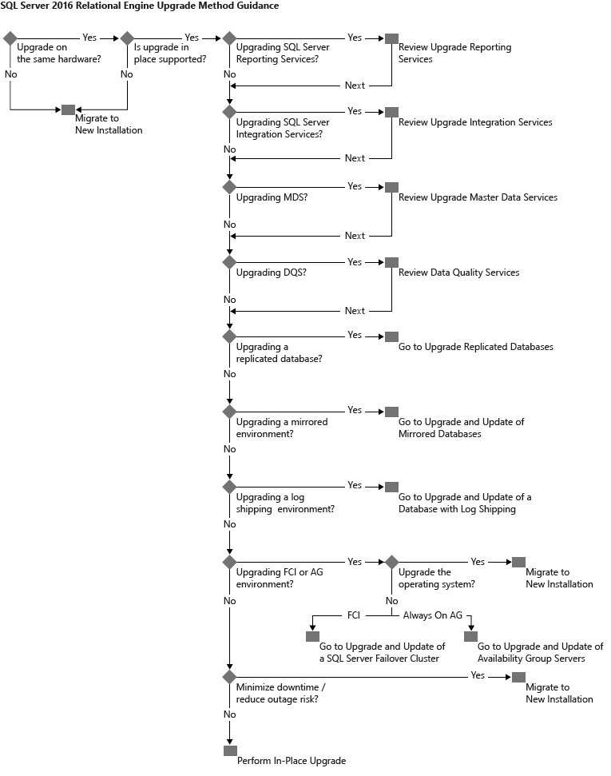
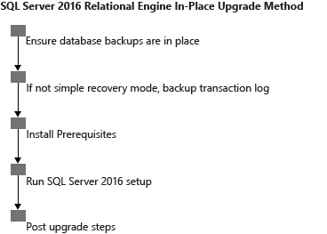
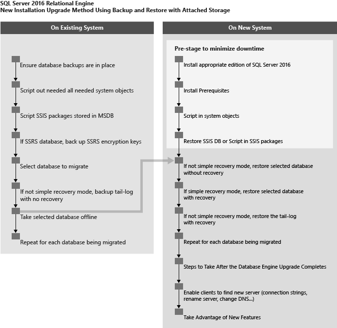
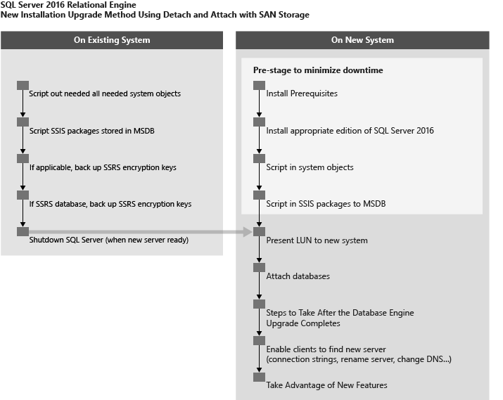

# W&#228;hlen einer Upgrademethode f&#252;r das Datenbankmodul
  Es gibt verschiedene zu prüfende Ansätze beim Planen des Upgrades von [!INCLUDE[ssDE](../../includes/ssde-md.md)] von einer früheren Version von SQL Server auf [!INCLUDE[ssCurrent](../../includes/sscurrent-md.md)], um Ausfallzeiten und Risiken zu minimieren. Sie können ein direktes Upgrade ausführen, zu einer neuen Installation migrieren oder ein paralleles Upgrade vornehmen. Das folgende Diagramm hilft Ihnen, zwischen diesen Ansätzen auszuwählen. Jeder der Ansätze im Diagramm wird außerdem nachstehend erläutert. Informationen zu den Entscheidungskriterien im Diagramm finden Sie auch unter [Planen und Testen des Upgradeplans für das Datenbankmodul](../../database-engine/install-windows/plan-and-test-the-database-engine-upgrade-plan.md).  
  
   
  
 **Download**  
  
-   Um [!INCLUDE[ssSQL15](../../includes/sssql15-md.md)]herunterzuladen, navigieren Sie zum  **[Evaluierungscenter](https://www.microsoft.com/en-us/evalcenter/evaluate-sql-server-2016)**.  
  
-   Sie haben ein Azure-Konto?  Wechseln Sie anschließend **[hierhin](https://azure.microsoft.com/en-us/marketplace/partners/microsoft/sqlserver2016ctp2evaluationwindowsserver2012r2/?wt.mc_id=sqL16_vm)**, um einen virtuellen Computer zu starten, auf dem [!INCLUDE[ssCurrent](../../includes/sscurrent-md.md)] bereits installiert ist.  
  
> [!NOTE]  
>  Sie können auch ein Upgrade auf Azure SQL-Datenbank erwägen oder Ihre SQL Server-Umgebung als Teil Ihres Upgradeplans virtualisieren. Die folgenden Themen sind nicht Gegenstand dieses Themas. Bei Interesse klicken Sie auf die Links: [Einführung in SQL Server 2016 Hybrid Cloud](../Topic/Introduction%20to%20SQL%20Server%202016%20Hybrid%20Cloud.md), [Übersicht zu SQL Server auf virtuellen Azure-Computern](https://azure.microsoft.com/documentation/articles/virtual-machines-sql-server-infrastructure-services/), [Azure SQL-Datenbank](https://azure.microsoft.com/en-us/services/sql-database/) und [Auswählen einer SQL Server-Option in Azure](https://azure.microsoft.com/documentation/articles/data-management-azure-sql-database-and-sql-server-iaas/).  
  
##   Direktes Upgrade  
 Bei diesem Ansatz aktualisiert das SQL Server-Setup-Programm die vorhandene [!INCLUDE[ssNoVersion](../../includes/ssnoversion-md.md)]-Installation durch Ersetzen der vorhandenen [!INCLUDE[ssNoVersion](../../includes/ssnoversion-md.md)]-Bits durch die [!INCLUDE[ssCurrent](../../includes/sscurrent-md.md)]-Bits und aktualisiert anschließend alle System- und Benutzerdatenbanken.  Der Ansatz für ein direktes Upgrade ist am einfachsten, erfordert gewisse Ausfallzeiten, erfordert nötigenfalls ein längeres Fallback und wird nicht für alle Szenarien unterstützt. Weitere Informationen zu unterstützten und nicht unterstützten direkten Aktualisierungsszenarien finden Sie unter [Unterstützte Versions- und Editionsupgrades](../../database-engine/install-windows/supported-version-and-edition-upgrades.md).  
  
 Dieser Ansatz wird häufig in den folgenden Szenarien verwendet:  
  
-   Eine Entwicklungsumgebung ohne Konfiguration mit hoher Verfügbarkeit.  
  
-   Eine nicht unternehmenswichtige Produktionsumgebung mit Toleranz für Ausfallzeiten, die auf aktueller Hardware und Software ausgeführt wird. Die Länge der Ausfallzeit ist abhängig von der Größe Ihrer Datenbank und der Geschwindigkeit des E/A-Subsystems. Wenn während des Upgrades von SQL Server 2014 speicheroptimierte Tabellen verwendet werden, erfordert das Upgrade zusätzliche Zeit. Weitere Informationen finden Sie unter [Planen und Testen des Upgradeplans für das Datenbankmodul](../../database-engine/install-windows/plan-and-test-the-database-engine-upgrade-plan.md).  
  
> [!WARNING]  
>  Beim Ausführen des [!INCLUDE[ssCurrent](../../includes/sscurrent-md.md)]-Setup-Programms wird die [!INCLUDE[ssNoVersion](../../includes/ssnoversion-md.md)]-Instanz im Rahmen der vor dem Upgrade erfolgenden Überprüfungen beendet und neu gestartet.  
  
> [!CAUTION]  
>  Wenn Sie auf [!INCLUDE[ssNoVersion](../../includes/ssnoversion-md.md)] aktualisieren, wird die frühere [!INCLUDE[ssNoVersion](../../includes/ssnoversion-md.md)]-Instanz überschrieben und ist auf dem Computer folglich nicht mehr vorhanden. Sichern Sie vor dem Upgrade die [!INCLUDE[ssNoVersion](../../includes/ssnoversion-md.md)]-Datenbanken und alle anderen der früheren [!INCLUDE[ssNoVersion](../../includes/ssnoversion-md.md)]-Instanz zugeordneten Objekte.  
  
 Das folgende Diagramm bietet einen allgemeinen Überblick über die Schritte, die für ein direktes Upgrade des [!INCLUDE[ssDE](../../includes/ssde-md.md)]s erforderlich sind.  
  
   
  
 Ausführliche Schritte finden Sie unter [Aktualisieren auf SQL Server 2016 mithilfe des Installations-Assistenten &#40;Setup&#41;](../../database-engine/install-windows/upgrade-to-sql-server-2016-using-the-installation-wizard-setup.md).  
  
##   Migrieren zu einer neuen Installation  
 Bei diesem Ansatz behalten Sie die aktuelle Umgebung bei, während Sie eine neue [!INCLUDE[ssCurrent](../../includes/sscurrent-md.md)]-Umgebung einrichten. Dies erfolgt häufig auf neuer Hardware und mit einer neuen Version des Betriebssystems. Nach der Installation von [!INCLUDE[ssCurrent](../../includes/sscurrent-md.md)] in der neuen Umgebung führen Sie verschiedene Schritte aus, um die neue Umgebung so vorzubereiten, dass eine Migration der vorhandenen Benutzerdatenbanken aus der vorhandenen in die neue Umgebung bei minimierter Ausfallzeit erfolgen kann. Bei diesen Schritten wird Folgendes migriert:  
  
-   **Systemobjekte:** Einige Anwendungen sind von Informationen, Entitäten und/oder Objekten abhängig, die sich außerhalb einer einzelnen Benutzerdatenbank befinden. Normalerweise weist eine Anwendung Abhängigkeiten von den Datenbanken „master“ und „msdb“ sowie von der Benutzerdatenbank auf. Alle Daten, die außerhalb einer Benutzerdatenbank gespeichert werden und für die richtige Funktionsweise dieser Datenbank erforderlich sind, müssen auf der Zielserverinstanz bereitgestellt werden. Beispielsweise werden die Anmeldungen für eine Anwendung als Metadaten in der „master“-Datenbank gespeichert und müssen auf dem Zielserver neu erstellt werden. Wenn ein Anwendungs- oder Datenbank-Wartungsplan von Aufträgen des SQL Server-Agents abhängig ist, deren Metadaten in der „msdb“-Datenbank gespeichert sind, müssen Sie diese Aufträge auf der Zielserverinstanz neu erstellen. Analog dazu werden die Metadaten für einen Trigger auf Serverebene in der „master“-Datenbank gespeichert.  
    Wenn Sie die Datenbank für eine Anwendung auf eine andere Serverinstanz verschieben, müssen Sie alle Metadaten der abhängigen Entitäten und Objekte in „master“ und „msdb“ auf der Zielserverinstanz neu erstellen. Wenn für eine Datenbankanwendung beispielsweise Trigger auf Serverebene verwendet werden, genügt es nicht, die Datenbank im neuen System lediglich anzufügen oder wiederherzustellen. Die Datenbank funktioniert nicht wie erwartet, wenn Sie die Metadaten für diese Trigger in der „master“-Datenbank nicht manuell neu erstellen. Ausführliche Informationen finden Sie unter [Verwalten von Metadaten beim Bereitstellen einer Datenbank auf einer anderen Serverinstanz &#40;SQL Server&#41;](../../relational-databases/databases/manage metadata when making a database available on another server.md).  
  
-   **In der „msdb“-Datenbank gespeicherte Integration Services-Pakete:** Wenn Sie Pakete in der „msdb“-Datenbank speichern, müssen Sie diese Pakete entweder per Skript mithilfe des Hilfsprogramms [dtutil](../../integration-services/dtutil-utility.md) entfernen oder sie auf dem neuen Server erneut bereitstellen. Vor der Verwendung der Pakete auf dem neuen Server müssen Sie die Pakete auf [!INCLUDE[ssCurrent](../../includes/sscurrent-md.md)] aktualisieren. Weitere Informationen finden Sie unter [Upgrade Integration Services Packages](../../integration-services/install-windows/upgrade-integration-services-packages.md).  
  
-   **Verschlüsselungsschlüssel für Reporting Services:** Das Erstellen einer Sicherungskopie des symmetrischen Schlüssels, der zum Verschlüsseln sensibler Informationen verwendet wird, ist ein wichtiger Bestandteil der Berichtsserverkonfiguration. Eine Sicherungskopie des Schlüssels ist für viele Routinevorgänge erforderlich und ermöglicht Ihnen das Wiederverwenden einer vorhandenen Berichtsserver-Datenbank in einer neuen Installation. Weitere Informationen finden Sie unter [Sichern und Wiederherstellen von Reporting Services-Verschlüsselungsschlüsseln](../../reporting-services/install-windows/back-up-and-restore-reporting-services-encryption-keys.md) und [Aktualisieren und Migrieren von Reporting Services](../../reporting-services/install-windows/upgrade-and-migrate-reporting-services.md).  
  
 Sobald die neue [!INCLUDE[ssCurrent](../../includes/sscurrent-md.md)]-Umgebung über die gleichen Systemobjekte wie die vorhandene Umgebung verfügt, können Sie die Benutzerdatenbanken aus dem vorhandenen System in die [!INCLUDE[ssCurrent](../../includes/sscurrent-md.md)]-Instanz auf eine Weise migrieren, die Ausfallzeiten für das vorhandene System minimiert. Sie erreichen die Datenbankmigration entweder mittels Sicherung und Wiederherstellung oder indem Sie bei einer SAN-Umgebung die LUNs auf neue Ziele verweisen. Die Schritte für beide Methoden sind in den folgenden Diagrammen dargestellt.  
  
> [!CAUTION]  
>  Die Länge der Ausfallzeit ist abhängig von der Größe Ihrer Datenbank und der Geschwindigkeit des E/A-Subsystems. Wenn während des Upgrades von SQL Server 2014 speicheroptimierte Tabellen verwendet werden, erfordert das Upgrade zusätzliche Zeit. Weitere Informationen finden Sie unter [Planen und Testen des Upgradeplans für das Datenbankmodul](../../database-engine/install-windows/plan-and-test-the-database-engine-upgrade-plan.md).  
  
 Nach der Migration der Benutzerdatenbanken verweisen Sie neue Benutzer mithilfe verschiedener Methoden (z. B. Umbenennen des Servers, Verwenden eines DNS-Eintrags, Ändern von Verbindungszeichenfolgen) auf die neue [!INCLUDE[ssNoVersion](../../includes/ssnoversion-md.md)]-Instanz.  Durch diesen neuen Installationsansatz werden Risiken und Ausfallzeiten im Vergleich mit einem direkten Upgrade reduziert und Upgrades von Hardware und Betriebssystem im Zusammenspiel mit dem Upgrade auf [!INCLUDE[ssCurrent](../../includes/sscurrent-md.md)] erleichtert.  
  
> [!NOTE]  
>  Falls Sie eine Lösung für hohe Verfügbarkeit oder eine andere Umgebung mit mehreren [!INCLUDE[ssNoVersion](../../includes/ssnoversion-md.md)]-Instanzen haben, fahren Sie mit dem [parallelen Upgrade](#RollingUpgrade) fort. Wenn keine Lösung für hohe Verfügbarkeit vorhanden ist, können Sie entweder vorübergehend die [Datenbankspiegelung](http://msdn.microsoft.com/library/ms190941.aspx) konfigurieren, um Ausfallzeiten zu minimieren und dieses Upgrade zu vereinfachen, oder die Chance wahrnehmen, eine [AlwayOn-Verfügbarkeitsgruppe](http://msdn.microsoft.com/library/hh510260.aspx) als dauerhafte Lösung für hohe Verfügbarkeit zu konfigurieren.  
  
 Beispielsweise können Sie diesen Ansatz befolgen, um Folgendes zu aktualisieren:  
  
-   Eine Installation von [!INCLUDE[ssNoVersion](../../includes/ssnoversion-md.md)] unter einem nicht unterstützten Betriebssystem.  
  
-   Eine x86-Installation von SQL Server, da [!INCLUDE[ssCurrent](../../includes/sscurrent-md.md)] keine x86-Installationen unterstützt.  
  
-   [!INCLUDE[ssNoVersion](../../includes/ssnoversion-md.md)] auf neue Hardware und/oder eine neue Version des Betriebssystems.  
  
-   [!INCLUDE[ssNoVersion](../../includes/ssnoversion-md.md)] in Verbindung mit einer Serverkonsolidierung.  
  
-   SQL Server 2005, da [!INCLUDE[ssCurrent](../../includes/sscurrent-md.md)] kein direktes Upgrade von SQL Server 2005 auf [!INCLUDE[ssCurrent](../../includes/sscurrent-md.md)] unterstützt. Weitere Informationen finden Sie unter [Führen Sie ein Upgrade von SQL Server 2005 aus?](../../database-engine/install-windows/are-you-upgrading-from-sql-server-2005.md).  
  
 Die erforderlichen Schritte für ein Upgrade auf eine neue Installation hängen zum Teil davon ab, ob Sie zugeordneten oder SAN-Speicher verwenden.  
  
-   **Umgebung mit zugeordnetem Speicher:** Wenn Sie eine [!INCLUDE[ssNoVersion](../../includes/ssnoversion-md.md)]-Umgebung mit zugeordnetem Speicher haben, begleiten Sie das folgende Diagramm und die darin enthaltenen Links durch die Schritte, die für ein Upgrade auf eine neue Installation des [!INCLUDE[ssDE](../../includes/ssde-md.md)]s erforderlich sind.  
  
       
  
-   **SAN-Speicherumgebung:** Wenn Sie eine [!INCLUDE[ssNoVersion](../../includes/ssnoversion-md.md)]-Umgebung mit SAN-Speicher haben, begleiten Sie das folgende Diagramm und die darin enthaltenen Links durch die Schritte, die für ein Upgrade auf eine neue Installation des [!INCLUDE[ssDE](../../includes/ssde-md.md)]s erforderlich sind.  
  
       
  
##   Paralleles Upgrade  
 Ein paralleles Update ist in Umgebungen mit SQL Server-Lösungen mit mehreren [!INCLUDE[ssNoVersion](../../includes/ssnoversion-md.md)]-Instanzen erforderlich, die in einer bestimmten Reihenfolge aktualisiert werden müssen, um die Betriebszeit zu maximieren, Risiken zu minimieren und Funktionalität beizubehalten. Ein paralleles Upgrade ist im Wesentlichen die Aktualisierung mehrerer [!INCLUDE[ssNoVersion](../../includes/ssnoversion-md.md)]-Instanzen in einer bestimmten Reihenfolge, wobei entweder ein direktes Upgrade jeder vorhandenen [!INCLUDE[ssNoVersion](../../includes/ssnoversion-md.md)]-Instanz oder ein Upgrade auf eine neue Installation erfolgt, um die Aktualisierung von Hardware und/oder des Betriebssystems im Rahmen des Upgradeprojekts zu erleichtern. Es gibt eine Reihe von Szenarien, in denen der parallele Upgradeansatz befolgt werden muss. Diese Szenarien sind in den folgenden Themen dokumentiert:  
  
-   AlwaysOn-Verfügbarkeitsgruppen: Ausführliche Schritte zum Ausführen eines parallelen Upgrades in dieser Umgebung finden Sie unter [Upgraden von AlwaysOn-Verfügbarkeitsgruppen-Replikatsinstanzen](../../database-engine/availability-groups/windows/upgrading-always-on-availability-group-replica-instances.md).  
  
-   Failoverclusteringinstanzen: Ausführliche Schritte zum Ausführen eines parallelen Upgrades in dieser Umgebung finden Sie unter [Aktualisieren einer SQL Server-Failoverclusterinstanz](../../sql-server/failover-clusters/windows/upgrade-a-sql-server-failover-cluster-instance.md).  
  
-   Gespiegelte Instanzen: Ausführliche Schritte zum Ausführen eines parallelen Upgrades in dieser Umgebung finden Sie unter [Upgrade von gespiegelten Instanzen](../../database-engine/database-mirroring/upgrading-mirrored-instances.md).  
  
-   Protokollversandinstanzen: Ausführliche Schritte zum Ausführen eines parallelen Upgrades in dieser Umgebung finden Sie unter [Aktualisieren des Protokollversands auf SQL Server 2016 &#40;Transact-SQL&#41;](../../database-engine/log-shipping/upgrading-log-shipping-to-sql-server-2016-transact-sql.md)  
  
-   Replikationsumgebung: Ausführliche Schritte zum Ausführen eines parallelen Upgrades in dieser Umgebung finden Sie unter [Aktualisieren von replizierten Datenbanken](../../database-engine/install-windows/upgrade-replicated-databases.md).  
  
-   Eine horizontal hochskalierte SQL Server Reporting Services-Umgebung: Ausführliche Schritte zum Ausführen eines parallelen Upgrades in dieser Umgebung finden Sie unter [Aktualisieren und Migrieren von Reporting Services](../../reporting-services/install-windows/upgrade-and-migrate-reporting-services.md).  
  
## Fanden Sie diesen Artikel nützlich? Wir hören Ihnen zu  
 Welche Informationen suchen Sie, und haben Sie sie gefunden? Wir nehmen uns Ihr Feedback zu Herzen, um unsere Inhalte zu verbessern. Bitte senden Sie Ihre Kommentare an [sqlfeedback@microsoft.com](mailto:sqlfeedback@microsoft.com?subject=Your%20feedback%20about%20the%20Choose%20a%20Database%20Engine%20Upgrade%20Method%20page).  
  
## Siehe auch  
 [Planen und Testen des Upgradeplans für das Datenbankmodul](../../database-engine/install-windows/plan-and-test-the-database-engine-upgrade-plan.md)   
 [Abschließen des Datenbankmodul-Upgrades](../../database-engine/install-windows/complete-the-database-engine-upgrade.md)  
  
  