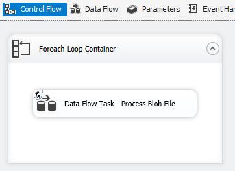

# Azure Feature Pack f&#252;r Integration Services (SSIS)
  Das SQL Server Integration Services-Feature Pack (SSIS) für Azure für SQL Server 2016 ist eine Erweiterung, die die folgenden SSIS-Komponenten für Verbindungen mit Azure, für die Übertragung von Daten zwischen Azure und lokalen Datenquellen und für die Verarbeitung der in Azure gespeicherten Daten bereitstellt.

 **Herunterladen** des [SSIS Feature Packs für Azure für SQL Server 2016](http://go.microsoft.com/fwlink/?LinkID=626967)

-   Verbindungs-Manager

    -   [Azure Storage-Verbindungs-Manager](../integration-services/connection-manager/azure-storage-connection-manager.md)

    -   [Azure-Abonnementverbindungs-Manager](../integration-services/connection-manager/azure-subscription-connection-manager.md)
    
    -   [Azure Data Lake Store Connection Manager (Azure Data Lake Store-Verbindungs-Manager)](../integration-services/connection-manager/azure-data-lake-store-connection-manager.md)

-   Aufgaben

    -   [Azure-Blob-Uploadtask](../integration-services/control-flow/azure-blob-upload-task.md)

    -   [Azure Blob-Download-Task](../integration-services/control-flow/azure-blob-download-task.md)

    -   [Azure HDInsight Hive-Task](../integration-services/control-flow/azure-hdinsight-hive-task.md)

    -   [Azure HDInsight Pig-Task](../integration-services/control-flow/azure-hdinsight-pig-task.md)

    -   [Azure HDInsight Create Cluster-Task](../integration-services/control-flow/azure-hdinsight-create-cluster-task.md)

    -   [Azure HDInsight-Delete Cluster-Task](../integration-services/control-flow/azure-hdinsight-delete-cluster-task.md)
    
    -   [Azure SQL DW-Uploadtask](../integration-services/control-flow/azure-sql-dw-upload-task.md)

-   Datenflusskomponenten

    -   [Azure-Blob-Quelle](../integration-services/data-flow/azure-blob-source.md)

    -   [Azure-BLOB-Ziel](../integration-services/data-flow/azure-blob-destination.md)
    
    -   [Azure Data Lake Store Source](../integration-services/data-flow/azure-data-lake-store-source.md)
    
    -   [Azure Data Lake Store Destination](../integration-services/data-flow/azure-data-lake-store-destination.md)

-   Azure Blob-Enumerator. Siehe [Enumerator = Foreach-Azure-Blob-Enumerator](../../../Topic/Foreach%20Loop%20Editor%20\(Collection%20Page\).md#ForeachAzureBlob)

## Download des Feature Packs
 Sie können das SQL Server Integration Services-Feature Pack (SSIS) für Azure für SQL Server 2016 [hier](http://go.microsoft.com/fwlink/?LinkID=626967)herunterladen.

## Erforderliche Komponenten
 Sie müssen die folgenden erforderlichen Komponenten installieren, bevor Sie dieses Feature Pack installieren.

-   SQL Server Integration Services

-   .NET Framework 4.5

## Szenario: Verarbeitung großer Datenmengen
 Verwenden Sie den Azure Connector zum Ausführen der folgenden Big Data-Verarbeitungsaufgaben:

1.  Verwenden Sie den Azure Blob Upload-Task zum Hochladen von Eingabedaten in den Azure BLOB-Speicher.

2.  Verwenden Sie den Azure HDInsight Create Cluster-Task zum Erstellen eines Azure HDInsight-Clusters. Dieser Schritt ist optional, wenn Sie einen eigenen Cluster verwenden möchten.

3.  Verwenden Sie den Azure HDInsight Hive-Task oder Azure HDInsight Pig-Task zum Aufrufen eines Pig- oder Hive-Auftrags auf dem Azure HDInsight-Cluster.

4.  Verwenden Sie den Azure HDInsight Delete Cluster-Task zum Löschen des HDInsight-Clusters nach der Verwendung, wenn Sie in Schritt 2 einen HDInsight-Bedarfscluster erstellt haben.

5.  Verwenden Sie den Azure HDInsight Blob Download-Task zum Herunterladen der Pig/Hive-Ausgabedaten vom Azure BLOB-Speicher.

 
## Szenario: Verwalten von Daten in der Cloud
 Verwenden Sie das Azure BLOB-Ziel in einem SSIS-Paket, um Ausgabedaten in einen Azure BLOB-Speicher zu schreiben, oder verwenden Sie die Azure Blob-Quelle zum Lesen von Daten aus einem Azure BLOB-Speicher.

 
 

 Verwenden Sie den Foreach-Schleifencontainer mit dem Azure Blob-Enumerator, um Daten in mehreren BLOB-Dateien zu verarbeiten.

  