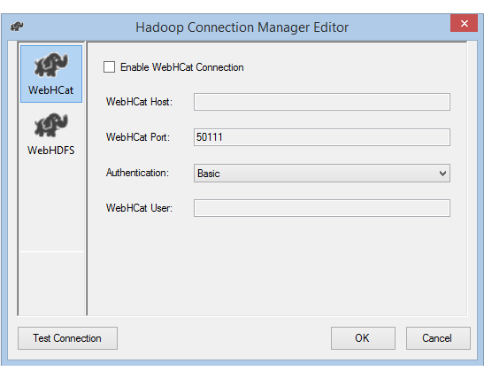

# Hadoop-Verbindungs-Manager
  Der Hadoop-Verbindungs-Manager ermöglicht die Verbindung eines SSIS-Pakets mit einem Hadoop-Cluster mithilfe der Werte, die Sie für die Eigenschaften angeben.  
  
## Konfigurieren des Hadoop-Verbindungs-Managers  
  
1.  Wählen Sie im Dialogfeld **SSIS-Verbindungs-Manager** hinzufügen die Option **Hadoop** aus, und klicken Sie auf **Hinzufügen**. Der **Hadoop-Verbindungs-Manager-Editor** wird geöffnet.  
  
2.  Wählen Sie links die Registerkarte **WebHCat** oder **WebHDFS** aus, um entsprechende Hadoop-Clusterinformationen zu konfigurieren.  
  
3.  Wenn Sie die Option **WebHCat** aktivieren, um einen Hive- oder Pig-Auftrag auf Hadoop aufzurufen, gehen Sie folgendermaßen vor.  
  
    1.  Geben Sie für **WebHCat Host** den Server ein, der den WebHCat-Dienst hostet.  
  
    2.  Geben Sie für **WebHCat Port** den Port des WebHCat-Diensts ein. Dies ist standardmäßig 50111.  
  
    3.  Wählen Sie unter **Authentication** die Zugriffsmethode für den WebHCat-Dienst auf. Die verfügbaren Werte sind **Basic** und **Kerberos**.  
  
           
  
           
  
    4.  Geben Sie für **WebHCat User** im Feld **User** den für den Zugriff auf WebHCat autorisierten Benutzer ein.  
  
    5.  Wenn Sie als Authentifizierungsoption **Kerberos** wählen, geben Sie in die Felder **Password** und **Domain** das Kennwort und die Domäne des Benutzers ein.  
  
4.  Wenn Sie die Option **WebHDFS** aktivieren, um Daten aus oder in HDFS zu kopieren, gehen Sie folgendermaßen vor.  
  
    1.  Geben Sie für **WebHDFS Host** den Server ein, der den WebHDFS-Dienst hostet.  
  
    2.  Geben Sie für **WebHDFS Port** den Port des WebHDFS-Diensts ein. Dies ist standardmäßig 50070.  
  
    3.  Wählen Sie unter **Authentication** die Zugriffsmethode für den WebHDFS-Dienst aus. Die verfügbaren Werte sind **Basic** und **Kerberos**.  
  
    4.  Geben Sie für **WebHDFS User** den für den Zugriff auf HDFS autorisierten Benutzer ein.  
  
    5.  Wenn Sie als Authentifizierungsoption **Kerberos** wählen, geben Sie in die Felder **Password** und **Domain** das Kennwort und die Domäne des Benutzers ein.  
  
5.  Klicken Sie auf **Verbindung testen**, um die Verbindung zu testen. (Nur die Verbindung, die Sie aktiviert, wird getestet.)  
  
6.  Klicken Sie auf **OK** , um das Dialogfeld zu schließen.  
  
## Siehe auch  
 [Hadoop Hive-Task](../../integration-services/control-flow/hadoop-hive-task.md)   
 [Hadoop Pig-Task](../../integration-services/control-flow/hadoop-pig-task.md)   
 [Hadoop-Dateisystemtask](../../integration-services/control-flow/hadoop-file-system-task.md)  
  
  