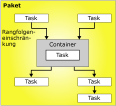

# Ablaufsteuerung
  Ein Paket besteht aus einer Ablaufsteuerung und optional einem oder mehreren Datenflüssen. [!INCLUDE[ssNoVersion](../../includes/ssnoversion-md.md)][!INCLUDE[ssISnoversion](../../includes/ssisnoversion-md.md)] stellt drei verschiedene Arten von ablaufsteuerungselementen bereit: Container für die Strukturen in Paketen, Tasks für die Funktionalität sowie rangfolgeneinschränkungen, mit denen die ausführbaren Dateien, Container und Tasks zu einer geordneten ablaufsteuerung verbunden.  
  
 Weitere Informationen finden Sie unter [Precedence Constraints](../../integration-services/control-flow/precedence-constraints.md), [Integration Services Containers](../../integration-services/control-flow/integration-services-containers.md)und [Integration Services Tasks](../../integration-services/control-flow/integration-services-tasks.md).  
  
 Im folgenden Diagramm wird eine Ablaufsteuerung mit einem Container und sechs Tasks angezeigt. Fünf Tasks sind auf Paketebene und ein Task auf Containerebene definiert. Der Task befindet sich innerhalb eines Containers.  
  
   
  
 Die Architektur von [!INCLUDE[ssISnoversion](../../includes/ssisnoversion-md.md)] unterstützt das Schachteln von Containern, und eine Ablaufsteuerung kann mehrere Ebenen geschachtelter Container einschließen. Beispielsweise könnte ein Paket einen Foreach-Schleifencontainer enthalten, der wiederum einen Foreach-Schleifencontainer enthält usw.  
  
 Ereignishandler weisen ebenfalls Ablaufsteuerungen auf, die mit denselben Ablaufsteuerungselementen erstellt werden.  
  
## Ablaufsteuerungsimplementierung  
 Sie erstellen die Ablaufsteuerung in einem Paket mithilfe der Registerkarte **Ablaufsteuerung** im [!INCLUDE[ssIS](../../includes/ssis-md.md)] -Designer. Wenn die Registerkarte **Ablaufsteuerung** aktiv ist, werden in der Toolbox die Tasks und Container aufgeführt, die Sie der Ablaufsteuerung hinzufügen können.  
  
 Im folgenden Diagramm wird die Ablaufsteuerung eines einfachen Pakets im Ablaufsteuerungs-Designer angezeigt. Die dargestellte Ablaufsteuerung besteht aus drei Tasks auf Paketebene und einem Container auf Paketebene, der drei Tasks enthält. Die Tasks und Container sind mithilfe von Rangfolgeneinschränkungen miteinander verbunden.  
  
   
  
 Das Erstellen einer Ablaufverfolgung umfasst folgende Aufgaben:  
  
-   Hinzufügen von Containern, die die Wiederholung von Workflows in einem Paket implementieren oder eine Ablaufsteuerung unterteilen.  
  
-   Hinzufügen von Tasks, mit denen Ablaufsteuerung unterstützt, Daten vorbereitet, Workflow- und Business Intelligence-Funktionen ausgeführt und Skript implementiert wird.  
  
     [!INCLUDE[ssISnoversion](../../includes/ssisnoversion-md.md)] enthält eine Reihe von Tasks, mit denen Sie Ablaufsteuerungen erstellen können, die die Unternehmensanforderungen des Pakets erfüllen. Falls im Paket Daten verwendet werden müssen, muss die Ablaufsteuerung mindestens einen Datenflusstask enthalten. Beispielsweise kann es sein, dass mit einem Paket Daten extrahiert, Datenwerte aggregiert und dann die Ergebnisse in eine Datenquelle geschrieben werden müssen.  Weitere Informationen finden Sie unter [Integration Services-Tasks](../../integration-services/control-flow/integration-services-tasks.md) und [Hinzufügen oder Löschen eines Tasks oder Containers in einer Ablaufsteuerung](../../integration-services/control-flow/add-or-delete-a-task-or-a-container-in-a-control-flow.md).  
  
-   Verbinden von Containern und Tasks zu einer geordneten Ablaufsteuerung mithilfe von Rangfolgeneinschränkungen.  
  
     Nachdem Sie der Entwurfsoberfläche der Registerkarte **Ablaufsteuerung** einen Task oder Container hinzugefügt haben, fügt der [!INCLUDE[ssIS](../../includes/ssis-md.md)] -Designer dem Element automatisch einen Konnektor hinzu. Enthält ein Paket mehrere Elemente, Tasks oder Container, können Sie sie zu einer Ablaufsteuerung verknüpfen, indem Sie die entsprechenden Konnektoren von einem Element in ein anderes Element ziehen.  
  
     Der Konnektor zwischen zwei Elementen stellt eine Rangfolgeneinschränkung dar. Eine Rangfolgeneinschränkung definiert die Beziehung zwischen den beiden verbundenen Elementen. Sie gibt die Reihenfolge an, in der Tasks und Container zur Laufzeit ausgeführt werden, sowie die Bedingungen, unter denen Tasks und Container ausgeführt werden. Beispielsweise kann eine Rangfolgeneinschränkung definieren, dass ein Task erfolgreich ausgeführt werden muss, damit der nächste Task in der Ablaufsteuerung ausgeführt wird. Weitere Informationen finden Sie unter [Precedence Constraints](../../integration-services/control-flow/precedence-constraints.md).  
  
-   Hinzufügen von Verbindungs-Managern.  
  
     Viele Tasks erfordern eine Verbindung mit einer Datenquelle, und Sie müssen dem Paket die vom Task benötigten Verbindungs-Manager hinzufügen. In Abhängigkeit vom verwendeten Enumeratortyp erfordert der Foreach-Schleifencontainer möglicherweise auch einen Verbindungs-Manager. Sie können die Verbindungs-Manager beim Erstellen der Ablaufsteuerung für jedes einzelne Element hinzufügen, oder aber bevor Sie mit dem Erstellen der Ablaufsteuerung beginnen. Weitere Informationen finden Sie unter [Integration Services-Verbindungen &#40;SSIS&#41;](../../integration-services/connection-manager/integration-services-ssis-connections.md) und [Erstellen von Verbindungs-Managern](http://msdn.microsoft.com/library/6ca317b8-0061-4d9d-b830-ee8c21268345).  
  
 [!INCLUDE[ssIS](../../includes/ssis-md.md)]-Designer enthält außerdem viele Entwurfszeitfunktionen, die Sie verwenden können, auf die Entwurfsoberfläche verwalten und die ablaufsteuerung selbstdokumentierend zu gestalten.  
  
## Verwandte Aufgaben  
  
-   [Fügen Sie hinzu oder löschen Sie eines Tasks oder Containers in einer Ablaufsteuerung](../../integration-services/control-flow/add-or-delete-a-task-or-a-container-in-a-control-flow.md)  
  
-   [Festlegen der Eigenschaften eines Tasks oder Containers](http://msdn.microsoft.com/library/52d47ca4-fb8c-493d-8b2b-48bb269f859b)  
  
-   [Gruppe oder Aufheben der Gruppierung von Komponenten](../../integration-services/group-or-ungroup-components.md)  
  
  

