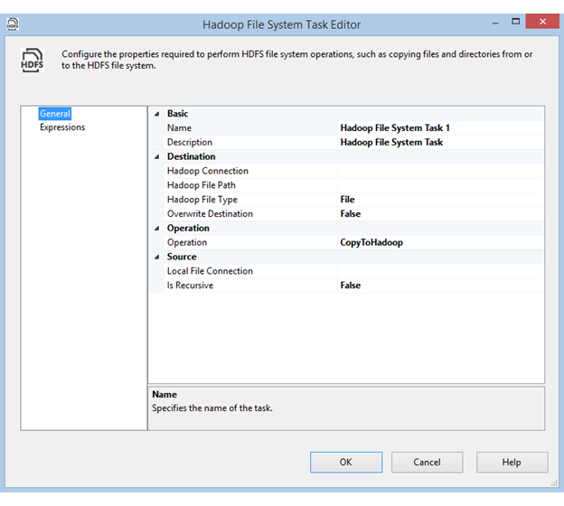

# Hadoop-Dateisystemtask
  Der Hadoop-Dateisystemtask ermöglicht einem SSIS-Paket das Kopieren von Dateien aus einem, in ein oder innerhalb eines Hadoop-Clusters.  
  
 Zum Hinzufügen eines Hadoop-Dateisystemtasks ziehen Sie diesen auf den Designer. Doppelklicken Sie anschließend auf den Task, oder klicken Sie mit der rechten Maustaste darauf, und klicken Sie auf **Bearbeiten**, um das Hadoop-Dialogfeld **Editor für den Task „Dateisystem“** zu öffnen.  
  
   
  
## enthalten  
 Konfigurieren Sie die folgenden Optionen im Hadoop-Dialogfeld **Editor für den Task „Dateisystem“** .  
  
|Feld|Description|  
|-----------|-----------------|  
|**Hadoop-Verbindung**|Geben Sie einen vorhandenen Hadoop-Verbindungs-Manager an, oder erstellen Sie einen neuen. Dieser Verbindungs-Manager gibt an, wo die Zieldateien gehostet werden.|  
|**Hadoop-Dateipfad**|Geben Sie den Datei- oder Verzeichnispfad auf HDFS an.|  
|**Hadoop-Dateityp**|Geben Sie an, ob es sich beim HDFS-Dateisystemobjekt um eine Datei oder um ein Verzeichnis handelt.|  
|**Ziel überschreiben**|Geben Sie an, ob die Zieldatei überschrieben werden soll, wenn sie bereits vorhanden ist.|  
|**Vorgang**|Geben Sie den Vorgang an. Verfügbare Vorgänge sind **CopyToHDFS**, **CopyFromHDFS**und **CopyWithinHDFS**.|  
|**Lokale Dateiverbindung**|Geben Sie einen vorhandenen Dateiverbindungs-Manager an, oder erstellen Sie einen neuen. Dieser Verbindungs-Manager gibt an, wo die Quelldateien gehostet werden.|  
|**Ist rekursiv**|Geben Sie an, ob alle Unterordner rekursiv kopiert werden sollen.|  
  
## Siehe auch  
 [Hadoop-Verbindungs-Manager](../../integration-services/connection-manager/hadoop-connection-manager.md)   
 [Dateiverbindungs-Manager](../../integration-services/connection-manager/file-connection-manager.md)  
  
  