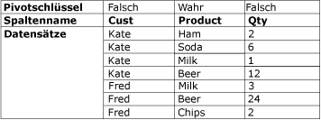

# Entpivotierungstransformation
  Die Transformation für UNPIVOT ändert ein nicht normalisiertes Dataset in eine stärker normalisierte Version, indem Werte aus mehreren Spalten in einem einzelnen Datensatz in mehrere Datensätze mit den gleichen Werten in einer einzigen Spalte erweitert werden. Angenommen, ein Dataset, das Kundennamen auflistet, weist eine Zeile pro Kunden auf, wobei die Produkte und die gekaufte Menge in Spalten in der Zeile angezeigt werden. Nachdem die Entpivotierungstransformation das Dataset normalisiert hat, enthält das Dataset eine andere Zeile für jedes Produkt, das der Kunde gekauft hat.  
  
 Im folgenden Diagramm wird ein Dataset vor dem Entpivotieren der Daten in der Product-Spalte dargestellt.  
  
   
  
 Im folgenden Diagramm wird ein Dataset nach dem Entpivotieren in der Product-Spalte dargestellt.  
  
   
  
 Unter einigen Umständen enthalten die Ergebnisse der Transformation für UNPIVOT möglicherweise Zeilen mit unerwarteten Werten. Wenn z.B. die im Diagramm gezeigten zu entpivotierenden Beispieldaten in allen Qty-Spalten für Fred NULL-Werte enthielten, würde die Ausgabe nur eine Zeile für Fred enthalten, nicht fünf. Die Qty-Spalte würde je nach dem Datentyp der Spalte entweder NULL oder 0 enthalten.  
  
## Konfiguration der Transformation für UNPIVOT  
 Die Transformation für UNPIVOT schließt die benutzerdefinierte Eigenschaft **PivotKeyValue** ein. Diese Eigenschaft kann beim Laden des Pakets mithilfe eines Eigenschaftsausdrucks aktualisiert werden. Weitere Informationen finden Sie unter [Integration Services-Ausdrücke &#40;SSIS&#41;](../../../integration-services/expressions/integration-services-ssis-expressions.md), [Verwenden von Eigenschaftsausdrücken in Paketen](../../../integration-services/expressions/use-property-expressions-in-packages.md) und [Benutzerdefinierte Eigenschaften von Transformationen](../../../integration-services/data-flow/transformations/transformation-custom-properties.md).  
  
 Diese Transformation weist je eine Eingabe und eine Ausgabe auf. Es ist keine Fehlerausgabe vorhanden.  
  
 Sie können Eigenschaften mit dem [!INCLUDE[ssIS](../../../includes/ssis-md.md)] -Designer oder programmgesteuert festlegen.  
  
 Klicken Sie auf eines der folgenden Themen, um weitere Informationen zu den Eigenschaften zu erhalten, die Sie im Dialogfeld **Editor zum Entpivotieren von Transformationen** festlegen können:  
  
-   [Editor zum Entpivotieren von Transformationen](../../../integration-services/data-flow/transformations/unpivot-transformation-editor.md)  
  
 Klicken Sie auf eines der folgenden Themen, um weitere Informationen zu den Eigenschaften zu erhalten, die Sie im Dialogfeld **Erweiterter Editor** oder programmgesteuert festlegen können:  
  
-   [Allgemeine Eigenschaften](http://msdn.microsoft.com/library/51973502-5cc6-4125-9fce-e60fa1b7b796)  
  
-   [Benutzerdefinierte Eigenschaften von Transformationen](../../../integration-services/data-flow/transformations/transformation-custom-properties.md)  
  
 Informationen zum Festlegen der Eigenschaften finden Sie unter [Festlegen der Eigenschaften einer Datenflusskomponente](../../../integration-services/data-flow/set-the-properties-of-a-data-flow-component.md).  
  
  
