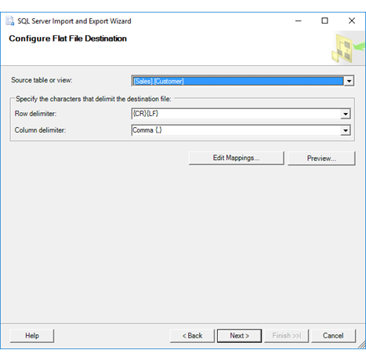

# Flatfileziel konfigurieren (SQL Server-Import/Export-Assistent)
  Wenn Sie ein Flatfileziel ausgewählt der [!INCLUDE[ssNoVersion](../../includes/ssnoversion-md.md)] Import / Export-Assistent zeigt **Flatfileziel konfigurieren** nach dem Sie angeben, dass eine Tabelle kopiert werden soll, oder nachdem Sie eine Abfrage bereitzustellen. Auf dieser Seite geben Sie Formatierungsoptionen für das Flatfileziel an. Optional können Sie die Zuordnung einzelner Spalten überprüfen und eine Vorschau von Beispieldaten anzeigen.  
  
## Screenshot der Seite „Flatfileziel konfigurieren“  
 Der folgende Screenshot zeigt ein Beispiel der **Flatfileziel konfigurieren** Seite des Assistenten.
 
 In diesem Beispiel hat der Benutzer die folgenden Optionen zum Erstellen einer typischen CSV-Datei (mit kommagetrennten Werten) angegeben.
-   **Zeilentrennzeichen**. Jede Datenzeile in der Ausgabe endet mit einem Wagenrücklauf-Zeilenvorschub Kombination.
-   **Spaltentrennzeichen**. Datenspalten innerhalb jeder Zeile werden durch ein Komma getrennt.

 
  
## Wählen Sie eine Quelltabelle
 **Quelltabelle oder -sicht**  
-   Wenn Sie auf einer vorherigen Seite angegeben haben, dass Sie eine Tabelle kopieren möchten, wählen Sie die Quelltabelle oder-Sicht aus der Dropdown-Liste.
-   Wenn Sie eine Abfrage bereitgestellt `"Query"` ausgewählt ist, und ist die einzige Option.  

## Geben Sie die Zeilen- und Spaltentrennzeichnen für die Ausgabe
 **Zeilentrennzeichen**  
 Wählen Sie aus der Liste der Trennzeichen zum Trennen von Zeilen in der Ausgabe. Es gibt keine Option zum Angeben einer *benutzerdefinierte* Zeilentrennzeichen.  
  
|Wert|Description|  
|-----------|-----------------|  
|**{CR}{LF}**|Trennen von Zeilen mit einem Wagenrücklauf in Kombination mit einem Zeilenvorschub.|  
|**{CR}**|Trennen von Zeilen mit einem Wagenrücklauf.|  
|**{LF}**|Trennen von Zeilen mit einem Zeilenvorschub.|  
|**Semikolon {;}**|Trennen von Zeilen mit einem Semikolon.|  
|**Doppelpunkt {:}**|Trennen von Zeilen mit einem Doppelpunkt.|  
|**Komma {,}**|Trennen von Zeilen mit einem Komma.|  
|**Tabulator {t}**|Trennen von Zeilen mit einem Tabstoppzeichen.|  
|**Senkrechter Strich {&#124;}**|Trennen von Zeilen mit einem senkrechten Strich.|  
  
 **Spaltentrennzeichen**  
 Wählen Sie aus der Liste der Trennzeichen zum Trennen der Spalten in der Ausgabe. Es gibt keine Option zum Angeben einer *benutzerdefinierte* Spaltentrennzeichen.  
  
|Wert|Description|  
|-----------|-----------------|  
|**{CR}{LF}**|Trennen von Spalten mit einem Wagenrücklauf in Kombination mit einem Zeilenvorschub.|  
|**{CR}**|Trennen von Spalten mit einem Wagenrücklauf.|  
|**{LF}**|Trennen von Spalten mit einem Zeilenvorschub.|  
|**Semikolon {;}**|Trennen von Spalten mit einem Semikolon.|  
|**Doppelpunkt {:}**|Trennen von Spalten mit einem Doppelpunkt.|  
|**Komma {,}**|Trennen von Spalten mit einem Komma.|  
|**Tabulator {t}**|Trennen von Spalten mit einem Tabstoppzeichen.|  
|**Senkrechter Strich {&#124;}**|Trennen von Spalten mit einem senkrechten Strich.|  

## Optional, überprüfen Sie die spaltenzuordnungen und anzeigen Daten in der Vorschau

**Zuordnungen bearbeiten**   
Klicken Sie optional auf **Zuordnungen bearbeiten** zum Anzeigen der **Spaltenzuordnungen** im Dialogfeld für die ausgewählte Tabelle. Verwenden Sie das Dialogfeld **Spaltenzuordnungen** , um Folgendes auszuführen.
-   Überprüfen Sie die Zuordnung einzelner Spalten zwischen der Quelle und dem Ziel.
-   Wenn Sie nur eine Teilmenge von Spalten kopieren möchten, wählen Sie **ignore** für Spalten aus, die Sie nicht kopieren möchten.

Weitere Informationen finden Sie unter [Spaltenzuordnungen](../../integration-services/import-export-data/column-mappings-sql-server-import-and-export-wizard.md).  

**Vorschau**  
Klicken Sie optional auf **Vorschau** um bis zu 200 Zeilen der Beispieldaten in der Vorschau anzuzeigen die **Vorschaudaten** (Dialogfeld). Dadurch können Sie sicherstellen, dass der Assistent die Daten kopieren wird, die Sie kopieren möchten. Weitere Informationen finden Sie unter [Datenvorschau](../../integration-services/import-export-data/preview-data-dialog-box-sql-server-import-and-export-wizard.md).  
  
Nachdem Sie die Daten in der Vorschau anzeigen, sollten Sie die Optionen ändern, die Sie auf den vorherigen Seiten des Assistenten ausgewählt haben. Wechseln Sie zum Vornehmen dieser Änderungen zurück auf die Seite **Flatfileziel konfigurieren** , und klicken Sie anschließend auf **Zurück** , um zu vorherigen Seiten zurückzukehren, auf denen Sie Ihre Auswahl ändern können.  

## Wie geht es weiter?  
 Nachdem Sie Formatierungsoptionen für die Zielflatfile angegeben haben, ist die nächste Seite **Paket speichern und ausführen**. Auf dieser Seite geben Sie an, ob der Vorgang sofort ausgeführt werden soll. Abhängig von Ihrer Konfiguration Sie möglicherweise auch zum Speichern der Einstellungen als ein [!INCLUDE[ssNoVersion](../../includes/ssnoversion-md.md)] [!INCLUDE[ssISnoversion](../../includes/ssisnoversion-md.md)] Paket, um ihn anzupassen und späteren Wiederverwendung. Weitere Informationen finden Sie unter [Paket speichern und ausführen](../../integration-services/import-export-data/save-and-run-package-sql-server-import-and-export-wizard.md).  

