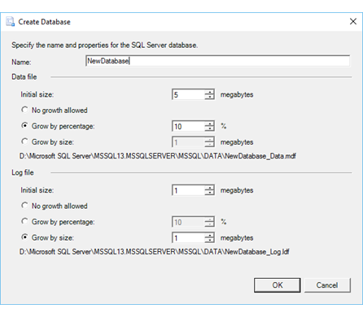

# Datenbank erstellen (SQL Server-Import/Export-Assistent)
Wenn Sie auf der Seite **Ziel auswählen** die Option **Neu** auswählen, um eine neue SQL Server Zieldatenbank zu erstellen, zeigt der [!INCLUDE[ssNoVersion](../../includes/ssnoversion-md.md)] -Import/Export-Assistent das Dialogfeld **Datenbank erstellen** an. Auf dieser Seite geben Sie einen Namen für die neue Datenbank ein. Optional können Sie auch die Einstellungen für die anfängliche Größe und die automatische Vergrößerung der neuen Datenbank und der zugehörigen Protokolldatei ändern. 

Die **Create Database** Dialogfeld des Assistenten bietet nur die grundlegenden Optionen, die für das Erstellen einer neuen SQL Server-Datenbank verfügbar sind. Anzeigen und konfigurieren alle Optionen für einen neuen [!INCLUDE[ssNoVersion](../../includes/ssnoversion-md.md)] -Datenbank [!INCLUDE[ssManStudioFull](../../includes/ssmanstudiofull-md.md)] zum Erstellen der Datenbank oder die Datenbank zu konfigurieren, nachdem der Assistent erstellt. 

> [!NOTE]
> Wenn Sie Informationen zur [!INCLUDE[tsql](../../includes/tsql-md.md)]-Anweisung CREATE DATABASE und nicht zum Dialogfeld **Datenbank erstellen** des [!INCLUDE[ssNoVersion](../../includes/ssnoversion-md.md)]-Import/Export-Assistenten suchen, lesen Sie den Artikel [CREATE DATABASE &#40;Transact-SQL&#41;](../../t-sql/statements/create-database-sql-server-transact-sql.md).  

## Screenshot der Seite „Datenbank erstellen“  
Der folgende Screenshot zeigt das Dialogfeld **Datenbank erstellen** des Assistenten an.  

  

## Angeben eines Namens für die neue Datenbank  
**Name**  
 Geben Sie einen Namen für die SQL Server-Zieldatenbank an.
 
### Benennungsanforderungen
Beachten Sie beim Benennen dieser Datenbank die entsprechenden Konventionen von SQL Server.  
  
-   Der Datenbankname muss innerhalb einer Instanz von SQL Server eindeutig sein.  
  
-   Der Datenbankname darf maximal 123 Zeichen lang sein. (SQL Server fügt 5 Zeichen lange Suffixe an die Datendatei und die Protokolldatei an, sodass die Maximallänge des gesamten Datenbanknamens 128 Zeichen beträgt.)  
  
-   Der Datenbankname muss den Regeln für Bezeichner in SQL Server entsprechen. Hier sind die wichtigsten Anforderungen.  
  
    -   Das erste Zeichen muss ein Buchstabe, ein Unterstrich (_), das at-Zeichen (@) oder das Nummernzeichen (#) sein.  
  
    -   Nachfolgende Zeichen können Buchstaben, Ziffern, das at-Zeichen, das Dollarzeichen ($), das Nummernzeichen oder ein Unterstrich sein.  
  
    -   Leerzeichen oder Sonderzeichen dürfen nicht verwendet werden.  
  
Ausführliche Informationen zu diesen Anforderungen finden Sie unter [Datenbankbezeichner](../../relational-databases/databases/database-identifiers.md).  

## Optionales Angeben von Datendatei- und Protokolldateioptionen

> [!TIP]
> Sie müssen im Feld **Name** einen Namen für die neue Datenbank angeben, die Einstellungen für Dateigröße und Dateivergrößerung können Sie auf den Standardwerten belassen.

### Optionen für Datendateien  
 **Anfangsgröße**  
 Geben Sie die Anzahl der Megabytes für die Anfangsgröße der Datendatei an.  
  
 **Keine Vergrößerung zulässig**  
 Geben Sie an, ob die Datendatei die Größe der angegebenen Anfangsgröße übersteigen kann.  
  
 **Vergrößerung nach Prozent**  
 Geben Sie einen Prozentsatz an, um den die Datendatei wachsen kann.  
  
 **Vergrößerung nach Größe**  
 Geben Sie die Anzahl der Megabytes an, um die die Datendatei wachsen kann.  
  
### Protokolldateioptionen  
 **Anfangsgröße**  
 Geben Sie die Anzahl der Megabytes für die Anfangsgröße der Protokolldatei an.  
  
 **Keine Vergrößerung zulässig**  
 Geben Sie an, ob die Protokolldatei die Größe der angegebenen Anfangsgröße übersteigen kann.  
  
 **Vergrößerung nach Prozent**  
 Geben Sie einen Prozentsatz an, um den die Protokolldatei wachsen kann.  
  
 **Vergrößerung nach Größe**  
 Geben Sie die Anzahl der Megabytes an, um die die Protokolldatei wachsen kann.  

### Weitere Informationen
Weitere Informationen zu den Optionen für die Dateigröße, die auf dieser Seite angezeigt werden, finden Sie unter [CREATE DATABASE &#40;SQL Server Transact-SQL&#41;](../../t-sql/statements/create-database-sql-server-transact-sql.md). 

## Wie geht es weiter?  
 Nachdem Sie einen Namen für die neue Datenbank angegeben und auf **OK**geklickt haben, wechselt das Dialogfeld **Datenbank erstellen** wieder zurück zur Seite **Ziel auswählen** . Weitere Informationen finden Sie unter [Ziel auswählen](../../integration-services/import-export-data/choose-a-destination-sql-server-import-and-export-wizard.md).  

