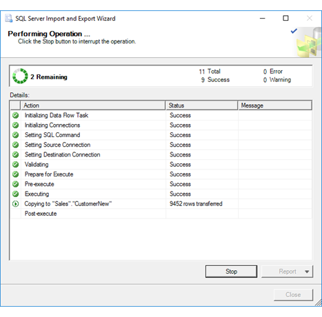
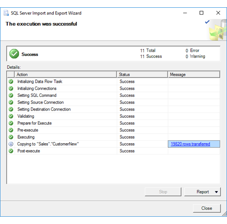

# Vorgang wird ausgeführt (SQL Server-Import/Export-Assistent)
Nachdem Sie Ihre Auswahl im Assistenten überprüft und auf der Seite **Abschließen des Assistenten** auf **Fertig stellen** geklickt haben, zeigt der [!INCLUDE[ssNoVersion](../../includes/ssnoversion-md.md)] -Import/Export-Assistent **Vorgang wird ausgeführt**an. Auf dieser Seite sehen Sie den Status und das Ergebnis des Vorgangs, den Sie auf den vorherigen Seiten konfiguriert haben. Sie müssen auf dieser Seite keine Aktionen durchführen.

## Screenshot: Vorgang wird ausgeführt 
 Der folgende Screenshot zeigt die Seite **Vorgang wird ausgeführt** des Assistenten während der Vorgang noch ausgeführt wird.  
  
   

## Screenshot: Vorgang wurde abgeschlossen 
 Der folgende Screenshot zeigt die Seite **Vorgang wird ausgeführt** des Assistenten nachdem der Vorgang abgeschlossen wurde. Klicken Sie auf ein Element in der Spalte **Nachricht** , um weitere Informationen zum jeweiligen Schritt zu erhalten.  
  
   
  
## Überwachen des Vorgangsstatus
 **Aktion**  
 Zeigt jeden Schritt des Vorgangs an.  
  
 **Status**  
 Zeigt an, ob die einzelnen Schritte erfolgreich ausgeführt wurden oder fehlerhaft sind.  
  
 **Nachricht**  
 Zeigt Informationen und Fehlermeldungen zu dem Schritt an. Klicken Sie auf ein Element in dieser Spalte, um weitere Informationen zum jeweiligen Schritt zu erhalten.

## Unterbrechen des Vorgangs oder Speichern der Ergebnisse
 **Stop**  
 Mit der Schaltfläche **Beenden** können Sie den Vorgang ggf. unterbrechen.  
  
 **Report**  
 Mit dieser Option können Sie einen Bericht mit den Ergebnissen anzeigen, den Bericht in einer Datei speichern, den Bericht in die Zwischenablage kopieren oder den Bericht per E-Mail versenden.  
  
## Wie geht es weiter?  
 Wenn der von Ihnen konfigurierte Vorgang ausgeführt und erfolgreich abgeschlossen wurde, sind Sie mit der Ausführung des [!INCLUDE[ssNoVersion](../../includes/ssnoversion-md.md)] -Import/Export-Assistenten fertig.  
-   Wenn Sie den Vorgang sofort ausgeführt haben, können Sie das ausgewählte Ziel öffnen, um die Daten zu überprüfen, die der Assistent kopiert hat.  
-   Wenn Sie das vom Assistenten erstellte SSIS-Paket gespeichert haben, können Sie es in SQL Server Data Tools öffnen, um es anzupassen und wiederzuverwenden. Informationen zur Anpassung des gespeicherten Pakets und zur späteren erneuten Ausführung finden Sie unter [Speichern des SSIS-Pakets](../../integration-services/import-export-data/save-ssis-package-sql-server-import-and-export-wizard.md).

## Siehe auch
[Erste Schritte mit diesem einfachen Beispiel des Import/Export-Assistenten](../../integration-services/import-export-data/get-started-with-this-simple-example-of-the-import-and-export-wizard.md)

