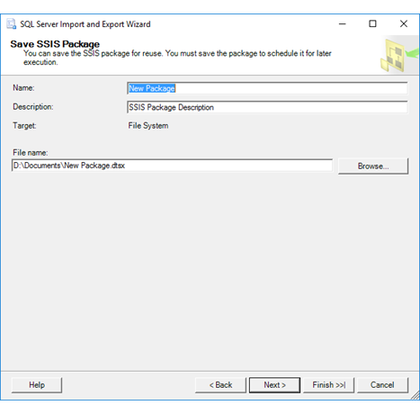

# SSIS-Paket speichern (SQL Server-Import/Export-Assistent)
  Wenn Sie angegeben haben, auf die **speichern und Paket ausführen** Seite, die Sie die Einstellungen als SQL Server Integration Services (SSIS)-Paket speichern möchten die [!INCLUDE[ssNoVersion](../../includes/ssnoversion-md.md)] Import / Export-Assistent zeigt **SSIS-Paket speichern**. Auf dieser Seite Geben Sie zusätzliche Optionen zum Speichern des Pakets, das vom Assistenten erstellt.  

Die auf der Seite **SSIS-Paket speichern** angezeigten Optionen hängen von Ihrer Auswahl auf der Seite **Paket speichern und ausführen** ab, ob das Paket in SQL Server oder im Dateisystem gespeichert werden soll. Weitere Informationen zur Seite **Paket speichern und ausführen** finden Sie unter [Paket speichern und ausführen](../../integration-services/import-export-data/save-and-run-package-sql-server-import-and-export-wizard.md).
 
**Was ist ein Paket?** Der Assistent verwendet SQL Server Integration Services (SSIS) zum Kopieren von Daten. In SSIS stellt das Paket die Basiseinheit dar. Der Assistent erstellt ein SSIS-Paket im Arbeitsspeicher, während Sie die Seiten des Assistenten durchlaufen und Optionen festlegen.

## Screenshot - allgemeine Optionen
Der folgende Screenshot zeigt den ersten Teil der **SSIS-Paket speichern** Seite des Assistenten. Der Rest der Seite verfügt über eine Variable Anzahl von Optionen, mit denen des Paketziels abhängig, die Sie ausgewählt haben.

## Bereitstellen eines Namens und einer Beschreibung für das Paket  
 **Name**  
 Geben Sie einen eindeutigen Namen für das Paket an.  
  
 **Beschreibung**  
 Geben Sie eine Beschreibung für das Paket an. Es wird hierbei empfohlen, das Paket zweckbezogen zu beschreiben, sodass Pakete selbsterklärend und einfacher zu verwalten sind.  
  
 **Target**  
 Das Ziel ([!INCLUDE[ssNoVersion](../../includes/ssnoversion-md.md)] oder Dateisystem), das Sie zuvor für das Paket angegeben haben. Wenn Sie das Paket an einem anderen Ziel speichern möchten, navigieren Sie zurück zur Seite **Paket speichern und ausführen** .

## Screenshot: Speichern des Pakets in SQL Server

 Die folgende Abbildung zeigt die **SSIS-Paket speichern** Seite des Assistenten bei Auswahl der **SQL Server** option die **speichern und Paket ausführen** Seite. 
  
  

## Optionen zum festlegen (Ziel = SQL Server) 

 > [!NOTE]
 > Der Assistent speichert das Paket in der **Msdb** -Datenbank in die **Sysssispackages** Tabelle. Diese Option **nicht** des Pakets zur SSIS-Katalogdatenbank (SSISDB) zu speichern.  
 
 **Servername**  
 Geben Sie den Namen des Zielservers ein, oder wählen Sie ihn aus.  
   
 **Windows-Authentifizierung verwenden**  
Stellen Sie eine Verbindung mit dem Server mithilfe der integrierten Windows-Authentifizierung her. Dies ist die bevorzugte Authentifizierungsmethode.  
  
 **SQL Server-Authentifizierung verwenden**  
Stellen Sie eine Verbindung mit dem Server mithilfe der SQL Server-Authentifizierung her.  
  
 **Benutzername**  
Wenn Sie SQL Server-Authentifizierung angegeben haben, geben Sie den Benutzernamen ein.  
  
 **Kennwort**  
Wenn Sie SQL Server-Authentifizierung angegeben haben, geben Sie das Kennwort ein.  
    
## Screenshot: Speichern des Pakets im Dateisystem
 
Die folgende Abbildung zeigt die **SSIS-Paket speichern** Seite des Assistenten bei Auswahl der **Dateisystem** option die **speichern und Paket ausführen** Seite. 
  
  

## Optionen zum festlegen (Ziel = Dateisystem)

 **Dateiname**  
 Geben Sie den Pfad und Dateinamen für die Zieldatei oder das Verwenden der **Durchsuchen** klicken, um ein Ziel auszuwählen.  
  
> [!TIP]
> Achten Sie darauf, dass Sie einen Zielordner, geben Sie entweder durch eingeben oder durch navigieren. Wenn Sie nur den Dateinamen ohne Pfad eingegeben haben, wissen Sie nicht, in dem der Assistent das Paket speichert. Außerdem versucht der Assistent möglicherweise, das Paket an einem Speicherort zu speichern, an dem Sie nicht über die Berechtigung zum Speichern einer Datei verfügen, und löst einen Fehler aus.  
>   
>  Notieren Sie sich, wo Sie die Paketdatei speichern.  
  
 **Durchsuchen**  
 Suchen Sie nach optional, wählen Sie den Pfad für die Zieldatei in der **Paket speichern** (Dialogfeld).  

## Informationen zu den beiden Seiten der Optionen für das Speichern des Pakets  
 Die Seite **SSIS-Paket speichern** ist eine der beiden Seiten, auf denen Sie Optionen für das Speichern des SSIS-Pakets auswählen.  
  
-   Auf der vorherigen Seite ( **Paket speichern und ausführen**) haben Sie ausgewählt, ob das Paket in SQL Server oder als Datei gespeichert werden soll. Sie können auch Sicherheitseinstellungen für das gespeicherte Paket auswählen. Weitere Informationen zur Seite **Paket speichern und ausführen** finden Sie unter [Paket speichern und ausführen](../../integration-services/import-export-data/save-and-run-package-sql-server-import-and-export-wizard.md).  
  
-   Auf der aktuellen Seite geben Sie einen Namen für das Paket und weitere Informationen dazu an, wo Sie es speichern möchten.  
 
## Erneutes Ausführen des gespeicherten Pakets zu einem späteren Zeitpunkt  
 Weitere Informationen dazu, wie Sie das gespeicherte Paket später erneut ausführen, finden Sie in den folgenden Themen.  
  
-   Weitere Informationen dazu, wie Sie ein Paket über eine benutzerfreundliche Oberfläche eines Hilfsprogramms ausführen, finden Sie unter [Paketausführungshilfsprogramm &#40;DtExecUI&#41; – Referenz zur Benutzeroberfläche](../../integration-services/packages/execute-package-utility-dtexecui-ui-reference.md).  
  
-   Weitere Informationen dazu, wie Sie ein Paket über die Eingabeaufforderung oder über eine Batchdatei ausführen, finden Sie unter [dtexec (Hilfsprogramm)](../../integration-services/packages/dtexec-utility.md).  
  
-   Wenn Sie das Paket in SQL Server in der Datenbank **msdb** gespeichert haben, stellen Sie eine Verbindung mit dem Integration Services-Dienst her. Navigieren Sie dann in SQL Server Management Studio im Objekt-Explorer zu **Gespeicherte Pakete | MSDB**, klicken Sie mit der rechten Maustaste auf das Paket, und wählen Sie **Paket ausführen**aus.

-   Wenn Sie das Paket im Dateisystem gespeichert haben, finden Sie unter [Ausführen von Integration Services-Paketen (SSIS)](../../integration-services/packages/run-integration-services-ssis-packages.md) Informationen zum Ausführen des Pakets in der Entwicklungsumgebung. Sie müssen das Paket einem Integration Services-Projekt hinzufügen, bevor Sie es öffnen und ausführen können.  

## Anpassen des gespeicherten Pakets  
 Weitere Informationen zum Anpassen des gespeicherten Pakets finden Sie unter [Integration Services-Pakete &#40;SSIS&#41;](../../integration-services/integration-services-ssis-packages.md).  
  
## Wie geht es weiter?  
 Nachdem Sie zusätzliche Optionen für das Speichern des Pakets angegeben haben, ist die nächste Seite **Abschließen des Assistenten**. Auf dieser Seite überprüfen Sie die im Assistenten ausgewählten Optionen und starten dann den Vorgang. Weitere Informationen finden Sie unter [Assistenten abschließen](../../integration-services/import-export-data/complete-the-wizard-sql-server-import-and-export-wizard.md).  
 
## Siehe auch  
[Speichern von Paketen](../../integration-services/save-packages.md)  
[Ausführen von Integration Services-Paketen (SSIS)](../../integration-services/packages/run-integration-services-ssis-packages.md)  
[SQL Server Integration Services](../../integration-services/sql-server-integration-services.md)
 
 

