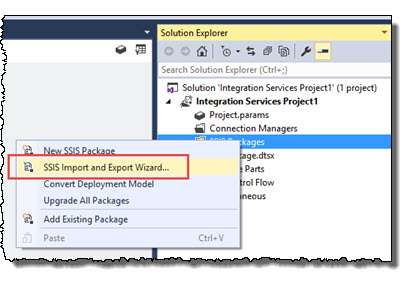

# Start the SQL Server Import and Export Wizard
Sie können den Import-/Export-Assistenten von [!INCLUDE[ssNoVersion](../../includes/ssnoversion-md.md)] mit einer der folgenden Methoden starten.
-   Von [Startmenü](#startStart) oder [Befehlszeile](#startCmd) aus, um aus allen unterstützten Datenquellen zu importieren oder dorthin zu exportieren.
-   Von [SQL Server Management Studio (SSMS)](#startSSMS) aus, wenn Sie zu SQL Server importieren oder von dort exportieren.
-   Von [Visual Studio mit SQL Server Data Tools (SSDT)](#startVS) aus, wenn Sie ein SQL Server Integration Services-Projekt geöffnet haben.

In diesem Thema wird nur beschrieben, wie Sie den Assistenten **starten**.
-   Wenn Sie eine Übersicht über den Assistenten suchen, lesen Sie [Importieren und Exportieren von für SQL Server unterstützten Datenquellen](../../integration-services/import-export-data/import-and-export-data-with-the-sql-server-import-and-export-wizard.md).
-   Wenn Sie Informationen zu den Schritten im Assistenten suchen, wählen Sie die gewünschte Seite im Inhaltsnavigationsmenü aus. Es ist eine eigene Dokumentationsseite für jede Seite des Assistenten. Drücken Sie alternativ auf einer beliebigen Seite oder in einem beliebigen Dialogfeld des Assistenten auf F1, um die Dokumentation für die aktuelle Seite anzuzeigen.

**So erhalten Sie den Wizard.** Wenn Sie den Assistenten ausführen möchten, [!INCLUDE[msCoName] (../Token/msCoName_md.md)] [!INCLUDE[ssNoVersion](../../includes/ssnoversion-md.md)] aber nicht auf Ihrem Computer installiert ist, können Sie den [!INCLUDE[ssNoVersion](../../includes/ssnoversion-md.md)]-Import/Export-Assistenten mit den SQL Server Data Tools (SSDT) installieren. Weitere Informationen finden Sie unter [Herunterladen von SQL Server Data Tools (SSDT)](https://msdn.microsoft.com/library/mt204009.aspx).  

##  Starten des Assistenten über das Startmenü  
1.  Klicken Sie im Menü **Start** auf **Alle Apps**.
2.  Suchen und erweitern Sie **Microsoft SQL Server 2016**.
3.  Klicken Sie auf eine der folgenden Optionen:
  
    -   **SQL Server 2016-Datenimport und -export (64 Bit)**
          
    -   **SQL Server 2016-Datenimport und -export (32 Bit)**  
  
Führen Sie die 64-Bit-Version des Assistenten aus, sofern für die Datenquelle kein 32-Bit-Datenanbieter erforderlich ist.
 

  
##  Starten des Assistenten über die Eingabeaufforderung  
Führen Sie in einem Eingabeaufforderungsfenster **DTSWizard.exe** von einem der folgenden Speicherorte aus.  
  
-   **C:\Programme\Microsoft SQL Server\130\DTS\Binn** bei einer 64-Bit-Version.  
  
-   **C:\Programme (x86)\Microsoft SQL Server\130\DTS\Binn** bei einer 32-Bit-Version.  
  
Führen Sie die 64-Bit-Version des Assistenten aus, sofern für die Datenquelle kein 32-Bit-Datenanbieter erforderlich ist.

  
  
##  Starten des Assistenten in SQL Server Management Studio (SSMS)  
1.  Stellen Sie in [!INCLUDE[ssManStudioFull](../../includes/ssmanstudiofull-md.md)] eine Verbindung mit einer Instanz von [!INCLUDE[ssNoVersion](../../includes/ssnoversion-md.md)] [!INCLUDE[ssDE](../../includes/ssde-md.md)] her.
2.  Erweitern Sie **Datenbanken**.
3.  Klicken Sie mit der rechten Maustaste auf eine Datenbank.
4.  Zeigen Sie auf **Aufgaben**.
5.  Klicken Sie auf eine der folgenden Optionen:
  
    -   **Daten importieren**
      
    -   **Daten exportieren**  

 

Wenn Sie SQL Server nicht installiert haben, bzw. SQL Server installiert haben, jedoch nicht SQL Server Management Studio, lesen Sie [Herunterladen von SQL Server Management Studio (SSMS)](https://msdn.microsoft.com/library/mt238290.aspx).
    
##  Starten des Assistenten aus Visual Studio mit SQL Server Data Tools (SSDT)  
 Führen Sie in Visual Studio mit [!INCLUDE[ssBIDevStudioFull](../../includes/ssbidevstudiofull-md.md)] mit einem geöffneten Integration Services-Projekt eine der folgenden Aktionen aus.  
  
-   Klicken Sie im Menü **Projekt** auf **SSIS-Import/Export-Assistent**. 

     
    
    \- Oder –
    
-   Klicken Sie im Projektmappen-Explorer mit der rechten Maustaste auf den Ordner **SSIS-Pakete**, und klicken Sie dann auf **SSIS-Import/Export-Assistent**.

    

Wenn Sie Visual Studio nicht installiert haben, bzw. Visual Studio installiert haben, jedoch nicht SQL Server Data Tools, lesen Sie [Herunterladen von SQL Server Data Tools (SSDT)](https://msdn.microsoft.com/library/mt204009.aspx). 

## Aufrufen der Hilfe während der Ausführung des Assistent
> [!TIP] Drücken Sie auf einer beliebigen Seite oder in einem beliebigen Dialogfeld des Assistenten F1, um die Dokumentation für die aktuelle Seite anzuzeigen.   

 ## Wie geht es weiter?  
 Beim Starten des Assistenten ist die erste Seite **Willkommen beim SQL Server-Import/Export-Assistenten**. Sie müssen auf dieser Seite keine Aktionen durchführen. Weitere Informationen finden Sie unter [Willkommen beim SQL Server-Import/Export-Assistenten](../../integration-services/import-export-data/welcome-to-sql-server-import-and-export-wizard.md).  
  
  