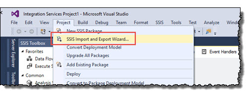

# Starten Sie den SQLServer Import / Export-Assistenten

 > Inhalt im Zusammenhang mit früheren Versionen von SQL Server, finden Sie unter [führen Sie die SQL Server-Import / Export-Assistenten](https://msdn.microsoft.com/en-US/library/ms140052(SQL.120).aspx).

Starten Sie den [!INCLUDE[ssNoVersion](../../includes/ssnoversion-md.md)] -Import / Export-Assistenten in einer der in diesem Thema beschriebenen Methoden zum Importieren von Daten aus, und Exportieren von Daten in allen unterstützten Datenquellen.

> [!IMPORTANT]
> In diesem Thema wird nur beschrieben, wie Sie den Assistenten **starten** . Wenn Sie für ein anderes Element suchen, finden Sie unter [Aufgaben und den Inhalt im Zusammenhang mit](#related).

Sie können den Assistenten starten:
-   Von [Startmenü](#startStart).
-   Von [Befehlszeile](#startCmd). 
-   Von [SQL Server Management Studio (SSMS)](#startSSMS).
-   Von [Visual Studio mit SQL Server Data Tools (SSDT)](#startVS).

## Voraussetzung - ist der Assistent auf dem Computer installiert werden?
Wenn Sie den Assistenten ausführen möchten, aber Sie verfügen nicht über [! UMFASSEN[MsCoName](/sql-docs/docs/ssdt/download-sql-server-data-tools-ssdt).

> [!NOTE]
> Um die 64-Bit-Version von den SQL Server-Import / Export-Assistenten verwenden zu können, müssen Sie SQL Server installieren. SQL Server Data Tools (SSDT) und SQL Server Management Studio (SSMS) sind 32-Bit-Anwendungen, und nur 32-Bit-Dateien, einschließlich der 32-Bit-Version des Assistenten installieren.

##  Startmenü  
### Starten Sie den SQL Server-Import / Export-Assistenten über das Startmenü
1.  Auf der **starten** Menü Suchen und erweitern Sie **Microsoft SQL Server 2016**.
3.  Klicken Sie auf eine der folgenden Optionen:
  
    -   **SQL Server 2016-Datenimport und -export (64 Bit)**
          
    -   **SQL Server 2016-Datenimport und -export (32 Bit)**  
  
    Führen Sie die 64-Bit-Version des Assistenten aus, sofern für die Datenquelle kein 32-Bit-Datenanbieter erforderlich ist.
 
    
  
##  Command prompt
### Starten Sie den SQL Server-Import / Export-Assistenten von der Befehlszeile aus  
Führen Sie in einem Eingabeaufforderungsfenster **DTSWizard.exe** von einem der folgenden Speicherorte aus.  
  
-   **C:\Programme\Microsoft SQL Server\130\DTS\Binn** bei einer 64-Bit-Version.  
  
-   **C:\Programme (x86)\Microsoft SQL Server\130\DTS\Binn** bei einer 32-Bit-Version.  
  
Führen Sie die 64-Bit-Version des Assistenten aus, sofern für die Datenquelle kein 32-Bit-Datenanbieter erforderlich ist.

  
  
##  SQL Server Management Studio (SSMS)
### Starten Sie den SQL Server-Import / Export-Assistent in SQL Server Management Studio (SSMS)    
1.  Stellen Sie in [!INCLUDE[ssManStudioFull](../../includes/ssmanstudiofull-md.md)]eine Verbindung mit einer Instanz von [!INCLUDE[ssNoVersion](../../includes/ssnoversion-md.md)] [!INCLUDE[ssDE](../../includes/ssde-md.md)]her.
    
2.  Erweitern Sie **Datenbanken**.
3.  Klicken Sie mit der rechten Maustaste auf eine Datenbank.
4.  Zeigen Sie auf **Aufgaben**.
5.  Klicken Sie auf eine der folgenden Optionen:
  
    -   **Daten importieren**
      
    -   **Daten exportieren**  

     

Wenn Sie SQL Server nicht installiert haben, bzw. SQL Server installiert haben, jedoch nicht SQL Server Management Studio, lesen Sie [Herunterladen von SQL Server Management Studio (SSMS)](/sql-docs/docs/ssms/download-sql-server-management-studio-ssms).
  
## Visual Studio
### Starten Sie den SQL Server-Import / Export-Assistent aus Visual Studio mit SQL Server Data Tools (SSDT) 
 Führen Sie in Visual Studio mit [!INCLUDE[ssBIDevStudioFull](../../includes/ssbidevstudiofull-md.md)]mit einem geöffneten Integration Services-Projekt eine der folgenden Aktionen aus. 
  
-   Klicken Sie im Menü **Projekt** auf **SSIS-Import/Export-Assistent**. 

     
    
    \- Oder –
    
-   Klicken Sie im Projektmappen-Explorer mit der rechten Maustaste auf den Ordner **SSIS-Pakete** , und klicken Sie dann auf **SSIS-Import/Export-Assistent**.

    

Wenn Sie Visual Studio nicht installiert haben, bzw. Visual Studio installiert haben, jedoch nicht SQL Server Data Tools, lesen Sie [Herunterladen von SQL Server Data Tools (SSDT)](/sql-docs/docs/ssdt/download-sql-server-data-tools-ssdt).

## Abrufen des Assistenten
Wenn Sie den Assistenten ausführen möchten, aber Sie verfügen nicht über [! UMFASSEN[MsCoName](/sql-docs/docs/ssdt/download-sql-server-data-tools-ssdt).

## Aufrufen der Hilfe während der Ausführung des Assistent
> [!TIP]
> Drücken Sie auf einer beliebigen Seite oder in einem beliebigen Dialogfeld des Assistenten F1, um die Dokumentation für die aktuelle Seite anzuzeigen.   

 ## Wie geht es weiter?  
 Beim Starten des Assistenten ist die erste Seite **Willkommen beim SQL Server-Import/Export-Assistenten**. Sie müssen auf dieser Seite keine Aktionen durchführen. Weitere Informationen finden Sie unter [Willkommen beim SQL Server-Import/Export-Assistenten](../../integration-services/import-export-data/welcome-to-sql-server-import-and-export-wizard.md).  
  
## Verwandte Aufgaben und Inhalt  
 Hier sind einige andere grundlegende Aufgaben aus.
-   **Finden Sie ein kurzes Beispiel der Funktionsweise des Assistenten aus.**

    -   **Wenn Sie es vorziehen, Screenshots finden Sie unter.** Sehen Sie sich diesem einfachen End-to-End-Beispiel auf einer Seite - [beginnen Sie mit diesem einfachen Beispiel des Import / Export-Assistenten](../../integration-services/import-export-data/get-started-with-this-simple-example-of-the-import-and-export-wizard.md).

    -   **Wenn Sie ein Video ansehen möchten.** In diesem vierminütigen Video aus YouTube, die der Assistent zeigt und erklärt eindeutig und einfach Gewusst wie: Exportieren von Daten in Excel - [mithilfe der SQL Server-Import / Export-Assistenten, um nach Excel exportieren,](https://go.microsoft.com/fwlink/?linkid=829049).

-   **Weitere Informationen zur Funktionsweise des Assistenten.**

    -   **Erfahren Sie mehr über den Assistenten.** Wenn Sie eine Übersicht über den Assistenten suchen, lesen Sie [Importieren und Exportieren von für SQL Server unterstützten Datenquellen](../../integration-services/import-export-data/import-and-export-data-with-the-sql-server-import-and-export-wizard.md).

    -   **Weitere Informationen Sie zu den Schritten im Assistenten.** Wenn Sie Informationen zu den Schritten im Assistenten suchen, finden Sie unter [Schritte in der SQL Server-Import / Export-Assistenten](../../integration-services/import-export-data/steps-in-the-sql-server-import-and-export-wizard.md). Es gibt auch eine separate Seite der Dokumentation für jede Seite des Assistenten.

    -   **Informationen Sie zur Verbindung mit Datenquellen und Ziele.** Wenn Sie Informationen zum Herstellen einer Verbindung mit Ihren Daten suchen, wählen Sie die gewünschte Seite aus der Liste hier - [Herstellen einer Verbindung mit Datenquellen mit der SQL Server-Import / Export-Assistenten](../../integration-services/import-export-data/connect-to-data-sources-with-the-sql-server-import-and-export-wizard.md). Es gibt eine separate Seite der Dokumentation für jede der verschiedenen häufig verwendeten Datenquellen.

