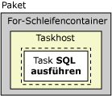
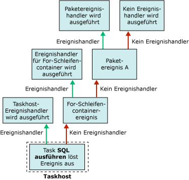

# Integration Services-Ereignishandler (SSIS)
  Zur Laufzeit lösen ausführbare Dateien (Pakete und Foreach-Schleifencontainer, For-Schleifencontainer, Sequenzcontainer und Taskhostcontainer) Ereignisse aus. Beispielsweise wird ein OnError-Ereignis ausgelöst, wenn ein Fehler auftritt. Sie können benutzerdefiniert Ereignishandler für diese Ereignisse erstellen, um die Paketfunktionalität zu erweitern und die Verwaltung der Pakete zur Laufzeit zu vereinfachen. Mit Ereignishandlern können folgende Aufgaben ausgeführt werden:  
  
-   Cleanup des temporären Datenspeichers, wenn die Ausführung eines Pakets oder Tasks beendet ist.  
  
-   Abrufen von Systeminformationen, um die Ressourcenverfügbarkeit zu bewerten, bevor ein Paket ausgeführt wird.  
  
-   Aktualisieren von Daten in einer Tabelle, wenn bei einer Suche in einer Verweistabelle ein Fehler auftritt.  
  
-   Senden einer E-Mail-Nachricht bei einem Fehler oder einer Warnung oder bei einem Fehler im Zusammenhang mit einem Task.  
  
 Falls ein Ereignis keinen Ereignishandler aufweist, wird das Ereignis im nächsten übergeordneten Container der Containerhierarchie in einem Paket ausgelöst. Wenn dieser Container einen Ereignishandler aufweist, wird der Ereignishandler als Antwort auf das Ereignis ausgeführt. Andernfalls wird das Ereignis im nächsten übergeordneten Container der Containerhierarchie ausgelöst.  
  
 Im folgenden Diagramm wird ein einfaches Paket mit einem For-Schleifencontainer, der einen Task SQL ausführen enthält, angezeigt.  
  
   
  
 Nur das Paket hat einen Ereignishandler, und zwar für das **OnError** -Ereignis. Wenn beim Ausführen des Tasks SQL ausführen ein Fehler auftritt, wird der **OnError** -Ereignishandler für das Paket ausgeführt. Im folgenden Diagramm wird die Aufrufsequenz angezeigt, durch die der **OnError** -Ereignishandler für das Paket ausgeführt wird.  
  
   
  
 Ereignishandler sind Elemente einer Ereignishandlerauflistung, und alle Container schließen diese Auflistung ein. Wenn Sie das Paket mit dem [!INCLUDE[ssIS](../includes/ssis-md.md)] -Designer erstellen, können Sie die Elemente der Ereignishandlerauflistungen im Ordner **Ereignishandler** auf der Registerkarte **Paket-Explorer** des [!INCLUDE[ssIS](../includes/ssis-md.md)] -Designers anzeigen.  
  
 Es gibt folgende Möglichkeiten, um den Ereignishandlercontainer zu konfigurieren:  
  
-   Geben Sie einen Namen und eine Beschreibung für den Ereignishandler an.  
  
-   Geben Sie an, ob der Ereignishandler ausgeführt wird, ob für das Paket bei einem Ereignishandlerfehler ein Fehler gemeldet wird und nach wie vielen Fehlern der Ereignishandler einen Fehler meldet.  
  
-   Geben Sie ein Ausführungsergebnis an, das anstelle des vom Ereignishandler zur Laufzeit zurückgegebenen Ausführungsergebnisses zurückgegeben werden soll.  
  
-   Geben Sie die Transaktionsoption für den Ereignishandler an.  
  
-   Geben Sie den Protokollierungsmodus für den Ereignishandler an.  
  
## Ereignishandlerinhalt  
 Das Erstellen eines Ereignishandlers ist mit dem Erstellen eines Pakets vergleichbar. Ein Ereignishandler weist Tasks und Container auf, die in einer Ablaufsteuerung angeordnet sind. Ein Ereignishandler kann außerdem Datenflüsse enthalten. Der [!INCLUDE[ssIS](../includes/ssis-md.md)] -Designer weist die Registerkarte **Ereignishandler** zum Erstellen benutzerdefinierter Ereignishandler auf.  
  
 Ereignishandler können auch programmgesteuert erstellt werden. Weitere Informationen finden Sie unter [Programmgesteuerte Behandlung von Ereignissen](../integration-services/building-packages-programmatically/handling-events-programmatically.md).  
  
## Laufzeitereignisse  
 In der folgenden Tabelle werden die Ereignishandler von [!INCLUDE[ssISnoversion](../includes/ssisnoversion-md.md)] aufgeführt und die Laufzeitereignisse beschrieben, durch die die Ereignishandler ausgeführt werden.  
  
|Ereignishandler|Ereignis|  
|-------------------|-----------|  
|**OnError**|Der Ereignishandler für das **OnError** -Ereignis. Dieses Ereignis wird durch eine ausführbare Datei ausgelöst, wenn ein Fehler auftritt.|  
|**OnExecStatusChanged**|Der Ereignishandler für das **OnExecStatusChanged** -Ereignis. Dieses Ereignis wird durch eine ausführbare Datei ausgelöst, wenn sich deren Ausführungsstatus ändert.|  
|**OnInformation**|Der Ereignishandler für das **OnInformation** -Ereignis. Dieses Ereignis wird während der Prüfung und Ausführung einer ausführbaren Datei ausgelöst, um Informationen zu melden. Dieses Ereignis übermittelt nur Informationen, keine Fehler oder Warnungen.|  
|**OnPostExecute**|Der Ereignishandler für das **OnPostExecute** -Ereignis. Dieses Ereignis wird durch eine ausführbare Datei ausgelöst, unmittelbar nachdem sie ausgeführt wurde.|  
|**OnPostValidate**|Der Ereignishandler für das **OnPostValidate** -Ereignis. Dieses Ereignis wird durch eine ausführbare Datei ausgelöst, nachdem sie überprüft wurde.|  
|**OnPreExecute**|Der Ereignishandler für das **OnPreExecute** -Ereignis. Dieses Ereignis wird durch eine ausführbare Datei ausgelöst, unmittelbar bevor sie ausgeführt wird.|  
|**OnPreValidate**|Der Ereignishandler für das **OnPreValidate** -Ereignis. Dieses Ereignis wird durch eine ausführbare Datei ausgelöst, wenn die Überprüfung gestartet wird.|  
|**OnProgress**|Der Ereignishandler für das **OnProgress** -Ereignis. Dieses Ereignis wird durch eine ausführbare Datei ausgelöst, wenn die ausführbare Datei einen messbaren Fortschritt aufweist.|  
|**OnQueryCancel**|Der Ereignishandler für das **OnQueryCancel** -Ereignis. Dieses Ereignis wird durch eine ausführbare Datei ausgelöst, um zu bestimmen, ob deren Ausführung beendet werden soll.|  
|**OnTaskFailed**|Der Ereignishandler für das **OnTaskFailed** -Ereignis. Dieses Ereignis wird durch einen Fehler bei einem Task ausgelöst.|  
|**OnVariableValueChanged**|Der Ereignishandler für das **OnVariableValueChanged** -Ereignis. Dieses Ereignis wird durch eine ausführbare Datei ausgelöst, wenn sich der Wert einer Variablen ändert. Dieses Ereignis wird durch die ausführbare Datei ausgelöst, für die die Variable definiert ist. Dieses Ereignis wird nicht ausgelöst, wenn Sie die **RaiseChangeEvent** -Eigenschaft für die Variable auf **False**festlegen. Weitere Informationen finden Sie unter [Integration Services-Variablen &#40;SSIS&#41;](../integration-services/integration-services-ssis-variables.md).|  
|**OnWarning**|Der Ereignishandler für das **OnWarning** -Ereignis. Dieses Ereignis wird durch eine ausführbare Datei ausgelöst, wenn eine Warnung auftritt.|  
  
## Konfiguration eines Ereignishandlers  
 Eigenschaften können Sie im Fenster **Eigenschaften** von [!INCLUDE[ssBIDevStudioFull](../includes/ssbidevstudiofull-md.md)] oder programmgesteuert festlegen.  
  
 Informationen zum Anzeigen dieser Eigenschaften in [!INCLUDE[ssBIDevStudioFull](../includes/ssbidevstudiofull-md.md)] finden Sie unter [Festlegen der Eigenschaften eines Tasks oder Containers](../Topic/Set%20the%20Properties%20of%20a%20Task%20or%20Container.md).  
  
 Weitere Informationen zum programmgesteuerten Festlegen dieser Eigenschaften finden Sie unter <xref:Microsoft.SqlServer.Dts.Runtime.DtsEventHandler>.  
  
## Verwandte Aufgaben  
 Informationen zum Hinzufügen eines Ereignishandlers zu einem Paket finden Sie unter [Hinzufügen eines Ereignishandlers zu einem Paket](../Topic/Add%20an%20Event%20Handler%20to%20a%20Package.md).  
  
  