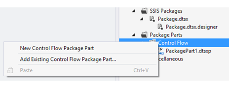
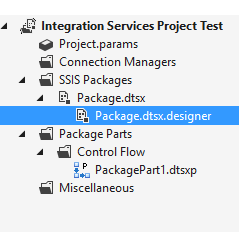
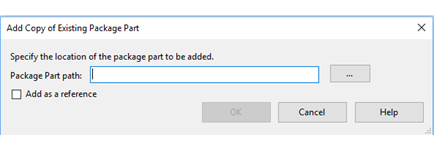
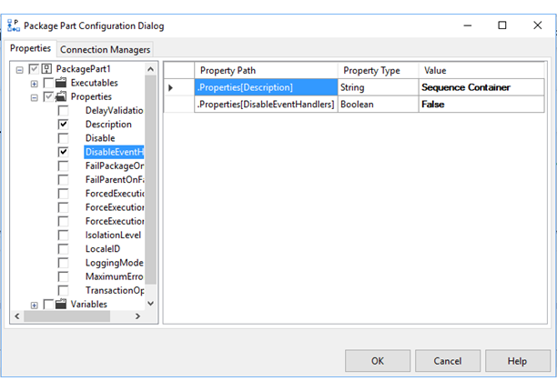

# Wiederverwenden der Ablaufsteuerung f&#252;r Pakete mithilfe von Ablaufsteuerungs-Paketteilen
  Sie können einen häufig verwendeten Ablaufsteuerungstask oder Container in einer eigenständigen Teiledatei (einer DTSXP-Datei) speichern und in einem oder mehreren Paketen unter Verwendung von Ablaufsteuerungs-Paketteilen mehrmalig wiederverwenden. Die Wiederverwendbarkeit erleichtert das Design und die Verwaltung von SSIS-Paketen.  
  
## Erstellen eines neuen Ablaufsteuerungs-Paketteils  
 Erweitern Sie im Projektmappen-Explorer den Ordner **Paketteile**, um einen neuen Ablaufsteuerungs-Paketteil zu erstellen. Klicken Sie mit der rechten Maustaste auf **Ablaufsteuerung**, und wählen Sie **Neuer Ablaufsteuerungs-Paketteil** aus.  
  
   
  
 Eine neue Teiledatei mit der Erweiterung „.dtsxp“ wird im Ordner **Paketteile | Ablaufsteuerung** erstellt. Gleichzeitig wird ein neues Element mit dem gleichen Namen zur SSIS-Toolbox hinzugefügt. (Das Toolboxelement wird nur angezeigt, wenn in Visual Studio ein Projekt geöffnet ist, das den Teil enthält.)  
  
   
  
## Entwerfen eines Ablaufsteuerungs-Paketteils  
 Zum Öffnen des Paketteil-Editors, doppelklicken Sie im Projektmappen-Explorer auf die Teiledatei. Sie können den Teil genau wie ein Paket entwerfen.  
  
   
  
   
  
 Für Ablaufsteuerungs-Paketteile gelten die folgenden Einschränkungen.  
  
-   Ein Teil kann nur einen Task oder Container der obersten Ebene enthalten. Wenn Sie mehrere Tasks oder Container hinzufügen möchten, fügen Sie diese in einen Sequenzcontainer ein.  
  
-   Sie können einen Teil nicht direkt im Designer ausführen oder debuggen .  
  
## Hinzufügen eines vorhandenen Ablaufsteuerungs-Paketteils zu einem Paket  
 Teile, die im aktuellen Integration Services-Projekt oder in einem anderen Projekt gespeichert wurden, können wiederverwendet werden.  
  
-   Zum Wiederverwenden eines Teils, der zum aktuellen Projekt gehört, ziehen Sie ihn mit Drag & Drop aus der Toolbox.  
  
-   Zum Wiederverwenden eines Teils, der zu einem anderen Projekt gehört, verwenden Sie den Befehl **Vorhandenen Ablaufsteuerungs-Paketteil hinzufügen**.  
  
### Verschieben eines Ablaufsteuerungs-Paketteils mit Drag & Drop  
 Wenn Sie einen Teil in einem Projekt wiederverwenden möchten, verschieben Sie das Teilelement einfach mit Drag & Drop wie einen beliebigen anderen Task oder Container aus der Toolbox. Sie können den Teil per Drag & Drop mehrere Male in ein Paket verschieben, um die Logik an mehreren Orten im Paket wiederzuverwenden. Mit dieser Methode können Sie einen Teil wiederverwenden, der zum aktuellen Projekt gehört.  
  
   
  
   
  
 Beim Speichern des Pakets wird vom SSIS-Designer überprüft, ob das Paket Teileinstanzen enthält.  
  
-   Ist dies der Fall, generiert der Designer eine neue .dtsx.designer-Datei mit allen Informationen über die Teile.  
  
-   Wenn das Paket keine Teile verwendet werden alle zuvor erstellten .dtsx.designer-Dateien für das Paket (d. h. alle .dtsx.designer-Dateien, die den gleichen Namen wie das Paket haben) vom Designer gelöscht.  
  
   
  
### Hinzufügen einer Kopie eines vorhandenen Ablaufsteuerungs-Paketteils oder eines Verweises auf einen vorhandenen Teil  
 Erweitern Sie im Projektmappen-Explorer den Ordner **Paketteile**, um einem Paket im Dateisystem eine Kopie eines vorhandenen Teils hinzuzufügen. Klicken Sie mit der rechten Maustaste auf **Ablaufsteuerung**, und wählen Sie **Vorhandenen Ablaufsteuerungs-Paketteil hinzufügen** aus.  
  
   
  
   
  
 **enthalten**  
  
 **Paketteilpfad**  
 Geben Sie den Pfad der Teildatei ein, oder klicken Sie auf die Schaltfläche „Durchsuchen (...)“, und suchen Sie die Teildatei, die Sie kopieren oder auf die Sie verweisen möchten.  
  
 **Als Verweis hinzufügen**  
 -   Ist diese Option ausgewählt, wird der Teil dem Integration Services-Projekt als Verweis hinzugefügt. Wählen Sie diese Option aus, wenn Sie auf eine einzige Kopie einer Teiledatei in mehreren Integration Services-Projekten verweisen möchten.  
  
-   Ist die Option deaktiviert, wird eine Kopie der Teiledatei zum Projekt hinzugefügt.  
  
## Konfigurieren eines Ablaufsteuerungs-Paketteils  
 Verwenden Sie das Dialogfeld **Paketteilkonfiguration**, um Ablaufsteuerungs-Paketteile zu konfigurieren, nachdem Sie sie zur Ablaufsteuerung eines Pakets hinzugefügt haben.  
  
#### So öffnen Sie das Dialogfeld „Paketteilkonfiguration“  
  
1.  Um eine Teileinstanz zu konfigurieren, doppelklicken Sie in der Ablaufsteuerung auf die Teileinstanz. Oder klicken Sie mit der rechten Maustaste auf die Teileinstanz, und wählen Sie **Bearbeiten** aus. Das Dialogfeld **Paketteilkonfiguration** wird geöffnet.  
  
2.  Konfigurieren Sie die Eigenschaften und Verbindungs-Manager für die Teileinstanz.  
  
### Eigenschaften (Registerkarte)  
 Verwenden Sie die Registerkarte **Eigenschaften** im Dialogfeld **Paketteilkonfiguration**, um die Eigenschaften des Teils festzulegen.  
  
   
  
 In der Strukturansichthierarchie im linken Fensterbereich werden alle konfigurierbaren Eigenschaften der Teileinstanz aufgeführt.  
  
-   Wird eine Option deaktiviert, wird die Eigenschaft für die Teileinstanz nicht konfiguriert. Für die Teileinstanz wird der Standardwert für die Eigenschaft verwendet, der im Ablaufsteuerungs-Paketteil definiert ist.  
  
-   Wird eine Option aktiviert, überschreibt der eingegebene oder ausgewählte Wert den Standardwert.  
  
 Die Tabelle im rechten Fensterbereich enthält die zu konfigurierenden Eigenschaften.  
  
-   **Eigenschaftspfad**. Der Eigenschaftspfad des Eigenschaft.  
  
-   **Eigenschaftstyp**. Der Datentyp der Eigenschaft.  
  
-   **Wert**. Der konfigurierte Wert. Dieser Wert überschreibt den Standardwert.  
  
### Registerkarte „Verbindungs-Manager“  
 Auf der Registerkarte **Verbindungs-Manager** im Dialogfeld **Paketteilkonfiguration** können Sie die Eigenschaften der Verbindungs-Manager für die Teileinstanz festlegen.  
  
   
  
 Die Tabelle im linken Fensterbereich enthält alle Verbindungs-Manager, die im Ablaufsteuerungsteil definiert sind. Wählen Sie den Verbindungs-Manager aus, den Sie konfigurieren möchten.  
  
 Die Liste im rechten Fensterbereich enthält die Eigenschaften des ausgewählten Verbindungs-Managers.  
  
-   **Festgelegt**. Aktiviert, wenn die Eigenschaft für die Teileinstanz konfiguriert wurde.  
  
-   **Eigenschaftsname**. Der Name der Eigenschaft.  
  
-   **Wert**. Der konfigurierte Wert. Dieser Wert überschreibt den Standardwert.  
  
## Löschen eines Ablaufsteuerungsteils  
 Klicken Sie im Projektmappen-Explorer mit der rechten Maustaste auf einen Teil, und wählen Sie anschließend **Löschen** aus. Klicken Sie auf **OK**, um den Löschvorgang zu bestätigen, oder klicken Sie auf **Abbrechen**, um den Teil beizubehalten.  
  
 Wenn Sie einen Teil aus einem Projekt löschen, wird er endgültig aus dem Dateisystem entfernt und kann nicht wiederhergestellt werden.  
  
> [!NOTE]  
>  Wenn Sie einen Teil aus einem Integration Services-Projekt entfernen, ihn aber in anderen Projekten weiter verwenden möchten, wählen Sie anstelle der Option **Löschen** die Option **Aus Projekt ausschließen** aus.  
  
## Paketteile sind eine reine Entwurfszeitfunktion  
 Paketteile sind eine reine Entwurfszeitfunktion. Im SSIS-Designer können Sie Teile erstellen, öffnen, speichern und aktualisieren sowie Teileinstanzen zu einem Paket hinzufügen, darin konfigurieren oder daraus löschen. In der SSIS-Laufzeit werden die Teile jedoch ignoriert. Nachfolgend wird erläutert, wie der Designer diese Trennung erreicht.  
  
-   Der Designer speichert Instanzen von Paketteilen mit den konfigurierten Eigenschaften in einer .dtsx.designer-Datei.  
  
-   Beim Speichern der .dtsx.designer-Datei durch den Designer wird gleichzeitig der Inhalt aus den Teilen extrahiert, auf die diese Datei verweist, und die Teileinstanzen im Paket werden durch den Inhalt der Teile ersetzt.  
  
-   Schließlich wird der gesamte Inhalt, der keine Teileinformationen mehr enthält, zurück in die DTSX-Paketdatei gespeichert. Dies ist die Datei, die von der SSIS-Laufzeit ausgeführt wird.  
  
 Das folgende Diagramm veranschaulicht die Beziehung zwischen Teilen („DTSXP-Dateien), dem SSIS-Designer und der SSIS-Laufzeit.  
  
   
  
  