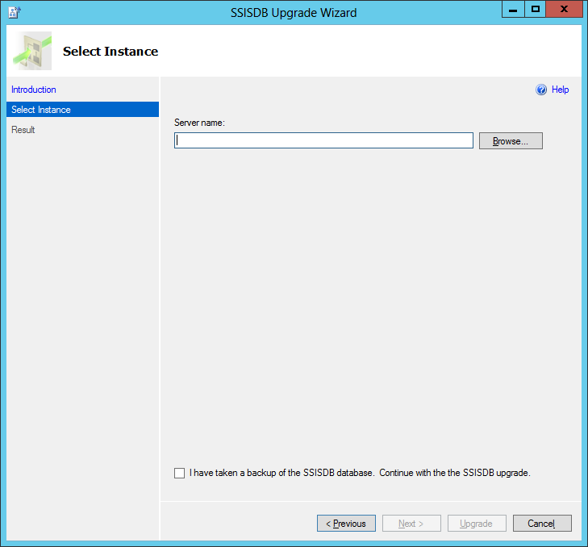

# Aktualisieren des SSIS-Katalogs (SSISDB)
  Führen Sie den SSISDB-Upgrade-Assistenten aus, um die Datenbank SSIS-Katalogdatenbank (SSISDB) zu aktualisieren, falls diese älter ist als die aktuelle Version der SQL Server-Instanz. Dies tritt auf, wenn eine der folgenden Bedingungen zutrifft.  
  
-   Sie haben die Datenbank aus einer älteren Version von SQL Server wiederhergestellt.  
  
-   Sie haben die Datenbank vor der Aktualisierung der SQL Server-Instanz nicht aus einer Always On-Verfügbarkeitsgruppe entfernt. Dies verhindert die automatische Aktualisierung der Datenbank. Weitere Informationen finden Sie unter [Upgrading SSISDB in an availability group](../../integration-services/service/always-on-for-ssis-catalog-ssisdb.md#Upgrade).  
  
 Der Assistent kann die Datenbank nur auf einer lokalen Serverinstanz aktualisieren.  
  
## Aktualisieren des SSIS-Katalogs (SSISDB) mit dem SSISDB-Upgrade-Assistenten  
  
1.  Sichern Sie die SSIS-Katalogdatenbank (SSISDB).  
  
2.  Erweitern Sie in [!INCLUDE[ssManStudioFull](../../includes/ssmanstudiofull-md.md)] den lokalen Server und dann **Integration Services-Katalog**.  
  
3.  Klicken Sie mit der rechten Maustaste auf **SSISDB**, und wählen Sie **Datenbankupgrade** aus, um den SSISDB-Upgrade-Assistenten zu starten.  
  
       
  
4.  Wählen Sie auf der Seite **Instanz auswählen** eine SQL Server-Instanz auf dem lokalen Server aus.  
  
    > [!IMPORTANT]  
    >  Der Assistent kann die Datenbank nur auf einer lokalen Server-Instanz aktualisieren.  
  
     Aktivieren Sie das Kontrollkästchen, mit dem Sie bestätigen, dass Sie die SSISDB-Datenbank vor der Ausführung des Assistenten gesichert haben.  
  
       
  
5.  Wählen Sie **Upgrade**, um die SSIS-Katalogdatenbank zu aktualisieren.  
  
6.  Überprüfen Sie die Ergebnisse auf der Seite **Ergebnis**.  
  
       
  
  