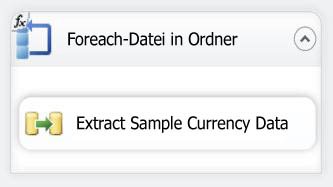

# Schritt 3: Testen des Pakets aus Lektion 6
Zur Laufzeit erhält Ihr Paket den Wert für die Eigenschaft "Verzeichnis" vom VarFolderName-Parameter.  
  
Um zu überprüfen, ob vom Paket die Directory-Eigenschaft während der Laufzeit auf den neuen Wert aktualisiert wird, führen Sie das Paket einfach aus. Weil nur drei Beispieldatendateien in das neue Verzeichnis kopiert werden, wird der Datenfluss nur drei Mal ausgeführt, statt durch 14 Dateien im ursprünglichen Ordner zu iterieren.  
  
## Überprüfen des Paketlayouts  
Bevor Sie das Paket testen, sollten Sie überprüfen, ob Ablaufsteuerung und Datenfluss im Paket aus Lektion 6 die in den folgenden Diagrammen gezeigten Objekte enthalten. Die Ablaufsteuerung sollte mit der Ablaufsteuerung in Lektion 5 übereinstimmen. Der Datenfluss sollte mit dem Datenfluss in Lektion 5 übereinstimmen.  
  
**Ablaufsteuerung**  
  
  
  
**Datenfluss**  
  
  
  
### So testen Sie das Lektion 6-Lernprogrammpaket  
  
1.  Klicken Sie im Menü "Debuggen" auf "Debuggen starten".  
  
2.  Klicken Sie nach Ausführen des Pakets im Menü "Debuggen" auf "Debuggen beenden".  
  
## Nächste Aufgabe in der Lektion  
[Schritt 4: Bereitstellen des Pakets aus Lektion 6](../integration-services/step-4-deploying-the-lesson-6-package.md)  
  
  
  
