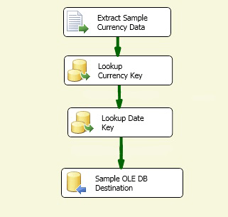

# Schritt 4: Testen des Lektion 2-Tutorialpakets
Mit dem jetzt konfigurierten Foreach-Schleifencontainer und Verbindungs-Manager für Flatfiles kann das Paket aus Lektion 2 nun die Sammlung von 14 Flatfiles im Sample Data-Ordner durchlaufen. Jedes Mal, wenn ein Dateiname gefunden wird, der mit den angegebenen Dateinamenskriterien übereinstimmt, wird die benutzerdefinierte Variable vom Foreach-Schleifencontainer mit dem Dateinamen aufgefüllt. Von dieser Variablen wird im Gegenzug die Eigenschaft ConnectionString des Verbindungs-Managers für Flatfiles aktualisiert, und es wird eine Verbindung mit der neuen Flatfile hergestellt. Vom Foreach-Schleifencontainer wird dann der unveränderte Datenflusstask gegen die Daten in der neuen Flatfile ausgeführt, bevor eine Verbindung zur nächsten Datei im Ordner hergestellt wird.  
  
Verwenden Sie die folgende Prozedur, um die neue Schleifenfunktionalität zu testen, die Sie zu Ihrem Paket hinzugefügt haben.  
  
> [!NOTE]  
> Wenn Sie das Paket aus Lektion 1 ausgeführt haben, müssen Sie die Datensätze aus dbo.FactCurrency in AdventureWorksDW2012 löschen, bevor Sie das Paket von dieser Lektion aus ausführen. Andernfalls wird für das Paket eine Verletzung der PRIMARY KEY-Einschränkung angezeigt. Die gleichen Fehler werden angezeigt, wenn Sie das Paket durch Auswahl von Debuggen bzw. Debuggen starten (oder Drücken von F5) ausführen. Das liegt daran, dass sowohl Lektion 1 als auch Lektion 2 ausgeführt wird. In Lektion 2 wird versucht, die Datensätze einzufügen, die bereits in Lektion 1 eingefügt wurden.  
  
## Überprüfen des Paketlayouts  
Bevor Sie das Paket testen, sollten Sie überprüfen, ob Ablaufsteuerung und Datenfluss im Paket aus Lektion 2 die in den folgenden Diagrammen gezeigten Objekte enthalten. Der Datenfluss sollte mit dem Datenfluss in Lektion 1 übereinstimmen.  
  
**Ablaufsteuerung**  
  
  
  
**Datenfluss**  
  
  
  
### So testen Sie das Lektion 2-Lernprogrammpaket  
  
1.  Klicken Sie im **Projektmappen-Explorer** mit der rechten Maustaste auf **Lesson 2.dtsx**, und klicken Sie auf **Paket ausführen**.  
  
    Das Paket wird ausgeführt. Sie können den Status jeder Schleife im Ausgabefenster überprüfen, oder indem Sie auf die Registerkarte **Status** klicken. So können Sie beispielsweise feststellen, dass 1097 Zeilen zur Zieltabelle aus der Datei Currency_VEB.txt hinzugefügt wurden.  
  
2.  Klicken Sie nach Ausführen des Pakets im Menü **Debuggen** auf **Debuggen beenden**.  
  
## Nächste Lektion  
[Lesson 5: Add SSIS Package Configurations for the Package Deployment Model](../integration-services/lesson-5-add-ssis-package-configurations-for-the-package-deployment-model.md)  
  
## Siehe auch  
[Ausführung von Projekten und Paketen](../Topic/Execution%20of%20Projects%20and%20Packages.md)  
  
  
  
