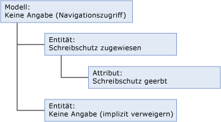

# Navigationszugriff (Master Data Services)
  Der Navigationszugriff gilt für die Modellobjektsicherheit, die auf der Registerkarte **Modelle** zugewiesen wird.  
  
 Navigationszugriff ist der Zugriff auf höhere Ebenen als die Ebene, für die Ihnen Sicherheit zugewiesen wurde.  
  
 In diesem Beispiel werden einer Entität Berechtigungen zugewiesen, der Navigationszugriff wird daher auf der Modellebene gewährt.  
  
   
  
 **Entitäten**  
  
 Wenn Sie einer Entität, den Blattelementen oder konsolidierten Elementen Berechtigungen zuweisen, bedeutet Navigationszugriff, dass Sie den Namen und den Code für alle Elemente lesen oder aktualisieren können. Sie können auch den Modellnamen lesen.  
  
 **Attribute**  
  
 Wenn Sie einem Attribut Berechtigungen zuweisen, bedeutet Navigationszugriff, dass Sie den Namen und den Code für alle Elemente in der Entität lesen oder aktualisieren können. Sie können auch den Modellnamen lesen.  
  
 **Auflistungen**  
  
 Wenn Sie Auflistungen Berechtigungen zuweisen, können Sie den Namen, Code, die Beschreibung und Besitzer-ID lesen oder aktualisieren. Sie können auch den Modellnamen lesen.  
  
## Siehe auch  
 [Vorgehensweise: Festlegen von Berechtigungen &#40;Master Data Services&#41;](../master-data-services/how-permissions-are-determined-master-data-services.md)  
  
  