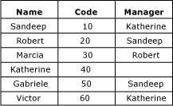

# Rekursive Hierarchien (Master Data Services)
  In [!INCLUDE[ssMDSshort](../includes/ssmdsshort-md.md)]ist eine rekursive Hierarchie ist eine abgeleitete Hierarchie, die eine rekursive Beziehung einschließt. Eine rekursive Beziehung ist vorhanden, wenn eine Entität über ein domänenbasiertes Attribut auf Grundlage der Entität selbst verfügt.  
  
## Beispiel für eine rekursive Hierarchie  
 Ein typisches Beispiel für eine rekursive Hierarchie ist eine Organisationsstruktur. In [!INCLUDE[ssMDSshort](../includes/ssmdsshort-md.md)]erstellen Sie dazu eine Entität "Employee" mit einem domänenbasierten Attribut "Manager". Das Manager-Attribut wird aus der Liste der Mitarbeiter aufgefüllt. In dieser Beispielorganisation können alle Mitarbeiter Manager sein.  
  
   
  
 Sie können eine abgeleitete Hierarchie erstellen, die die Beziehung zwischen der Employee-Entität und dem domänenbasierten Attribut "Manager" hervorhebt.  
  
   
  
 Um jedes Element nur einmal in die Hierarchie einzuschließen, können Sie NULL-Beziehungen verankern. Wenn Sie dies tun, werden Elemente mit leeren domänenbasierten Attributwerten auf der obersten Ebene der Hierarchie angezeigt.  
  
   
  
 Wenn Sie keine NULL-Beziehungen verankern, werden Elemente mehrmals eingeschlossen. Alle Elemente werden auf der obersten Ebene angezeigt. Sie werden auch unter den Elementen angezeigt, deren Attribute sie sind.  
  
   
  
 In diesem Beispiel befindet sich Marcia auf der obersten Ebene. Sie ist kein Manager von Mitarbeitern, da sie nicht als domänenbasierter Attributwert für andere Employee-Elemente verwendet wird. Robert dagegen hat unter sich eine Ebene, da Marcia Robert als Managerattributwert hat.  
  
## Regeln  
  
-   Eine abgeleitete Hierarchie kann höchstens eine rekursive Beziehung aufweisen. Sie kann jedoch andere abgeleitete Beziehungen aufweisen (z. B. eine abgeleitete Hierarchie, die eine rekursive Beziehung zwischen Manager und Mitarbeiter aufweist, kann ebenso Beziehungen zwischen Land und Manager und zwischen Mitarbeiter und Store aufweisen).  
  
-   Sie können Elementen in einer rekursiven Hierarchie (auf der Registerkarte **Hierarchieelemente** ) keine Elementberechtigungen zuweisen.  
  
-   Rekursive Hierarchien können keine kreisförmigen Beziehungen einschließen. Katherine kann z. B. nicht Sandeeps Managerin sein, wenn Sandeep ihr Manager ist. Auch kann Katherine nicht ihre eigener Managerin sein.  
  
## Verwandte Aufgaben  
  
|Taskbeschreibung|Thema|  
|----------------------|-----------|  
|Erstellen Sie eine abgeleitete Hierarchie.|[Erstellen Sie eine abgeleitete Hierarchie &#40; Master Data Services &#41;](../master-data-services/create-a-derived-hierarchy-master-data-services.md)|  
|Ändern Sie den Namen einer vorhandenen abgeleiteten Hierarchie.|[Ändern Sie einen Namen für die abgeleitete Hierarchie &#40; Master Data Services &#41;](../master-data-services/change-a-derived-hierarchy-name-master-data-services.md)|  
|Löschen Sie eine vorhandene abgeleitete Hierarchie.|[Löschen einer abgeleiteten Hierarchie &#40; Master Data Services &#41;](../master-data-services/delete-a-derived-hierarchy-master-data-services.md)|  
  
## Verwandte Inhalte  
  
-   [Domänenbasierte Attribute &#40; Master Data Services &#41;](../master-data-services/domain-based-attributes-master-data-services.md)  
  
-   [Abgeleitete Hierarchien &#40; Master Data Services &#41;](../master-data-services/derived-hierarchies-master-data-services.md)  
  
  
