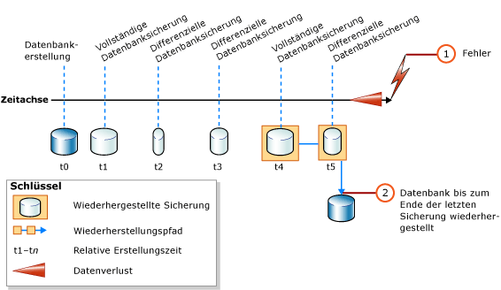

# <a name="complete-database-restores-simple-recovery-model"></a>Vollständige Datenbankwiederherstellungen (einfaches Wiederherstellungsmodell)
[!INCLUDE[tsql-appliesto-ss2016-xxxx-xxxx-xxx_md](../../includes/tsql-appliesto-ss2016-xxxx-xxxx-xxx-md.md)]

  Das Ziel einer vollständigen Datenbankwiederherstellung besteht in der Wiederherstellung der gesamten Datenbank. Die gesamte Datenbank ist für die Dauer der Wiederherstellung offline. Bevor Teile der Datenbank wieder online zur Verfügung gestellt werden können, müssen alle Daten bis zu einem konsistenten Zeitpunkt wiederhergestellt werden. Ein solcher Punkt ist gegeben, wenn für alle Teile der Datenbank derselbe Zeitpunkt gilt und keine Transaktionen ohne Commit vorhanden sind.  
  
 Im einfachen Wiederherstellungsmodell kann die Datenbank nicht bis zu einem bestimmten Zeitpunkt innerhalb eines bestimmten Sicherungsvorgangs wiederhergestellt werden.  
  
> [!IMPORTANT]  
>  Das Anfügen oder Wiederherstellen von Datenbanken aus unbekannten oder nicht vertrauenswürdigen Quellen wird nicht empfohlen. Diese Datenbanken können bösartigen Code enthalten, der möglicherweise unbeabsichtigten [!INCLUDE[tsql](../../includes/tsql-md.md)] -Code ausführt oder Fehler durch Ändern des Schemas oder der physischen Datenbankstruktur erzeugt. Bevor Sie eine Datenbank aus einer unbekannten oder nicht vertrauenswürdigen Quelle verwenden, führen Sie auf einem Nichtproduktionsserver [DBCC CHECKDB](../../t-sql/database-console-commands/dbcc-checkdb-transact-sql.md) für die Datenbank aus. Überprüfen Sie außerdem den Code in der Datenbank, z.B. gespeicherte Prozeduren oder anderen benutzerdefinierten Code.  
  
 **In diesem Thema:**  
  
-   [Übersicht über die Datenbankwiederherstellung mit dem einfachen Wiederherstellungsmodell](#Overview)  
  
-   [Verwandte Aufgaben](#RelatedTasks)  
  
> [!NOTE]  
>  Informationen zur Unterstützung von Sicherungskopien früherer [!INCLUDE[ssNoVersion](../../includes/ssnoversion-md.md)]-Versionen finden Sie im Kapitel [RESTORE &#40;Transact-SQL&#41;](../../t-sql/statements/restore-statements-transact-sql.md)im Abschnitt „Kompatibilitätsunterstützung“.  
  
##  <a name="Overview"></a> Übersicht über die Datenbankwiederherstellung mit dem einfachen Wiederherstellungsmodell  
 Für eine vollständige Datenbankwiederherstellung mit dem einfachen Wiederherstellungsmodell sind nur ein oder zwei [RESTORE](../../t-sql/statements/restore-statements-transact-sql.md) -Anweisungen erforderlich, je nachdem, ob Sie eine differenzielle Datenbanksicherung wiederherstellen möchten. Stellen Sie lediglich die letzte Sicherung wieder her, wie in der folgenden Abbildung dargestellt, wenn Sie nur eine vollständige Datenbanksicherung verwenden:  
  
   
  
 Wenn Sie auch eine differenzielle Datenbanksicherung verwenden, stellen Sie die letzte vollständige Datenbanksicherung wieder her, ohne die Datenbank wiederherzustellen. Anschließend stellen Sie die letzte differenzielle Datenbanksicherung wieder her und stellen die Datenbank wieder her. Die folgende Abbildung veranschaulicht diesen Prozess:  
  
   
  
> [!NOTE]  
>  Informationen zum Wiederherstellen einer Datenbanksicherung auf einer anderen Serverinstanz finden Sie unter [Kopieren von Datenbanken durch Sichern und Wiederherstellen](../../relational-databases/databases/copy-databases-with-backup-and-restore.md).  
  
###  <a name="TsqlSyntax"></a> Grundlegende Transact-SQL-RESTORE-Syntax  
 Die grundlegende [!INCLUDE[tsql](../../includes/tsql-md.md)][RESTORE](../../t-sql/statements/restore-statements-transact-sql.md) -Syntax zur Wiederherstellung einer vollständigen Datenbanksicherung lautet:  
  
 RESTORE DATABASE *database_name* FROM *backup_device* [ WITH NORECOVERY ]  
  
> [!NOTE]  
>  Verwenden Sie WITH NORECOVERY, wenn Sie planen, auch eine differenzielle Datenbanksicherung wiederherzustellen.  
  
 Die grundlegende [RESTORE](../../t-sql/statements/restore-statements-transact-sql.md) -Syntax zur Wiederherstellung einer Datenbanksicherung lautet:  
  
 RESTORE DATABASE *database_name* FROM *backup_device* WITH RECOVERY  
  
###  <a name="Example"></a> Beispiel (Transact-SQL)  
 Das folgende Beispiel zeigt zunächst, wie die [BACKUP](../../t-sql/statements/backup-transact-sql.md) -Anweisung zum Erstellen einer vollständigen Datenbanksicherung und einer differenziellen Datenbanksicherung der [!INCLUDE[ssSampleDBobject](../../includes/sssampledbobject-md.md)] -Datenbank verwendet wird. Anschließend werden diese Sicherungen im Beispiel nacheinander wiederhergestellt. Die Datenbank wird zu dem Status wiederhergestellt, in dem sie sich beim Abschließen der differenziellen Datenbanksicherung befand.  
  
 Im Beispiel werden die wichtigen Optionen in einer Wiederherstellungssequenz für das Szenario der vollständigen Datenbankwiederherstellung veranschaulicht. Eine *Wiederherstellungssequenz* besteht aus mindestens einem Wiederherstellungsvorgang, mit dessen Hilfe Daten mindestens eine Wiederherstellungsphase durchlaufen. Hierfür unwichtige Syntax und Informationen werden ausgelassen. Wenn Sie eine Datenbank wiederherstellen, wird empfohlen, die Option RECOVERY aus Gründen der Klarheit explizit anzugeben, obwohl das die Standardvorgabe ist.  
  
> [!NOTE]  
>  Das Beispiel beginnt mit einer [ALTER DATABASE](../../t-sql/statements/alter-database-transact-sql.md) -Anweisung, mit der das Wiederherstellungsmodell auf `SIMPLE`festgelegt wird.  
  
```  
USE master;  
--Make sure the database is using the simple recovery model.  
ALTER DATABASE AdventureWorks2012 SET RECOVERY SIMPLE;  
GO  
-- Back up the full AdventureWorks2012 database.  
BACKUP DATABASE AdventureWorks2012   
TO DISK = 'Z:\SQLServerBackups\AdventureWorks2012.bak'   
  WITH FORMAT;  
GO  
--Create a differential database backup.  
BACKUP DATABASE AdventureWorks2012   
TO DISK = 'Z:\SQLServerBackups\AdventureWorks2012.bak'  
   WITH DIFFERENTIAL;  
GO  
--Restore the full database backup (from backup set 1).  
RESTORE DATABASE AdventureWorks2012   
FROM DISK = 'Z:\SQLServerBackups\AdventureWorks2012.bak'   
   WITH FILE=1, NORECOVERY;  
--Restore the differential backup (from backup set 2).  
RESTORE DATABASE AdventureWorks2012   
FROM DISK = 'Z:\SQLServerBackups\AdventureWorks2012.bak'   
   WITH FILE=2, RECOVERY;  
GO  
```  
  
##  <a name="RelatedTasks"></a> Verwandte Aufgaben  
 **So stellen Sie eine vollständige Datenbanksicherung wieder her**  
  
-   [Wiederherstellen einer Datenbanksicherung unter dem einfachen Wiederherstellungsmodell &#40;Transact-SQL&#41;](../../relational-databases/backup-restore/restore-a-database-backup-under-the-simple-recovery-model-transact-sql.md)  
  
-   [Restore a Database Backup Using SSMS](../../relational-databases/backup-restore/restore-a-database-backup-using-ssms.md)  
  
-   [Wiederherstellen einer Datenbank an einem neuen Speicherort &#40;SQL Server&#41;](../../relational-databases/backup-restore/restore-a-database-to-a-new-location-sql-server.md)  
  
 **So stellen Sie eine differenzielle Datenbanksicherung wieder her**  
  
-   [Wiederherstellen einer differenziellen Datenbanksicherung &#40;SQL Server&#41;](../../relational-databases/backup-restore/restore-a-differential-database-backup-sql-server.md)  
  
 **So stellen Sie eine Sicherung mithilfe von SQL Server Management Objects (SMO) wieder her**  
  
-   <xref:Microsoft.SqlServer.Management.Smo.Restore.SqlRestore%2A>  
  
## <a name="see-also"></a>Siehe auch  
 [RESTORE &#40;Transact-SQL&#41;](../../t-sql/statements/restore-statements-transact-sql.md)   
 [BACKUP &#40;Transact-SQL&#41;](../../t-sql/statements/backup-transact-sql.md)   
 [sp_addumpdevice &#40;Transact-SQL&#41;](../../relational-databases/system-stored-procedures/sp-addumpdevice-transact-sql.md)   
 [Vollständige Datenbanksicherungen &#40;SQL Server&#41;](../../relational-databases/backup-restore/full-database-backups-sql-server.md)   
 [Differenzielle Sicherungen &#40;SQL Server&#41;](../../relational-databases/backup-restore/differential-backups-sql-server.md)   
 [Übersicht über Sicherungen &#40;SQL Server&#41;](../../relational-databases/backup-restore/backup-overview-sql-server.md)   
 [Übersicht über Wiederherstellungsvorgänge &#40;SQL Server&#41;](../../relational-databases/backup-restore/restore-and-recovery-overview-sql-server.md)  
  
  

