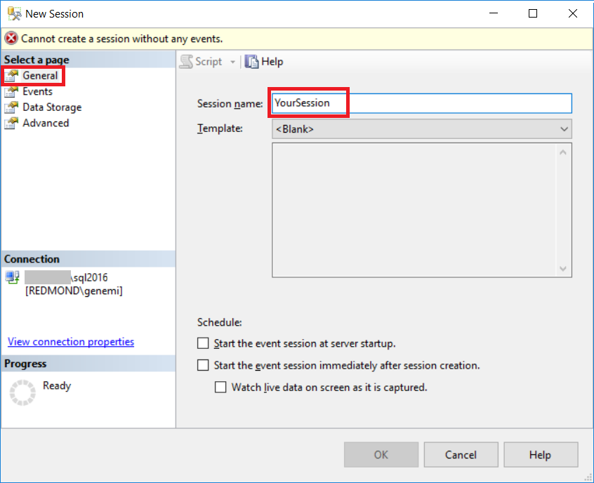
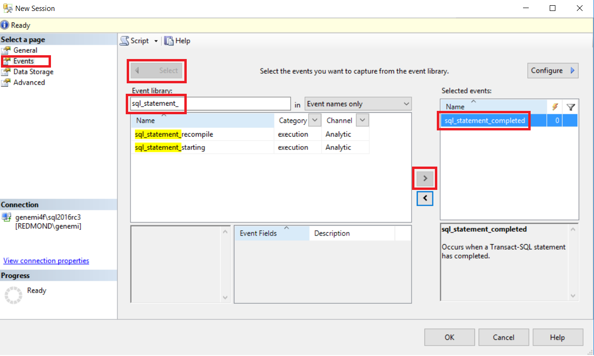
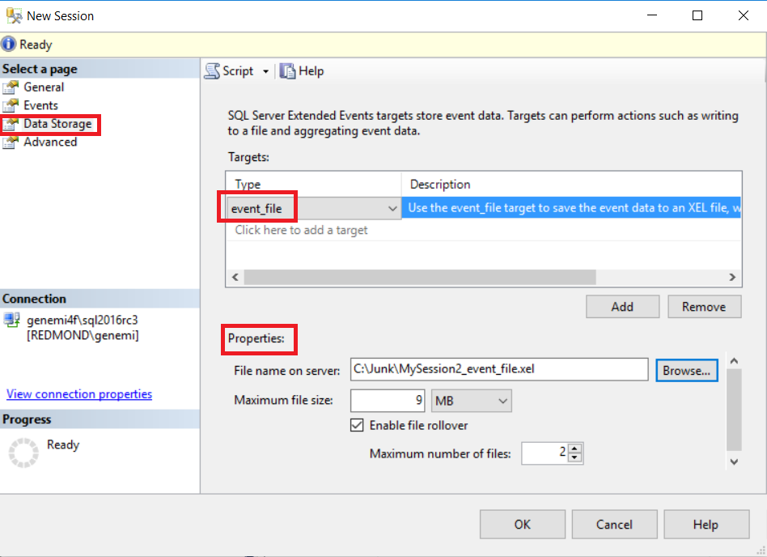
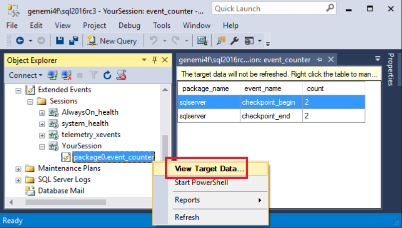
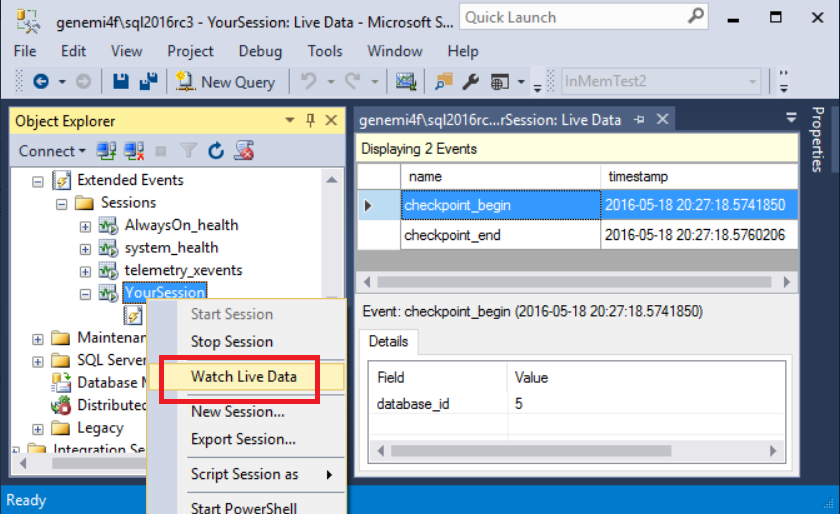

# <a name="quick-start-extended-events-in-sql-server"></a>Schnellstart: Erweiterte Ereignisse in SQL Server
[!INCLUDE[appliesto-ss-asdb-xxxx-xxx-md](../../includes/appliesto-ss-asdb-xxxx-xxx-md.md)]


Dieser Artikel ist darauf ausgerichtet, SQL-Entwickler zu unterstützen, die mit erweiterten Ereignissen nicht vertraut sind und in wenigen Minuten eine Ereignissitzung erstellen möchten. Mithilfe von erweiterten Ereignissen können Sie Details zu internen Vorgängen des SQL-System und Ihrer Anwendung anzeigen. Wenn Sie eine Sitzung für erweiterte Ereignisse erstellen, teilen Sie dem System Folgendes mit:

- An welchen Vorkommen Sie interessiert sind.
- Auf welche Weise Ihnen das System die Daten melden soll.


Dieser Artikel bietet Folgendes:

- Screenshots zum Veranschaulichen der Klicks in SSMS.exe, die eine Ereignissitzung erstellen.
- Screenshots werden mit entsprechenden Transact-SQL-Anweisungen korreliert.
- Ausführliche Erläuterung der Begriffe und Konzepte hinter den Klicks und T-SQL für Ereignissitzungen.
- Veranschaulichung der Vorgehensweise beim Testen von Ereignissitzungen.
- Beschreibung der Alternativen für Ergebnisse:
  - Speicheraufnahme von Ergebnissen.
  - Verarbeitete Ergebnisse im Vergleich zu unverarbeiteten Ergebnissen.
  - Tools zum Anzeigen der Ergebnisse auf verschiedene Arten und auf unterschiedlichen Zeitskalen.
- Veranschaulichung, wie Sie alle verfügbaren Ereignisse suchen und entdecken können.
- Bereitstellung der Beziehungen zwischen Primär- und Fremdschlüsseln, die unter dynamischen Verwaltungssichten (DMVs) für erweiterte Ereignisse implizit sind.
- Beschreibung der Inhalte von verwandten Artikeln.


In Blogbeiträgen und anderen formlosen Konversationen wird häufig über die Abkürzung *xevents*auf erweiterte Ereignisse verwiesen.


> [!NOTE]
> Informationen zu Unterschieden bei erweiterten Ereignissen zwischen Microsoft SQL Server und Azure SQL-Datenbank finden Sie unter [Erweiterte Ereignisse in SQL-Datenbank](http://azure.microsoft.com/documentation/articles/sql-database-xevent-db-diff-from-svr/).


## <a name="preparations-before-demo"></a>Vorbereitung vor der Demo


Die folgenden Vorbereitungen wären erforderlich, damit Sie die nachfolgende Demo tatsächlich ausführen können.

1. [Herunterladen von SQL Server Management Studio (SSMS)](http://msdn.microsoft.com/library/mt238290.aspx)
  - Sie sollten jeden Monat das neueste monatliche Update von SSMS installieren.
2. Melden Sie sich bei Microsoft SQL Server 2014 oder höher oder in einer Datenbank von Azure SQL-Datenbank an, wobei `SELECT @@version` einen Wert zurückgibt, dessen erster Knoten 12 oder höher ist.
3. Stellen Sie sicher, dass Ihr Konto über die [Serverberechtigung](../../t-sql/statements/grant-server-permissions-transact-sql.md) **ALTER ANY EVENT SESSION**verfügt.
  - Bei Interesse sind am Ende dieses Artikels im [Anhang](#appendix1)weitere Details zur Sicherheit und zu Berechtigungen verfügbar, die sich auf erweiterte Ereignisse beziehen.


## <a name="demo-of-ssms-integration"></a>Demo zur SSMS-Integration


„SSMS.exe“ bietet eine hervorragende Benutzeroberfläche für erweiterte Ereignisse. Die Benutzeroberfläche ist so gut, dass sich viele Benutzer nicht mit erweiterten Ereignissen unter Verwendung von Transact-SQL oder dynamischen Verwaltungssichten (DMVs) befassen müssen, die auf erweiterte Ereignisse ausgerichtet sind.

In diesem Abschnitt werden die auf der Benutzeroberfläche zum Erstellen eines erweiterten Ereignisses und zum Anzeigen der gemeldeten Daten erforderlichen Schritte veranschaulicht. Im Anschluss an die Schritte können Sie sich für ein tiefergehendes Verständnis mit den Informationen zu den Konzepten befassen, die in die Schritte einbezogen sind.


### <a name="steps-of-demo"></a>Schritte der Demo


Sie können die Schritte verstehen, selbst wenn Sie sich entscheiden, diese nicht auszuführen. Die Demo beginnt mit dem Dialogfeld **Neue Sitzung** . Wir bearbeiten die vier zugehörigen Seiten, die folgende Bezeichnung aufweisen:

- Allgemein
- Ereignisse
- Datenspeicher
- Erweitert


Der Text und die unterstützenden Screenshots können im Laufe der Monate oder Jahre etwas ungenau werden, wenn die SSMS-Benutzeroberfläche optimiert wird. Die Screenshots dienen jedoch weiterhin zur Erläuterung, wenn sie nur geringe Abweichungen aufweisen.


1. Stellen Sie eine Verbindung mit SSMS her.

2. Klicken Sie im Objekt-Explorer auf **Verwaltung** > **Erweiterte Ereignisse** > **Neue Sitzung**. Das Dialogfeld **Neue Sitzung** ist dabei dem **Assistenten für neue Sitzungen**vorzuziehen, obwohl die beiden einander ähnlich sind.

3. Klicken Sie in der linken oberen Ecke auf die Seite **Allgemein** . Geben Sie *YourSession*oder einen beliebigen Namen in das Textfeld **Sitzungsname** ein. Drücken Sie noch *nicht* die Schaltfläche **OK** , die nur am Ende der Demo auftritt.

    

4. Klicken Sie in der linken oberen Ecke auf die Seite **Ereignisse** , und klicken Sie dann auf die Schaltfläche **Auswählen** .

    

5. Wählen Sie im Bereich **Ereignisbibliothek** in der Dropdownliste **Nur Ereignisnamen**aus.
    - Geben Sie **sql**in das Textfeld ein, wodurch die lange Liste der verfügbaren Ereignisse mithilfe eines *Enthält* -Operators gefiltert und somit verkürzt wird.
    - Scrollen Sie zum Ereignis **sql_statement_completed**, und klicken Sie anschließend darauf.
    - Klicken Sie auf den Pfeil nach rechts **>** , um das Ereignis in das Feld **Ausgewählte Ereignisse** zu verschieben.

6. Bleiben Sie auf der Seite **Ereignisse** , und klicken Sie ganz rechts auf die Schaltfläche **Konfigurieren** .
    - Im folgenden Screenshot sehen Sie den Bereich **Optionen für die Ereigniskonfiguration** , wobei die linke Seite zur besseren Ansicht abgeschnitten ist.

    

7. Klicken Sie auf die Registerkarte **Filter (Prädikat)** . Klicken Sie anschließend auf **Klicken Sie hier, um eine Klausel hinzuzufügen**, um alle SQL SELECT-Anweisungen zu erfassen, die eine HAVING-Klausel aufweisen.

8. Wählen Sie in der Dropdownliste **Feld** die Option **sqlserver.sql_text**aus.
   - Wählen Sie für **Operator** einen LIKE-Operator aus.
   - Geben Sie für **Wert** die Option **%SELECT%HAVING%**ein.

    > [!NOTE]
    > In diesem zweiteiligen Namen stellt *sqlserver* den Paketnamen und *sql_text* den Feldnamen dar. Das zuvor von uns ausgewählte Ereignis, *sql_statement_completed* muss sich in demselben Paket wie das ausgewählte Feld befinden.

9. Klicken Sie in der linken oberen Ecke auf die Seite **Datenspeicher** .

10. Klicken Sie im Bereich **Ziele** auf **Klicken Sie hier, um ein Ziel hinzuzufügen**.
    - Wählen Sie in der Dropdownliste **Typ** den Eintrag **event_file**aus.
    - Dies bedeutet, dass die Ereignisdaten in einer Datei gespeichert werden, die wir anzeigen können.

    

11. Geben Sie im Bereich **Eigenschaften** einen vollständigen Pfad und Namen in das Textfeld **Dateiname auf Server** ein.
    - Die Dateierweiterung muss *XEL*sein.
    - Unser kleiner Test erfordert eine Dateigröße von weniger als 1 MB.

    

12. Klicken Sie in der linken oberen Ecke auf die Seite **Erweitert** .
    - Verringern Sie den Wert für **Maximale Verteilungslatenzzeit** auf 3 Sekunden.
    - Klicken Sie abschließend unten auf die Schaltfläche **OK** .

13. Erweitern Sie dann im **Objekt-Explorer**die Option **Verwaltung** > **Sitzungen**, und beachten Sie den neuen Knoten für **YourSession**.

    


#### <a name="edit-your-event-session"></a>Bearbeiten der Ereignissitzung


Im **Objekt-Explorer**von SSMS können Sie die Ereignissitzung bearbeiten, indem Sie mit der rechten Maustaste auf ihren Knoten klicken. Anschließend klicken Sie auf **Eigenschaften**. Dasselbe mehrseitige Dialogfeld wird angezeigt.


### <a name="corresponding-t-sql-for-your-event-session"></a>Entsprechendes T-SQL für die Ereignissitzung


Sie haben die SSMS-Benutzeroberfläche verwendet, um ein T-SQL-Skript zu generieren, das Ihre Ereignissitzung erstellt hat. Sie können das generierte Skript wie folgt anzeigen:

- Klicken Sie mit der rechten Maustaste auf **Skript für Sitzung als** > **CREATE in** > **Zwischenablage**.
- Fügen Sie die Auswahl in einen beliebigen Text-Editor ein.


Als Nächstes folgt die T-SQL CREATE EVENT SESSION-Anweisung für *YourSession*, die durch Klicken auf der Benutzeroberfläche generiert wurde:


```tsql
CREATE EVENT SESSION [YourSession]
    ON SERVER 
    ADD EVENT sqlserver.sql_statement_completed
    (
        ACTION(sqlserver.sql_text)
        WHERE
        ( [sqlserver].[like_i_sql_unicode_string]([sqlserver].[sql_text], N'%SELECT%HAVING%')
        )
    )
    ADD TARGET package0.event_file
    (SET
        filename = N'C:\Junk\YourSession_Target.xel',
        max_file_size = (2),
        max_rollover_files = (2)
    )
    WITH (
        MAX_MEMORY = 2048 KB,
        EVENT_RETENTION_MODE = ALLOW_MULTIPLE_EVENT_LOSS,
        MAX_DISPATCH_LATENCY = 3 SECONDS,
        MAX_EVENT_SIZE = 0 KB,
        MEMORY_PARTITION_MODE = NONE,
        TRACK_CAUSALITY = OFF,
        STARTUP_STATE = OFF
    );
GO
```


> [!NOTE]
> Für Azure SQL-Datenbank würde in der vorherigen CREATE EVENT SESSION-Anweisung anstelle der ON SERVER-Klausel entsprechend ON DATABASE verwendet werden.
> 
> Weitere Informationen zu Unterschieden bei erweiterten Ereignissen zwischen Microsoft SQL Server und Azure SQL-Datenbank finden Sie unter [Erweiterte Ereignisse in SQL-Datenbank](http://azure.microsoft.com/documentation/articles/sql-database-xevent-db-diff-from-svr/).


#### <a name="pre-drop-of-the-event-session"></a>Vorgezogene Ablage der Ereignissitzung


Vor der CREATE EVENT SESSION-Anweisung sollten Sie eine DROP EVENT SESSION-Anweisung für den Fall bedingt ausgeben, dass der Name bereits vorhanden ist.


```tsql
IF EXISTS (SELECT *
      FROM sys.server_event_sessions    -- If Microsoft SQL Server.
    --FROM sys.database_event_sessions  -- If Azure SQL Database in the cloud.
      WHERE name = 'YourSession')
BEGIN
    DROP EVENT SESSION YourSession
          ON SERVER;    -- If Microsoft SQL Server.
        --ON DATABASE;  -- If Azure SQL Database.
END
go
```


#### <a name="alter-to-start-and-stop-the-event-session"></a>ALTER zum Starten oder Beenden der Ereignissitzung


Wenn Sie eine Ereignissitzung erstellen, wird sie gemäß der Standardeinstellung nicht automatisch gestartet. Sie starten die Ereignissitzung jederzeit mithilfe der folgenden T-SQL ALTER EVENT SESSION-Anweisung starten oder beenden.


```tsql
ALTER EVENT SESSION [YourSession]
      ON SERVER
    --ON DATABASE
    STATE = START;   -- STOP;
```


Sie haben die Möglichkeit, der Ereignissitzung mitzuteilen, dass sie beim Start der SQL Server-Instanz automatisch startet. Weitere Informationen finden Sie unter dem Schlüsselwort **STARTUP STATE = ON** für CREATE EVENT SESSION.

- Die SSMS-Benutzeroberfläche bietet ein entsprechendes Kontrollkästchen auf der Seite **Neue Sitzung** > **Allgemein** .


## <a name="test-your-event-session"></a>Testen der Ereignissitzung


Verwenden Sie die folgenden einfachen Schritte zum Testen Ihrer Ereignissitzung:

1. Klicken Sie im **Objekt-Explorer**von SSMS mit der rechten Maustaste auf den Ereignissitzungsknoten, und klicken Sie dann auf **Sitzung starten**.
2. Führen Sie die folgende `SELECT...HAVING` -Anweisung mehrmals aus.
    - Im Idealfall können Sie den `HAVING Count` -Wert zwischen den beiden Testläufen ändern, wobei Sie zwischen 2 und 3 wechseln. Dadurch können Sie die Unterschiede in den Ergebnissen erkennen.
3. Klicken Sie mit der rechten Maustaste auf den Sitzungsknoten, und klicken Sie dann auf **Sitzung beenden**.
4. Lesen Sie den nächsten Unterabschnitt zum [Auswählen und Anzeigen der Ergebnisse](#select-the-full-results-xml-37).


```tsql
SELECT
        c.name,
        Count(*)  AS [Count-Per-Column-Repeated-Name]
    FROM
             sys.syscolumns  AS c
        JOIN sys.sysobjects  AS o
    
            ON o.id = c.id
    WHERE
        o.type = 'V'
        AND
        c.name like '%event%'
    GROUP BY
        c.name
    HAVING
        Count(*) >= 3   --2     -- Try both values during session.
    ORDER BY
        c.name;
```


Aus Gründen der Vollständigkeit folgt hier die ungefähre Ausgabe der vorherigen SELECT...HAVING-Anweisung.


```
/*** Approximate output, 6 rows, all HAVING Count >= 3:
name                   Count-Per-Column-Repeated-Name
---------------------  ------------------------------
event_group_type       4
event_group_type_desc  4
event_session_address  5
event_session_id       5
is_trigger_event       4
trace_event_id         3
***/
```


<a name="select-the-full-results-xml-37"/>

### <a name="select-the-full-results-as-xml"></a>Auswählen der vollständigen Ergebnisse als XML


Führen Sie in SSMS die folgende T-SQL SELECT-Anweisung aus, um Ergebnisse zurückzugeben, bei denen jede Zeile die Daten zu einem Ereignisvorkommen bereitstellt. Die CAST AS XML-Anweisung vereinfacht die Anzeige der Ergebnisse.


> [!NOTE]
> Das Ereignissystem fügt immer eine lange Zahl an den von Ihnen angegebenen Dateinamen für „ *.xel* event_file“ an. Bevor Sie die folgende SELECT-Anweisung aus der Datei ausführen können, müssen Sie den vom System angegebenen vollständigen Namen kopieren und in die SELECT-Anweisung einfügen.


```tsql
SELECT
        object_name,
        file_name,
        file_offset,
        event_data,
        'CLICK_NEXT_CELL_TO_BROWSE_XML RESULTS!'
                AS [CLICK_NEXT_CELL_TO_BROWSE_XML_RESULTS],
    
        CAST(event_data AS XML) AS [event_data_XML]
                -- TODO: In ssms.exe results grid, double-click this xml cell!
    FROM
        sys.fn_xe_file_target_read_file(
            'C:\Junk\YourSession_Target_0_131085363367310000.xel',
            null, null, null
        );
```


Die vorherige SELECT-Anweisung bietet zwei Möglichkeiten zum Anzeigen der vollständigen Ergebnisse einer bestimmten Ereigniszeile:

- Führen Sie die SELECT-Anweisung in SSMS aus, und klicken Sie dann in der Spalte **event_data_XML** auf eine Zelle. Das ist sehr praktisch.
- Kopieren Sie die lange XML-Zeichenfolge aus einer Zelle in die Spalte **event_data** . Fügen Sie sie in einen einfachen Text-Editor wie Notepad.exe ein, und speichern Sie die Zeichenfolge in einer Datei mit der Erweiterung XML. Öffnen Sie dann die XML-Datei mit einem Browser.


#### <a name="display-of-results-for-one-event"></a>Anzeigen der Ergebnisse für ein Ereignis


Als Nächstes wird ein Teil der Ergebnisse im XML-Format angezeigt. Der XML-Code wird hier bearbeitet, um ihn für die Anzeige zu verkürzen. Beachten Sie, dass `<data name="row_count">` einen Wert von `6`anzeigt, der mit den zuvor angezeigten sechs Ergebniszeilen übereinstimmt. Und es wird die vollständige SELECT-Anweisung angezeigt.


```xml
<event name="sql_statement_completed" package="sqlserver" timestamp="2016-05-24T04:06:08.997Z">
  <data name="duration">
    <value>111021</value>
  </data>
  <data name="cpu_time">
    <value>109000</value>
  </data>
  <data name="physical_reads">
    <value>0</value>
  </data>
  <data name="last_row_count">
    <value>6</value>
  </data>
  <data name="offset">
    <value>0</value>
  </data>
  <data name="offset_end">
    <value>584</value>
  </data>
  <data name="statement">
    <value>SELECT
        c.name,
        Count(*)  AS [Count-Per-Column-Repeated-Name]
    FROM
             sys.syscolumns  AS c
        JOIN sys.sysobjects  AS o

            ON o.id = c.id
    WHERE
        o.type = 'V'
        AND
        c.name like '%event%'
    GROUP BY
        c.name
    HAVING
        Count(*) &gt;= 3   --2     -- Try both values during session.
    ORDER BY
        c.name</value>
  </data>
</event>
```


## <a name="ssms-to-display-results"></a>SSMS zum Anzeigen von Ergebnissen


Die SSMS-Benutzeroberfläche verfügt über zahlreiche Features, mit denen Sie die Daten anzeigen können, die von einem erweiterten Ereignis erfasst werden. Weitere Informationen finden Sie unter:

- [Erweiterte Ansicht von Zieldaten aus erweiterten Ereignissen in SQL Server](../../relational-databases/extended-events/advanced-viewing-of-target-data-from-extended-events-in-sql-server.md)


Die Grundlagen beginnen mit Kontextmenüoptionen, die mit **Anzeigen von Zieldaten** und **Anzeigen von Livedaten**bezeichnet sind.


### <a name="view-target-data"></a>Anzeigen von Zieldaten


Im **Objekt-Explorer**von SSMS können Sie mit der rechten Maustaste auf den Zielknoten klicken, der sich unter Ihrem Sitzungsereignisknoten befindet. Klicken Sie im Kontextmenü auf **Zieldaten anzeigen**. Die Daten werden von SSMS angezeigt.

Die Anzeige wird nicht aktualisiert, da neue Daten vom Ereignis gemeldet werden. Sie können jedoch erneut auf **Zieldaten anzeigen** klicken.





### <a name="watch-live-data"></a>Anzeigen von Livedaten


Im **Objekt-Explorer**von SSMS können Sie mit der rechten Maustaste auf Ihren Sitzungsereignisknoten klicken. Klicken Sie im Kontextmenü auf **Livedaten anzeigen**. Eingehende Daten werden beim Eintreffen von SSMS in Echtzeit angezeigt.





## <a name="scenarios"></a>Szenarien


Es gibt unzählige Szenarien für die effektive Verwendung von erweiterten Ereignissen. Die folgenden Artikel bieten Beispielszenarien, die Sperren einbeziehen, die während der Abfragen eingerichtet wurden.


Bestimmte Szenarien für Ereignissitzungen, die auf den Zugriff von Sperren ausgerichtet sind, werden in den folgenden Artikeln beschrieben. Die Artikel zeigen auch einige erweiterten Techniken, z. B. die Verwendung von **@dbid**und der dynamischen `EXECUTE (@YourSqlString)`-Anweisung:

- [Suchen der Objekte, die über die meisten Sperren verfügen](../../relational-databases/extended-events/find-the-objects-that-have-the-most-locks-taken-on-them.md)
  - Dieses Szenario verwendet „target package0.histogram“, mit dem die Rohereignisdaten vor der Anzeige verarbeitet werden.
- [Feststellen, welche Abfragen Sperren enthalten](../../relational-databases/extended-events/determine-which-queries-are-holding-locks.md)
  - In diesem Szenario wird [target package0.pair_matching](http://msdn.microsoft.com/library/3c87dcfb-543a-4bd8-a73d-1390bdf4ffa3)verwendet, wobei das Ereignispaar aus „sqlserver.lock_acquire“ und „lock_release“ besteht.


## <a name="terms-and-concepts-in-extended-events"></a>Begriffe und Konzepte für erweiterte Ereignisse


In der folgenden Tabelle sind die für erweiterte Ereignisse verwendeten Begriffe aufgeführt. Zudem werden ihre Bedeutungen beschrieben.


| Begriff | Beschreibung |
| :--- | :---------- |
| Ereignissitzung | Ein Konstrukt, das um mindestens ein Ereignis angeordnet ist, sowie unterstützende Elemente (wie Aktionen) stellen Ziele dar. Die CREATE EVENT SESSION-Anweisung erstellt jede Ereignissitzung. Sie können eine Ereignissitzung mithilfe der ALTER-Anweisung bei Bedarf starten und beenden. <br/> <br/> Eine Ereignissitzung wird gelegentlich nur als *Sitzung*bezeichnet, wenn der Kontext verdeutlicht, dass es sich um eine *Ereignissitzung*handelt. <br/> <br/> Weitere Informationen zu Ereignissitzungen werden im folgenden Abschnitt beschrieben: [Sitzungen für erweiterte Ereignisse von SQL Server](../../relational-databases/extended-events/sql-server-extended-events-sessions.md). |
| Ereignis | Ein bestimmtes Vorkommen im System, das von einer aktiven Ereignissitzung überwacht wird. <br/> <br/> Das Ereignis *sql_statement_completed* stellt z. B. den Zeitpunkt dar, zu dem jede angegebene T-SQL-Anweisung abgeschlossen wird. Das Ereignis kann seine Dauer und andere Daten melden. |
| target | Ein Element, das die Ausgabedaten eines erfassten Ereignisses empfängt. Das Ziel zeigt Ihnen die Daten an. <br/> <br/> Beispiele hierfür sind *event_file*und das verwandte kompakte Ereignis *ring_buffer*für den Speicher. Das ausgefallenere Ziel *histogram* verarbeitet Ihre Daten vor der Anzeige. <br/> <br/> Sie können für jede Ereignissitzung beliebige Ziele verwenden. Details finden Sie unter [Ziele für erweiterte Ereignisse in SQL Server](../../relational-databases/extended-events/targets-for-extended-events-in-sql-server.md). |
| action | Ein Feld, das dem Ereignis bekannt ist. Daten aus dem Feld werden an das Ziel gesendet. Das Aktionsfeld ist eng mit dem *Prädikatfilter*verknüpft. |
| Prädikatfilter | Ein Test für die Daten in einem Ereignisfeld, der dazu verwendet wird, dass nur eine interessante Teilmenge der Ereignisvorkommen an das Ziel gesendet wird. <br/> <br/> Ein Filter kann beispielsweise nur die *sql_statement_completed* -Ereignisvorkommen einbeziehen, für die die T-SQL-Anweisung die Zeichenfolge *HAVING*enthält. |
| Paket | Ein Namensqualifizierer, der jedem Element in einem Satz von Elementen angefügt wird, die um einen Kern von Ereignissen herum angeordnet sind. <br/> <br/> Beispielsweise kann ein Paket Ereignisse zum T-SQL-Text enthalten. Ein Ereignis könnte sich auf alle T-SQL-Anweisungen in einem durch GO getrennten Batch beziehen. Unterdessen bezieht sich ein anderes begrenzteres Ereignis auf einzelne T-SQL-Anweisungen. Darüber hinaus gibt es für jede T-SQL-Anweisung Ereignisse für den Start und für den Abschluss. <br/> <br/> Zudem befinden sich in dem Paket mit den Ereignissen auch für die Ereignisse geeignete Felder. Die meisten Ziele befinden sich in *package0* und sie werden mit Ereignissen aus vielen anderen Paketen verwendet. |


## <a name="how-to-discover-the-available-events-in-packages"></a>Ermitteln der verfügbaren Ereignisse in Paketen


Die folgende T-SQL SELECT-Anweisung gibt eine Zeile für alle verfügbaren Ereignisse zurück, deren Name die drei Zeichen umfassende Zeichenfolge „sql“ enthält. Natürlich können Sie den LIKE-Wert bearbeiten, um andere Ereignisnamen zu suchen. Die Zeilen benennen auch das Paket, das das Ereignis enthält.


```tsql
SELECT   -- Find an event you want.
        p.name         AS [Package-Name],
        o.object_type,
        o.name         AS [Object-Name],
        o.description  AS [Object-Descr],
        p.guid         AS [Package-Guid]
    FROM
              sys.dm_xe_packages  AS p
        JOIN  sys.dm_xe_objects   AS o
    
                ON  p.guid = o.package_guid
    WHERE
        o.object_type = 'event'   --'action'  --'target'
        AND
        p.name LIKE '%'
        AND
        o.name LIKE '%sql%'
    ORDER BY
        p.name, o.object_type, o.name;
```


Die folgende Anzeige zeigt die zurückgegebene Zeile, die hier im Format „Spaltenname = Wert“ bearbeitet wurde. Die Daten stammen aus dem *sql-statement_completed* -Ereignis, das in den vorherigen Beispielschritten verwendet wurde. Der Satz für die Spalte „Object-Descr“ ist besonders hilfreich.


```  
Package-Name = sqlserver
object_type  = event
Object-Name  = sql_statement_completed
Object-Descr = Occurs when a Transact-SQL statement has completed.
Package-Guid = 655FD93F-3364-40D5-B2BA-330F7FFB6491
```


#### <a name="ssms-ui-for-search"></a>SSMS-Benutzeroberfläche für die Suche


Eine weitere Option für die Suche ist die Verwendung der SSMS-Benutzeroberfläche für das Dialogfeld **Neue Sitzung** > **Ereignisse** > **Ereignisbibliothek** , das in einem vorhergehenden Screenshot veranschaulicht wurde.


#### <a name="sql-trace-event-classes-with-extended-events"></a>Ereignisklassen für die SQL-Ablaufverfolgung, mit erweiterten Ereignissen


Eine Beschreibung der Verwendung von erweiterter Ereignissen mit Ereignisklassen und -spalten der SQL-Ablaufverfolgung finden Sie unter: [Anzeigen der Entsprechungen von erweiterten Ereignissen für SQL-Ablaufverfolgungsklassen](../../relational-databases/extended-events/view-the-extended-events-equivalents-to-sql-trace-event-classes.md)


#### <a name="event-tracing-for-windows-etw-with-extended-events"></a>Ereignisablaufverfolgung für Windows (ETW), mit erweiterten Ereignissen


Beschreibungen zur Verwendung von erweiterter Ereignissen mit der Ereignisablaufverfolgung für Windows (ETW) finden Sie unter:

- [Ereignisablaufverfolgung für Windows-Ziel](../../relational-databases/extended-events/event-tracing-for-windows-target.md)
- [Überwachen der Systemaktivität mit erweiterten Ereignisses](../../relational-databases/extended-events/monitor-system-activity-using-extended-events.md)


Die ETW-Ereignisse sind nicht in den erweiterten Ereignissen für Azure SQL-Datenbank verfügbar.


## <a name="additional-items"></a>Zusätzliche Elemente


In diesem Abschnitt werden einige verschiedene Elemente kurz erwähnt.


### <a name="event-sessions-installed-with-sql-server"></a>Mit SQL Server installierte Ereignissitzungen


Im Lieferumfang von SQL Server befinden sind einige bereits erstellte erweiterte Ereignisse. Alle Ereignisse sind so konfiguriert, dass sie bei jedem Start des SQL-Systems gestartet werden. Diese Ereignissitzungen erfassen Daten, die im Falle eines Systemfehlers hilfreich sein können. Wie alle erweiterten Ereignisse belegen sie nur geringe Mengen von Ressourcen und Microsoft empfiehlt, dass sie weiterhin unverändert ausgeführt werden.

Sie können diese Ereignissitzungen im **Objekt-Explorer** von SSMS unter **Verwaltung** > **Erweiterte Ereignisse** > **Sitzungen**anzeigen.  Ab Juni 2016 sieht die Liste dieser installierten Ereignissitzungen wie folgt aus:

- AlwaysOn_health
- system_health
- telemetry_events


### <a name="powershell-provider-for-extended-events"></a>PowerShell-Anbieter für erweiterte Ereignisse


Sie können erweiterte SQL Server-Ereignisse mithilfe des SQL Server PowerShell-Anbieters verwalten. Weitere Informationen finden Sie unter: [Verwenden des PowerShell-Anbieters für erweiterte Ereignisse](../../relational-databases/extended-events/use-the-powershell-provider-for-extended-events.md)


### <a name="system-views-for-extended-events"></a>Systemansichten für erweiterte Ereignisse


Die Systemansichten für erweiterte Ereignisse umfassen Folgendes:

- *Katalogsichten:* Für Informationen zu Ereignissitzungen, die durch die CREATE EVENT SESSION-Anweisung definiert wurden.

- *Dynamische Verwaltungssichten (DMVs):* Für Informationen zu Ereignissitzungen, die zurzeit aktiv ausgeführt werden.


[SELECT- und JOIN-Anweisungen von Systemsichten für erweiterte Ereignisse in SQL Server](../../relational-databases/extended-events/selects-and-joins-from-system-views-for-extended-events-in-sql-server.md) – Stellt Informationen zu Folgendem bereit:


- Vorgehensweise beim Verknüpfen der Ansichten miteinander.


- Verschiedene hilfreiche SELECT-Anweisungen aus den Sichten.


- Die Korrelation zwischen:
    - Sichtspalten
    - CREATE EVENT SESSION-Klauseln
    - Steuerelemente der SSMS-Benutzeroberfläche


<a name="appendix1"></a>
## <a name="appendix-selects-to-ascertain-permission-owner-in-advance"></a>Anhang: SELECT-Anweisungen zur Vorabermittlung des Berechtigungsbesitzers


In diesem Artikel erwähnte Berechtigungen:

- ALTER ANY EVENT SESSION
- VIEW SERVER STATE
- CONTROL SERVER

Mithilfe der folgenden Transact-SQL SELECT-Anweisungen kann gemeldet werden, wer über diese Berechtigungen verfügt.


#### <a name="union-direct-permissions-plus-role-derived-permissions"></a>Direkte UNION-Berechtigungen sowie von Rollen abgeleitete Berechtigungen


Die folgende SELECT...UNION ALL-Anweisung gibt Zeilen zurück, die angeben, wer über die erforderlichen Berechtigungen zum Erstellen von Ereignissitzungen und zum Abfragen der Systemkatalogsichten für erweiterte Ereignisse verfügt.


```tsql
-- Ascertain who has the permissions listed in the ON clause.
-- 'CONTROL SERVER' permission includes the permissions
-- 'ALTER ANY EVENT SESSION' and 'VIEW SERVER STATE'.
SELECT
        'Owner-is-Principal'  AS [Type-That-Owns-Permission],
        NULL                  AS [Role-Name],
        prin.name             AS [Owner-Name],

        perm.permission_name
            COLLATE Latin1_General_CI_AS_KS_WS
            AS [Permission-Name]
    FROM
             sys.server_permissions  AS perm
        JOIN sys.server_principals   AS prin

            ON prin.principal_id = perm.grantee_principal_id
    WHERE
        perm.permission_name IN
            ('ALTER ANY EVENT SESSION',
            'VIEW SERVER STATE',
            'CONTROL SERVER')
UNION ALL

-- Plus check for members of the 'sysadmin' fixed server role,
-- because 'sysadmin' includes the 'CONTROL SERVER' permission.
SELECT
        'Owner-is-Role',
        prin.name,  -- [Role-Name]

        CAST( (IsNull(pri2.name, N'No members'))
            AS nvarchar(128)),

        NULL
    FROM
                         sys.server_role_members  AS rolm
        RIGHT OUTER JOIN sys.server_principals    AS prin

            ON prin.principal_id = rolm.role_principal_id

        LEFT OUTER JOIN sys.server_principals     AS pri2

            ON rolm.member_principal_id = pri2.principal_id
    WHERE
        prin.name = 'sysadmin'
    ORDER BY
        1,2,3,4;
```


#### <a name="haspermsbyname-function"></a>HAS_PERMS_BY_NAME-Funktion


Die folgende SELECT-Anweisung meldet Ihre Berechtigungen. Sie beruht auf der integrierten Funktion [HAS_PERMS_BY_NAME](../../t-sql/functions/has-perms-by-name-transact-sql.md).

Wenn Sie zudem über die Berechtigung verfügen, temporär die Identität anderer Konten *anzunehmen* , können Sie die Auskommentierung der [EXECUTE AS LOGIN](../../t-sql/statements/execute-as-transact-sql.md) - und REVERT-Anweisungen aufheben, um sich über die anderen Konten zu informieren.


```tsql
--EXECUTE AS LOGIN = 'AccountNameHere';
SELECT HAS_PERMS_BY_NAME(
    null, null,
    'ALTER ANY EVENT SESSION'
    );
--REVERT;
```


#### <a name="security-links"></a>Sicherheitsbezogene Links

Hier folgen Links zu Dokumentationen, die sich auf diese SELECT-Anweisungen und auf Berechtigungen beziehen:

- Details zur integrierten Funktion [HAS_PERMS_BY_NAME (Transact-SQL)](../../t-sql/functions/has-perms-by-name-transact-sql.md)
- [sys.fn_my_permissions (Transact-SQL)](../../relational-databases/system-functions/sys-fn-my-permissions-transact-sql.md)
- [GRANT (Serverberechtigungen) (Transact-SQL)](../../t-sql/statements/grant-server-permissions-transact-sql.md)
- [sys.server_principals (Transact-SQL)](http://msdn.microsoft.com/library/ms188786.aspx)
- Insbesondere für Azure SQL-Datenbank, [sys.database_principals (Transact-SQL)](http://msdn.microsoft.com/library/ms187328.aspx)
- Blog: [Effektive Datenbankmodulberechtigungen](http://social.technet.microsoft.com/wiki/contents/articles/15180.effective-database-engine-permissions.aspx)
- Zoombare [Poster](http://go.microsoft.com/fwlink/?LinkId=229142)als PDF-Datei, die die Hierarchie aller SQL Server-Berechtigungen anzeigt.


## <a name="links-to-supporting-information"></a>Links zu weiterführenden Informationen


- [sys.fn_xe_file_target_read_file (Transact-SQL)](../../relational-databases/system-functions/sys-fn-xe-file-target-read-file-transact-sql.md)


