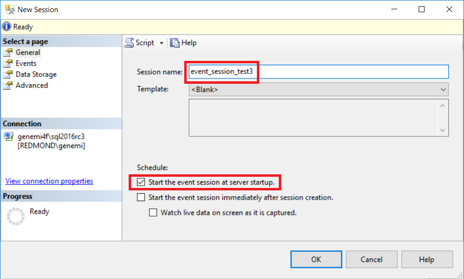
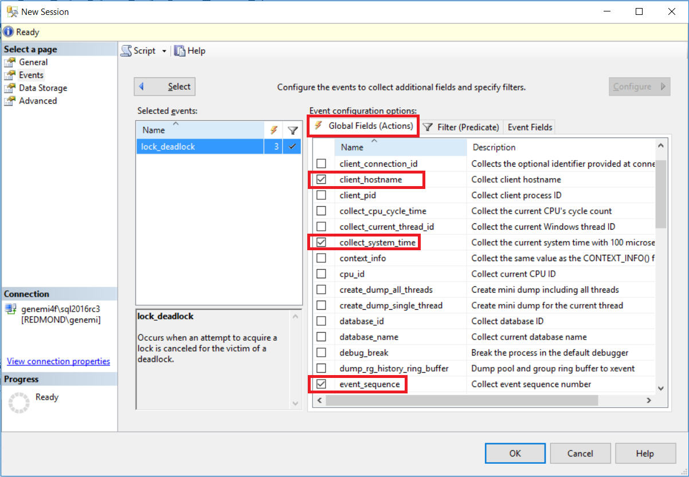
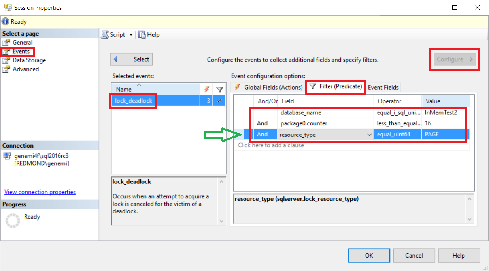
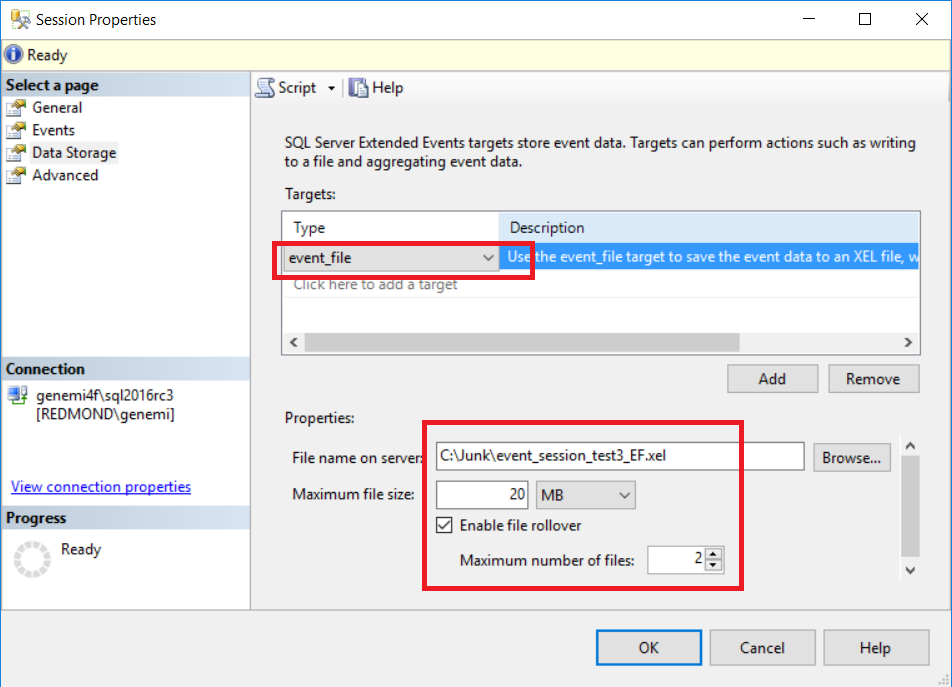
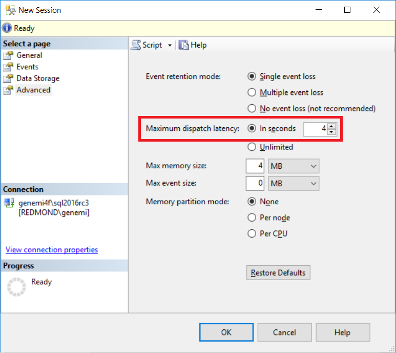

# <a name="selects-and-joins-from-system-views-for-extended-events-in-sql-server"></a>SELECT- und JOIN-Anweisungen von Systemsichten für erweiterte Ereignisse in SQL Server
[!INCLUDE[tsql-appliesto-ss2014-asdb-xxxx-xxx_md](../../includes/tsql-appliesto-ss2014-asdb-xxxx-xxx-md.md)]


Dieser Artikel beschreibt die zwei Gruppen von Systemsichten, die mit erweiterten Ereignissen in Microsoft SQL Server und im Azure SQL Database-Clouddienst zusammenhängen. Dieser Artikel beschreibt:

- wie mithilfe der JOIN-Anweisung verschiedene Systemsichten zusammengefügt werden.
- wie eine SELECT-Anweisung für bestimmte Informationen der Systemsichten durchgeführt wird.
- wie die gleiche Ereignissitzungsinformation von verschiedenen technologischen Standpunkten aus dargestellt wird, was Ihr Verständnis von jeder Perspektive vertieft.


Die meisten Beispiele werden für SQL Server geschrieben. Mit kleineren Änderungen könnten sie auf der SQL-Datenbank ausgeführt werden.


## <a name="a-foundational-information"></a>A. Grundlegende Informationen


Es gibt zwei Sammlungen von Systemsichten für erweiterte Ereignisse:


#### <a name="catalog-views"></a>Katalogsichten:

- Diese Sichten speichern Informationen über die *Definition* jeder Ereignissitzung, die durch [CREATE EVENT SESSION](../../t-sql/statements/create-event-session-transact-sql.md)oder durch eine Entsprechung der SSMS-Benutzeroberfläche erstellt wird. Diese Sichten wissen jedoch nicht, ob eine Sitzung jemals ausgeführt wurde.
    - Wenn z.B. der **Objekt-Explorer** von SSMS (SQL Server Management Studio) anzeigt, dass keine Ereignissitzungen definiert sind, würde das Ausführen einer SELECT-Anweisung in der Sicht *sys.server_event_session_targets* null (0) Zeilen zurückgeben.


- Das Namenspräfix ist:
    - Das Namenspräfix auf SQL Server ist *sys.server\_event\_session\**.
    - Das Namenspräfix in der SQL-Datenbank ist *sys.database\_event\_session\**.


#### <a name="dynamic-management-views-dmvs"></a>Dynamische Verwaltungssichten (Dynamic management views; DMVs):

- Speichern Informationen über die *aktuelle Aktivität* beim Ausführen von Ereignissitzungen. Aber diese DMVs wissen nur wenig über die Definition der Sitzungen.
    - Auch wenn derzeit alle Eventsitzungen beendet werden, würde aus der Ansicht *sys.dm_xe_packages* SELECT weiterhin Zeilen zurückgegeben, da verschiedene Pakete beim Serverstart in den aktiven Arbeitsspeicher geladen werden.
    - Aus demselben Grund würden *sys.dm_xe_objects* *sys.dm_xe_object_columns* would also still return rows.


- Namenspräfix für erweiterte Ereignisse DMVs ist:
    - Das Namenspräfix auf SQL Server ist *sys.dm\_xe\_\**.
    - Das Namenspräfix in der SQL-Datenbank ist in der Regel *sys.dm\_xe\_database\_\**.


#### <a name="permissions"></a>Berechtigungen:


Die folgende Berichtigung ist notwendig, um SELECT für Systemsichten ausführen zu können:

- VIEW SERVER STATE – wenn es um Microsoft SQL Server handelt.
- VIEW DATABASE STATE – wenn es sich um eine Azure SQL-Datenbank handelt.


<a name="section_B_catalog_views"></a>

## <a name="b-catalog-views"></a>B. Katalogsichten


Dieser Abschnitt stimmt mit drei verschiedenen technologischen Perspektiven auf der gleichen definierten Ereignissitzung überein und bezieht sich auf sie. Die Sitzung wurde definiert und kann im **Objekt-Explorer** von SQL Server Management Studio (SSMS.exe) angezeigt werden. Diese Sitzung wird derzeit jedoch nicht ausgeführt.

Es wird empfohlen, jeden Monat [das neueste Update von SSMS zu installieren](http://msdn.microsoft.com/library/mt238290.aspx), um unerwartete Fehler zu vermeiden.


Die Referenzdokumentation zu den Katalogsichten für erweiterte Ereignisse finden Sie unter [Katalogsichten für erweiterte Ereignisse (Transact-SQL)](../../relational-databases/system-catalog-views/extended-events-catalog-views-transact-sql.md).


&nbsp;


#### <a name="the-sequence-in-this-section-b"></a>Die Reihenfolge in diesem Abschnitt B:


- [B.1 Die Perspektive der SSMS-Benutzeroberfläche](#section_B_1_SSMS_UI_perspective)
    - Erstellen Sie mithilfe der SSMS-Benutzeroberfläche die Definition der Ereignissitzung. Screenshots zeigen eine Schritt-für-Schritt-Anleitung an.


- [B.2 Die Perspektive von Transact-SQL](#section_B_2_TSQL_perspective)
    - Verwenden Sie das SSMS-Kontextmenü, um die definierte Ereignissitzung in die entsprechende Anweisung **CREATE EVENT SESSION** von Transact-SQL zurückzuentwickeln. T-SQL zeigt eine perfekte Übereinstimmung zu der Auswahl der SSMS-Screenshots.


- [B.3 Die Perspektive SELECT JOIN UNION der Katalogsicht](#section_B_3_Catalog_view_S_J_UNION)
    - Geben Sie eine SELECT-Anweisung von T-SQL aus den Systemkatalogsichten für unsere Ereignissitzung aus. Die Ergebnisse stimmen mit den Spezifikationen der **CREATE EVENT SESSION** -Abfrage überein.


&nbsp;


<a name="section_B_1_SSMS_UI_perspective"></a>

### <a name="b1-ssms-ui-perspective"></a>B.1 Die Perspektive der SSMS-Benutzeroberfläche


Im **Objekt-Explorer**von SSMS können Sie das Dialogfeld **Neue Sitzung** ausführen, indem Sie **Management** > **Extended Events**erweitern und anschließend mit der rechten Maustaste auf **Sitzungen** > **Neue Sitzung**klicken.

Im großen Dialogfeld **New Session** (Neue Sitzung) wird im ersten Abschnitt namens **General** (Allgemein) angezeigt, dass die Option **Start the event session at server startup** (Ereignissitzung beim Serverstart starten) ausgewählt wurde.




Als nächstes sehen wir, dass im Abschnitt **Events** (Ereignisse), das Ereignis **lock_deadlock** ausgewählt wurde. Drei **Actions** (Aktionen) wurden für dieses Ereignis ausgewählt. Dies bedeutet, dass die Schaltfläche **Configure** (Konfigurieren) geklickt wurde, die nach dem Auswählen ausgegraut wird.




<a name="resource_type_PAGE_cat_view"></a>

Wir sind immer noch im Abschnitt **Events** > **Configure** (Ereignisse > Konfigurieren) und sehen als nächstes, dass [**resource_type** auf **PAGE**](#resource_type_dmv_actual_row) festgelegt wurde. Dies bedeutet, dass Ereignisdaten nicht vom Ereignismodul zum Ziel gesendet wird, wenn der Wert **resource_type** nicht **PAGE**ist.

Es werden zusätzliche Prädikatfilter für die Datenbank und für einen Leistungsindikator angezeigt.




Im Abschnitt **Data Storage** (Datenspeicher) sehen Sie, dass **event_file** als Ziel ausgewählt wurde. Darüber hinaus sehen Sie, dass die Option **Enable file rollover** (Dateirollover aktivieren) ausgewählt wurde.




Schließlich können Sie im Abschnitt **Advanced** (Erweitert) erkennen, dass der Wert **Maximum dispatch latency** (Maximale Verteilungslatenzzeit) auf 4 Sekunden reduziert wurde.




Dadurch ist die Perspektive der SSMS-Benutzeroberfläche mit der Definition der Ereignissitzung abgeschlossen.


<a name="section_B_2_TSQL_perspective"></a>

### <a name="b2-transact-sql-perspective"></a>B.2 Die Perspektive von Transact-SQL


Unabhängig davon, wie eine Definition für die Ereignissitzung erstellt wurde, kann die Sitzung der SSMS-Benutzeroberfläche in perfekter Übereinstimmung mit dem Transact-SQL-Skript zurückentwickelt werden. Sie können die vorhergehenden Screenshots von „New Session“ (Neue Sitzung) überprüfen und anschließend deren sichtbare Spezifikationen mit den Klauseln des folgenden generierten **CREATE EVENT SESSION** -Skript von T-SQL vergleichen.

Sie können mit der rechten Maustaste im **Objekt-Explorer** auf den Sitzungsknoten klicken und anschließend **Script Session as** > **CREATE to** > **Clipboard**(Skript für Sitzung als &gt; CREATE to &gt; Zwischenablage) auswählen, um eine Ereignissitzung zurückzuentwickeln.

Das folgende T-SQL-Skript wurde durch Zurückentwickeln mit SSMS erstellt. Anschließend wurde das Skript manuell durch strategische Bearbeitung der Leerzeichen verschönert.


```tsql
CREATE EVENT SESSION [event_session_test3]
    ON SERVER  -- Or, if on Azure SQL Database, ON DATABASE.

    ADD EVENT sqlserver.lock_deadlock
    (
        SET
            collect_database_name = (1)
        ACTION
        (
            package0  .collect_system_time,
            package0  .event_sequence,
            sqlserver .client_hostname
        )
        WHERE
        (
            [database_name]           = N'InMemTest2'
            AND [package0].[counter] <= (16)
            AND [resource_type]       = (6)
        )
    )

    ADD TARGET package0.event_file
    (
        SET
            filename           = N'C:\Junk\event_session_test3_EF.xel',
            max_file_size      = (20),
            max_rollover_files = (2)
    )

    WITH
    (
        MAX_MEMORY            = 4096 KB,
        EVENT_RETENTION_MODE  = ALLOW_SINGLE_EVENT_LOSS,
        MAX_DISPATCH_LATENCY  = 4 SECONDS,
        MAX_EVENT_SIZE        = 0 KB,
        MEMORY_PARTITION_MODE = NONE,
        TRACK_CAUSALITY       = OFF,
        STARTUP_STATE         = ON
    );
```


Dadurch ist die T-SQL-Perspektive abgeschlossen.


<a name="section_B_3_Catalog_view_S_J_UNION"></a>

### <a name="b3-catalog-view-select-join-union-perspective"></a>B.3 Die Perspektive SELECT JOIN UNION der Katalogsicht


Machen Sie sich keine Sorgen! Die folgende SELECT-Anweisung von T-SQL ist nur so lang, da durch die UNION-Klausel mehrere kleine SELECT-Anweisungen vereinigt wurden. Jede der kleinen SELECT-Anweisungen kann einzeln ausgeführt werden. Die kleinen SELECT-Anweisungen zeigen an, wie die verschiedenen Katalogsichten des Systems durch JOIN verknüpft werden müssen.


```tsql
SELECT
        s.name        AS [Session-Name],
        '1_EVENT'     AS [Clause-Type],
        'Event-Name'  AS [Parameter-Name],
        e.name        AS [Parameter-Value]
    FROM
              sys.server_event_sessions         AS s
        JOIN  sys.server_event_session_events   AS e

            ON  e.event_session_id = s.event_session_id
    WHERE
        s.name = 'event_session_test3'

UNION ALL
SELECT
        s.name         AS [Session-Name],
        '2_EVENT_SET'  AS [Clause-Type],
        f.name         AS [Parameter-Name],
        f.value        AS [Parameter-Value]
    FROM
              sys.server_event_sessions         AS s
        JOIN  sys.server_event_session_events   AS e

            ON  e.event_session_id = s.event_session_id

        JOIN  sys.server_event_session_fields   As f

            ON  f.event_session_id = s.event_session_id
            AND f.object_id        = e.event_id
    WHERE
        s.name = 'event_session_test3'

UNION ALL
SELECT
        s.name              AS [Session-Name],
        '3_EVENT_ACTION'    AS [Clause-Type],

        e.package + '.' + a.name
                            AS [Parameter-Name],

        '(Not_Applicable)'  AS [Parameter-Value]
    FROM
              sys.server_event_sessions         AS s
        JOIN  sys.server_event_session_events   AS e

            ON  e.event_session_id = s.event_session_id

        JOIN  sys.server_event_session_actions  As a

            ON  a.event_session_id = s.event_session_id
            AND a.event_id         = e.event_id
    WHERE
        s.name = 'event_session_test3'

UNION ALL
SELECT
        s.name                AS [Session-Name],
        '4_EVENT_PREDICATES'  AS [Clause-Type],
        e.predicate           AS [Parameter-Name],
        '(Not_Applicable)'    AS [Parameter-Value]
    FROM
              sys.server_event_sessions         AS s
        JOIN  sys.server_event_session_events   AS e

            ON  e.event_session_id = s.event_session_id
    WHERE
        s.name = 'event_session_test3'

UNION ALL
SELECT
        s.name              AS [Session-Name],
        '5_TARGET'          AS [Clause-Type],
        t.name              AS [Parameter-Name],
        '(Not_Applicable)'  AS [Parameter-Value]
    FROM
              sys.server_event_sessions         AS s
        JOIN  sys.server_event_session_targets  AS t

            ON  t.event_session_id = s.event_session_id
    WHERE
        s.name = 'event_session_test3'

UNION ALL
SELECT
        s.name          AS [Session-Name],
        '6_TARGET_SET'  AS [Clause-Type],
        f.name          AS [Parameter-Name],
        f.value         AS [Parameter-Value]
    FROM
              sys.server_event_sessions         AS s
        JOIN  sys.server_event_session_targets  AS t

            ON  t.event_session_id = s.event_session_id

        JOIN  sys.server_event_session_fields   As f

            ON  f.event_session_id = s.event_session_id
            AND f.object_id        = t.target_id
    WHERE
        s.name = 'event_session_test3'

UNION ALL
SELECT
        s.name               AS [Session-Name],
        '7_WITH_MAX_MEMORY'  AS [Clause-Type],
        'max_memory'         AS [Parameter-Name],
        s.max_memory         AS [Parameter-Value]
    FROM
              sys.server_event_sessions  AS s
    WHERE
        s.name = 'event_session_test3'

UNION ALL
SELECT
        s.name                  AS [Session-Name],
        '7_WITH_STARTUP_STATE'  AS [Clause-Type],
        'startup_state'         AS [Parameter-Name],
        s.startup_state         AS [Parameter-Value]
    FROM
              sys.server_event_sessions  AS s
    WHERE
        s.name = 'event_session_test3'

ORDER BY
    [Session-Name],
    [Clause-Type],
    [Parameter-Name]
;
```


#### <a name="output"></a>Ausgabe


Als nächstes wird die tatsächliche Ausgabe nach dem Ausführen von SELECT JOIN UNION angezeigt. Der Ausgabeparameter benennt und bewertet die Zuordnung von dem, was schlicht in der vorherigen CREATE EVENT SESSION-Anweisung zu sehen ist.


```
Session-Name          Clause-Type            Parameter-Name                  Parameter-Value
------------          -----------            --------------                  ---------------
event_session_test3   1_EVENT                Event-Name                      lock_deadlock
event_session_test3   2_EVENT_SET            collect_database_name           1
event_session_test3   3_EVENT_ACTION         sqlserver.client_hostname       (Not_Applicable)
event_session_test3   3_EVENT_ACTION         sqlserver.collect_system_time   (Not_Applicable)
event_session_test3   3_EVENT_ACTION         sqlserver.event_sequence        (Not_Applicable)
event_session_test3   4_EVENT_PREDICATES     ([sqlserver].[equal_i_sql_unicode_string]([database_name],N'InMemTest2') AND [package0].[counter]<=(16))   (Not_Applicable)
event_session_test3   5_TARGET               event_file                      (Not_Applicable)
event_session_test3   6_TARGET_SET           filename                        C:\Junk\event_session_test3_EF.xel
event_session_test3   6_TARGET_SET           max_file_size                   20
event_session_test3   6_TARGET_SET           max_rollover_files              2
event_session_test3   7_WITH_MAX_MEMORY      max_memory                      4096
event_session_test3   7_WITH_STARTUP_STATE   startup_state                   1
```


Dadurch ist der Abschnitt über Katalogsichten abgeschlossen.


<a name="section_C_DMVs"></a>

## <a name="c-dynamic-management-views-dmvs"></a>C. Dynamische Verwaltungssichten (DMVs)


Wir wenden uns jetzt den DMVs zu. Dieser Abschnitt enthält mehrere Transact-SQL-SELECT-Anweisungen, die jeweils für bestimmte, nützliche Unternehmenszwecke gedacht sind. Des Weiteren zeigt die SELECT-Anweisung, wie sie mit JOIN die DMVs für jede beliebige Verwendung verknüpfen können.


Die Referenzdokumentation für die DMVs finden Sie unter [Dynamische Verwaltungssichten für erweiterte Ereignisse](../../relational-databases/system-dynamic-management-views/extended-events-dynamic-management-views.md).


Wenn nicht anders angegeben sind alle tatsächlichen Ausgabezeilen der folgenden SELECT-Anweisungen in diesem Artikel von SQL Server 2016.


Hier ist die Liste der SELECT-Anweisungen in dieser DMV aus dem Abschnitt C:

- [C.1 Liste aller Pakete](#section_C_1_list_packages)
- [C.2 Anzahl jedes Objekttyps](#section_C_2_count_object_type)
- [C.3 Auswählen aller verfügbaren Elemente nach Typ mit der SELECT-Anweisung](#section_C_3_select_all_available_objects)
- [C.4 Verfügbare Datenfelder für Ihr Ereignis](#section_C_4_data_fields)
- [C.5 *sys.dm_xe_map_values* und Ereignisfelder](#section_C_5_map_values_fields)
- [C.6 Parameter für Ziele](#section_C_6_parameters_targets)
- [C.7 Typumwandlung der target_data-Spalte nach XML durch DMV SELECT](#section_C_7_dmv_select_target_data_column)
- [C.8 Auswählen aus einer Funktion zum Abrufen von event_file-Daten vom Laufwerk durch SELECT](#section_C_8_select_function_disk)


<a name="section_C_1_list_packages"></a>

### <a name="c1-list-of-all-packages"></a>C.1 Liste aller Pakete


Alle Objekte, die Sie im Bereich erweitere Ereignisse verwenden können, stammen von Paketen, die in Ihr System geladen werden. In diesem Abschnitt werden alle Pakete und deren Beschreibungen aufgeführt.


```tsql
SELECT  --C.1
        p.name         AS [Package],
        p.description  AS [Package-Description]
    FROM
        sys.dm_xe_packages  AS p
    ORDER BY
        p.name;
```


#### <a name="output"></a>Ausgabe

Hier ist die Liste der Pakete.


```
/***  (The unique p.guid values are not shown.)
Package        Package-Description
-------        -------------------
filestream     Extended events for SQL Server FILESTREAM and FileTable
package0       Default package. Contains all standard types, maps, compare operators, actions and targets
qds            Extended events for Query Store
SecAudit       Security Audit Events
sqlclr         Extended events for SQL CLR
sqlos          Extended events for SQL Operating System
SQLSatellite   Extended events for SQL Satellite
sqlserver      Extended events for Microsoft SQL Server
sqlserver      Extended events for Microsoft SQL Server
sqlserver      Extended events for Microsoft SQL Server
sqlsni         Extended events for Microsoft SQL Server
ucs            Extended events for Unified Communications Stack
XtpCompile     Extended events for the XTP Compile
XtpEngine      Extended events for the XTP Engine
XtpRuntime     Extended events for the XTP Runtime
***/
```


*Definitionen der vorhergehenden Abkürzungen:*

- clr = Common Language Runtime von .NET
- qds = Query Data Store (Abfragedatenspeicher)
- sni = Server Network Interface (Server-Netzwerkschnittstelle)
- ucs = Unified Communications Stack (Unified Communications-Stapel)
- xtp = Extreme Transaction Processing


<a name="section_C_2_count_object_type"></a>

### <a name="c2-count-of-every-object-type"></a>C.2 Anzahl jedes Objekttyps


Dieser Abschnitt beschreibt die Objekttypen, die in Ereignispaketen enthalten sind. Eine vollständige Liste aller Objekttypen, die in *sys.dm\_xe\_objects* zusammen mit der Anzahl der Objekte für jeden Typ angezeigt werden.


```tsql
SELECT  --C.2
        Count(*)  AS [Count-of-Type],
        o.object_type
    FROM
        sys.dm_xe_objects  AS o
    GROUP BY
        o.object_type
    ORDER BY
        1  DESC;
```


#### <a name="output"></a>Ausgabe

Hier ist die Anzahl der Objekte pro Objekttyp. Es gibt ungefähr 1915 Objekte.


```
/***  Actual output, sum is about 1915:

Count-of-Type   object_type
-------------   -----------
1303            event
351             map
84              message
77              pred_compare
53              action
46              pred_source
28              type
17              target
***/
```


<a name="section_C_3_select_all_available_objects"></a>

### <a name="c3-select-all-available-items-sorted-by-type"></a>C.3 Auswählen aller verfügbaren Elemente nach Typ mit der SELECT-Anweisung


Die folgende SELECT-Anweisung gibt in etwa 1915 Zeilen zurück, eine für jedes Objekt.


```tsql
SELECT  --C.3
        o.object_type  AS [Type-of-Item],
        p.name         AS [Package],
        o.name         AS [Item],
        o.description  AS [Item-Description]
    FROM
             sys.dm_xe_objects  AS o
        JOIN sys.dm_xe_packages AS p  ON o.package_guid = p.guid
    WHERE
        o.object_type IN ('action' , 'target' , 'pred_source')
        AND
        (
            (o.capabilities & 1) = 0
            OR
            o.capabilities IS NULL
        )
    ORDER BY
        [Type-of-Item],
        [Package],
        [Item];
```


#### <a name="output"></a>Ausgabe

Als nächstes könnten für Sie das willkürliche Sampling der Objekte, die von der vorhergehenden SELECT-Anweisung zurückgegeben wurde, interessant sein.


```
/***
Type-of-Item   Package        Item                          Item-Description
------------   -------        ----                          ----------------
action         package0       callstack                     Collect the current call stack
action         package0       debug_break                   Break the process in the default debugger
action         sqlos          task_time                     Collect current task execution time
action         sqlserver      sql_text                      Collect SQL text
event          qds            query_store_aprc_regression   Fired when Query Store detects regression in query plan performance
event          SQLSatellite   connection_accept             Occurs when a new connection is accepted. This event serves to log all connection attempts.
event          XtpCompile     cgen                          Occurs at start of C code generation.
map            qds            aprc_state                    Query Store Automatic Plan Regression Correction state
message        package0       histogram_event_required      A value is required for the parameter 'filtering_event_name' when source type is 0.
pred_compare   package0       equal_ansi_string             Equality operator between two ANSI string values
pred_compare   sqlserver      equal_i_sql_ansi_string       Equality operator between two SQL ANSI string values
pred_source    sqlos          task_execution_time           Get current task execution time
pred_source    sqlserver      client_app_name               Get the current client application name
target         package0       etw_classic_sync_target       Event Tracing for Windows (ETW) Synchronous Target
target         package0       event_counter                 Use the event_counter target to count the number of occurrences of each event in the event session.
target         package0       event_file                    Use the event_file target to save the event data to an XEL file, which can be archived and used for later analysis and review. You can merge multiple XEL files to view the combined data from separate event sessions.
target         package0       histogram                     Use the histogram target to aggregate event data based on a specific event data field or action associated with the event. The histogram allows you to analyze distribution of the event data over the period of the event session.
target         package0       pair_matching                 Pairing target
target         package0       ring_buffer                   Asynchronous ring buffer target.
type           package0       xml                           Well formed XML fragment
***/
```


<a name="section_C_4_data_fields"></a>

### <a name="c4-data-fields-available-for-your-event"></a>C.4 Verfügbare Datenfelder für Ihr Ereignis


Die folgende SELECT-Anweisung gibt alle Datenfelder zurück, die speziell für Ihren Ereignistyp gelten.

- Beachten Sie das Klauselelement WHERE: *column_type = 'data'*.
- Darüber hinaus müssen Sie den Wert der Klausel WHERE für *o.name =*bearbeiten.


```tsql
SELECT  -- C.4
        p.name         AS [Package],
        c.object_name  AS [Event],
        c.name         AS [Column-for-Predicate-Data],
        c.description  AS [Column-Description]
    FROM
              sys.dm_xe_object_columns  AS c
        JOIN  sys.dm_xe_objects         AS o

            ON  o.name = c.object_name

        JOIN  sys.dm_xe_packages        AS p

            ON  p.guid = o.package_guid
    WHERE
        c.column_type = 'data'
        AND
        o.object_type = 'event'
        AND
        o.name        = '\<EVENT-NAME-HERE!>'  --'lock_deadlock'
    ORDER BY
        [Package],
        [Event],
        [Column-for-Predicate-Data];
```


#### <a name="output"></a>Ausgabe

Die folgenden Zeilen wurden von der vorhergehenden SELECT-Anweisung zurückgegeben, wobei WHERE `o.name = 'lock_deadlock'`:

- Jede Zeile stellt einen optionalen Filter für das Ereignis *sqlserver.lock_deadlock* dar.
- Die Spalte *\[Column-Description\]* (Spaltenbeschreibung) wird im folgenden Screenshot ausgelassen. Der Wert ist häufig NULL.


```
/***
Actual output, except for the omitted Description column which is often NULL.
These rows are where object_type = 'lock_deadlock'.

Package     Event           Column-for-Predicate-Data
-------     -----           -------------------------
sqlserver   lock_deadlock   associated_object_id
sqlserver   lock_deadlock   database_id
sqlserver   lock_deadlock   database_name
sqlserver   lock_deadlock   deadlock_id
sqlserver   lock_deadlock   duration
sqlserver   lock_deadlock   lockspace_nest_id
sqlserver   lock_deadlock   lockspace_sub_id
sqlserver   lock_deadlock   lockspace_workspace_id
sqlserver   lock_deadlock   mode
sqlserver   lock_deadlock   object_id
sqlserver   lock_deadlock   owner_type
sqlserver   lock_deadlock   resource_0
sqlserver   lock_deadlock   resource_1
sqlserver   lock_deadlock   resource_2
sqlserver   lock_deadlock   resource_description
sqlserver   lock_deadlock   resource_type
sqlserver   lock_deadlock   transaction_id
***/
```


<a name="section_C_5_map_values_fields"></a>

### <a name="c5-sysdmxemapvalues-and-event-fields"></a>C.5 *sys.dm_xe_map_values* und Ereignisfelder


Die folgende SELECT-Anweisung erhält die JOIN-Klausel mit der schwierigen Sicht *sys.dm_xe_map_values*.

Der Zweck der SELECT-Anweisung ist es, die zahlreichen Felder anzuzeigen, aus denen Sie für Ihre Ereignissitzung wählen können. Die Ereignisfelder können auf zwei Arten verwendet werden:

- Zum Auswählen, welche Feldwerte in Ihr Ziel für jedes Ereignisvorkommen geschrieben werden.
- Zum Filtern, welche Ereignisvorkommen zu Ihrem Ziel gesendet werden, bzw. davon abgehalten werden.


```tsql
SELECT  --C.5
        dp.name         AS [Package],
        do.name         AS [Object],
        do.object_type  AS [Object-Type],
        'o--c'     AS [O--C],
        dc.name         AS [Column],
        dc.type_name    AS [Column-Type-Name],
        dc.column_type  AS [Column-Type],
        dc.column_value AS [Column-Value],
        'c--m'     AS [C--M],
        dm.map_value    AS [Map-Value],
        dm.map_key      AS [Map-Key]
    FROM
              sys.dm_xe_objects         AS do
        JOIN  sys.dm_xe_object_columns  AS dc

            ON  dc.object_name = do.name

        JOIN  sys.dm_xe_map_values      AS dm

            ON  dm.name = dc.type_name

        JOIN  sys.dm_xe_packages        AS dp

            ON  dp.guid = do.package_guid
    WHERE
        do.object_type = 'event'
        AND
        do.name        = '\<YOUR-EVENT-NAME-HERE!>'  --'lock_deadlock'
    ORDER BY
        [Package],
        [Object],
        [Column],
        [Map-Value];
```


#### <a name="output"></a>Ausgabe

<a name="resource_type_dmv_actual_row"></a>

Anschließend wird eine Stichprobe der tatsächlichen 153 Spalten der Ausgabe der vorhergehenden SELECT-Anweisung von T-SQL durchgeführt. Die Zeile für **resource_type** ist [relevant](#resource_type_PAGE_cat_view) für das im Beispiel **event_session_test3** durchführte Prädikatfiltern, das an anderer Stelle in diesem Artikel vorgestellt wird.


```
/***  5 sampled rows from the actual 153 rows returned.
    NOTE:  'resource_type' under 'Column'.

Package     Object          Object-Type   O--C   Column          Column-Type-Name     Column-Type   Column-Value   C--M   Map-Value        Map-Key
-------     ------          -----------   ----   ------          ----------------     -----------   ------------   ----   ---------        -------
sqlserver   lock_deadlock   event         o--c   CHANNEL         etw_channel          readonly      2              c--m   Operational      4
sqlserver   lock_deadlock   event         o--c   KEYWORD         keyword_map          readonly      16             c--m   access_methods   1024
sqlserver   lock_deadlock   event         o--c   mode            lock_mode            data          NULL           c--m   IX               8
sqlserver   lock_deadlock   event         o--c   owner_type      lock_owner_type      data          NULL           c--m   Cursor           2
sqlserver   lock_deadlock   event         o--c   resource_type   lock_resource_type   data          NULL           c--m   PAGE             6

Therefore, on your CREATE EVENT SESSION statement, in its ADD EVENT WHERE clause,
you could put:
    WHERE( ... resource_type = 6 ...)  -- Meaning:  6 = PAGE.
***/
```


<a name="section_C_6_parameters_targets"></a>

### <a name="c6-parameters-for-targets"></a>C.6 Parameter für Ziele


Die folgende SELECT-Anweisung gibt jeden Parameter für Ihr Ziel zurück. Jeder Parameter ist markiert, um anzuzeigen, ob er verbindlich ist, oder nicht. Die Werte, die Sie Parametern zuweisen, beeinflussen das Verhalten des Ziels.

- Beachten Sie das Klauselelement WHERE: *object_type = 'customizable'*.
- Darüber hinaus müssen Sie den Wert der Klausel WHERE für *o.name =*bearbeiten.


```tsql
SELECT  --C.6
        p.name        AS [Package],
        o.name        AS [Target],
        c.name        AS [Parameter],
        c.type_name   AS [Parameter-Type],

        CASE c.capabilities_desc
            WHEN 'mandatory' THEN 'YES_Mandatory'
            ELSE 'Not_mandatory'
        END  AS [IsMandatoryYN],

        c.description AS [Parameter-Description]
    FROM
              sys.dm_xe_objects   AS o
        JOIN  sys.dm_xe_packages  AS p

            ON  o.package_guid = p.guid

        LEFT OUTER JOIN  sys.dm_xe_object_columns  AS c

            ON  o.name        = c.object_name
            AND c.column_type = 'customizable'  -- !
    WHERE
        o.object_type = 'target'
        AND
        o.name     LIKE '%'    -- Or '\<YOUR-TARGET-NAME-HERE!>'.
    ORDER BY
        [Package],
        [Target],
        [IsMandatoryYN]  DESC,
        [Parameter];
```


#### <a name="output"></a>Ausgabe

Die folgenden Zeilen der Parameter sind eine Teilmenge von denen, die in SQL Server 2016 von der vorhergehenden SELECT-Anweisung zurückgegeben wurden.


```
/***  Actual output, all rows, where target name = 'event_file'.
Package    Target       Parameter            Parameter-Type       IsMandatoryYN   Parameter-Description
-------    ------       ---------            --------------       -------------   ---------------------
package0   event_file   filename             unicode_string_ptr   YES_Mandatory   Specifies the location and file name of the log
package0   event_file   increment            uint64               Not_mandatory   Size in MB to grow the file
package0   event_file   lazy_create_blob     boolean              Not_mandatory   Create blob upon publishing of first event buffer, not before.
package0   event_file   max_file_size        uint64               Not_mandatory   Maximum file size in MB
package0   event_file   max_rollover_files   uint32               Not_mandatory   Maximum number of files to retain
package0   event_file   metadatafile         unicode_string_ptr   Not_mandatory   Not used
***/
```


<a name="section_C_7_dmv_select_target_data_column"></a>

### <a name="c7-dmv-select-casting-targetdata-column-to-xml"></a>C.7 Typumwandlung der target_data-Spalte nach XML durch DMV SELECT


Diese DMV SELECT-Anweisung gibt Datenzeilen des Ziels Ihrer aktiven Ereignissitzung zurück. Die Daten werden in XML umgewandelt. Dadurch kann die zurückgegebene Zelle zum einfachen Anzeigen in SSMS geklickt werden.

- Wenn die Ereignissitzung beendet wird, gibt SELECT null Zeilen zurück.
- Sie müssen den Wert der WHERE-Klausel für *s.name =*bearbeiten.


```tsql
SELECT  --C.7
        s.name,
        t.target_name,
        CAST(t.target_data AS XML)  AS [XML-Cast]
    FROM
              sys.dm_xe_session_targets  AS t
        JOIN  sys.dm_xe_sessions         AS s

            ON s.address = t.event_session_address
    WHERE
        s.name = '\<Your-Session-Name-Here!>';
```


#### <a name="output-the-only-row-including-its-xml-cell"></a>Ausgabe der einzelnen Zeile einschließlich der XML-Zelle

Hier ist die einzige Zeile, die von der vorhergehenden SELECT-Anweisung ausgegeben wurde. Die Spalte *XML-Cast* (XML-Umwandlung) enthält eine XML-Zeichenfolge, die von SSMS auch als XML verstanden wird. Daher erkennt SSMS, dass die Zelle der XML-Umwandlung klickbar gemacht werden sollte.


Für diese Ausführung:

- Der Wert *s.name =* wurde auf eine Ereignissitzung für das Ereignis *checkpoint_begin* festgelegt.
- Das Ziel war *ring_buffer*.


```XML
name                              target_name   XML-Cast
----                              -----------   --------
checkpoint_session_ring_buffer2   ring_buffer   <RingBufferTarget truncated="0" processingTime="0" totalEventsProcessed="2" eventCount="2" droppedCount="0" memoryUsed="104"><event name="checkpoint_begin" package="sqlserver" timestamp="2016-07-09T01:28:23.508Z"><data name="database_id"><type name="uint32" package="package0" /><value>5</value></data></event><event name="checkpoint_begin" package="sqlserver" timestamp="2016-07-09T01:28:26.975Z"><data name="database_id"><type name="uint32" package="package0" /><value>5</value></data></event></RingBufferTarget>
```


#### <a name="output-xml-displayed-pretty-when-cell-is-clicked"></a>Beim Klicken in die Zelle erfolgt die Ausgabe in strukturiertem XML.


Wenn die Zelle „XML-Cast“ (XML-Umwandlung) ausgewählt wird, erscheint folgende Anzeige.


```xml
<RingBufferTarget truncated="0" processingTime="0" totalEventsProcessed="2" eventCount="2" droppedCount="0" memoryUsed="104">
  <event name="checkpoint_begin" package="sqlserver" timestamp="2016-07-09T01:28:23.508Z">
    <data name="database_id">
      <type name="uint32" package="package0" />
      <value>5</value>
    </data>
  </event>
  <event name="checkpoint_begin" package="sqlserver" timestamp="2016-07-09T01:28:26.975Z">
    <data name="database_id">
      <type name="uint32" package="package0" />
      <value>5</value>
    </data>
  </event>
</RingBufferTarget>
```


<a name="section_C_8_select_function_disk"></a>

### <a name="c8-select-from-a-function-to-retrieve-eventfile-data-from-disk-drive"></a>C.8 Auswählen aus einer Funktion zum Abrufen von event_file-Daten vom Laufwerk durch SELECT


Angenommen, Ihre Ereignissitzungen haben Daten erfasst und wurden später beendet. Wenn Ihre Sitzung definiert wurde, das Ziel „event_file“ zu benutzen, können Sie die Daten immer noch abrufen, indem Sie die Funktion *sys.fn_xe_target_read_file*aufrufen.

- Sie müssen den Pfad und Dateinamen im Parameter des Funktionsaufrufs anpassen, bevor Sie diese SELECT-Anweisung ausführen.
    - Achten Sie nicht auf die zusätzlichen Ziffern, die SQL-System jedes Mal, wenn Sie die Sitzung neu starten, in Ihre tatsächlichen. XEL-Dateinamen einbettet. Geben Sie einfach den normalen Stammnamen und die Erweiterung an.


```tsql
SELECT  --C.8
        f.module_guid,
        f.package_guid,
        f.object_name,
        f.file_name,
        f.file_offset,
        CAST(f.event_data AS XML)  AS [Event-Data-As-XML]
    FROM
        sys.fn_xe_file_target_read_file(

            '\<YOUR-PATH-FILE-NAME-ROOT-HERE!>*.xel',
            --'C:\Junk\Checkpoint_Begins_ES*.xel',  -- Example.

            NULL, NULL, NULL
        )  AS f;
```


#### <a name="output-rows-returned-by-select-from-the-function"></a>Ausgabe der Zeilen, wenn die SELECT FROM-Anweisung auf eine Funktion angewendet wird


Die Zeilen, die von der vorhergehenden SELECT FROM-Anweisung zurückgegeben werden, wenn diese auf eine Funktion angewendet wird Die XML-Spalte ganz rechts enthält die Daten, die insbesondere mit dem Ereignisvorkommen zusammenhängen.


```
module_guid                            package_guid                           object_name        file_name                                                           file_offset   Event-Data-As-XML
-----------                            ------------                           -----------        ---------                                                           -----------   -----------------
D5149520-6282-11DE-8A39-0800200C9A66   03FDA7D0-91BA-45F8-9875-8B6DD0B8E9F2   checkpoint_begin   C:\Junk\Checkpoint_Begins_ES_20160615bb-_0_131125086091700000.xel   5120          <event name="checkpoint_begin" package="sqlserver" timestamp="2016-07-09T03:30:14.023Z"><data name="database_id"><value>5</value></data><action name="session_id" package="sqlserver"><value>60</value></action><action name="database_id" package="sqlserver"><value>5</value></action></event>
D5149520-6282-11DE-8A39-0800200C9A66   03FDA7D0-91BA-45F8-9875-8B6DD0B8E9F2   checkpoint_end     C:\Junk\Checkpoint_Begins_ES_20160615bb-_0_131125086091700000.xel   5120          <event name="checkpoint_end" package="sqlserver" timestamp="2016-07-09T03:30:14.025Z"><data name="database_id"><value>5</value></data></event>
D5149520-6282-11DE-8A39-0800200C9A66   03FDA7D0-91BA-45F8-9875-8B6DD0B8E9F2   checkpoint_begin   C:\Junk\Checkpoint_Begins_ES_20160615bb-_0_131125086091700000.xel   5632          <event name="checkpoint_begin" package="sqlserver" timestamp="2016-07-09T03:30:17.704Z"><data name="database_id"><value>5</value></data><action name="session_id" package="sqlserver"><value>60</value></action><action name="database_id" package="sqlserver"><value>5</value></action></event>
D5149520-6282-11DE-8A39-0800200C9A66   03FDA7D0-91BA-45F8-9875-8B6DD0B8E9F2   checkpoint_end     C:\Junk\Checkpoint_Begins_ES_20160615bb-_0_131125086091700000.xel   5632          <event name="checkpoint_end" package="sqlserver" timestamp="2016-07-09T03:30:17.709Z"><data name="database_id"><value>5</value></data></event>
```


#### <a name="output-one-xml-cell"></a>Ausgabe einer XML-Zelle


Hier wird der Inhalt der ersten XML-Zelle aus dem vorherigen zurückgegebenen Rowset gezeigt.


```xml
<event name="checkpoint_begin" package="sqlserver" timestamp="2016-07-09T03:30:14.023Z">
  <data name="database_id">
    <value>5</value>
  </data>
  <action name="session_id" package="sqlserver">
    <value>60</value>
  </action>
  <action name="database_id" package="sqlserver">
    <value>5</value>
  </action>
</event>
```


