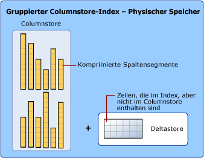
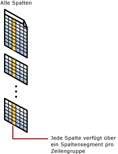

# Columnstore-Indizes-Architektur
[!INCLUDE[appliesto-ss-asdb-asdw-pdw-md](../../includes/appliesto-ss-asdb-asdw-pdw-md.md)]

Erfahren Sie, wie ein Columnstore-Index erstellt wird. Die Kenntnis dieser Grundlagen erleichtert es die anderen Columnstore-Artikel zu verstehen, die erläutern, wie sie effektiv verwendet werden können.

## Die Datenspeicherung verwendet die Columnstore- und Rowstore-Komprimierung
In Diskussionen zu Columnstore-Indizes verwenden wir die Begriffe *Rowstore* und *Columnstore* , um das Format der Datenspeicherung zu bezeichnen.  Columnstore-Indizes verwenden beide Arten der Datenspeicherung.

 

- Ein **Columnstore** enthält Daten, die logisch als Tabelle mit Zeilen und Spalten organisiert und physisch in einem Spaltendatenformat gespeichert sind.
  
Ein Columnstore-Index speichert die meisten Daten physisch im Columnstore-Format. Im Columnstore-Format werden die Daten als Spalten komprimiert und dekomprimiert. Es ist nicht erforderlich, andere Werte in jeder Zeile zu dekomprimieren, die nicht von der Abfrage angefordert werden. Das schnelle Scannen einer ganzen Spalte einer großen Tabelle wird dadurch erleichtert. 

- Ein **Rowstore** enthält Daten, die logisch als Tabelle mit Zeilen und Spalten organisiert und anschließend physisch in einem Zeilendatenformat gespeichert sind. Dies war die herkömmliche Methode zum Speichern von Daten aus relationalen Tabellen z.B. mithilfe eines Heap oder gruppierten Btree-Index.

Ein Columnstore-Index speichert einige Zeilen auch physisch in einem Rowstore-Format, ein sogenannter Deltastore. Beim Deltastore, auch Delta-Zeilengruppe genannt, handelt es sich um einen Aufbewahrungsort für Zeilen, die eine zu geringe Anzahl darstellen, um in den Columnstore komprimiert zu werden. Jede delta-Zeilengruppe wird als gruppierter Btree-Index implementiert. 

- Ein **Deltastore** ist ein Aufbewahrungsort für Zeilen, die eine zu geringe Anzahl darstellen, um in den Columnstore komprimiert zu werden. Der Deltastore ist ein Rowstore. 
  
## Vorgänge werden für Zeilengruppen und Spaltensegmente ausgeführt

Der Columnstore-Index gruppiert Zeilen in verwaltbare Einheiten. Diese Einheiten werden jeweils als eine Zeilengruppe bezeichnet. Die Anzahl der Zeilen in der Zeilengruppe muss groß genug sein, um die Komprimierungsraten zu verbessern, und klein genug, um von In-Memory-Vorgängen profitieren zu können.

* Eine **Zeilengruppe** ist eine Gruppe von Zeilen, für die der Columnstore-Index Verwaltungs- und Komprimierungsvorgänge ausführt. 

Der Columnstore-Index führt diese Vorgänge z.B. auf Zeilengruppen aus:

* Komprimiert Zeilengruppen in den Columnstore. Die Komprimierung wird für jedes Spaltensegment innerhalb einer Zeilengruppe ausgeführt.
* Die Zeilengruppen werden während eines ALTER INDEX REORGANIZE-Vorgangs erstellt.
* Die Zeilengruppen werden während eines ALTER INDEX REBUILD-Vorgangs erstellt.
* Meldet Zeilengruppen-Integrität und Fragmentierung in dynamischen Verwaltungsansichten (DMVs).

Der Deltastore besteht aus ein oder mehr Zeilengruppen, die Delta-Zeilengruppen genannt werden. Bei jeder delta-Zeilengruppe handelt es sich um einen gruppierten Btree-Index, der Zeilen speichert, wenn deren Anzahl für eine Komprimierung in den Columnstore zu gering ist.  

* Eine **Delta-Zeilengruppe** ist ein gruppierter Btree-Index, bei dem kleine Massenladevorgänge gespeichert werden, bis die Zeilengruppe 1.048.576 Zeilen enthält oder der Index neu erstellt wird.  Wenn eine Delta-Zeilengruppe 1.048.576 Zeilen enthält, wird diese als geschlossen markiert und wartet, bis ein sogenannter Tupelverschiebungsvorgang gestartet wird, um sie im Columnstore zu komprimieren. 

Jede Spalte weist einige ihrer Werte in jeder Zeilengruppe auf. Diese Werte werden als Spaltensegmente bezeichnet. Wenn der Columnstore-Index eine Zeilengruppe komprimiert, wird jedes Spaltensegment separat komprimiert. Um eine ganze Spalte zu dekomprimieren, muss der Columnstore-Index nur ein Spaltensegment von jeder Zeilengruppe dekomprimieren.

* Bei einem **Spaltensegment** handelt es sich um den Teil der Spaltenwerte in einer Zeilengruppe. Jede Zeilengruppe enthält ein Spaltensegment für jede Spalte in der Tabelle. Jede Spalte besitzt ein Spaltensegment in jeder Zeilengruppe. | 
  
   
 
## Kleine Ladungen und Einfügungen werden im Deltastore gespeichert
Ein Columnstore-Index verbessert die Columnstore-Komprimierung und Leistung durch das Komprimieren von mindestens 102.400 Zeilen gleichzeitig in den Columnstore-Index. Um Zeilen in einem Sammelvorgang zu komprimieren, sammelt der Columnstore-Index kleine Lasten, und fügt diese im Deltastore ein. Die Deltastore-Vorgänge werden im Hintergrund verarbeitet. Damit die richtigen Abfrageergebnisse zurückgegeben werden, kombiniert der gruppierte Columnstore-Index Abfrageergebnisse aus dem Columnstore und dem Deltastore. 

Zeilen werden im Deltastore aufgenommen wenn sie:
* Mit der INSERT INTO VALUES-Anweisung eingefügt werden.
* Am Ende eines Massenladevorgangs angelangt sind und ihre Anzahl weniger als 102.400 ist.
* Aktualisiert. Jedes Update wird als Delete und Insert implementiert.

Der Deltastore speichert auch eine Liste von IDs für gelöschte Zeilen, die als gelöscht markiert, aber noch nicht physisch aus dem Columnstore entfernt wurden. 

## Wenn Delta-Zeilengruppen voll sind, werden sie in den Columnstore komprimiert

Gruppierte Columnstore-Indizes erfassen bis zu 1.048.576 Zeilen in jeder Delta-Zeilengruppe, bevor die Zeilengruppe in den Delta-Store komprimiert wird. Dies verbessert die Komprimierung des Columnstore-Index. Wenn eine Delta-Zeilengruppe 1.048.576 Zeilen enthält, markiert der Columnstore-Index die Zeilengruppe als geschlossen. Ein Hintergrundprozess, der als *tuple-mover*bezeichnet wird, findet jede geschlossene Zeilengruppe, und komprimiert sie im Columnstore. 

Mit [ALTER INDEX](../../t-sql/statements/alter-index-transact-sql.md) können Delta-Zeilengruppen in den Columnstore gezwungen werden, um den Index neu zu erstellen oder zu organisieren.  Beachten Sie, dass bei zu wenig verfügbarem Arbeitsspeicher während des Komprimiervorgangs, der Columnstore-Index die Anzahl der Zeilen in der komprimierten Zeilengruppe möglicherweise reduziert.

## Jede Tabellenpartition verfügt über eigene Zeilengruppen und Delta-Zeilengruppen

Das Konzept der Partitionierung ist in einem gruppierten Index, einem Heap, und einem Columnstore-Index identisch. Das Partitionieren einer Tabelle teilt die Tabelle in kleinere Gruppen von Zeilen, gemäß einer Reihe von Spaltenwerten. Es wird häufig für die Verwaltung der Daten verwendet. Sie könnten z.B. für jedes Jahr und dessen Daten eine Partition erstellen, und anschließend einen Partitionswechsel durchführen, um Daten in einem kostengünstigeren Speicher zu archivieren. Ein Partitionswechsel funktioniert bei Columnstore-Indizes und macht es ganz einfach eine Partition von Daten an einen anderen Speicherort zu verschieben.

Zeilengruppen werden immer in einer Spalten-Partition definiert. Wenn ein Columnstore-Index partitioniert ist, besitzt jede Partition seine eigenen komprimierten Zeilengruppen und Delta-Zeilengruppen.

### Jede Partition kann über mehrere Delta-Zeilengruppen verfügen
Jede Partition kann über mehrere Delta-Zeilengruppen verfügen. Wenn der Columnstore-Index Daten zu einer Delta-Zeilengruppe hinzufügen muss, und die Delta-Zeilengruppe gesperrt ist, wird der Columnstore-Index versuchen eine Sperre für eine andere Delta-Zeilengruppe zu erhalten. Wenn keine Delta-Zeilengruppen verfügbar sind, wird der Columnstore-Index eine neue Delta-Zeilengruppe erstellen.  Beispielsweise könnte eine Tabelle mit 10 Partitionen problemlos über mindestens 20 Delta-Zeilengruppen verfügen. 

  
## Sie können Columnstore und Rowstore-Indizes für dieselbe Tabelle kombinieren
Der nicht gruppierte Index enthält eine Kopie eines Teils oder aller Zeilen und Spalten der zugrundeliegenden Tabelle. Der Index ist als eine oder mehrere Spalte(n) der Tabelle definiert und weist eine optionale Bedingung auf, die zum Filtern der Zeilen dient. 

Ab [!INCLUDE[ssSQL15](../../includes/sssql15-md.md)]können Sie einen aktualisierbaren, nicht gruppierten Columnstore-Index für eine Rowstore-Tabelle erstellen. Der Columnstore-Index speichert eine Kopie der Daten, sodass Sie keinen zusätzlichen Speicher benötigen. Allerdings werden die Daten in den Columnstore-Index komprimiert, auf eine kleinere Größe als die Rowstore-Tabelle es erfordert.  Durch dieses Vorgehen können Sie Analysen mit dem Columnstore-Index und Transaktionen mit dem Rowstore-Index zur gleichen Zeit ausführen. Der Spaltenspeicher wird aktualisiert, wenn sich die Daten in der Rowstore-Tabelle ändern, daher arbeiten beide Indizes auf den gleichen Daten.  
  
 Seit [!INCLUDE[ssSQL15](../../includes/sssql15-md.md)]können nicht gruppierte Rowstore-Indizes für einen Columnstore-Index erstellt werden. Auf diese Weise können effiziente Tabellensuchvorgänge im zugrundeliegenden Columnstore ausgeführt werden. Auch weitere Optionen werden dadurch verfügbar. Beispielsweise können Sie eine Primärschlüsseleinschränkung durchsetzen, indem Sie eine UNIQUE-Bedingung auf die Rowstore-Tabelle anwenden. Da ein nicht eindeutiger Wert nicht in die Rowstore-Tabelle eingefügt werden kann, kann SQL Server den Wert nicht in den Columnstore einfügen.  
 

## Metadaten  
Verwenden Sie diese Metadatenansichten, um die Attribute des Columnstore-Indizes zu sehen. Weitere Informationen zur Architektur sind in einigen Ansichten eingebettet.

Alle Spalten in einem Columnstore-Index werden in den Metadaten als eingeschlossene Spalten gespeichert. Der Columnstore-Index weist keine Schlüsselspalten auf.  
  
-   [sys.indexes &#40;Transact-SQL&#41;](../../relational-databases/system-catalog-views/sys-indexes-transact-sql.md)  
  
-   [sys.index_columns &#40;Transact-SQL&#41;](../../relational-databases/system-catalog-views/sys-index-columns-transact-sql.md)  
  
-   [sys.partitions &#40;Transact-SQL&#41;](../../relational-databases/system-catalog-views/sys-partitions-transact-sql.md)  
  
-   [sys.internal_partitions &#40;Transact-SQL&#41;](../../relational-databases/system-catalog-views/sys-internal-partitions-transact-sql.md)  
  
-   [sys.column_store_segments &#40;Transact-SQL&#41;](../../relational-databases/system-catalog-views/sys-column-store-segments-transact-sql.md)  
  
-   [sys.column_store_dictionaries &#40;Transact-SQL&#41;](../../relational-databases/system-catalog-views/sys-column-store-dictionaries-transact-sql.md)  
  
-   [sys.column_store_row_groups &#40;Transact-SQL&#41;](../../relational-databases/system-catalog-views/sys-column-store-row-groups-transact-sql.md)  
  
-   [sys.dm_db_column_store_row_group_operational_stats &#40;Transact-SQL&#41;](../../relational-databases/system-dynamic-management-views/sys-dm-db-column-store-row-group-operational-stats-transact-sql.md)  
  
-   [sys.dm_db_column_store_row_group_physical_stats &#40;Transact-SQL&#41;](../../relational-databases/system-dynamic-management-views/sys-dm-db-column-store-row-group-physical-stats-transact-sql.md)  
  
-   [sys.dm_column_store_object_pool &#40;Transact-SQL&#41;](../../relational-databases/system-dynamic-management-views/sys-dm-column-store-object-pool-transact-sql.md)  
  
-   [sys.dm_db_column_store_row_group_operational_stats &#40;Transact-SQL&#41;](../../relational-databases/system-dynamic-management-views/sys-dm-db-column-store-row-group-operational-stats-transact-sql.md)  
  
-   [sys.dm_db_index_operational_stats &#40;Transact-SQL&#41;](../../relational-databases/system-dynamic-management-views/sys-dm-db-index-operational-stats-transact-sql.md)  
  
-   [sys.dm_db_index_physical_stats &#40;Transact-SQL&#41;](../../relational-databases/system-dynamic-management-views/sys-dm-db-index-physical-stats-transact-sql.md)  
  
|  

## Nächste Schritte
 Hinweise zum Entwerfen Ihrer Columnstore-Indizes finden Sie unter [Columnstore-Indizes - Leitfaden zum Design](../../relational-databases/indexes/columnstore-indexes-design-guidance.md)

