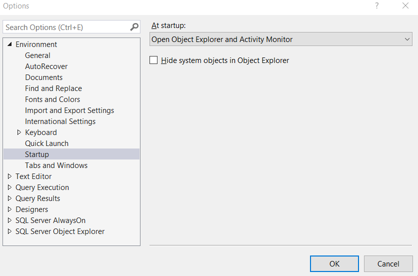

# Öffnen des Aktivitätsmonitors (SQL Server Management Studio)

   
 Der Aktivitätsmonitor führt Abfragen auf der überwachten Instanz aus, um Informationen für die Anzeigebereiche des Aktivitätsmonitors abzurufen. Wenn für das Intervall für die automatische Aktualisierung weniger als 10 Sekunden festgelegt sind, kann die für die Ausführung der Abfragen benötigte Zeit die Serverleistung beeinträchtigen.  
  
  
##   Überprüfen Sie Ihre Berechtigungen!  
 Zum Anzeigen der tatsächlichen Aktivität müssen Sie über die VIEW SERVER STATE-Berechtigung verfügen. Sie müssen zum Anzeigen des Abschnitts "Datendatei-E/A" des Aktivitätsmonitors neben VIEW SERVER STATE über die CREATE DATABASE-, ALTER ANY DATABASE- oder VIEW ANY DEFINITION-Berechtigung verfügen.  
  
 Zum Ausführen von KILL für einen Prozess muss ein Benutzer Mitglied der festen Serverrolle sysadmin oder processadmin sein.  
  
  
## Öffnen des Aktivitätsmonitors  

### Tastenkombination  
 - Geben Sie **STRG+ALT+A** ein, um den Aktivitätsmonitor jederzeit zu öffnen.

 >**Tipp:** Bewegen Sie den Mauszeiger über ein Symbol in SSMS, um zu erfahren, wozu es dient und über welche Tastenkombination es aktiviert wird.

### Symbolleiste

Klicken Sie auf der Standardsymbolleiste auf das Symbol **Aktivitätsmonitor** . Es befindet sich in der Mitte, rechts neben den Schaltflächen „Rückgängig“ bzw. „Wiederholen“.
  
  
Stellen Sie das Dialogfeld **Verbindung mit Server herstellen** fertig, wenn Sie nicht bereits mit einer Instanz von SQL Server verbunden sind, die Sie überwachen möchten.
  
## Starten des Aktivitätsmonitors und Objekt-Explorers beim Start
  
1.  Klicken Sie im Menü **Extras** auf **Optionen**.  
  
2.  Erweitern Sie im Dialogfeld **Optionen** die Option **Umgebung**, und wählen Sie dann **Start**aus.  
  
3.  Wählen Sie in der Dropdownliste **Beim Start** die Option **Objekt-Explorer und Aktivitätsmonitor öffnen**aus.  

4.  Klicken Sie auf **OK**.
  

  
  
## Festlegen des Aktualisierungsintervalls für den Aktivitätsmonitor  
  
1.   Öffnen Sie Aktivitätsmonitor.  
  
2.   Klicken Sie mit der rechten Maustaste auf **Übersicht**, wählen Sie **Aktualisierungsintervall**aus, und wählen Sie anschließend das Intervall aus, in dem der Aktivitätsmonitor neue Instanzinformationen abrufen soll.  
  
  

