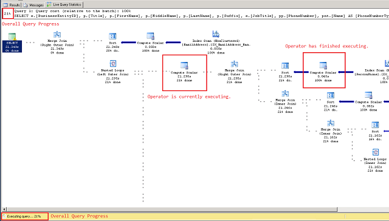

# Live-Abfragestatistik
  [!INCLUDE[ssManStudioFull](../../includes/ssmanstudiofull-md.md)] bietet die Möglichkeit, den Live-Ausführungsplan einer aktiven Abfrage anzuzeigen. Dieser Live-Abfrageplan bietet Einblicke in Echtzeit in den Abfrageausführungsprozess, während die Steuerelemente von einem Abfrageplanoperator zu einem anderen übertragen werden. Der Live-Abfrageplan zeigt den gesamten Abfragestatus und die Laufzeit-Ausführungsstatistik auf Operatorebene an, wie z.B. die Anzahl der erzeugten Zeilen, die verstrichene Zeit, den Operatorstatus usw. Da diese Daten in Echtzeit verfügbar sind und es nicht nötig ist, auf den Abschluss der Abfrage zu warten, sind diese Ausführungsstatistiken äußerst nützlich für das Debuggen von Leistungsproblemen in Zusammenhang mit Abfragen. Diese Funktion ist ab [!INCLUDE[ssSQL15](../../includes/sssql15-md.md)] [!INCLUDE[ssManStudio](../../includes/ssmanstudio-md.md)] verfügbar, funktioniert unter Umständen jedoch auch mit [!INCLUDE[ssSQL14](../../includes/sssql14-md.md)].  
  
**Gilt für**: [!INCLUDE[ssNoVersion](../../includes/ssnoversion-md.md)] ([!INCLUDE[ssSQL14](../../includes/sssql14-md.md)] bis [aktuelle Version](http://go.microsoft.com/fwlink/p/?LinkId=299658)).  
  
> [!WARNING]  
>  Diese Funktion wird hauptsächlich für Problembehandlungszwecke vorgesehen. Mit dieser Funktion kann die gesamte Abfrageleistung leicht verlangsamt werden. Diese Funktion kann mit dem [Transact-SQL-Debugger](../../relational-databases/scripting/configure-firewall-rules-before-running-the-tsql-debugger.md)verwendet werden.  
  
#### So zeigen Sie die Live-Abfragestatistik an  
  
1.  Klicken Sie zum Anzeigen des Live-Abfrageausführungsplans im Menü „Extras“ auf das Symbol **Live-Abfragestatistik** .  
  
       
  
     Zugriff auf den Ausführungsplan einer aktiven Abfrage erhalten Sie außerdem, indem Sie mit der rechten Maustaste auf eine ausgewählte Abfrage in [!INCLUDE[ssManStudio](../../includes/ssmanstudio-md.md)] klicken und anschließend auf **Live-Abfragestatistiken einschließen**klicken.  
  
       
  
2.  Führen Sie nun die Abfrage aus. Der Live-Abfrageplan zeigt den Abfragestatus sowie Statistiken zur Laufzeitausführung (beispielsweise verstrichene Zeit, Status usw.) für den Abfrageplanoperator an. Die Informationen zum Abfragestatus und die Ausführungsstatistik werden während der Ausführung der Abfrage regelmäßig aktualisiert. Diese Informationen geben Auskunft über den Status der Abfrageausführung und sind für das Debuggen von Abfragen mit langer Ausführungszeit, von Abfragen mit unbegrenzter Ausführungszeit, von Abfragen, die einen tempdb-Überlauf verursachen können, sowie von Timeoutproblemen nützlich.  
  
       
  
 Sie können auf den Plan für aktive Abfragen auch vom **Aktivitätsmonitor** aus zugreifen, indem Sie mit der rechten Maustaste auf die Abfragen in der Tabelle **Aktuelle ressourcenintensive Abfragen** klicken.  
  
   
  
## Hinweise  
 Die Infrastruktur des Statistikprofils muss aktiviert sein, bevor die Live-Abfragestatistik Informationen zum Status von Abfragen erfassen kann. Die Angabe von **Live-Abfragestatistiken einschließen** in [!INCLUDE[ssManStudio](../../includes/ssmanstudio-md.md)] aktiviert die Statistikinfrastruktur für die aktuelle Abfragesitzung. 
 
Bis [!INCLUDE[ssSQL15](../../includes/sssql15-md.md)]gibt es zwei weitere Methoden, die Statistikinfrastruktur zu aktivieren, die verwendet werden kann, um die Statistiken für aktive Abfragen aus anderen Sitzungen (z.B. vom Aktivitätsmonitor) anzuzeigen:  
  
-   Führen Sie `SET STATISTICS XML ON;` oder `SET STATISTICS PROFILE ON;` in der Zielsitzung aus.  
  
 oder  
  
-   Aktivieren Sie das erweiterte Ereignis **query_post_execution_showplan** . Dies ist eine serverweite Einstellung, die Statistiken für aktive Abfragen zu allen Sitzungen aktiviert. Informationen zum Aktivieren von erweiterten Ereignissen finden Sie unter [Überwachen der Systemaktivität mit erweiterten Ereignissen](../../relational-databases/extended-events/monitor-system-activity-using-extended-events.md).  

Ab [!INCLUDE[ssSQL15](../../includes/sssql15-md.md)] SP1 umfasst [!INCLUDE[ssNoVersion](../../includes/ssnoversion-md.md)] eine einfache Version der Infrastruktur des Statistikprofils. Es gibt zwei Methoden, die einfache Version der Statistikinfrastruktur zu aktivieren, die verwendet werden kann, um die Statistiken für aktive Abfragen aus anderen Sitzungen (z.B. vom Aktivitätsmonitor) anzuzeigen:

-   Verwenden des globalen Ablaufverfolgungsflags 7412  
  
 oder  
  
-   Aktivieren des erweiterten Ereignisses **query_thread_profile** . Dies ist eine serverweite Einstellung, die Statistiken für aktive Abfragen zu allen Sitzungen aktiviert. Informationen zum Aktivieren von erweiterten Ereignissen finden Sie unter [Überwachen der Systemaktivität mit erweiterten Ereignissen](../../relational-databases/extended-events/monitor-system-activity-using-extended-events.md).
  
 > [!NOTE]
 > Nativ kompilierte gespeicherte Prozeduren werden nicht unterstützt.  
  
## Berechtigungen  
 Erfordert die **SHOWPLAN** -Berechtigung für die Datenbankebene, um die **Live-Abfragestatistik** -Ergebnisseite aufzufüllen, und die **VIEW SERVER STATE** -Berechtigung für die Serverebene, um die Live-Statistik anzuzeigen sowie eine nötige Berechtigung zum Ausführen der Abfrage.  
  
## Siehe auch  
 [Überwachen und Optimieren der Leistung](../../relational-databases/performance/monitor-and-tune-for-performance.md)   
 [Tools für die Leistungsüberwachung und -optimierung](../../relational-databases/performance/performance-monitoring-and-tuning-tools.md)   
 [Öffnen des Aktivitätsmonitors &#40;SQL Server Management Studio&#41;](../../relational-databases/performance-monitor/open-activity-monitor-sql-server-management-studio.md)   
 [Aktivitätsmonitor](../../relational-databases/performance-monitor/activity-monitor.md)   
 [Leistungsüberwachung mit dem Abfragespeicher](../../relational-databases/performance/monitoring-performance-by-using-the-query-store.md)   
 [sys.dm_exec_query_statistics_xml](../../relational-databases/system-dynamic-management-views/sys-dm-exec-query-statistics-xml-transact-sql.md)   
 [sys.dm_exec_query_profiles](../../relational-databases/system-dynamic-management-views/sys-dm-exec-query-profiles-transact-sql.md)   
 [Ablaufverfolgungsflags](../../t-sql/database-console-commands/dbcc-traceon-trace-flags-transact-sql.md)
