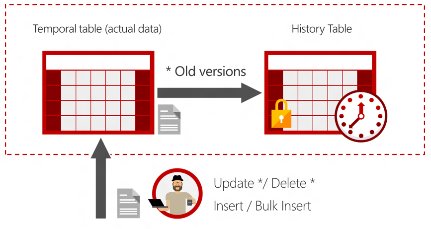
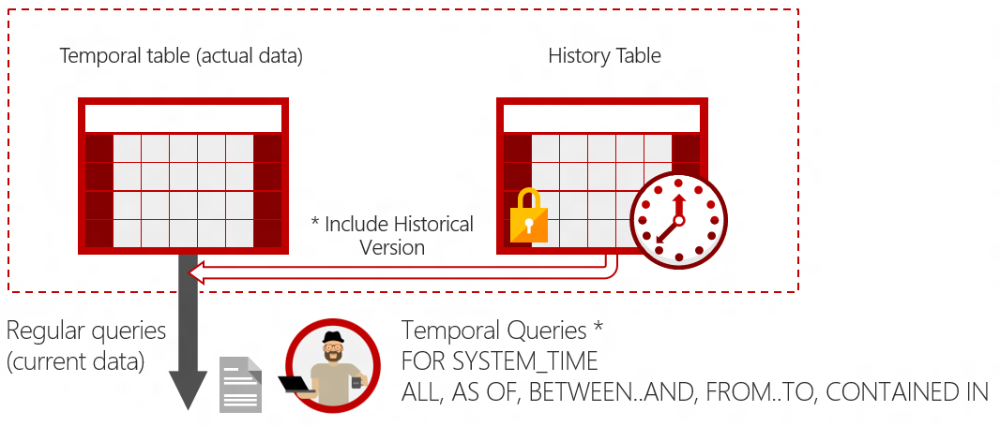

# <a name="temporal-tables"></a>Temporale Tabellen
[!INCLUDE[tsql-appliesto-ss2016-asdb-xxxx-xxx_md](../../includes/tsql-appliesto-ss2016-asdb-xxxx-xxx-md.md)]

  SQL Server 2016 führte die Unterstützung von temporalen Tabellen mit Systemversionsverwaltung als Datenbankfeature ein, das integrierte Unterstützung für das Bereitstellen von Informationen zu den zu jedem Zeitpunkt in der Tabelle gespeicherten Daten mit sich bringt, anstatt nur die aktuell in einer Tabelle gespeicherten Daten zu unterstützen. Temporal ist ein Datenbankfeature, das zusammen mit ANSI SQL 2011 eingeführt wurde.  
  
 **Schnellstart**  
  
-   **Erste Schritte:**  
  
    -   [Erste Schritte mit temporalen Tabellen mit Systemversionsverwaltung](../../relational-databases/tables/getting-started-with-system-versioned-temporal-tables.md)  
  
    -   [Temporale Tabellen mit Systemversionsverwaltung und speicheroptimierten Tabellen](../../relational-databases/tables/system-versioned-temporal-tables-with-memory-optimized-tables.md)  
  
    -   [Verwendungsszenarien für temporale Tabellen](../../relational-databases/tables/temporal-table-usage-scenarios.md)  
  
    -   [Erste Schritte mit temporalen Tabellen in Azure SQL-Datenbank](https://azure.microsoft.com/documentation/articles/sql-database-temporal-tables/)  
  
-   **Beispiele:**  
  
    -   [Erstellen einer temporalen Tabelle mit Systemversionsverwaltung](../../relational-databases/tables/creating-a-system-versioned-temporal-table.md)  
  
    -   [Verwenden von speicheroptimierten temporalen Tabellen mit Systemversionsverwaltung](../../relational-databases/tables/working-with-memory-optimized-system-versioned-temporal-tables.md)  
  
    -   [Ändern von Daten in einer temporalen Tabelle mit Systemversionsverwaltung](../../relational-databases/tables/modifying-data-in-a-system-versioned-temporal-table.md)  
  
    -   [Abfragen von Daten in einer temporalen Tabelle mit Systemversionsverwaltung](../../relational-databases/tables/querying-data-in-a-system-versioned-temporal-table.md)  
  
    -   **Herunterladen der Adventure Works-Beispieldatenbank:** Laden Sie zum Einstieg in temporale Tabellen die [AdventureWorks-Datenbank für SQL Server 2016 CTP3](https://www.microsoft.com/download/details.aspx?id=49502) mit Skriptbeispielen herunter, und führen Sie die Anweisungen im Ordner „Temporal“ aus.  
  
-   **Syntax:**  
  
    -   [CREATE TABLE &#40;Transact-SQL&#41;](../../t-sql/statements/create-table-transact-sql.md)  
  
    -   [ALTER TABLE &#40;Transact-SQL&#41;](../../t-sql/statements/alter-table-transact-sql.md)  
  
    -   [FROM &#40;Transact-SQL&#41;](../../t-sql/queries/from-transact-sql.md)  
  
-   **Video:** Eine 20-minütige Erörterung des Temporal-Features finden Sie unter [Temporal in SQL Server 2016](http://channel9.msdn.com/Shows/Data-Exposed/Temporal-in-SQL-Server-2016).  
  
## <a name="what-is-a-system-versioned-temporal-table"></a>Was ist eine temporale Tabelle mit Versionsverwaltung durch das System?  
 Eine temporale Tabelle mit Systemversionsverwaltung ist ein Benutzertabellentyp, der darauf ausgelegt ist, den Verlauf aller Datenänderungen lückenlos zu speichern und einfache Zeitpunktanalysen zu ermöglichen. Bei diesem Typ von temporaler Tabelle spricht man von Versionsverwaltung durch das System, da die Gültigkeitsdauer für jede Zeile vom System (d.h. vom Datenbankmodul) verwaltet wird.  
  
 Jede temporale Tabelle weist zwei explizit definierte Spalten auf, beide vom Datentyp **datetime2** . Diese Spalten werden als Zeitraumspalten bezeichnet. Diese Zeitraumspalten werden bei jeder Änderung einer Zeile ausschließlich vom System zum Aufzeichnen des Gültigkeitszeitraums verwendet.  
  
 Über diese Zeitraumspalten hinaus enthält eine temporale Tabelle außerdem einen Verweis auf eine weitere Tabelle mit einem gespiegelten Schema. Das System verwendet diese Tabelle, um bei jeder Aktualisierung oder Löschung einer Zeile in der temporalen Tabelle automatisch die Vorversion der Zeile zu speichern. Diese zusätzliche Tabelle wird als die Verlaufstabelle bezeichnet, während die Haupttabelle, die die aktuellen (gültigen) Zeilenversionen speichert, als die aktuelle Tabelle oder einfach als die temporale Tabelle bezeichnet wird. Während der Erstellung von temporalen Tabellen können Benutzer eine vorhandene Verlaufstabelle (deren Schema kompatibel sein muss) angeben oder vom System eine standardmäßige Verlaufstabelle erstellen lassen.  
  
## <a name="why-temporal"></a>Warum temporal?  
 Real verwendete Datenquellen sind dynamisch, und in der Mehrzahl der Fälle beruhen Geschäftsentscheidungen auf Erkenntnissen, die Analysten aus der Entwicklung der Daten ableiten. Zu den Einsatzgebieten von temporalen Tabellen zählen beispielsweise:  
  
-   Die Überwachung aller Datenänderungen und ggf. die Ausführung von Datenforensik  
  
-   Wiederherstellung des Status der Daten zu beliebigen Zeitpunkten in der Vergangenheit  
  
-   Berechnen von Trends im zeitlichen Verlauf  
  
-   Warten einer sich langsam verändernden Dimension für Anwendungen zur Entscheidungsunterstützung  
  
-   Wiederherstellung nach unbeabsichtigten Datenänderungen und Anwendungsfehlern  
  
## <a name="how-does-temporal-work"></a>Wie funktioniert temporal?  
 Die Versionsverwaltung durch das System für eine Tabelle wird in Form eines Tabellenpaars implementiert, von denen eine die aktuelle und die andere eine Verlaufstabelle ist. Innerhalb jeder dieser Tabellen werden die zwei folgenden zusätzlichen **datetime2** -Spalten verwendet, um den Gültigkeitszeitraum für jede Zeile zu definieren:  
  
-   Spalte des Systemzeitraumstarts: Das System zeichnet die Anfangszeit für die Zeile in dieser Spalte auf, normalerweise als **SysStartTime** -Spalte bezeichnet.  
  
-   Spalte des Systemzeitraumendes: Das System zeichnet die Endzeit für die Zeile in dieser Spalte auf, normalerweise als **SysEndTime** -Spalte bezeichnet.  
  
 Die aktuelle Tabelle enthält den aktuellen Wert für jede Zeile. Die Verlaufstabelle enthält jeden früheren Wert für jede Zeile, falls vorhanden, sowie die Anfangszeit und Endzeit für den Zeitraum, für den er gültig war.  
  
   
  
 Das folgende einfache Beispiel veranschaulicht ein Szenario mit Mitarbeiterinformationen in einer hypothetischen Personaldatenbank:  
  
```  
CREATE TABLE dbo.Employee   
(    
  [EmployeeID] int NOT NULL PRIMARY KEY CLUSTERED   
  , [Name] nvarchar(100) NOT NULL  
  , [Position] varchar(100) NOT NULL   
  , [Department] varchar(100) NOT NULL  
  , [Address] nvarchar(1024) NOT NULL  
  , [AnnualSalary] decimal (10,2) NOT NULL  
  , [ValidFrom] datetime2 (2) GENERATED ALWAYS AS ROW START  
  , [ValidTo] datetime2 (2) GENERATED ALWAYS AS ROW END  
  , PERIOD FOR SYSTEM_TIME (ValidFrom, ValidTo)  
 )    
 WITH (SYSTEM_VERSIONING = ON (HISTORY_TABLE = dbo.EmployeeHistory));  
```  
  
 **INSERTS:** Bei einem **INSERT**legt das System den Wert für die **SysStartTime** -Spalte basierend auf der Systemzeit auf den Anfangszeitpunkt der aktuellen Transaktion (in der UTC-Zeitzone) fest und weist der **SysEndTime** -Spalte den Maximalwert von 9999-12-31 als Wert zu. Dadurch wird die Zeile als offen gekennzeichnet.  
  
 **UPDATES:** Bei einem **UPDATE**speichert das System den vorhergehenden Wert der Zeile in der Verlaufstabelle und legt den Wert für die **SysEndTime** -Spalte basierend auf der Systemzeit auf den Anfangszeitpunkt der aktuellen Transaktion (in der UTC-Zeitzone) fest. Dadurch wird die Zeile als geschlossen mit einem aufgezeichneten Zeitraum gekennzeichnet, zu dem die Zeile gültig war. In der aktuellen Tabelle wird die Zeile mit dem neuen Wert aktualisiert, und das System legt den Wert für die **SysStartTime** -Spalte basierend auf der Systemzeit auf den Anfangszeitpunkt der Transaktion (in der UTC-Zeitzone) fest. Der Wert für die **SysEndTime** -Spalte für die aktualisierte Zeile verbleibt in der aktuellen Tabelle auf dem Maximalwert von 9999-12-31.  
  
 **DELETES:** Bei einem **DELETE**speichert das System den vorhergehenden Wert der Zeile in der Verlaufstabelle und legt den Wert für die **SysEndTime** -Spalte basierend auf der Systemzeit auf den Anfangszeitpunkt der aktuellen Transaktion (in der UTC-Zeitzone) fest. Dadurch wird die Zeile als geschlossen mit einem aufgezeichneten Zeitraum gekennzeichnet, zu dem die vorhergehende Zeile gültig war. In der aktuellen Tabelle wird die Zeile entfernt. Bei Abfragen der aktuellen Tabelle wird die Zeile nicht zurückgegeben. Nur bei Abfragen von Verlaufsdaten werden Daten zurückgegeben, für die eine Zeile geschlossen ist.  
  
 **MERGE:** Bei einem **MERGE**verläuft der Vorgang so, als würden bis zu drei Anweisungen ausgeführt (ein **INSERT**, ein **UPDATE**und/oder ein **DELETE**), je nachdem, welche Aktionen in der **MERGE** -Anweisung angegeben sind.  
  
> [!IMPORTANT]  
>  Die in den datetime2-Spalten des Systems aufgezeichneten Zeiten basieren auf dem Anfangszeitpunkt der Transaktion selbst. Beispielsweise wird für alle Zeilen, die innerhalb einer einzelnen Transaktion eingefügt werden, in der Spalte, die dem Beginn des **SYSTEM_TIME** -Zeitraums entspricht, die gleiche UTC-Zeit aufgezeichnet.  
  
## <a name="how-do-i-query-temporal-data"></a>Wie lassen sich temporale Daten abfragen?  
 Die **FROM***\<Tabelle>*-Klausel der **SELECT**-Anweisung hat eine neue Klausel (**FOR SYSTEM_TIME**) mit fünf temporal-spezifischen Unterklauseln zum Abfragen von Daten in der aktuellen und in den Verlaufstabellen. Die Syntax dieser neuen **SELECT** -Anweisung wird für Einzeltabellen direkt unterstützt, durch mehrfache JOINS weitergegeben und für zusammenfassende Sichten mehrerer temporaler Tabellen unterstützt.  
  
   
  
 Die folgende Abfrage sucht nach Zeilenversionen für die Mitarbeiterzeile mit EmployeeID = 1000, die mindestens eine Zeit lang zwischen dem 1. Januar 2014 und dem 1. Januar 2015 (einschließlich der oberen Grenze) aktiv waren:  
  
```  
SELECT * FROM Employee   
    FOR SYSTEM_TIME    
        BETWEEN '2014-01-01 00:00:00.0000000' AND '2015-01-01 00:00:00.0000000'   
            WHERE EmployeeID = 1000 ORDER BY ValidFrom;  
```  
  
> [!NOTE]  
>  **FOR SYSTEM_TIME** filtert Zeilen mit einer Gültigkeitsdauer von 0 (null) (**SysStartTime** = **SysEndTime**).  
> Diese Zeilen werden generiert, wenn mehrere Updates für den gleichen Primärschlüssel innerhalb der gleichen Transaktion ausgeführt werden.  
> In diesem Fall geben temporale Abfragen nur Zeilenversionen vor diesen Transaktionen sowie solche zurück, die erst nach diesen Transaktionen wirksam wurden.  
> Wenn diese Zeilen in die Analyse mit aufgenommen werden müssen, fragen Sie die Verlaufstabelle direkt ab.  
  
 In der Tabelle unten steht SysStartTime in der Spalte „Qualifizierte Zeilen“ für den Wert in der -Spalte **SysStartTime** in der abgefragten Tabelle, und **SysEndTime** stellt den Wert in der Spalte **SysEndTime** in der abgefragten Tabelle dar. Die vollständige Syntax und Beispiele finden Sie unter [FROM &#40;Transact-SQL&#41;](../../t-sql/queries/from-transact-sql.md) und [Abfragen von Daten in einer temporalen Tabelle mit Systemversionsverwaltung](../../relational-databases/tables/querying-data-in-a-system-versioned-temporal-table.md)unterstützt wird.  
  
|expression|Qualifizierte Zeilen|Description|  
|----------------|---------------------|-----------------|  
|**AS OF**<Datum_Uhrzeit>|SysStartTime \<= date_time AND SysEndTime > date_time|Gibt eine Tabelle mit Zeilen zurück, die die Werte enthalten, die zum angegebenen Zeitpunkt in der Vergangenheit real (aktuell) waren. Intern wird eine Union zwischen der temporalen Tabelle und ihrer Verlaufstabelle ausgeführt, und die Ergebnisse werden so gefiltert, dass die Werte in der Zeile zurückgegeben werden, die zu dem durch den Parameter *<Datum_Uhrzeit>* angegebenen Zeitpunkt gültig waren. Der Wert für eine Zeile ist gültig, wenn der Wert *system_start_time_column_name* kleiner als oder gleich dem Parameterwert *<Datum_Uhrzeit>* und der Wert *system_end_time_column_name* größer als der Parameterwert *<Datum_Uhrzeit>* ist.|  
|**FROM**<Start_Datum_Zeit>**TO**<End_Datum_Zeit>|SysStartTime < Ende_Datum_Uhrzeit AND SysEndTime > Start_Datum_Uhrzeit|Gibt eine Tabelle mit den Werten für alle Zeilenversionen zurück, die innerhalb des angegebenen Zeitbereichs aktiv waren, unabhängig davon, ob ihre Aktivität vor dem *<Start_Datum_Zeit>*-Parameterwert für das FROM-Argument begonnen hat oder ihre Aktivität nach dem *<End_Datum_Zeit>*-Parameterwert für das TO-Argument geendet hat. Intern wird eine Union zwischen der temporalen Tabelle und ihrer Verlaufstabelle ausgeführt, und die Ergebnisse werden so gefiltert, dass die Werte für alle Zeilenversionen zurückgegeben werden, die zu irgendeinem Zeitpunkt innerhalb des angegebenen Zeitbereichs aktiv waren. Zeilen, die genau an dem durch den FROM-Endpunkt definierten unteren Grenzwert deaktiviert wurden, sind nicht enthalten, und Datensätze, die genau an dem durch den TO-Endpunkt definierten oberen Grenzwert aktiv wurden, sind auch nicht enthalten.|  
|**BETWEEN**<Start_Datum_Uhrzeit>**AND**<Ende_Datum_Uhrzeit>|SysStartTime \<= end_date_time AND SysEndTime > start_date_time|Gleich wie oben in der Beschreibung zu **FOR SYSTEM_TIME FROM** <Start_Datum_Uhrzeit> **TO** <Ende_Datum_Uhrzeit>, mit dem Unterschied, dass die zurückgegebene Tabelle Zeilen enthält, die an dem durch den <Ende_Datum_Uhrzeit>-Endpunkt definierten oberen Grenzwert aktiv wurden.|  
|**CONTAINED IN** (<Start_Datum_Uhrzeit>, <Ende_Datum_Uhrzeit>)|SysStartTime >= start_date_time AND SysEndTime \<= end_date_time|Gibt eine Tabelle mit den Werten für alle Zeilenversionen zurück, die innerhalb des von den zwei Datums-/Uhrzeitwerten für das Argument CONTAINED IN definierten Zeitbereichs geöffnet und geschlossen wurden. Zeilen, die genau beim unteren Grenzwert aktiv wurden, oder deren Aktivität genau beim oberen Grenzwert endete, sind enthalten.|  
|**ALL**|Alle Zeilen|Gibt die Vereinigungsmenge der Zeilen zurück, die der aktuellen und der Verlaufstabelle angehören.|  
  
> [!NOTE]  
>  Optional können Sie sich entscheiden, diese Zeitraumspalten auszublenden, sodass Abfragen, die nicht explizit auf diese Zeitraumspalten verweisen, diese Spalten nicht wiedergeben (das Szenario **SELECT \* FROM***\<Tabelle>*). Um eine ausgeblendete Spalte zurückzugeben, verweisen Sie einfach in der Abfrage explizit auf die ausgeblendete Spalte. Analog dazu verhalten sich **INSERT** und **BULK INSERT** -Anweisungen, als ob diese neuen Zeitraumspalten nicht vorhanden wären (und die Spaltenwerte werden automatisch aufgefüllt). Weitere Informationen zur Verwendung der **HIDDEN** -Klausel finden Sie unter [CREATE TABLE &#40;Transact-SQL&#41;](../../t-sql/statements/create-table-transact-sql.md) und [ALTER TABLE &#40;Transact-SQL&#41;](../../t-sql/statements/alter-table-transact-sql.md)unterstützt wird.  
  
## <a name="did-this-article-help-you-were-listening"></a>Fanden Sie diesen Artikel nützlich? Wir hören Ihnen zu  
 Welche Informationen suchen Sie, und haben Sie sie gefunden? Wir nehmen uns Ihr Feedback zu Herzen, um unsere Inhalte zu verbessern. Bitte senden Sie Ihre Kommentare an [sqlfeedback@microsoft.com](mailto:sqlfeedback@microsoft.com?subject=Your%20feedback%20about%20the%20Temporal%20Tables%20page)  
  
## <a name="see-also"></a>Siehe auch  
 [Erste Schritte mit temporalen Tabellen mit Systemversionsverwaltung](../../relational-databases/tables/getting-started-with-system-versioned-temporal-tables.md)   
 [Temporale Tabellen mit Systemversionsverwaltung und speicheroptimierten Tabellen](../../relational-databases/tables/system-versioned-temporal-tables-with-memory-optimized-tables.md)   
 [Verwendungsszenarien für temporale Tabellen](../../relational-databases/tables/temporal-table-usage-scenarios.md)   
 [Überlegungen und Einschränkungen zu temporalen Tabellen](../../relational-databases/tables/temporal-table-considerations-and-limitations.md)   
 [Verwalten der Beibehaltung von Verlaufsdaten in temporalen Tabellen mit Systemversionsverwaltung](../../relational-databases/tables/manage-retention-of-historical-data-in-system-versioned-temporal-tables.md)   
 [Partitionierung mit temporären Tabellen](../../relational-databases/tables/partitioning-with-temporal-tables.md)   
 [Systemkonsistenzprüfungen von temporalen Tabellen](../../relational-databases/tables/temporal-table-system-consistency-checks.md)   
 [Sicherheit bei temporale Tabellen](../../relational-databases/tables/temporal-table-security.md)   
 [Metadatenansichten und Funktionen für temporale Tabellen](../../relational-databases/tables/temporal-table-metadata-views-and-functions.md)  
  
  

