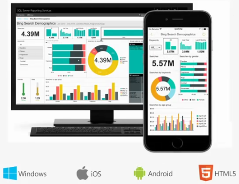
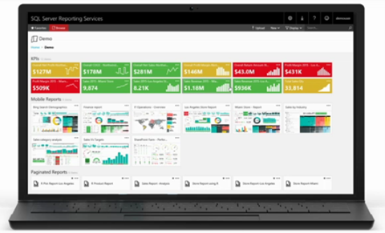

# Was ist SQL Server Reporting Services (SSRS)?

[!INCLUDE [ssrs-appliesto](../includes/ssrs-appliesto.md)] [!INCLUDE [ssrs-appliesto-2016-and-later](../includes/ssrs-appliesto-2016-and-later.md)] [!INCLUDE [ssrs-appliesto-not-pbirs](../includes/ssrs-appliesto-not-pbirs.md)]

[!INCLUDE [ssrs-previous-versions](../includes/ssrs-previous-versions.md)]

Erstellen, bereitstellen und Verwalten von mobile und paginierte Berichte von Reporting Services und Power BI-Berichte lokal mit dem Bereich der bereit zu verwendende Tools und Dienste, die SQL Server Reporting Services (SSRS) und Power BI zu ermöglichen.

## Erstellen Sie, Bereitstellen Sie und verwalten Sie mobile und paginierte Berichte

SQL Server Reporting Services ist eine Lösung, die Kunden auf ihrer eigenen Infrastruktur bereitstellen, um Berichte zu erstellen, zu veröffentlichen und zu verwalten und schließlich auf unterschiedliche Weise an die gewünschten Benutzer zu übermitteln, etwa durch Anzeigen der Berichte im Webbrowser, auf mobilen Geräten oder als E-Mails in den Postfächern.

Für SQL Server 2016 wird in Reporting Services eine aktualisierte Sammlung von Produkten bereitgestellt:

* **„Herkömmlich“ paginierte Berichte** sind auf den neuesten Stand gebracht, sodass Sie modern aussehende Berichte erstellen können, wozu Sie aktualisierte Tools und neue Funktionen nutzen.
* **Neue mobile Berichte** mit einem ansprechenden Layout, das sich entsprechend den verschiedenen Geräten und den verschiedenen Arten anpasst, wie Sie diese Geräte halten.
* **Ein modernes Webportal** , das Sie in jedem modernen Browser anzeigen können. Im neuen Portal organisieren und mobile und paginierte Reporting Services-Berichte und KPIs anzeigen und Power BI Desktop-Berichte. Sie können Excel-Arbeitsmappen auf das Portal gespeichert.

Lesen Sie weiter, um weitere Informationen zu jedem Aspekt zu erhalten.

> [!NOTE]
> Suchen Sie für Power BI-Berichtsserver? Finden Sie unter [erste Schritte mit Power BI-Berichtsserver](https://powerbi.microsoft.com/documentation/reportserver-get-started/).

### Neuigkeiten bei Reporting Services

Mit diesen Quellen informieren wir Sie über neue Funktionen in SQL Server 2016 Reporting Services.

* [Neuigkeiten bei Reporting Services](../reporting-services/what-s-new-in-sql-server-reporting-services-ssrs.md)
* [SQL Server Reporting Services Team Blog (Blog des SQL Server Reporting Services-Teams)](https://blogs.msdn.microsoft.com/sqlrsteamblog/)
* Der [YouTube-Kanal „Guy in a Cube“](https://www.youtube.com/channel/UCFp1vaKzpfvoGai0vE5VJ0w)

## Paginierte Berichte

Reporting Services ist mit „herkömmlichen“ paginierten Berichten im Dokumentstil verknüpft, in denen, je mehr Daten vorliegen, der jeweilige Bericht umso mehr Zeilen in den Tabellen und umso mehr Seiten hat. Dies ist großartig für das Erstellen von zu druckenden pixelgenauen Dokumenten mit festem Layout, z. B. PDF- und Word-Dateien.

Diese BI-Kernarbeitslast gibt es nach wie vor, weshalb wir sie modernisiert haben. Jetzt von modernen aussehende Berichte mit aktualisierten neue Features erstellen verwenden [Berichts-Generator](../reporting-services/report-builder/report-builder-in-sql-server-2016.md) oder Berichts-Designer in [SQL Server Data Tools (SSDT)](../reporting-services/tools/reporting-services-in-sql-server-data-tools-ssdt.md).

* Wir haben die Standardstile und -farbpaletten aktualisiert, d. h., Sie erstellen Berichte standardmäßig mit einem neuen minimalistischen Stil.
* Wir haben den Bereich „Parameter“ aktualisiert, sodass Sie Parameter nach Wunsch beliebig anordnen können.
* Sie können in neue Formate, etwa PowerPoint, exportieren. Reporting Services-Visualisierungen in PowerPoint sind lebendig und können bearbeitet werden, sie sind nicht einfach Screenshots.
* Sie können eine hybride Power BI/Reporting Services-Umgebung erstellen: Statt Ihre lokalen Reporting Services-Berichte in Power BI neu zu erstellen, können Sie visuelle Objekte aus diesen Berichten an Ihre Power BI-Dashboards anheften. Anschließend können Sie alle Elemente an einem Ort in Ihrem Power BI-Dashboard überwachen.

## Mobile Berichte

Mobile Geräte haben zu einem anderen Arbeitsverhalten geführt, was bedeutet, dass Menschen von heute andere Anforderungen an Berichte haben. Die Berichtsdarstellung mit festem Layout funktioniert nicht sehr gut für Tablets und Smartphones. Eine Darstellung, die für einen breiten PC-Bildschirm konzipiert ist, ergibt nicht die optimale Darstellung auf einem kleinen Smartphonebildschirm, der nicht nur kleiner ist, sondern auch eine Ausrichtung im Hoch- oder Querformat hat.

Für diese sehr verschiedene Bildschirmformfaktoren benötigen Sie kein festes Layout, sondern ein reagierendes Layout, das sich an diese verschiedenen Geräten und die unterschiedlichen Arten anpasst, wie Sie diese halten. Dafür haben wir einen neuen Berichtstyp hinzugefügt: mobile Berichte, die auf der Datazen-Technologie basieren, die wir vor über einem Jahr erworben und in das Produkt integriert haben. Sie können Ihre vorhandene Datazen Berichte über den [SQL Server Migration Assistant for Datazen](https://www.microsoft.com/download/details.aspx?id=53128)zu Reporting Services migrieren. 

Sie erstellen diese mobilen Berichte in der neuen App [Publisher für mobile Berichte](../reporting-services/mobile-reports/create-mobile-reports-with-sql-server-mobile-report-publisher.md) . Dann können Sie in den systemeigenen [Power BI-Apps für mobile Geräte](https://powerbi.microsoft.com/documentation/powerbi-power-bi-apps-for-mobile-devices/) für Windows 10, iOS, Android und HTML5 auf die Daten, die Sie in Power BI in der Cloud haben, sowie Ihre lokalen SQL Server 2016 Reporting Services-Daten zugreifen. Während Sie Visualisierungen erstellen, generiert Publisher für mobile Berichte automatisch Beispieldaten für jede Visualisierung, sodass Sie sehen können, wie die Visualisierung mit Ihren Daten aussieht und welche Art von Daten in jeder Visualisierung gut funktioniert.

## Webportal

Für Endbenutzer des einheitlichen Modus von Reporting Services ist die „Eingangstür“ ein modernes Webportal, das Sie in jedem modernen Browser anzeigen können. Sie können alle Reporting Services mobile und paginierte Berichte und KPIs in das neue Portal sowie Power BI Desktop-Berichte zugreifen. Erfahren Sie mehr über [Power BI-Berichte in Reporting Services](../reporting-services/power-bi-reports-in-reporting-services.md).  

Sie können Ihr eigenes benutzerdefiniertes Branding auf Ihr Webportal anwenden. Und Sie können KPIs direkt im Webportal erstellen. KPIs können wichtige Geschäftsmetriken auf einen Blick im Browser zum Vorschein bringen, ohne dass ein Bericht geöffnet werden muss. 

Das neue Webportal ist eine vollständig neu geschriebene Version des Berichts-Managers. Es ist nun eine auf Standards basierende Einzelseiten-HTML5-App, für die moderne Browser optimiert sind: Edge, Internet Explorer 10 und 11, Chrome, Firefox, Safari und alle weiteren wichtigen Browser.

Der Inhalt auf das Webportal wird nach Typ geordnet: Reporting Services mobile und paginierte Berichte und KPIs, plus Power BI Desktop Berichte, Excel-Arbeitsmappen freigegebene Datasets und freigegebene Datenquellen als Bausteine für Ihre Berichte verwenden. Sie können speichern und diese im hier in der Ordnerhierarchie des herkömmlichen sicher verwalten. Sie können Ihre Favoriten kennzeichnen, und Sie können den Inhalt verwalten, wenn Sie diese Rolle haben.

Und Sie können im neuen Webportal weiterhin Berichtsverarbeitung planen, bei Bedarf auf Berichte zugreifen sowie veröffentlichte Berichte abonnieren.

Weitere Informationen zu den [-Webportal (einheitlicher SSRS-Modus)](../reporting-services/web-portal-ssrs-native-mode.md).

## Reporting Services im integrierten SharePoint-Modus

Sie veröffentlichen Berichte in Reporting Services im integrierten SharePoint-Modus. Sie können die Verarbeitung von Berichten planen, nach Bedarf auf Begriffe zugreifen, veröffentlichte Berichte abonnieren und Berichten in andere Programme wie Microsoft Excel exportieren. Erstellen Sie Datenwarnungen für Berichte, die auf einer SharePoint-Website veröffentlicht werden, und lassen Sie sich bei Berichtsdatenänderungen per E-Mail benachrichtigen.  

Weitere Informationen über [Reporting Services-Berichtsserver im integrierten SharePoint-Modus](../reporting-services/report-server-sharepoint/reporting-services-report-server-sharepoint-mode.md).

## [!INCLUDE[ssRSnoversion](../includes/ssrsnoversion-md.md)] -Programmierfeatures

Nutzen Sie [!INCLUDE[ssRSnoversion](../includes/ssrsnoversion-md.md)] -Programmierfeatures, um Ihre Berichterstellungsfunktionen zu erweitern und anzupassen. Dabei wird mit APIs die Daten- und Berichtsverarbeitung in benutzerdefinierte Anwendungen integriert und erweitert.

Weitere Informationen finden Sie in der [Reporting Services-Entwicklerdokumentation](../reporting-services/reporting-services-developer-documentation.md). 

## Nächste Schritte

* [Installieren von Reporting Services](../reporting-services/install-windows/install-reporting-services.md)  
* [Installieren des Berichts-Generators](../reporting-services/install-windows/install-report-builder.md)   
* [Herunterladen von SQL Server Data Tools (SSDT)](http://go.microsoft.com/fwlink/?LinkID=616714)  
* [Power BI-Berichten in Reporting Services](../reporting-services/power-bi-reports-in-reporting-services.md)

Weiteren Fragen wenden? [Versuchen Sie das Reporting Services-Forum stellen](http://go.microsoft.com/fwlink/?LinkId=620231)
