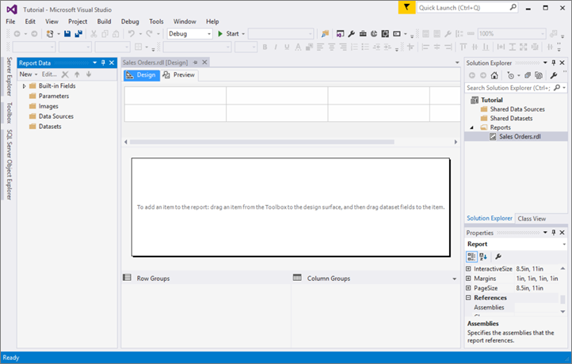

# Lektion 1: Erstellen eines Berichtsserverprojekts (Reporting Services)

 > Inhalt im Zusammenhang mit früheren Versionen von SQL Server, finden Sie unter [Lektion 1: Erstellen eines Berichtsserverprojekts (Reporting Services)](https://msdn.microsoft.com/en-US/library/ms167559(SQL.120).aspx).

In dieser Lektion erstellen Sie in Visual Studio ein *Berichtsserverprojekt* und eine *Berichtsdefinitionsdatei (.rdl)* in [!INCLUDE[ssBIDevStudio_md](../includes/ssbidevstudio-md.md)] . 

Zum Erstellen eines Berichts mit [!INCLUDE[ssBIDevStudioFull](../includes/ssbidevstudiofull-md.md)]benötigen Sie zunächst ein Berichtsserverprojekt, in dem Sie Ihre Berichtsdefinitionsdatei (.rdl) und alle anderen Ressourcendateien speichern können, die für Ihren Bericht erforderlich sind. 

In den folgenden Lektionen definieren Sie eine Datenquelle für Ihren Bericht, ein Dataset sowie das Berichtslayout. Beim Ausführen des Berichts werden die Daten abgerufen und mit dem Layout kombiniert und anschließend auf dem Bildschirm gerendert. Dort können Sie sie exportieren, drucken und speichern.  
  
  
  
## So erstellen Sie ein Berichtsserverprojekt  
  
1.  Öffnen Sie [!INCLUDE[ssBIDevStudio_md](../includes/ssbidevstudio-md.md)].  
  
2.  Klicken Sie im Menü **Datei** auf > **Neu** > **Projekt**.  

    
  
3.  Klicken Sie unter **Installiert** > **Vorlagen** > **Business Intelligence**auf **Reporting Services**.

    

5. Klicken Sie auf **Berichtsserverprojekt** . 

   >**Hinweis**: Wenn Sie sehen die **Business Intelligence** oder **Berichtsserverprojekt** Optionen müssen Sie SSDT mit Business Intelligence-Projektvorlagen zu aktualisieren. Weitere Informationen finden Sie unter [Herunterladen von SQL Server Data Tools (SSDT)](https://msdn.microsoft.com/library/mt204009.aspx).  
  
5.  Geben Sie im Feld **Name**den Namen **Tutorial**ein.  

    Standardmäßig wird es in Ihrem Ordner Visual Studio 2015\Projects in einem neuen Verzeichnis erstellt.
    
    
  
6.  Klicken Sie auf **OK** , um das Projekt zu erstellen.  
  
    Das Projekt für das Tutorial wird rechts im Projektmappen-Explorer angezeigt.  
  
## So erstellen Sie eine neue Berichtsdefinitionsdatei  
  
1.  Klicken Sie mit der rechten Maustaste im **Projektmappen-Explorer** auf **Berichte** > **Hinzufügen** > **Neues Element**. 

    >**Tipp**: Wenn der **Projektmappen-Explorer** nicht geöffnet ist, klicken Sie im Menü **Ansicht** auf **Projektmappen-Explorer**. 

    
  
2.  Klicken Sie im Fenster **Neues Element hinzufügen** auf **Bericht** .  
  
3.  Geben Sie in **Name** **Sales Orders.rdl** ein, und klicken Sie auf **Hinzufügen**.  
  
    Der Berichts-Designer wird geöffnet, und in der Entwurfsansicht wird die neue RDL-Datei angezeigt.  
    
    
  
     Der Berichts-Designer ist eine [!INCLUDE[ssRSnoversion](../includes/ssrsnoversion-md.md)] -Komponente, die in [!INCLUDE[ssBIDevStudioFull](../includes/ssbidevstudiofull-md.md)]ausgeführt wird. Er weist zwei Ansichten auf: **Entwurf** und **Vorschau**. Klicken Sie auf die einzelnen Registerkarten, um zwischen den Ansichten zu wechseln.  
  
    Die Daten werden im **Berichtsdatenbereich** definiert. In der Ansicht **Entwurf** wird das Berichtslayout definiert. Sie können den Bericht ausführen, und in der Ansicht **Vorschau** können Sie eine Vorschau des Berichts anzeigen.  
  
## Nächste Lektion  
Sie haben das Berichtsprojekt Tutorial erfolgreich erstellt und dem Berichtsprojekt eine Berichtsdefinitionsdatei (*.rdl) hinzugefügt. Als Nächstes geben Sie eine Datenquelle an, die für den Bericht verwendet werden soll. Weitere Informationen finden Sie unter [Lektion 2: Angeben von Verbindungsinformationen &#40;Reporting Services&#41;](../reporting-services/lesson-2-specifying-connection-information-reporting-services.md).  
  
## Siehe auch  
[Erstellen eines einfachen Tabellenberichts &#40;SSRS-Tutorial&#41;](../reporting-services/create-a-basic-table-report-ssrs-tutorial.md)  
  

