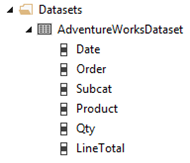

# Lektion 3: Definieren eines Datasets f&#252;r den Tabellenbericht (Reporting Services)
Nachdem Sie die Datenquelle festgelegt haben, müssen Sie ein Dataset definieren. In [!INCLUDE[ssRSnoversion](../includes/ssrsnoversion-md.md)]sind die Daten, die Sie in Berichten verwenden, in einem *Dataset*enthalten. Ein Dataset umfasst einen Zeiger auf eine Datenquelle sowie eine Abfrage, die vom Bericht verwendet werden, sowie berechnete Felder und Variablen.  
  
Verwenden Sie den Abfrage-Designer im Berichts-Designer, um das Dataset zu entwerfen. In diesem Tutorial erstellen Sie eine Abfrage, die Bestellinformationen aus der [!INCLUDE [ssSampleDBAdventureworks2014_md](../includes/sssampledbadventureworks2014-md.md)]-Datenbank abruft.  
  
### So definieren Sie eine Transact-SQL-Abfrage für Berichtsdaten  
  
1.  Klicken Sie im **Berichtsdatenbereich** auf **Neu**und anschließend auf **Dataset...**. Das Dialogfeld **Dataseteigenschaften** wird angezeigt.  
  
2.  Geben Sie in das Feld **Name** den Namen **AdventureWorksDataset**ein.  
  
3.  Klicken Sie auf **Verwenden Sie ein in den eigenen Bericht eingebettetes Dataset**.  
  
4.  Wählen Sie die Datenquelle aus, die Sie in der vorherigen Lektion, [!INCLUDE [ssSampleDBAdventureworks2014_md](../includes/sssampledbadventureworks2014-md.md)], erstellt haben.   
5. Wählen Sie **Text** für den **Abfragetyp** aus.  
  
6.  Geben Sie die folgende Transact-SQL-Abfrage entweder manuell oder durch Kopieren und Einfügen in das Feld **Abfrage** ein.  
  
    ```  
    SELECT   
       soh.OrderDate AS [Date],   
       soh.SalesOrderNumber AS [Order],   
       pps.Name AS Subcat, pp.Name as Product,    
       SUM(sd.OrderQty) AS Qty,  
       SUM(sd.LineTotal) AS LineTotal  
    FROM Sales.SalesPerson sp   
       INNER JOIN Sales.SalesOrderHeader AS soh   
          ON sp.BusinessEntityID = soh.SalesPersonID  
       INNER JOIN Sales.SalesOrderDetail AS sd   
          ON sd.SalesOrderID = soh.SalesOrderID  
       INNER JOIN Production.Product AS pp   
          ON sd.ProductID = pp.ProductID  
       INNER JOIN Production.ProductSubcategory AS pps   
          ON pp.ProductSubcategoryID = pps.ProductSubcategoryID  
       INNER JOIN Production.ProductCategory AS ppc   
          ON ppc.ProductCategoryID = pps.ProductCategoryID  
    GROUP BY ppc.Name, soh.OrderDate, soh.SalesOrderNumber, pps.Name, pp.Name,   
       soh.SalesPersonID  
    HAVING ppc.Name = 'Clothing'  
    ```  
  
7.  (Optional) klicken Sie auf die Schaltfläche **Abfrage-Designer**. Die Abfrage wird im textbasierten Abfrage-Designer angezeigt. Sie können zum grafischen Abfrage-Designer wechseln, indem Sie auf **Als Text bearbeiten**klicken. Wenn Sie die Ergebnisse der Abfrage anzeigen möchten, klicken Sie auf der Symbolleiste des Abfrage-Designers auf die Schaltfläche „Ausführen“ .  
  
    Daraufhin werden die Daten von sechs Feldern aus vier verschiedenen Tabellen in der [!INCLUDE [ssSampleDBAdventureworks2014_md](../includes/sssampledbadventureworks2014-md.md)]-Datenbank angezeigt. Diese Abfrage nutzt Transact-SQL-Funktionen wie Aliase. Beispielsweise wird die Tabelle SalesOrderHeader als *soh* bezeichnet.  
  
8.  Klicken Sie auf **OK** , um den Abfrage-Designer zu schließen.  
  
9.  Klicken Sie auf **OK** , um das Dialogfeld **Dataseteigenschaften** zu beenden.  
  
    Die Felder des **AdventureWorksDataset** -Datasets werden im Berichtsdatenbereich angezeigt.  
      
  
## Nächste Aufgabe  
Damit haben Sie erfolgreich eine Abfrage angegeben, die Daten für Ihren Bericht abruft. Als Nächstes erstellen Sie das Berichtslayout. Weitere Informationen finden Sie unter [Lektion 4: Hinzufügen einer Tabelle zum Bericht &#40;Reporting Services&#41;](../reporting-services/lesson-4-adding-a-table-to-the-report-reporting-services.md).  
  
## Siehe auch  
[Abfrageentwurfstools &#40;SSRS&#41;](../reporting-services/report-data/query-design-tools-ssrs.md)  
[SQL Server-Verbindungstyp &#40;SSRS&#41;](../reporting-services/report-data/sql-server-connection-type-ssrs.md)  
[Lernprogramm: Schreiben von Transact-SQL-Anweisungen](../t-sql/tutorial-writing-transact-sql-statements.md)  
  
  
  
