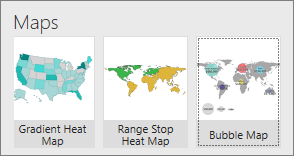

# Hinzufügen einer benutzerdefinierten Karte zu einem mobilen Reporting Services-Bericht
Benutzerdefinierte Karten erfordern zwei Dateien:  
* Eine SHP-Datei für Shape-Geometrien  
* Eine DBF-Datei für Metadaten  
  
Informieren Sie sich über [benutzerdefinierte Karten in mobilen Reporting Services-Berichten](../../reporting-services/mobile-reports/custom-maps-in-reporting-services-mobile-reports.md).  
  
Speichern Sie die beiden Dateien im selben Ordner. Die Dateinamen müssen übereinstimmen (z.B. "canada.shp" und "canada.dbf"). Die Metadaten (DBF-Datei) müssen das Feld "NAME" mit dem Namen (Schlüssel) der entsprechenden Shape enthalten, die beim Auffüllen der Karte mit Daten verwendet werden soll.   
  
## Laden einer benutzerdefinierten Karte  
  
1. Wählen Sie auf der Registerkarte **Layout** einen Kartentyp aus: **Gradient Heat Map**, **Range Stop Heat Map**oder **Bubble Map**. Ziehen Sie ihn auf die Entwurfsoberfläche, und stellen Sie ihn auf die gewünschte Größe ein.  
  
     
  
2. Wählen Sie in der Ansicht **Layout** im Bereich **Eigenschaften visueller Elemente** unter **Karte** die benutzerdefinierte Karte in einer Datei aus****.   
  
     
  
3. Navigieren Sie im Dialogfeld **Öffnen** zum Speicherort der SHP- und DBF-Dateien, und wählen Sie beide aus.   
  
     
  
## Verbinden von Daten an einer benutzerdefinierten Karte  
Wenn Sie die benutzerdefinierte Karte erstmals einem Bericht hinzufügen, wird sie von [!INCLUDE[SS_MobileReptPub_Short](../../includes/ss-mobilereptpub-short.md)] mit simulierten geografischen Daten aufgefüllt.  
  
  
  
Echte Daten zeigen Sie in Ihrer benutzerdefinierten Karte genauso wie in den vordefinierten Karten an. Führen Sie die Schritte unter [Karten in mobilen Reporting Services-Berichten](../../reporting-services/mobile-reports/maps-in-reporting-services-mobile-reports.md) aus, um Ihre Daten anzuzeigen.  
  
### Siehe auch  
- [Custom maps in Reporting Services mobile reports](../../reporting-services/mobile-reports/custom-maps-in-reporting-services-mobile-reports.md)  
- [Karten in mobilen Reporting Services-Berichten](../../reporting-services/mobile-reports/maps-in-reporting-services-mobile-reports.md)  
- [Erstellen und Veröffentlichen von mobilen Berichten mit dem Publisher für mobile Berichte von SQL Server](../../reporting-services/mobile-reports/create-mobile-reports-with-sql-server-mobile-report-publisher.md)   
  
  
  
  

