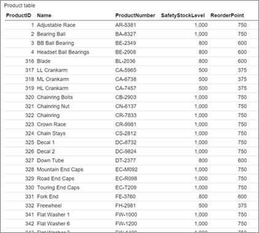

# Hinzufügen von Datenrastern zu mobilen Berichten | Reporting Services
Mitunter sind die Daten selbst die beste Visualisierung. Erfahren Sie mehr über die drei *Datenraster*(bzw. Tabellen) zum Anzeigen von Daten in [!INCLUDE[SS_MobileReptPub_Long](../../includes/ss-mobilereptpub-long.md)]:
* Einfaches Datenraster
* Indikatordatenraster
* Diagrammdatenraster

## Einfaches Datenraster
Das grundlegende bzw. einfache Datenraster kann mehrere Spalten mit Daten mit benutzerdefinierten Formaten und Kopfzeilen anzeigen. 

Nachdem Sie der Entwurfsoberfläche ein Datenraster hinzugefügt haben, können Sie es mit realen Daten verbinden.

1. Ziehen Sie von der Registerkarte **Layout** ein einfaches Datenraster in den Entwurfsbereich, und stellen Sie es auf die gewünschte Größe ein.

2. Rufen Sie [Daten aus Excel oder einem freigegebenen Dataset](../../reporting-services/mobile-reports/data-for-reporting-services-mobile-reports.md)ab.

3. Wählen Sie die Registerkarte **Daten** und im Bereich **Dateneigenschaften** unter **Daten für die Rasteransicht** eine Datentabelle aus.

4. Wählen Sie im Bereich **Spalten** die gewünschten Spalten aus. Sie können sie neu anordnen und umbenennen sowie ihr Format und ihre Aggregation festlegen. 

 
##  Indikatordatenraster
Sie können einem Indikatordatenraster Spalten mit Messgeräten hinzufügen.

1. Ziehen Sie von der Registerkarte **Layout** ein Indikatordatenraster in den Entwurfsbereich, und stellen Sie es auf die gewünschte Größe ein.

2. Wählen Sie auf der Registerkarte **Daten** im Bereich **Spalten** die Option **Messspalte hinzufügen**aus. 

3. Wählen Sie **Optionen**und und dann einen **Messgerättyp**aus. 

4. Legen Sie wie bei **Messgeräten, die Sie Ihrem mobilen Bericht direkt hinzufügen** die Felder **Wert** und **Vergleich**sowie [Wertrichtung](../../reporting-services/mobile-reports/add-gauges-to-mobile-reports-reporting-services.md)fest.

Das Datenraster gibt im Messgerät automatisch nur die Daten für die jeweilige Zeile des Datenrasters ein.  

## Diagrammdatenraster
Einem Diagrammdatenraster können Sie Spalten mit Messgeräten oder Diagrammen hinzufügen. 

Wenn Sie einem Datenraster eine Diagrammspalte hinzufügen, müssen Sie eine getrennte Datentabelle hinzufügen, um in jeder Zeile Daten für das Diagramm bereitzustellen. Diese zweite Datentabelle muss ein Feld mit der Hauptdatentabelle gemeinsam nutzen, um jede Zeile mit ihren dazugehörigen Diagrammdaten zu verknüpfen. 

1. Ziehen Sie von der Registerkarte **Layout** ein Diagrammdatenraster in den Entwurfsbereich, und stellen Sie es auf die gewünschte Größe ein.

2. Wählen Sie auf der Registerkarte **Daten** im Bereich **Spalten** die Option **Diagrammpalte hinzufügen**aus. 

3. Rufen Sie [Daten aus Excel oder einem freigegebenen Dataset](../../reporting-services/mobile-reports/data-for-reporting-services-mobile-reports.md) ab, um eine zweite Datentabelle hinzuzufügen, die ein Feld mit der Hauptdatentabelle gemeinsam nutzt, falls noch nicht geschehen.

4. Wählen Sie unter **Dateneigenschaften**in **Daten für die Rasteransicht**die Hauptdatentabelle und anschließend in **Referenzdaten für Diagrammvisualisierungen**die zweite Tabelle aus.

5. Wählen Sie **Optionen**und dann **Diagrammtyp**aus.
 
6. Wählen Sie **Diagrammdatenfeld**, **Quellensuche**und **Zielsuche**aus. 
   Diese drei Eigenschaften bestimmen, wie das Datenraster Daten für jedes Diagramm in der Spalte bereitstellt.
   
   *   **Quellensuche** ist auf ein Feld in der Datentabelle in **Daten für die Rasteransicht**festgelegt. Dieses Feld fungiert als Zeilenfilter, der auf die Referenzdatentabelle des Diagramms angewendet wird, um dem eingebetteten Diagramm für jede Zeile Daten bereitzustellen. 
   * **Zielsuche** ist das Feld in der Datentabelle **Referenzdaten für Diagrammvisualisierungen**. Die Daten für das Diagramm in den einzelnen Zeilen werden in diesen beiden Feldern verknüpft.   
   * **Diagrammdatenfeld** bestimmt, welche Metrik in der Datentabelle **Referenzdaten für Diagrammvisualisierungen** als Wert oder Reihe der Y-Achse im Diagramm in den einzelnen Zeilen verwendet wird.  

## Siehe auch 
* [Karten in mobilen Reporting Services-Berichten](../../reporting-services/mobile-reports/maps-in-reporting-services-mobile-reports.md)
* [Navigationen in mobilen Reporting Services-Berichten](../../reporting-services/mobile-reports/add-navigators-to-reporting-services-mobile-reports.md)
* [Visualisierungen in mobilen Reporting Services-Berichten](../../reporting-services/mobile-reports/add-visualizations-to-reporting-services-mobile-reports.md)
* [Messgeräte in mobilen Reporting Services-Berichten](../../reporting-services/mobile-reports/add-gauges-to-mobile-reports-reporting-services.md)  
 
  

