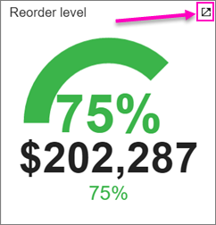

# Drillthrough zu anderen mobilen Berichten oder URLs aus einem mobilen Bericht hinzufügen
Sie können aus jedem Messgerät, jedem Diagramm oder jedem Datenraster in einem mobilen [!INCLUDE[ssRSnoversion_md](../../includes/ssrsnoversion-md.md)]-Bericht Drillthrough zu einem anderen mobilen Bericht oder einer benutzerdefinierten URL hinzufügen. 

Ein *Drillthrough*  ist eine Verknüpfung von einem Quellbericht, der einen anderen Zielbericht oder eine URL öffnet. Der Drillthrough-Zielbericht enthält oft Details zu einigen Elementen im Zusammenfassungsbericht. Abhängig vom mobilen Quellbericht können ein oder mehrere Parameter an den mobilen Zielbericht übergeben oder in eine benutzerdefinierte URL integriert werden.  
  
Wenn Sie den mobilen Quellbericht im [!INCLUDE[ssRSnoversion_md](../../includes/ssrsnoversion-md.md)] -Webportal anzeigen und ein Element mit einem Ziel-Drillthrough auswählen, gelangen Sie zu diesem Ziel, entweder einem anderen mobilen Bericht oder einer URL.  

Berichtselemente mit Drillthrough, entweder zu einer URL oder einem anderen mobilen Bericht, sind  in der rechten oberen Ecke mit dem Drillthrough-Symbol gekennzeichnet.

 

>**Tipp**: Erstellen Sie den Zielbericht, und speichern Sie ihn zunächst in einem [!INCLUDE[ssRSnoversion_md](../../includes/ssrsnoversion-md.md)] -Webportal. Wenn Sie Parameter aus dem Quellbericht übergeben möchten, fügen Sie die Parameter auch dem Zielbericht hinzu. Anschließend können Sie Drillthrough vom Quellbericht an den Zielbericht einrichten. [Hinzufügen von Parametern zu einem mobilen Bericht](../../reporting-services/mobile-reports/add-parameters-to-a-mobile-report-reporting-services.md).
 
## Einrichten von Drillthrough für einen mobilen Bericht  

1. Wählen Sie in der Layoutansicht in [!INCLUDE[SS_MobileReptPub_Long](../../includes/ss-mobilereptpub-long.md)]eine Visualisierung aus, die Drillthrough unterstützt.   

   Karten und Messgeräte unterstützen Drillthrough, ebenso wie die meisten Diagramme und einfachen Datenraster.
   
2. Wählen Sie im Bereich **Eigenschaften visueller Elemente** **Ziel für Drillthrough** > **Mobiler Bericht**aus.  
3. Wählen Sie den Server und den mobilen Zielbericht aus.  

   >Hinweis: Wenn sich der mobile Zielbericht nicht auf dem gleichen Server wie der mobile Quellbericht befindet, stellen Sie stattdessen mit einer benutzerdefinierten URL eine Verbindung mit ihm her, wie im nächsten Abschnitt erläutert.  
 
4. Nachdem Sie einen Zielbericht ausgewählt haben, sehen Sie dessen verfügbare Eingabeparameter, einschließlich der Eigenschaften, die an Navigatorsteuerungen und Parameter gebunden werden können, die auf Datasets des mobilen Zielberichts konfiguriert sind.  

   
   
   *Drillthrough-Eigenschaften für den mobilen Zielbericht*  
  
5. Wählen Sie den Pfeil rechts neben jeder Eigenschaft aus, um eine Verbindung zwischen Eigenschaften mit übereinstimmenden Datentypen mit verfügbaren Ausgabeeigenschaften im mobilen Quellbericht herzustellen. Sie können hier auch Standardwerte für jede Ausgabe festlegen, für den Fall, dass der Benutzer des Berichts vor dem Drillthrough zum mobilen Zielbericht noch nicht mit dem mobilen Quellbericht interagiert hat.  
  
## Einrichten eines Drillthrough zu einer benutzerdefinierten URL  
  
1. Wählen Sie in der Layoutansicht in [!INCLUDE[SS_MobileReptPub_Long](../../includes/ss-mobilereptpub-long.md)]eine Visualisierung aus, die Drillthrough-Ziele unterstützt.    
2. Wählen Sie im Bereich **Eigenschaften visueller Elemente** **Ziel für Drillthrough** > **Benutzerdefinierte URL**aus.  Dadurch öffnet sich das Dialogfeld „Drillthrough-Konfiguration“.  
  
3. Geben Sie unter **Drillthrough-URL festlegen**die Ziel-URL ein, die aufgerufen werden soll, wenn Sie auf die Visualisierung klicken, und wählen Sie aus den rechts aufgelisteten **verfügbaren Parametern** aus. Im unteren Bereich wird eine Vorschau der benutzerdefinierten URL in Kombination mit aufgelösten Beispielparametern (falls eingeschlossen) angezeigt.  
  
   
  
   *Drillthrough zu benutzerdefinierten URL-Eigenschaften*  
  
4. Klicken Sie auf **Anwenden**.  

  
Wenn Sie in [!INCLUDE[SS_MobileReptPub_Short](../../includes/ss-mobilereptpub-short.md)]die Vorschau für einen mobilen Bericht anzeigen lassen, wird beim Klicken auf eine Visualisierung mit Drillthrough eine Meldung angezeigt, dass Drillthrough deaktiviert ist. Sie können einen Drillthrough zum Ziel tatsächlich nur ausführen, nachdem Sie einen mobilen Bericht gespeichert oder veröffentlicht haben und ihn anschließend anzeigen, nicht vom Layout- oder Vorschaumodus von [!INCLUDE[SS_MobileReptPub_Short](../../includes/ss-mobilereptpub-short.md)] aus.  

## Ausblenden eines mobilen Zielberichts im Webportal
Wenn Sie nicht vorhaben, einen Standardwert für den Zielbericht festzulegen, sollten Sie ihn im Webportal ausblenden. Andernfalls wird der Bericht leer sein, wenn jemand versucht, ihn direkt, also nicht über den Quellbericht, im Webportal anzuzeigen.

1. Wählen Sie im Webportal die Auslassungspunkte (...) auf dem Zielbericht aus, den Sie ausblenden möchten, und wählen Sie anschließend „Verwalten“ aus.

2. Wählen Sie unter **Eigenschaften** **In Neben-/Untereinanderansicht ausblenden**aus.

Sie können auswählen, dass ausgeblendete Elemente im Webportal angezeigt werden: 

* Wählen Sie in der rechten oberen Ecke des Webportals **Anzeigen** > **Ausgeblendete anzeigen**aus. 

Ausgeblendete Elemente werden in einer helleren Farbe angezeigt.
    
### Siehe auch  
 
* [Hinzufügen von Parametern zu einem mobilen Bericht | Reporting Services](../../reporting-services/mobile-reports/add-parameters-to-a-mobile-report-reporting-services.md)
* [Erstellen und Veröffentlichen von mobilen Berichten mit dem Publisher für mobile Berichte von SQL Server](../../reporting-services/mobile-reports/create-mobile-reports-with-sql-server-mobile-report-publisher.md) 
* [Webportal (einheitlicher SSRS-Modus)](../../reporting-services/web-portal-ssrs-native-mode.md)

