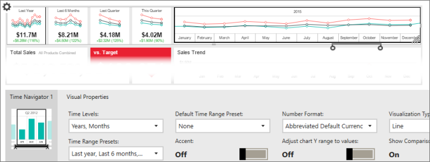
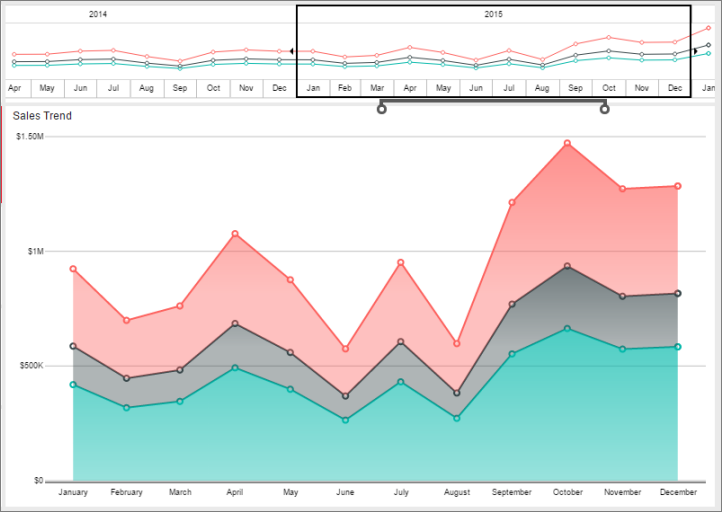
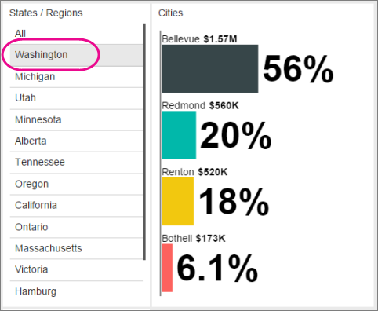
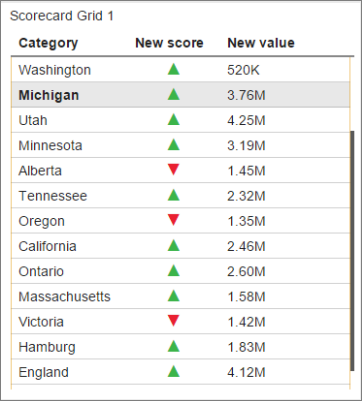

# Hinzuf&#252;gen von Navigationen zu mobilen Reporting Services-Berichten
In [!INCLUDE[SS_MobileReptPub_Long](../../includes/ss-mobilereptpub-long.md)] fügen Sie *Navigationen* hinzu, um die Daten in Visualisierungen nach Zeit oder nach Auswahl zu filtern. 

Die Navigationen ähneln Slicern in Power BI und Excel-PivotTables, haben aber auch einige eindeutige Merkmale.

**Zeitbasierte Navigationen** filtern Tabellen, indem sie Zeilen nach dem gewünschten Zeitraum auswählen. 

**Auswahlbasierte Navigationen** filtern Tabellen, indem sie Zeilen auswählen, in denen ein bestimmter Spaltenwert mit dem gewählten Schlüsselwert übereinstimmt. Im Fall von Strukturansichten wählen sie Zeilen aus, in denen ein bestimmter Spaltenwert zur Teilstruktur des gewählten Schlüsselwerts gehört. Es gibt zwei Arten von Auswahlnavigationen:
* Auswahllisten sind Tabellen mit einer Spalte, die Sie ähnlich wie Slicer in Power BI und Excel zum Filtern Ihres mobilen Berichts verwenden können.
* Scorecardraster filtern den mobilen Bericht ebenfalls. 
  
## Zeitnavigationen   
  
Wie der Name schon sagt, wird der Zeitnavigationsfilter verwendet, um einen Datenbereich in einem bestimmten Zeitraum auszuwählen.   
  
  
*Die vier Liniendiagramme auf der linken Seite werden in „Voreingestellte Zeitbereiche“ festgelegt. Das Liniendiagramm auf der rechten Seite ist der Filter.*  
  
Beim Anzeigen des Berichts in der Vorschau oder im [!INCLUDE[ssRSnoversion_md](../../includes/ssrsnoversion-md.md)]-Webportal ziehen Sie die Pfeile in der Zeitnavigation, um den Rest des Berichts zu filtern.  
  
  
  
Standardmäßig filtert die Zeitnavigation alle visuellen Elemente im Bericht, die mit zeitbasierten Daten verbunden sind. Wenn eine Tabelle mehr als eine zeitbasierte Spalte enthält, wird nur die erste zum Filtern verwendet. Die Serientabelle erzeugt die eingebettete Visualisierung und bestimmt den gesamten Zeitraum des mobilen Berichts.  
  
Sie können eine Visualisierung von der Zeitnavigation trennen.   
1. Wählen Sie diese Visualisierung und dann die Registerkarte **Daten** aus.  
2. Wählen Sie **Optionen** in **Dateneigenschaften** aus.  
3. Deaktivieren Sie das Kontrollkästchen **Gefiltert nach**.  
  
     
  
## Auswahllisten   
  
Die Auswahlliste filtert Daten in einem mobilen Bericht, indem sie den in der Liste ausgewählten Werte mit dem Wert einer angegebenen Spalte für jede Zeile einer gefilterten Tabelle vergleicht. 

1. Ziehen Sie die **Auswahlliste** von der Registerkarte **Layout** auf die Entwurfsoberfläche, und ändern Sie die Größe wie gewünscht.

2. Wählen Sie die Registerkarte **Daten** und im Bereich **Dateneigenschaften** unter **Schlüssel** die Tabelle und die Spalte aus, die den Filter darstellt. 

3. Wählen Sie unter **Beschriftungen** die Spalte mit der Beschriftung, die angezeigt wird. Die Schlüsselspalte und die Bezeichnungsspalte können identisch sein.  
  
   Wählen Sie im Fall von Strukturansichtsdaten eine übergeordnete Schlüsselspalte aus.  
  
4. Nachdem Sie die Dateneigenschaften unter **Nach Auswahlliste gefilterte Tabellen** festgelegt haben, wählen Sie die zu filternden Tabellen und die Spalte, nach der gefiltert werden soll. Diese Spalte muss Werte in der Schlüsselspalte der Auswahlliste abgleichen. 

Für jede Visualisierung im mobilen Bericht, die von der Auswahlliste gefiltert werden soll, gilt Folgendes:

1. Wählen Sie die Visualisierung, dann die Registerkarte **Daten** und anschließend im Bereich **Dateneigenschaften** neben dem Feldnamen **Optionen** aus.

   

2. Wählen Sie unter **Gefiltert nach** die Auswahlliste aus.

Wenn Sie den mobilen Bericht in der Vorschau oder im [!INCLUDE[ssRSnoversion_md](../../includes/ssrsnoversion-md.md)]-Webportal anzeigen und einen Wert in der Auswahlliste auswählen, werden die anderen Visualisierungen im mobilen Bericht gefiltert.

 
     
## Scorecardraster  
  
Der Scorecardrasterfilter funktioniert sehr ähnlich wie der Auswahllistenfilter, zeigt aber auch Wertspalten und Bewertungsindikatoren an, die den Indikatoren in einem Indikatordatenraster entsprechen. Nach Auswahl des Schlüssels, der Beschriftung und optionaler übergeordneter Schlüsselspalten müssen Sie eine Eingabetabelle und -spalte auswählen, um der Scorecard Daten zur Verfügung zu stellen. Die Scorecarddatenspalte sollte über die Schlüsselspalte gefiltert werden können.  

1. Ziehen Sie das **Scorecardraster** von der Registerkarte **Layout** auf die Entwurfsoberfläche, und ändern Sie die Größe wie gewünscht.

2. Wählen Sie die Registerkarte **Daten** und im Bereich **Dateneigenschaften** unter **Schlüssel** die Tabelle und die Spalte aus, die den Filter darstellt. 

3. Wählen Sie unter **Beschriftungen** die Spalte mit der Beschriftung, die angezeigt wird. Die Schlüsselspalte und die Bezeichnungsspalte können identisch sein.  
  
4. Um einen Wertungsindikator hinzuzufügen, klicken Sie im Bereich **Datenspalten** auf **Wertung hinzufügen**.   
  
5. Benennen Sie den Wertungsindikator, und wählen Sie **Optionen** aus, um dieselben Eigenschaften festzulegen, die Sie für einen Indikator im Datenraster festlegen würden:  
  
   * Messgerättyp
   * Wertfeld
   * Vergleichsfeld
   * Wertrichtung
  
6. Um einen Wertindikator hinzuzufügen, klicken Sie im Bereich **Datenspalten** auf **Wert hinzufügen**.

7. Benennen Sie den Wertindikator, und wählen Sie anschließend die Tabellenquellspalte und die Formatierung aus.  

   

8. Nachdem Sie die Dateneigenschaften unter **Nach Auswahlliste gefilterte Tabellen** festgelegt haben, wählen Sie die zu filternden Tabellen und die Spalte, nach der gefiltert werden soll. Diese Spalte muss Werte in der Schlüsselspalte der Auswahlliste abgleichen. 

Wenn Sie den mobilen Bericht in der Vorschau oder im [!INCLUDE[ssRSnoversion_md](../../includes/ssrsnoversion-md.md)]-Webportal anzeigen und einen Wert im Scorecardraster auswählen, werden die anderen Visualisierungen im mobilen Bericht gefiltert.

    
## Festlegen der zu filternden Visualisierungen  
  
Katalogelemente können für die Verwendung von Filtern konfiguriert werden, indem Sie für eine bestimmte Eingabe in der Datenansicht auf die Schaltfläche „Options...“ (Optionen) klicken. Filter werden aktiviert, indem Sie im entsprechenden Kontrollkästchen ein Häkchen setzen.  

Sie können die Visualisierungen im mobilen Bericht bestimmen, die von einer Navigation gefiltert werden:

1. Wählen Sie die Visualisierung, dann die Registerkarte **Daten** und anschließend im Bereich **Dateneigenschaften** neben dem Feldnamen **Optionen** aus.

   

2. Wählen Sie unter **Gefiltert nach** die Navigation aus. Jede Visualisierung kann anhand mehrerer Navigationen gefiltert werden.
  
## Kaskadierende Filter   
  
Filter können auch kaskadiert werden, sodass der ausgewählte Wert eines Filters die verfügbaren Werte eines zweiten Filters filtert. Wenden Sie die Filter so auf die Schlüsselspalte an, wie Sie mit einem normalen Katalogelement verfahren würden, um Filter zu kaskadieren.  

### Siehe auch 
  
* [Karten in mobilen Reporting Services-Berichten](../../reporting-services/mobile-reports/maps-in-reporting-services-mobile-reports.md)
* [Visualisierungen in mobilen Reporting Services-Berichten](../../reporting-services/mobile-reports/add-visualizations-to-reporting-services-mobile-reports.md)
* [Messgeräte in mobilen Reporting Services-Berichten](../../reporting-services/mobile-reports/add-gauges-to-mobile-reports-reporting-services.md)
* [Datenraster in mobilen Reporting Services-Berichten](../../reporting-services/mobile-reports/add-data-grids-to-mobile-reports-reporting-services.md)  
