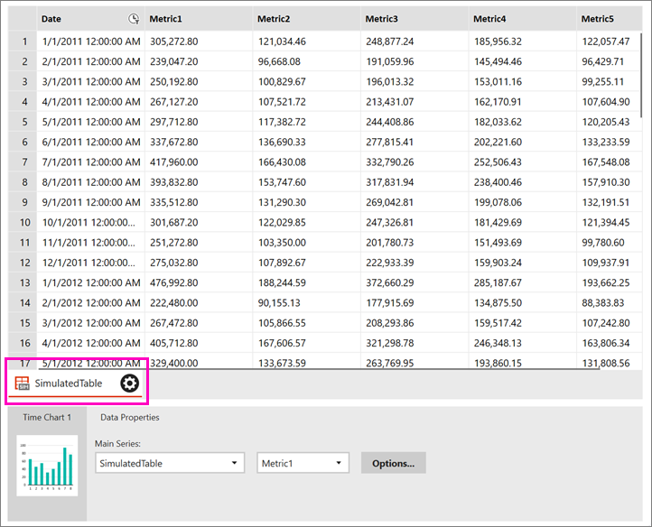
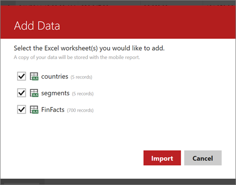
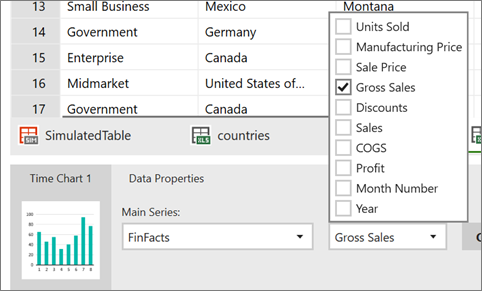
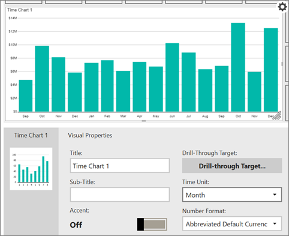

# Erstellen eines mobilen Berichts in Reporting Services
Mit SQL Server Mobile Report Publisher können Sie schnell mobile Berichte von SQL Server 2016 Reporting Services erstellen, die problemlos an jede Bildschirmgröße, auf eine Entwurfsoberfläche mit anpassbaren Rasterzeilen und Spalten und flexiblen Elementen skaliert werden.  
  
Beim ersten eines mobilen Berichts erstellen können Sie SQL Server Mobile Report Publisher auf dem lokalen Computer über das Reporting Services-Webportal installieren. Die Installation kann auch über das [Microsoft Download Center](http://go.microsoft.com/fwlink/?LinkID=733527)erfolgen. Danach können Sie das Tool entweder aus dem Webportal oder lokal starten.   
    
1. Wählen Sie in der oberen Leiste des Webportals Reporting Services, **neu** > **mobiler Bericht**.  
  
     
     
2. Auf der **Layout** Registerkarte im Publisher für Mobile Berichte, wählen Sie einen Navigator, Messgerät, Diagramm, Zuordnung oder Datagrid aus, und ziehen Sie es in den Entwurfsbereich.  
  
3. Klicken Sie auf die untere rechte Ecke des Elements und halten Sie sie gedrückt, um die Größe wie gewünscht anzupassen.  
  
     
  
   Dies ist der **Master** -Entwurfsbereich, in dem Sie die Elemente für Ihren Bericht erstellen können. Später können Sie das [Layout für ein Tablet oder Telefon optimieren](../../reporting-services/mobile-reports/lay-out-a-reporting-services-mobile-report-for-phone-or-tablet.md).     
     
   Beachten Sie in **Visuelle Eigenschaften** unterhalb des Entwurfsbereichs die verschiedenen Eigenschaften, die Sie festlegen können.  
     
4. Wählen Sie die Registerkarte **Daten** in der linken oberen Ecke aus. Dort werden Sie sehen, dass das Diagramm die ihm zugeordneten Daten bereits simuliert hat.   
  
     
  
5. Wählen Sie **Daten hinzufügen** in der oberen rechten Ecke aus.  
  
6. Wählen Sie **Lokales Excel** oder **Berichtsserver**aus.  
  
   >**Tipps**: Wenn Sie Daten aus Excel hinzufügen, stellen Sie sicher, dass:  
    >* Sie [die Excel-Daten vorbereiten](../../reporting-services/mobile-reports/prepare-excel-data-for-reporting-services-mobile-reports.md) , damit diese in Ihrem mobilen Bericht funktionieren.  
    >* Sie die Datei zuerst schließen.  
7. Wählen Sie die gewünschten Arbeitsblätter und anschließend **Importieren**aus.   
   Sie können mehr als ein Arbeitsblatt aus einer Arbeitsmappe gleichzeitig hinzufügen.  
    
       
  
8. Wählen Sie auf der Registerkarte **Daten** in dem Kästchen **Dateneigenschaften** die Tabelle und das Feld aus, die für das Diagramm verwendet werden sollen.  
  
     
  
9. Im Kästchen **Visuelle Eigenschaften** in der Registerkarte **Layout** können Sie Eigenschaften wie **Titel**, **Zeiteinheit**und **Zahlenformat**festlegen.  
  
     
    
10. Wählen Sie **Vorschau** in der oberen linken Ecke aus, um anzuzeigen, wie sich Ihr Bericht entwickelt.  
  
11. Nun sollten Sie Ihren Bericht speichern. Wählen Sie oben links das Symbol aus, und klicken Sie anschließend auf **Lokal speichern** oder **Auf Server speichern**.  
  
   Um es zu einem Server zu speichern, benötigen Sie Zugriff auf eine SQL Server 2016 Reporting Services-Berichtsserver.  
     
   ### Siehe auch  
     
-   [Create and publish mobile reports with SQL Server Mobile Report Publisher (Erstellen und Veröffentlichen von mobilen Berichten mit dem Publisher für mobile Berichte von SQL Server)](../../reporting-services/mobile-reports/create-mobile-reports-with-sql-server-mobile-report-publisher.md)  
-   [Gestalten eines mobilen Reporting Services-Berichts für Telefone oder Tablets](../../reporting-services/mobile-reports/lay-out-a-reporting-services-mobile-report-for-phone-or-tablet.md)  
  
   

