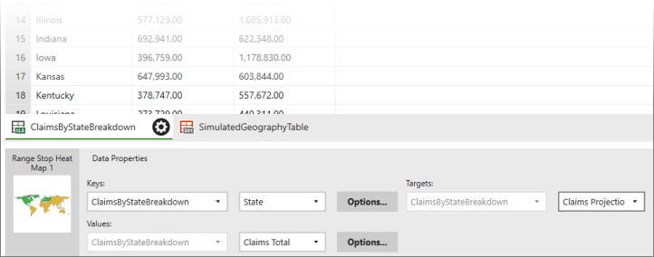

# Karten in mobilen Reporting Services-Berichten
Karten sind eine hervorragende Möglichkeit, geografische Daten visuell darzustellen. [!INCLUDE[SS_MobileReptPub_Long](../../includes/ss-mobilereptpub-long.md)] bietet drei verschiedene Typen von Kartenvisualisierungen sowie integrierte Karten für Kontinente und eine Reihe von einzelnen Ländern. Sie können auch [benutzerdefinierte Karten hochladen und verwenden](../../reporting-services/mobile-reports/custom-maps-in-reporting-services-mobile-reports.md).   
  
## Kartentypen  
  
Mobile SQL Server-Berichte bieten drei verschiedene Typen von Karten, die sich für unterschiedliche Situationen eignen.  
  
  
  
**Wärmebilder mit Verlauf** Das Feld in der Eigenschaft „Werte“ wird als Schattierungen einer einzelnen Farbe angezeigt, die jede Region in einer Karte ausfüllt. Im Feld **Wertrichtung** können Sie festlegen, ob die höheren oder die niedrigeren Werte dunkler sind.  
  
**Blasendiagrammkarte** Die Eigenschaft „Werte“ bestimmt den Radius der Blasenvisualisierung, die über den zugeordneten Bereich angezeigt wird. Sie können festlegen, ob alle Blasen die gleiche oder unterschiedliche Farben aufweisen.   
  
**Wärmebild mit Bereichsabgrenzung** zeigt einen Wert in Relation zu einem Ziel. Die Eigenschaft **Ziele** bestimmt das Delta zwischen einem Vergleichsfeld und dem Wertefeld. Das resultierende Delta bestimmt die Farbe, die die jeweilige Region der Karte ausfüllt: von Grün über Gelb zu Rot. Im Feld **Wertrichtung** können Sie festlegen, ob die höheren oder die niedrigeren Werte grün sind.  
  
## Auswählen des Kartentyps und der Region  
  
1. Wählen Sie auf der Registerkarte **Layout** einen Kartentyp aus, ziehen Sie ihn auf die Entwurfsoberfläche, und stellen Sie ihn auf die gewünschte Größe ein.  
  
2. Wählen Sie in der Ansicht **Layout** im Bereich **Eigenschaften visueller Elemente** unter **Karte** die gewünschte Kartenregion aus.  
  
     
  
3. Stellen Sie für Wärmebilder mit Verlauf oder mit Bereichsabgrenzung im Feld **Wertrichtung** unter **Eigenschaften visueller Elemente**ein, ob höhere oder niedrigere Werte besser sind.  
  
7. Legen Sie für Blasendiagrammkarten unter **Eigenschaften visueller Elemente** die Option **Verschiedene Farben verwenden** auf **Ein** oder **Aus** fest, damit die Blasen alle die gleiche oder unterschiedliche Farben aufweisen.  
  
## Auswählen der Kartendaten  
Wenn Sie eine Karte erstmals einem Bericht hinzufügen, wird sie von [!INCLUDE[SS_MobileReptPub_Short](../../includes/ss-mobilereptpub-short.md)] mit simulierten geografischen Daten aufgefüllt.  
  
  
  
Um echte Daten in Ihrer Karte anzuzeigen, müssen Sie Werte für mindestens zwei der Dateneigenschaften der Karte festlegen:   
* Die Eigenschaft **Schlüssel** verbindet die Daten mit bestimmten Kartenregionen: z. B. Staaten in den USA oder Länder in Afrika.  
* Die Eigenschaft **Werte** ist ein numerisches Feld in der gleichen Tabelle wie das ausgewählte Schlüsselfeld. Diese Werte werden in unterschiedlichen Karten unterschiedlich dargestellt. Die **Verlaufskarte** verwendet diese Werte, um den einzelnen Regionen anhand des Wertebereichs unterschiedliche Farbschattierungen zuzuweisen. Bei der **Blasendiagrammkarte** beruht die Größe einer Blasenvisualisierung über jede Region auf der Werteigenschaft.   
* Bei Wärmebildern mit Bereichsabgrenzung müssen Sie auch die Eigenschaft **Ziele** festlegen.  
  
### Festlegen der Eigenschaften von Kartendaten  
  
1. Wählen Sie in der linken oberen Ecke die Registerkarte **Daten** aus.  
  
2. Wählen Sie **Daten hinzufügen**und anschließend entweder **Lokale Excel-Datei** oder **SSRS-Server**aus.  
  
   > **Tipp**: Stellen Sie sicher, dass die [Daten in einem Format vorliegen, das in mobilen Berichten eingesetzt werden kann](../../reporting-services/mobile-reports/prepare-data-for-reporting-services-mobile-reports.md).  
  
3. Wählen Sie die gewünschten Arbeitsblätter aus, und wählen Sie **Importieren**.  
   Ihre Daten werden im [!INCLUDE[SS_MobileReptPub_Short](../../includes/ss-mobilereptpub-short.md)]angezeigt.  
  
4. Wählen Sie in dieser Ansicht **Daten** im Bereich **Dateneigenschaften** unter **Schlüssel** im linken Feld die Tabelle mit den Kartendaten und im rechten Feld das Schlüsselfeld aus, das den Regionen in Ihrer Karte entspricht.  
  
5. Unter **Werte** befindet sich dieselbe Tabelle bereits im linken Feld. Wählen Sie das numerische Feld, dessen Werte auf der Karte angezeigt werden sollen.   
  
6. Wenn es sich um ein Wärmebild mit Verlauf handelt, befindet sich dieselbe Tabelle unter dem Feld **Ziele** im linken Feld. Wählen Sie im Feld auf der rechten Seite das numerische Feld aus, dessen Werte als Ziel dienen sollen.   
  
     
  
7. Wählen Sie in der oberen linken Ecke die Option **Vorschau** .  
  
     
     
8. Wählen Sie in der oberen linken Ecke das Symbol **Speichern** und dann entweder **Lokal speichern** zum Speichern auf Ihrem Computer oder **Auf Server speichern**.  
  
### Siehe auch  
-  [Benutzerdefinierte Karten in mobilen Reporting Services-Berichten](../../reporting-services/mobile-reports/custom-maps-in-reporting-services-mobile-reports.md)  
- [Create and publish mobile reports with SQL Server Mobile Report Publisher (Erstellen und Veröffentlichen von mobilen Berichten mit dem Publisher für mobile Berichte von SQL Server)](../../reporting-services/mobile-reports/create-mobile-reports-with-sql-server-mobile-report-publisher.md)  
  
  

