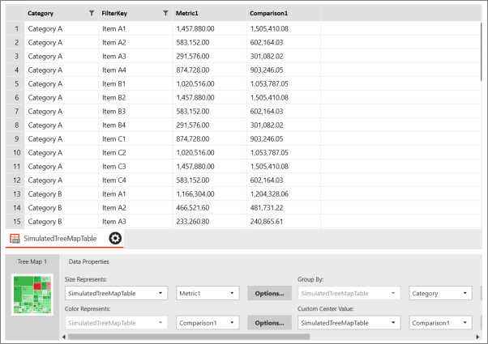

# Arbeiten mit simulierten Daten in mobilen Reporting Services-Berichten
Wenn Sie ein Katalogelement auf der Entwurfsoberfläche platzieren, generiert [!INCLUDE[PRODUCT_NAME](../../includes/ss-mobilereptpub-short.md)] sofort simulierte Daten für dieses Element. Diese Daten erfüllen zahlreiche nützliche Funktionen beim Erstellen von mobilen Berichten.   
  
  
  
Simulierte Daten sind hilfreich, wenn Sie beim Erstellen von mobilen Berichten einen entwurfsbasierten Ansatz verfolgen. Das Auffüllen der Elemente mit simulierten Daten am Anfang ermöglicht es Ihnen, schnell Prototypen für mobile Berichte zu erstellen, ohne dass Sie sich mit spezifischen Datenanforderungen auseinandersetzen müssen. Diese mobilen Berichte können dann in Hinsicht auf Gesamtästhetik und -effektivität bewertet werden.  
  
## Erstellen einer Excel-Datei mit simulierten Daten als Vorlage  
  
Simulierte Daten bietet auch eine Vorlage, die genau die Datenanforderungen eines bestimmten Entwurfs für mobile Berichte darstellt.   
  
-  Klicken Sie auf **Alle Daten exportieren** in der oberen rechten Ecke der Datensicht.   
  
[!INCLUDE[PRODUCT_NAME](../../includes/ss-mobilereptpub-short.md)] generiert ein Excel-Dokument, das die simulierten Daten enthält. Dies ermöglicht ein schnelles Ersetzen mit echten Daten, da es bereit für den Import ist.   
  
## So verhalten sich simulierte Daten  
  
Die generierten simulierten Daten werden speziell für den mobilen Bericht angepasst, den Sie erstellen. Wenn Sie weitere Elemente auf der Entwurfsoberfläche platzieren, wächst die zugeordnete Menge an simulierten Daten und wird so angepasst, dass auch ohne echte Daten ein möglichst realitätsgetreues Erlebnis bereitgestellt wird. Mit dieser Weiterentwicklung wird sichergestellt, dass zusätzliche Felder und Filtermöglichkeiten verfügbar sind, falls Sie zusätzliche Datenreihen für Diagrammvisualisierungen hinzufügen oder den Umfang eines oder mehrere mobiler Berichtselemente anderweitig erweitern.  
  
Wie bereits erwähnt, können Sie simulierte Daten in eine Excel-Datei exportieren; dadurch wird eine perfekte Datenvorlage für den entsprechenden mobilen Bericht erstellt. Sie können die simulierten durch ihre echten Daten in der Excel-Datei ersetzen und diese anschließend wieder in [!INCLUDE[PRODUCT_NAME](../../includes/ss-mobilereptpub-short.md)]importieren.   
  
Nachdem alle Steuerelemente an echte Daten gebunden sind, werden nicht mehr verwendete simulierte Tabellen automatisch aus dem mobilen Bericht entfernt. Sie können keine simulierten Tabellen entfernen, auf die Elemente in der Entwurfsoberfläche noch verweisen.  
  
>**Hinweis**: Die simulierten Daten erhöhen nicht den Gesamtspeicherbedarf des mobilen Berichts, da sie nicht mit dem mobilen Bericht serialisiert werden, sondern während der Laufzeit dynamisch erstellt werden.  
  
### Siehe auch  
- [Create and publish mobile reports with SQL Server Mobile Report Publisher (Erstellen und Veröffentlichen von mobilen Berichten mit dem Publisher für mobile Berichte von SQL Server)](../../reporting-services/mobile-reports/create-mobile-reports-with-sql-server-mobile-report-publisher.md)  
-  Anzeigen von [mobilen SQL Server-Berichten und KPIs in der iPad-App](https://pbiwebprod-docs.azurewebsites.net/en-us/documentation/powerbi-mobile-ipad-kpis-mobile-reports)  (Power BI für iOS)  
-  Anzeigen von [mobilen SQL Server-Berichten und KPIs in der iPhone-App](https://pbiwebprod-docs.azurewebsites.net/en-us/documentation/powerbi-mobile-iphone-kpis-mobile-reports) (Power BI für iOS)  
  
  
  
  
  

