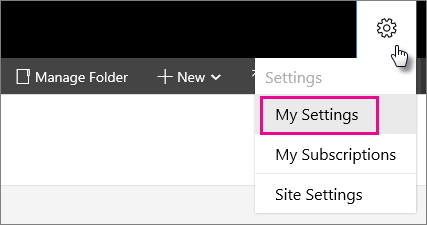
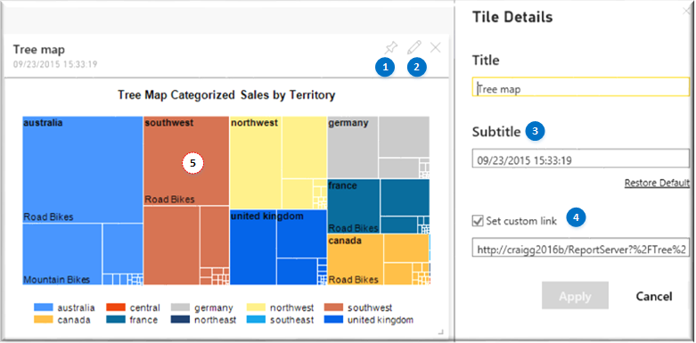

# Anheften von Reporting Services-Elementen an Power BI-Dashboards
  [!INCLUDE[ssRSCurrent](../includes/ssrscurrent-md.md)] ermöglicht es Benutzern, [!INCLUDE[ssRSnoversion](../includes/ssrsnoversion-md.md)] -Berichtselemente aus der Berichts-Viewer-Symbolleiste als neue Kachel an ein [!INCLUDE[sspowerbi](../includes/sspowerbi-md.md)] -Dashboard anzuheften.   Zum Anheften muss der Administrator den Berichtsserver zuerst in Azure Active Directory und [!INCLUDE[sspowerbi](../includes/sspowerbi-md.md)]integrieren.  
  
   
  
 [!INCLUDE[applies](../includes/applies-md.md)] [!INCLUDE[ssRSnoversion](../includes/ssrsnoversion-md.md)] im einheitlichen Modus
  
##   Anforderungen für das Anheften  
  
-   Der Berichtsserver muss für die [!INCLUDE[sspowerbi](../includes/sspowerbi-md.md)] -Integration konfiguriert sein. Weitere Informationen finden Sie unter [Berichtsserverintegration für Power BI &#40;Configuration Manager&#41;](../reporting-services/install-windows/power-bi-report-server-integration-configuration-manager.md)integrieren. Wenn der Berichtsserver nicht entsprechend konfiguriert wurde, wird die Schaltfläche **An Power BI-Dashboard anheften** in der Symbolleiste nicht angezeigt.  
  
       
  
-   Heften Sie Sie aus der [!INCLUDE[ssRSnoversion](../includes/ssrsnoversion-md.md)] Berichts-Viewer in t[!INCLUDE[ssRSWebPortal](../includes/ssrswebportal.md)]er z. B. `http://myserver/Reports`.  Das Anheften ist weder aus [!INCLUDE[ssRBnoversion](../includes/ssrbnoversion-md.md)]noch aus dem Berichts-Designer in [!INCLUDE[ssBIDevStudioFull](../includes/ssbidevstudiofull-md.md)]oder aus einer Berichtsserver-URL möglich,  Z. B. `http://myserver/ReportServer`.  
  
-   Ihr Browser muss Popups von der Berichtsserversite zulassen.  
  
-   Berichte müssen für gespeicherte Anmeldeinformationen konfiguriert sein, um ein Aktualisieren des angehefteten Elements zu ermöglichen.  Wenn Sie ein Element anheften, wird automatisch ein [!INCLUDE[ssRSnoversion](../includes/ssrsnoversion-md.md)] -Abonnement erstellt, um die Datenaktualisierung des Elements im Dashboard zu verwalten.  Wenn der Bericht keine gespeicherten Anmeldeinformationen verwendet, wird beim Ausführen des Abonnements auf der Seite **Meine Abonnements** eine Fehlermeldung mit etwa folgendem Wortlaut angezeigt.  
  
        PowerBI Delivery error: dashboard: IT Spend Analysis Sample, visual: Chart2, error: The current action cannot be completed. The user data source credentials do not meet the requirements to run this report or shared dataset. Either the user data source credential.
 
    Weitere Informationen finden Sie im Abschnitt „Konfigurieren von gespeicherten Anmeldeinformationen für eine berichtsspezifische Datenquelle (einheitlicher Modus)“ unter [Speichern von Anmeldeinformationen in einer Reporting Services-Datenquelle](../reporting-services/report-data/store-credentials-in-a-reporting-services-data-source.md)  
  
##   Elemente, die angeheftet werden können  
 Die folgenden Berichtselemente können an ein [!INCLUDE[sspowerbi](../includes/sspowerbi-md.md)] -Dashboard angeheftet werden.  Sie können keine Elemente anheften, die in einen Datenbereich geschachtelt sind. Sie können z.B. kein Element anheften, das in eine [!INCLUDE[ssRSnoversion](../includes/ssrsnoversion-md.md)] -Tabelle oder -Liste geschachtelt ist.  
  
-   Diagramme  
  
-   Messgerätbereiche  
  
-   Karten  
  
-   Bilder  
  
-   Elemente müssen sich im Hauptteil des Berichts befinden.  Sie können keine Elemente aus dem Seitenkopf oder Seitenfuß anheften.  
  
-   Sie können einzelne Elemente anheften, die sich in einem Rechteck der obersten Ebene befinden, aber Sie können sie nicht als eine Gruppe anheften.  
  
##   So heften Sie ein Berichtselement an  
  
1. Stellen Sie sicher, dass Sie bei [!INCLUDE[sspowerbi](../includes/sspowerbi-md.md)]angemeldet sind. Wählen Sie im [!INCLUDE[ssRSnoversion](../includes/ssrsnoversion-md.md)] [!INCLUDE[ssRSWebPortal](../includes/ssrswebportal.md)], select the menu item **My Settings** and sign in. Weitere Informationen finden Sie unter  [Meine Einstellungen für die Power BI-Integration &#40;Webportal&#41;](http://msdn.microsoft.com/en-us/85c2fac7-80bf-45b7-8654-764b5f5231f5) .

      
  
2. Navigieren Sie zum [!INCLUDE[ssRSWebPortal](../includes/ssrswebportal.md)] -Ordner mit Ihrem Bericht und zeigen Sie den Bericht an.  
  
3. Wählen Sie beim Anzeigen des Berichts in der Symbolleiste die Schaltfläche **An Power BI anheften** aus.  Wenn Sie nicht bereits angemeldet sind, werden Sie aufgefordert, sich anzumelden.  Wenn die Schaltfläche [!INCLUDE[sspowerbi](../includes/sspowerbi-md.md)] nicht angezeigt wird, ist der Berichtsserver nicht in [!INCLUDE[sspowerbi](../includes/sspowerbi-md.md)]integriert. Weitere Informationen finden Sie unter [Berichtsserverintegration für Power BI &#40;Configuration Manager&#41;](../reporting-services/install-windows/power-bi-report-server-integration-configuration-manager.md)integrieren.  
  
      
  
4. Wählen Sie das Berichtselement aus, das Sie an [!INCLUDE[sspowerbi](../includes/sspowerbi-md.md)]anheften möchten. Sie können jeweils nur ein Element anheften.  Der Berichts-Viewer zeigt eine schattierte Sicht des Berichts an, und die Berichtselemente, die Sie anheften können, werden hervorgehoben. Die Elemente, die nicht angeheftet werden können, sind dunkel schattiert.  
  
    **(1)** Wählen Sie die Gruppe aus, die das Dashboard enthält, an das Sie das Element anheften möchten, **(2)** wählen Sie das Dashboard aus, an das Sie das Element anheften möchten, und **(3)** wählen Sie aus, wie oft die Kachel im Dashboard aktualisiert werden soll.    die Aktualisierung erfolgt durch [!INCLUDE[ssRSnoversion](../includes/ssrsnoversion-md.md)] Abonnements und nach dem anheften des Elements können Sie das Abonnement bearbeiten und einen anderen Aktualisierungszeitplan konfigurieren.  
  
      
  
5. Wählen Sie **Anheften**aus  
  
    Im Dialogfeld **Anheften erfolgreich** können Sie den Link **In Power BI anzeigen** auswählen, um zum Dashboard zu navigieren und das angeheftete Element anzuzeigen.  
  
6. Wählen Sie **Schließen** aus, um zur normalen Sicht des Berichts zurückzukehren.  
  
##   Im Dashboard

Nachdem das Berichtselement an das Dashboard angeheftet wurde, sieht die Kachel wie jede andere Dashboardkachel aus, und es ist nicht erkennbar, dass sie ursprünglich aus [!INCLUDE[ssRSnoversion](../includes/ssrsnoversion-md.md)]stammt. Die folgende Liste fasst zusammen, wie die Kacheleigenschaften aus dem Berichtselement aufgefüllt werden.  
  
Im [!INCLUDE[sspowerbi](../includes/sspowerbi-md.md)] -Dashboard verhält sich das angeheftete Berichtselement wie andere Kacheln:

**(1)** Sie können die Kachel an andere Dashboards anheften.

**(2)** Unter **Kacheldetails** erkennen Sie, dass der [!INCLUDE[ssRSnoversion](../includes/ssrsnoversion-md.md)] -Berichtstitel als Standardtitel der Kachel verwendet wird.

**(3)** Der Untertitel der Kachel basiert auf dem Zeitpunkt (Datum und Uhrzeit) des Anheftens der Kachel oder der letzten Aktualisierung der Daten aus [!INCLUDE[ssRSnoversion](../includes/ssrsnoversion-md.md)]. Der Aktualisierungszeitplan wird durch das [!INCLUDE[ssRSnoversion](../includes/ssrsnoversion-md.md)] -Abonnement verwaltet, das beim Anheften des Berichtselements automatisch erstellt wurde.

**(4)** Wenn Sie die Kachel auswählen, verwendet [!INCLUDE[sspowerbi](../includes/sspowerbi-md.md)] den **(3) benutzerdefinierten Link** , um zur [!INCLUDE[ssRSWebPortal](../includes/ssrswebportal.md)] -Seite des registrierten Berichtsservers zu navigieren. Der Link wurde während des Anheftens des Elements aus [!INCLUDE[ssRSnoversion](../includes/ssrsnoversion-md.md)]festgelegt. Wenn Sie keine Internetverbindung mit dem Berichtsserver haben, wird im Browser ein Fehler angezeigt.  

  
  
##   Problembehandlung  
  
-   **Keine [!INCLUDE[sspowerbi](../includes/sspowerbi-md.md)]-Schaltfläche auf der Symbolleiste des Berichts-Viewers:** Dies deutet darauf hin, dass der Berichtsserver nicht in [!INCLUDE[sspowerbi](../includes/sspowerbi-md.md)] integriert wurde. Weitere Informationen finden Sie unter [Berichtsserverintegration für Power BI &#40;Configuration Manager&#41;](../reporting-services/install-windows/power-bi-report-server-integration-configuration-manager.md).  
  
- **Anheften nicht möglich**: Wenn Sie versuchen, ein Element anzuheften, wird die folgende Fehlermeldung angezeigt: Siehe Abschnitt [Elemente, die angeheftet werden können](#bkmk_supported_items).  
  
      Cannot Pin: There are no report items on this page that you can pin to [!INCLUDE[sspowerbi](../includes/sspowerbi-md.md)].  
  
-   **Angeheftete Elemente zeigen veraltete Daten** in einem [!INCLUDE[sspowerbi](../includes/sspowerbi-md.md)] -Dashboard an, obwohl die Daten über einen bestimmten Zeitraum aktualisiert wurden.  Das Benutzertoken für Anmeldeinformationen ist abgelaufen, und Sie müssen sich erneut anmelden.  Die Registrierung der Benutzeranmeldeinformationen bei Azure und [!INCLUDE[sspowerbi](../includes/sspowerbi-md.md)] wird 90 Tage beibehalten. Klicken Sie im[!INCLUDE[ssRSWebPortal](../includes/ssrswebportal.md)]auf **Meine Einstellungen**. Weitere Informationen finden Sie unter [Meine Einstellungen für die Power BI-Integration &#40;Webportal&#41;](http://msdn.microsoft.com/en-us/85c2fac7-80bf-45b7-8654-764b5f5231f5)integrieren.  
  
-   **Angeheftete Elemente zeigen veraltete Daten** in einem [!INCLUDE[sspowerbi](../includes/sspowerbi-md.md)] -Dashboard an, und die Daten wurden noch nie aktualisiert.  Das Problem besteht darin, dass der Bericht nicht für die Verwendung gespeicherter Anmeldeinformationen konfiguriert ist. Ein Bericht muss gespeicherte Anmeldeinformationen verwenden, da beim Anheften eines Berichtselements ein [!INCLUDE[ssRSnoversion](../includes/ssrsnoversion-md.md)] -Abonnement zum Verwalten des Aktualisierungszeitplans der Kacheln erstellt wird. [!INCLUDE[ssRSnoversion](../includes/ssrsnoversion-md.md)] -Abonnements: Erfordern gespeicherte Anmeldeinformationen. Wenn Sie die Seite **Meine Abonnements** überprüfen, wird eine Fehlermeldung mit etwa folgendem Wortlaut angezeigt:  
  
        PowerBI Delivery error: dashboard: SSRS items, visual: Image3, error: The current action cannot be completed. The user data source credentials do not meet the requirements to run this report or shared dataset. Either the user data source credentials are not stored in the report server database, or the user data source is configured not to require credentials but the unattended execution account is not specified. (rsInvalidDataSourceCredentialSetting)
  
-   **Abgelaufene Power BI-Anmeldeinformationen:**  Beim Versuch, ein Element anzuheften, wird die folgende Fehlermeldung angezeigt. Klicken Sie im [!INCLUDE[ssRSWebPortal](../includes/ssrswebportal.md)]auf **Meine Einstellungen** und anschließend auf der Seite „Meine Einstellungen“ auf **Anmelden**. Weitere Informationen finden Sie unter  [Meine Einstellungen für die Power BI-Integration &#40;Webportal&#41;](http://msdn.microsoft.com/en-us/85c2fac7-80bf-45b7-8654-764b5f5231f5) .  
  
        Cannot Pin : Unexpected Server Error: Missing, invalid or expired Power BI credentials.  
  
-   **Anheften nicht möglich**: Wenn Sie versuchen, ein Element an ein Dashboard anzuheften, das sich in einem schreibgeschützten Zustand befindet, wird eine Fehlermeldung mit etwa folgendem Wortlaut angezeigt:  
  
        Server Error : The item 'Dashboard deleted 015cf022-8e2f-462e-88e5-75ab0a04c4d0' cannot be found. (rsItemNotFound)  
  
##   Abonnementverwaltung  
 Neben den im Abschnitt zur Problembehandlung beschriebenen abonnementbezogenen Problemen sind die folgenden Informationen bei der Verwaltung von [!INCLUDE[sspowerbi](../includes/sspowerbi-md.md)] -bezogenen Abonnements hilfreich.
  
-   **Elementname geändert:** Wird ein angeheftetes Berichtselement umbenannt oder gelöscht, wird die [!INCLUDE[sspowerbi](../includes/sspowerbi-md.md)] -Kachel nicht mehr aktualisiert, und es wird eine Fehlermeldung mit etwa folgendem Wortlaut angezeigt.  Wenn Sie das Element wieder in den ursprünglichen Namen umbenennen, wird das Abonnement wieder gestartet und die Kachel entsprechend dem Abonnementzeitplan aktualisiert.  
  
        PowerBI Delivery error: dashboard: SSRS items, visual: Image1, error: Error: Report item 'Image1' cannot be found.  
  
     Sie könnten auch die Abonnementeigenschaften bearbeiten und **Angezeigter Name des Berichts** in den Namen des entsprechenden Berichtselements ändern.   
  
-   **Löschen einer Kachel**. Wenn Sie eine Kachel in [!INCLUDE[sspowerbi](../includes/sspowerbi-md.md)]löschen, wird das zugehörige Abonnement in [!INCLUDE[ssRSnoversion](../includes/ssrsnoversion-md.md)] und auf der Seite **Meine Abonnements**nicht gelöscht, und es wird eine Fehlermeldung mit etwa folgendem Wortlaut angezeigt. So können das Abonnement löschen.  
  
        PowerBI Delivery error: dashboard: SSRS items, visual: Image3, error: The item 'Tile deleted af7131d9-5eaf-480f-ba45-943a07d19c9f' cannot be found.  

## Video

<iframe width="560" height="315" src="https://www.youtube.com/embed/QhPQObqmMPc" frameborder="0" allowfullscreen></iframe>

## Siehe auch  
 [Berichtsserverintegration für Power BI &#40;Configuration Manager&#41;](../reporting-services/install-windows/power-bi-report-server-integration-configuration-manager.md)   
 [Meine Einstellungen für die Power BI-Integration &#40;Webportal&#41;](http://msdn.microsoft.com/en-us/85c2fac7-80bf-45b7-8654-764b5f5231f5)  
 [Dashboards in Power BI](https://powerbi.microsoft.com/documentation/powerbi-service-dashboards/)  
  
  
[!INCLUDE[feedback_stackoverflow_msdn_connect_md](../includes/feedback-stackoverflow-msdn-connect-md.md)]

