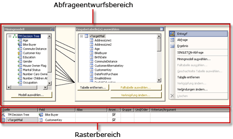
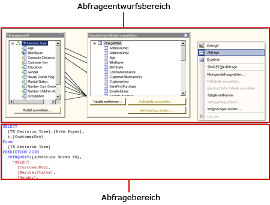
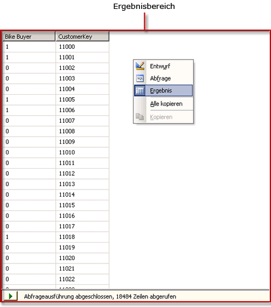

# Benutzeroberfläche des DMX-Abfrage-Designers für Analysis Services
  [!INCLUDE[ssRSnoversion](../../includes/ssrsnoversion-md.md)] stellt grafische Abfrage-Designer zum Erstellen von DMX-Abfragen (Data Mining Expressions) und MDX-Abfragen (Multidimensional Expression) für eine [!INCLUDE[ssASnoversion](../../includes/ssasnoversion-md.md)]-Datenquelle bereit. Dieses Thema beschreibt den DMX-Abfrage-Designer. Weitere Informationen zum MDX-Abfrage-Designer finden Sie unter [Analysis Services MDX Query Designer User Interface](../../reporting-services/report-data/analysis-services-mdx-query-designer-user-interface.md).  
  
 Der grafische DMX-Abfrage-Designer verfügt über drei Modi: Entwurf, Abfrage und Ergebnis. Klicken Sie mit der rechten Maustaste in den Abfrageentwurfsbereich, um zwischen den Modi zu wechseln, und wählen Sie den gewünschten Modus aus. Jeder Modus bietet einen Metadatenbereich, aus dem Sie Elemente aus den ausgewählten Cubes ziehen können, um eine DMX-Abfrage zu erstellen. Die DMX-Abfrage ruft Daten für ein Dataset ab, wenn der Bericht verarbeitet wird.  
  
## Symbolleiste für den grafischen DMX-Abfrage-Designer  
 Die Symbolleiste des Abfrage-Designers beinhaltet Schaltflächen, die Ihnen den Entwurf von DMX-Abfragen mithilfe der grafischen Oberfläche ermöglichen. In der folgenden Tabelle werden die Schaltflächen und ihre Funktionen beschrieben.  
  
|Schaltfläche|Description|  
|------------|-----------------|  
|**Als Text bearbeiten**|Deaktiviert für diesen Datenquellentyp.|  
|**Importieren**|Importieren einer vorhandenen Abfrage aus einer Berichtsdefinitionsdatei (.rdl) im Dateisystem. Weitere Informationen finden Sie unter [Erstellen von Berichten zu eingebetteten und freigegebenen Datasets &#40;Berichts-Generator und SSRS&#41;](../../reporting-services/report-data/report-embedded-datasets-and-shared-datasets-report-builder-and-ssrs.md).|  
||Wechseln zum Modus für den MDX-Abfrage-Designer.|  
||Wechseln zum Modus für den DMX-Abfrage-Designer.|  
||Aktualisieren von Metadaten aus der Datenquelle.|  
||Löschen der ausgewählten Spalte im Datenbereich aus der Abfrage.|  
|")|Anzeigen des Dialogfelds **Abfrageparameter** . Wenn Sie einer Variablen einen Standardwert zuweisen, wird ein entsprechender Berichtsparameter erstellt, wenn Sie im Berichts-Designer zur Layoutansicht wechseln.|  
||Bereitet die Abfrage vor.|  
||Umschalten zwischen Entwurfsmodus und Abfragemodus. Klicken Sie mit der rechten Maustaste in den Entwurfsbereich, und wählen Sie **Ergebnis**aus, um zur Ergebnisansicht zu wechseln.|  
  
## Grafischer DMX-Abfrage-Designer im Entwurfsmodus  
 Wenn Sie ein Dataset bearbeiten, das eine [!INCLUDE[ssASnoversion](../../includes/ssasnoversion-md.md)] -Datenquelle ohne gültige Cubes verwendet, aber gültige Miningmodelle aufweist, wird der grafische Abfrage-Designer im Entwurfsmodus geöffnet. In der folgenden Abbildung werden die Bereiche für den Entwurfsmodus bezeichnet.  
  
   
  
 Die folgende Tabelle beschreibt die Funktion jedes Bereichs.  
  
|Bereich|Funktion|  
|----------|--------------|  
|Abfrageentwurfsbereich|Verwenden Sie die Dialogfelder **Miningmodell** und **Eingabetabelle(n) auswählen** , um die DMX-Abfrage zu erstellen.|  
|Rasterbereich|Verwenden Sie für jede Zeile im Raster die Dropdownliste **Quelle** , um eine Funktion oder einen Ausdruck auszuwählen, und wählen Sie Felder, Gruppen und Kriterien oder Argumente aus, die in der DMX-Abfrage verwendet werden sollen. Klicken Sie zum Anzeigen des durch Ihre Auswahl generierten DMX-Abfragetexts auf die Schaltfläche **Entwurfsmodus** auf der Symbolleiste.|  
  
 Klicken Sie mit der rechten Maustaste in den Abfrageentwurfsbereich, und wählen Sie **Ergebnis**aus, um die DMX-Abfrage auszuführen und Ergebnisse im Ergebnisbereich anzuzeigen.  
  
## Grafischer DMX-Abfrage-Designer im Abfragemodus  
 Wenn Sie den grafischen Abfrage-Designer in den Abfragemodus umschalten möchten, klicken Sie auf der Symbolleiste auf die Schaltfläche **Entwurfsmodus** , oder klicken Sie mit der rechten Maustaste auf die Abfrageentwurfsoberfläche, und wählen Sie im Kontextmenü **Abfrage** aus. Verwenden Sie diesen Modus, um DMX-Text direkt in den Abfragebereich einzugeben.  
  
 In der folgenden Abbildung sind die Bereiche für den Abfragemodus veranschaulicht.  
  
   
  
 Die folgende Tabelle beschreibt die Funktion jedes Bereichs.  
  
|Bereich|Funktion|  
|----------|--------------|  
|Abfrageentwurfsbereich|Verwenden Sie die Dialogfelder **Miningmodell** und **Eingabetabelle(n) auswählen** , um die DMX-Abfrage zu erstellen.|  
|Abfragebereich|Anzeigen oder Bearbeiten von DMX-Abfragetext direkt im Bereich. Änderungen am DMX-Abfragetext bleiben nicht bestehen, wenn Sie zurück zum **Entwurfsmodus** wechseln.|  
  
 Klicken Sie mit der rechten Maustaste in den Abfrageentwurfsbereich, und wählen Sie **Ergebnis**aus, um die DMX-Abfrage auszuführen und Ergebnisse im Ergebnisbereich anzuzeigen.  
  
## Grafischer DMX-Abfrage-Designer im Ergebnismodus  
 Klicken Sie zum Anzeigen des Ergebnismodus mit der rechten Maustaste auf die Abfrageentwurfsoberfläche, und wählen Sie im Kontextmenü **Ergebnis** aus. Wenn Sie zum Ergebnismodus wechseln, wird die DMX-Abfrage automatisch ausgeführt.  
  
 In der folgenden Abbildung ist der Abfrage-Designer im Ergebnismodus dargestellt.  
  
   
  
 Klicken Sie zum Zurückwechseln in den Entwurfsmodus oder Abfragemodus mit der rechten Maustaste in den Ergebnisbereich, und wählen Sie **Entwurf** oder **Abfrage**aus.  
  
## Siehe auch  
 [Definieren von Parametern im MDX-Abfrage-Designer für Analysis Services &#40; Berichts-Generator und SSRS &#41;](../../reporting-services/report-data/define-parameters-in-the-mdx-query-designer-for-analysis-services.md)   
 [Erstellen eines freigegebenen Datasets oder eingebetteten Datasets &#40; Berichts-Generator und SSRS &#41;](../../reporting-services/report-data/create-a-shared-dataset-or-embedded-dataset-report-builder-and-ssrs.md)   
 [Analysis Services-Verbindungstyp für DMX &#40; SSRS &#41;](../../reporting-services/report-data/analysis-services-connection-type-for-dmx-ssrs.md)   
 [Abrufen von Daten aus einer Datamining-Modell &#40; DMX &#41; &#40; SSRS &#41;](../../reporting-services/report-data/retrieve-data-from-a-data-mining-model-dmx-ssrs.md)   
 [RSReportDesigner-Konfigurationsdatei](../../reporting-services/report-server/rsreportdesigner-configuration-file.md)   
 [Analysis Services-Verbindungstyp für MDX &#40; SSRS &#41;](../../reporting-services/report-data/analysis-services-connection-type-for-mdx-ssrs.md)   
 [Analysis Services-Verbindungstyp für DMX &#40; SSRS &#41;](../../reporting-services/report-data/analysis-services-connection-type-for-dmx-ssrs.md)  
  
  
