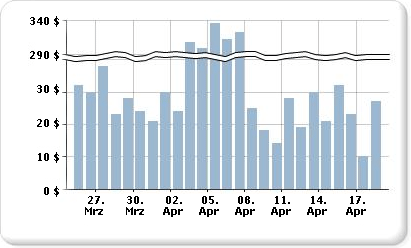

# Hinzufügen von Skalierungsunterbrechungen zu einem Diagramm (Berichts-Generator und SSRS)

  Eine Skalierungsunterbrechung ist ein Streifen, der über den Zeichnungsbereich eines Diagramms gezogen wird, um eine Unterbrechung in der Kontinuität zwischen den hohen und den niedrigen Werten auf einer Wertachse (normalerweise die vertikale oder y-Achse) zu kennzeichnen. Verwenden Sie eine Skalierungsunterbrechung, um zwei unterschiedliche Bereiche in der gleichen Diagrammfläche anzuzeigen.  
  
   
  
> [!NOTE]  
>  Sie können nicht angeben, an welcher Stelle im Diagramm eine Skalierungsunterbrechung platziert werden soll. Das Diagramm bestimmt anhand eigener, auf den Werten im Dataset basierenden Berechnungen, ob eine ausreichende Trennung zwischen den Datenbereichen vorhanden ist, um eine Skalierungsunterbrechung auf der Wertachse (Y-Achse) zur Laufzeit zu zeichnen.  
  
 Ein Beispiel eines Diagramms mit Skalierungsunterbrechungen ist als Beispielbericht verfügbar. Weitere Informationen zum Herunterladen dieses Beispielberichts und anderer finden Sie unter [Beispielberichte für Berichts-Generator und Berichts-Designer](http://go.microsoft.com/fwlink/?LinkId=198283).  
  
> [!NOTE]  
>  [!INCLUDE[ssRBRDDup](../../includes/ssrbrddup-md.md)]  
  
### So aktivieren Sie Skalierungsunterbrechungen für das Diagramm  
  
1.  Klicken Sie mit der rechten Maustaste auf die vertikale Achse, und klicken Sie dann auf **Achseneigenschaften**. Das Dialogfeld **Eigenschaften für vertikale Achsen** wird angezeigt.  
  
2.  Aktivieren Sie das Kontrollkästchen **Skalierungsunterbrechungen aktivieren** .  
  
### So ändern Sie den Stil der Skalierungsunterbrechung  
  
1.  Öffnen Sie den Bereich Eigenschaften.  
  
2.  Klicken Sie auf der Entwurfsoberfläche mit der rechten Maustaste auf die Y-Achse des Diagramms. Die Eigenschaften für das Y-Achsenobjekt (standardmäßig als Diagrammachse bezeichnet) werden im Bereich Eigenschaften angezeigt.  
  
3.  Erweitern Sie im Abschnitt **Skala** die ScaleBreakStyle-Eigenschaft.  
  
4.  Ändern Sie die Werte für ScaleBreakStyle-Eigenschaften, z.B. BreakLineType und Spacing. Weitere Informationen zu Skalierungsunterbrechungseigenschaften finden Sie unter [Anzeigen einer Reihe mit mehreren Datenbereichen in einem Diagramm &#40;Berichts-Generator und SSRS&#41;](../../reporting-services/report-design/displaying-a-series-with-multiple-data-ranges-on-a-chart.md).  

## Nächste Schritte

[Diagramme](../../reporting-services/report-design/charts-report-builder-and-ssrs.md)   
[Formatieren eines Diagramms](../../reporting-services/report-design/formatting-a-chart-report-builder-and-ssrs.md)   
[Achse-Eigenschaften (Dialogfeld), Achsenoptionen](http://msdn.microsoft.com/library/b276e210-7a12-48ae-971b-7dabae51df11)  

Weiteren Fragen wenden? [Versuchen Sie das Reporting Services-Forum stellen](http://go.microsoft.com/fwlink/?LinkId=620231)
