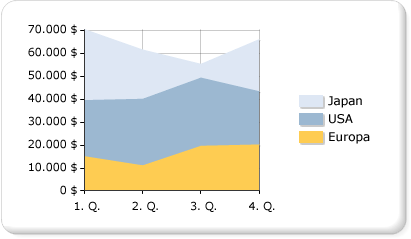

# Flächendiagramme (Berichts-Generator und SSRS)
  Ein Flächendiagramm zeigt eine Reihe als verschiedene Punkte an, die durch eine Linie miteinander verbunden sind, wobei die Fläche unterhalb der Linie ausgefüllt ist. Weitere Informationen zu Hinzufügen von Daten zu einem Flächendiagramm finden Sie unter [Diagramme &#40;Berichts-Generator und SSRS&#41;](../../reporting-services/report-design/charts-report-builder-and-ssrs.md).  
  
 Die folgende Abbildung zeigt ein Beispiel für ein gestapeltes Flächendiagramm. Die Daten sind für die Anzeige in einem gestapelten Flächendiagramm geeignet, da das Diagramm Summen für alle Reihen sowie den Anteil der einzelnen Reihen an der Gesamtsumme anzeigen kann.  
  
   
  
> [!NOTE]  
>  [!INCLUDE[ssRBRDDup](../../includes/ssrbrddup-md.md)]  
  
## Variationen  
  
-   **Gestapelte Fläche**. Ein Flächendiagramm, in dem mehrere Reihen vertikal gestapelt werden. Wenn nur eine Reihe im Diagramm vorhanden ist, wird das gestapelte Flächendiagramm angezeigt wie ein Flächendiagramm.  
  
-   **Prozentual gestapelte Fläche**. Ein Flächendiagramm, in dem mehrere Reihen vertikal gestapelt sind, um auf die gesamte Diagrammfläche zu passen. Wenn nur eine Reihe im Diagramm vorhanden ist, wird das gestapelte Flächendiagramm angezeigt wie ein Flächendiagramm.  
  
-   **Glatter Bereich**. Ein Flächendiagramm, in dem Datenpunkte durch eine geglättete Linie statt einer regulären Linie verbunden sind. Verwenden Sie ein geglättetes Flächendiagramm statt eines Flächendiagramms, wenn Ihnen an der Anzeige von Trends mehr liegt als an der Anzeige von Werten einzelner Datenpunkte.  
  
## Überlegungen zu Daten für ein Flächendiagramm  
  
-   Neben dem Liniendiagramm ist das Flächendiagramm der einzige Diagrammtyp, der Daten zusammenhängend anzeigt. Aus diesem Grund wird ein Flächendiagramm häufig zur Darstellung von Daten verwendet, die über einen kontinuierlichen Zeitraum hinweg auftreten.  
  
-   Ein prozentual gestapeltes Flächendiagramm ist nützlich, um proportionale Daten anzuzeigen, die im Laufe der Zeit auftreten.  
  
-   Wenn nur eine Reihe im Diagramm vorhanden ist, wird das gestapelte Flächendiagramm wie ein Flächendiagramm dargestellt.  
  
-   Wenn die Werte in mehreren Reihen ähnlich sind, überlappen die Flächen in einem einfachen Flächendiagramm. Dadurch werden wichtige Datenpunktwerte verdeckt. Sie können dieses Problem beheben, indem Sie den Diagrammtyp zu einem gestapelten Flächendiagramm ändern, das für die Anzeige mehrerer Reihen in einem Flächendiagramm entwickelt wurde.  
  
-   Wenn Ihr gestapeltes Flächendiagramm Lücken enthält, schließt Ihr Dataset möglicherweise leere Werte ein, die als Leerbereich in einem gestapelten Flächendiagramm angezeigt werden. Wenn das Dataset leere Werte enthält, erwägen Sie, leere Punkte auf dem Diagramm einzufügen. Durch Hinzufügen von leeren Punkten werden die leeren Bereiche des Diagramms mit einer anderen Farbe ausgefüllt, um Nullwerte anzugeben. Weitere Informationen finden Sie unter [Hinzufügen von leeren Punkten zu einem Diagramm &#40;Berichts-Generator und SSRS&#41;](../../reporting-services/report-design/add-empty-points-to-a-chart-report-builder-and-ssrs.md).  
  
-   Flächendiagrammtypen verhalten sich ähnlich wie Säulen- und Liniendiagramme. Wenn Sie einen Vergleich zwischen mehreren Reihen durchführen, erwägen Sie, stattdessen ein Säulendiagramm zu verwenden. Für die Analyse von Trends über einen bestimmten Zeitraum ist ein Liniendiagramm unter Umständen besser geeignet.  
  
## Siehe auch  
 [Diagramme &#40;Berichts-Generator und SSRS&#41;](../../reporting-services/report-design/charts-report-builder-and-ssrs.md)   
 [Diagrammtypen &#40;Berichts-Generator und SSRS&#41;](../../reporting-services/report-design/chart-types-report-builder-and-ssrs.md)   
 [Liniendiagramme &#40;Berichts-Generator und SSRS&#41;](../../reporting-services/report-design/line-charts-report-builder-and-ssrs.md)   
 [Ändern eines Diagrammtyps &#40;Berichts-Generator und SSRS&#41;](../../reporting-services/report-design/change-a-chart-type-report-builder-and-ssrs.md)   
 [Leere und NULL-Datenpunkte in Diagrammen &#40;Berichts-Generator und SSRS&#41;](../../reporting-services/report-design/empty-and-null-data-points-in-charts-report-builder-and-ssrs.md)  
  
  
