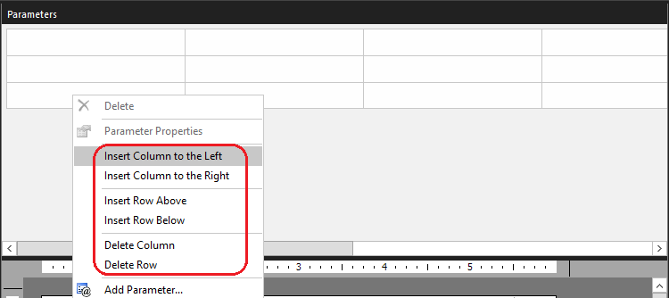

# Benutzerdefiniertes Anpassen des Parameterbereichs in einem Bericht (Berichts-Generator)
  Beim Erstellen von paginierten Berichten mit Parametern im Berichts-Generator können Sie den Parameterbereich anpassen. In der Berichtsentwurfsansicht können Sie einen Parameter zu einer bestimmten Spalte und Zeile im Parameterbereich ziehen. Sie können Spalten hinzufügen und entfernen, um das Layouts des Bereichs zu ändern.  
  
 Wenn Sie einen Parameter zu einer neuen Spalte oder Zeile im Bereich ziehen, wird die Parameterreihenfolge im Bereich **Berichtsdaten** geändert. Wenn Sie die Reihenfolge der Parameter im Bereich **Berichtsdaten** ändern, wird die Position des Parameters im Bereich geändert. Weitere Informationen dazu, warum die Reihenfolge der Parameter wichtig ist, finden Sie unter [Ändern der Reihenfolge von Berichtsparametern &#40;Berichts-Generator und SSRS&#41;](../../reporting-services/report-design/change-the-order-of-a-report-parameter-report-builder-and-ssrs.md).  
  
## So passen Sie den Parameterbereich benutzerdefiniert an  
  
1.  Wählen Sie das **Parameter** -Kontrollkästchen auf der Registerkarte **Ansicht** aus, um den Parameterbereich anzuzeigen.  
  
       
  
     Der Bereich erscheint im oberen Teil der Entwurfsoberfläche.  
  
2.  Führen Sie eine der folgenden Vorgehensweisen aus, um einen Parameter in den Bereich hinzuzufügen.  
  
    -   Klicken Sie in eine leere Zelle im Parameterbereich und klicken Sie anschließend auf **Parameter hinzufügen**.  
  
           
  
    -   Klicken Sie mit der rechten Maustaste im Bereich **Berichtsdaten** auf **Parameter** , und klicken Sie anschließend auf **Parameter hinzufügen**.  
  
3.  Ziehen Sie den Parameter in eine andere Zelle im Bereich, um einen Parameter an einen neuen Ort im Parameterbereich zu verschieben.  
  
     Wenn Sie die Position der Parameter im Bereich ändern, wird die Reihenfolge der Parameter in der **Parameter**-Liste im Bereich **Berichtsdaten** automatisch geändert. Weitere Informationen zur Auswirkung der Parameterreihenfolge finden Sie unter [Ändern der Reihenfolge von Berichtsparametern &#40;Berichts-Generator und SSRS&#41;](../../reporting-services/report-design/change-the-order-of-a-report-parameter-report-builder-and-ssrs.md)  
  
4.  Verwenden Sie eine der folgenden Vorgehensweisen, um auf die Eigenschaften eines Parameters zuzugreifen  
  
    -   Klicken Sie im Parameterbereich mit der rechten Maustaste auf den Parameter, und klicken Sie anschließend auf **Parametereigenschaften**.  
  
           
  
    -   Klicken Sie im Bereich **Berichtsdaten** mit der rechten Maustaste auf den Parameter, und klicken Sie anschließend auf **Parametereigenschaften**.  
  
5.  Klicken Sie mit der rechten Maustaste auf einen beliebigen Punkt im Parameterbereich, um dem Bereich neue Spalten oder Zeilen hinzuzufügen, oder um vorhandene Zeilen und Spalten zu löschen, und klicken Sie einen Befehl in dem Menü an, das daraufhin angezeigt wird.  
  
       
  
    > [!IMPORTANT]  
    >  Wenn Sie eine Spalte oder Zeile löschen, die Parameter enthält, werden die Parameter aus dem Bericht gelöscht.  
  
6.  Führen Sie eine der folgenden Vorgehensweisen aus, um einen Parameter aus dem Bereich und aus dem Bericht löschen  
  
    -   Klicken Sie im Parameterbereich mit der rechten Maustaste auf den Parameter, und klicken Sie anschließend auf  **Löschen**.  
  
           
  
    -   Klicken Sie im Bereich **Berichtsdaten** mit der rechten Maustaste auf „Parameter“, und klicken Sie anschließend auf **Löschen**.  
  
## Siehe auch  
 [Berichtsparameter &#40;Berichts-Generator und Berichts-Designer&#41;](../../reporting-services/report-design/report-parameters-report-builder-and-report-designer.md)  
  
  
