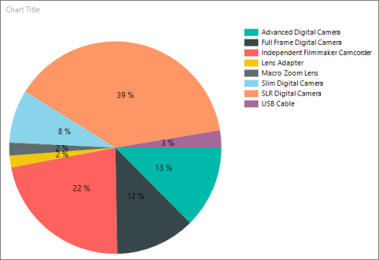

# Anzeigen von Prozentwerten in einem Kreisdiagramm (Berichts-Generator und SSRS)
In [!INCLUDE[ssRSnoversion_md](../../includes/ssrsnoversion-md.md)] paginierte Berichte standardmäßig die Legende zeigt Kategorien. Sie sollten auch die Prozentsätze in der Legende oder der Slices im Kreis selbst.   

 Die [Lernprogramm: Hinzufügen eines Kreisdiagramms zu einem Bericht (Berichts-Generator)](Tutorial:%20Add%20a%20Pie%20Chart%20to%20Your%20Report%20\(Report%20Builder\).md) führt Sie schrittweise durch Hinzufügen von Prozentsätzen zu Kreissegmente, wenn Sie diese zunächst mit Beispieldaten ausprobieren möchten.
 
  
## So zeigen Sie Prozentwerte als Bezeichnungen in einem Kreisdiagramm an  
  
1.  Fügen Sie dem Bericht ein Kreisdiagramm hinzu. Weitere Informationen finden Sie unter [Hinzufügen eines Diagramms zu einem Bericht &#40;Berichts-Generator und SSRS&#41;](../../reporting-services/report-design/add-a-chart-to-a-report-report-builder-and-ssrs.md).  
  
2.  Klicken Sie auf der Entwurfsoberfläche mit der rechten Maustaste auf das Kreisdiagramm, und wählen Sie **Datenbezeichnungen anzeigen** aus. Die Datenbezeichnungen sollten innerhalb jedes Segments des Kreisdiagramms angezeigt werden.  
  
3.  Klicken Sie auf der Entwurfsoberfläche mit der rechten Maustaste auf die Bezeichnungen, und wählen Sie **Reihenbezeichnungseigenschaften**aus. Das Dialogfeld **Reihenbezeichnungseigenschaften** wird angezeigt.  
  
4.  Geben Sie für die Option **Bezeichnungsdaten** den Wert **#PERCENT** ein.  
  
5.  (Optional) Geben Sie an, wie viele Dezimalstellen die Bezeichnung zeigt, indem Sie "#PERCENT {P*n*}", in dem  *n*  ist die Anzahl der anzuzeigenden Dezimalstellen. Geben Sie z. B. "#PERCENT{P0}" ein, um keine Dezimalstellen anzuzeigen.  
  
## So zeigen Sie Prozentwerte in der Legende eines Kreisdiagramms an  
  
1.  Klicken Sie auf der Entwurfsoberfläche mit der rechten Maustaste auf das Kreisdiagramm, und wählen Sie **Reiheneigenschaften**aus. Das Dialogfeld **Reiheneigenschaften** wird angezeigt.  
  
2.  Geben Sie unter **Legende**den Wert **#PERCENT** für die Eigenschaft **Benutzerdefinierter Legendentext** ein.  
  
## Siehe auch  
* [Lernprogramm: Hinzufügen eines Kreisdiagramms zu einem Bericht (Berichts-Generator)](Tutorial:%20Add%20a%20Pie%20Chart%20to%20Your%20Report%20\(Report%20Builder\).md)
*  [Kreisdiagramme &#40;Berichts-Generator und SSRS&#41;](../../reporting-services/report-design/pie-charts-report-builder-and-ssrs.md)   
*  [Formatieren der Legende in einem Diagramm &#40;Berichts-Generator und SSRS&#41;](../../reporting-services/report-design/chart-legend-formatting-report-builder.md)   
*  [Anzeigen von Datenpunktbezeichnungen außerhalb eines Kreisdiagramms &#40;Berichts-Generator und SSRS&#41;](../../reporting-services/report-design/display-data-point-labels-outside-a-pie-chart-report-builder-and-ssrs.md)   
 
  
