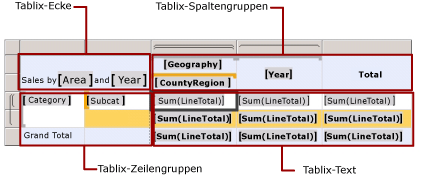

# Anzeigen von Zeilen- und Spalten&#252;berschriften auf mehreren Seiten (Berichts-Generator und SSRS)
  Sie können festlegen, ob bei einem Tablix-Datenbereich (Tabelle, Matrix oder Liste), der mehrere Seiten umfasst, Zeilen- und Spaltenüberschriften auf jeder Seite eines paginierten [!INCLUDE[ssRSnoversion_md](../../includes/ssrsnoversion-md.md)]-Berichts wiederholt werden sollen.
  
 Wie Zeilen und Spalten behandelt werden, hängt davon ab, ob der Tablix-Datenbereich Gruppenkopfzeilen enthält. Wenn Sie auf einen Tablix-Datenbereich klicken, der Gruppenkopfzeilen enthält, wird eine gepunktete Linie in den Tablix-Bereichen angezeigt, wie in der folgenden Abbildung dargestellt:  
  
   
  
 Zeilen- und Spaltengruppenkopfzeilen werden automatisch erstellt, wenn Sie Gruppen mit dem Tabellen- oder Matrix-Assistenten bzw. dem Diagramm-Assistenten hinzufügen, indem Felder zu dem Gruppierungsbereich hinzugefügt oder Kontextmenüs verwendet werden. Wenn der Tablix-Datenbereich nur einen Tablix-Textbereich und keine Gruppenkopfzeilen enthält, sind die Zeilen und Spalten Tablix-Elemente.  
  
 Bei statischen Elementen können Sie die obersten angrenzenden Zeilen oder die seitlichen angrenzenden Spalten auf mehreren Seiten anzeigen.  
  
## So zeigen Sie Zeilenüberschriften auf mehreren Seiten an  
  
1.  Klicken Sie im Tablix-Datenbereich mit der rechten Maustaste auf den Zeilen-, Spalten- oder Eckziehpunkt, und klicken Sie anschließend auf **Tablix-Eigenschaften**.  
  
2.  Wählen Sie unter **Zeilenüberschriften**die Option **Kopfzeile auf jeder Seite wiederholen**aus.  
  
3.  [!INCLUDE[clickOK](../../includes/clickok-md.md)]  
  
## So zeigen Sie Spaltenüberschriften auf mehreren Seiten an  
  
1.  Klicken Sie im Tablix-Datenbereich mit der rechten Maustaste auf den Zeilen-, Spalten- oder Eckziehpunkt, und klicken Sie anschließend auf **Tablix-Eigenschaften**.  
  
2.  Wählen Sie unter **Spaltenkopfzeilen**die Option **Spaltenüberschrift auf jeder Seite wiederholen**aus.  
  
3.  [!INCLUDE[clickOK](../../includes/clickok-md.md)]  
  
## So zeigen Sie eine statische Zeile oder Spalte auf mehreren Seiten an  
  
1.  Klicken Sie auf der Entwurfsoberfläche auf den Zeilen- oder Spaltenziehpunkt des Tablix-Datenbereichs, um diesen auszuwählen. Im Gruppierungsbereich werden die Zeilen- und Spaltengruppen angezeigt.  
  
2.  Klicken Sie auf der rechten Seite des Gruppierungsbereichs auf den Pfeil nach unten und anschließend auf **Erweiterter Modus**. In den Bereichen Zeilengruppen und Spaltengruppen werden die hierarchischen und statischen Elemente für die Zeilengruppenhierarchie bzw. Spaltengruppenhierarchie angezeigt.  
  
3.  Klicken Sie auf das statische Element, das dem statischen Element (Zeile oder Spalte) entspricht, das beim Bildlauf sichtbar bleiben soll. Im Eigenschaftenbereich werden die Eigenschaften für das **Tablix-Element** angezeigt.  
  
     Wenn der Eigenschaftenbereich nicht angezeigt wird, klicken Sie am oberen Rand des Fensters Berichts-Generator auf die Registerkarte **Ansicht** und dann auf **Eigenschaften**.  
  
4.  Legen Sie im Eigenschaftenbereich **RepeatOnNewPage** auf True fest.  
  
5.  Legen Sie **KeepWithGroup** auf After fest.  
  
6.  Wiederholen Sie diesen Schritt für alle angrenzenden Elemente, die wiederholt werden sollen.  
  
7.  Zeigen Sie eine Vorschau des Berichts an.  
  
 Während Sie jede Seite des Berichts anzeigen, über die sich der Tablix-Datenbereich erstreckt, werden die statischen Tablix-Elemente auf jeder Seite wiederholt.  
  
## Siehe auch  
 [Suchen, Anzeigen und Verwalten von Berichten &#40;Berichts-Generator und SSRS&#41;](../../reporting-services/report-builder/finding-viewing-and-managing-reports-report-builder-and-ssrs.md)   
 [Exportieren von Berichten &#40;Berichts-Generator und SSRS&#41;](../../reporting-services/report-builder/export-reports-report-builder-and-ssrs.md)   
 [Steuern von Seitenumbrüchen, Überschriften, Spalten und Zeilen &#40;Berichts-Generator und SSRS&#41;](../../reporting-services/report-design/controlling-page-breaks-headings-columns-and-rows-report-builder-and-ssrs.md)   
 [Anzeigen von Kopf- und Fußzeilen einer Gruppe &#40;Berichts-Generator und SSRS&#41;](../../reporting-services/report-design/display-headers-and-footers-with-a-group-report-builder-and-ssrs.md)   
 [Sichtbarhalten von Kopfzeilen beim Durchführen eines Bildlaufs durch einen Bericht &#40;Berichts-Generator und SSRS&#41;](../../reporting-services/report-design/keep-headers-visible-when-scrolling-through-a-report-report-builder-and-ssrs.md)  
  
  